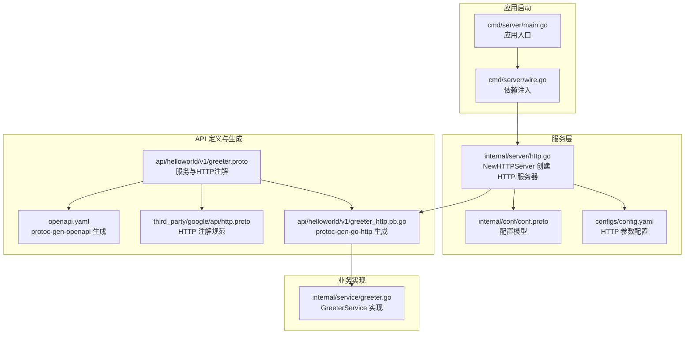
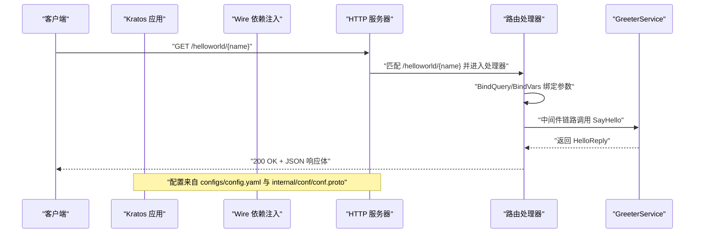
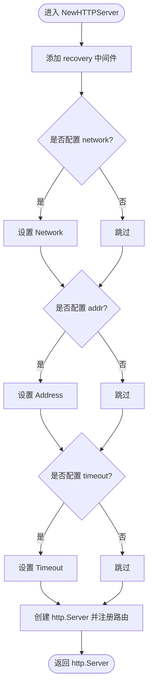
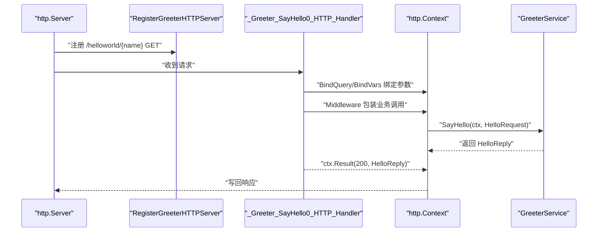
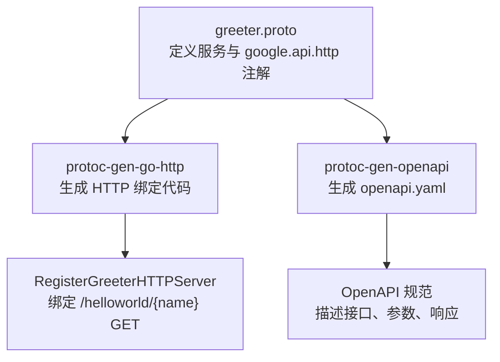
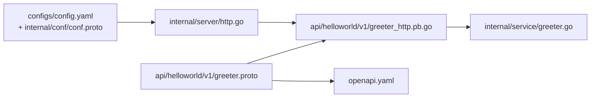

# HTTP/REST 支持

<cite>
**本文引用的文件列表**
- [internal/server/http.go](file://internal/server/http.go)
- [api/helloworld/v1/greeter_http.pb.go](file://api/helloworld/v1/greeter_http.pb.go)
- [api/helloworld/v1/greeter.proto](file://api/helloworld/v1/greeter.proto)
- [third_party/google/api/http.proto](file://third_party/google/api/http.proto)
- [openapi.yaml](file://openapi.yaml)
- [Makefile](file://Makefile)
- [configs/config.yaml](file://configs/config.yaml)
- [cmd/server/main.go](file://cmd/server/main.go)
- [cmd/server/wire.go](file://cmd/server/wire.go)
- [internal/conf/conf.proto](file://internal/conf/conf.proto)
- [internal/server/server.go](file://internal/server/server.go)
- [internal/service/greeter.go](file://internal/service/greeter.go)
</cite>

## 目录
1. [简介](#简介)
2. [项目结构](#项目结构)
3. [核心组件](#核心组件)
4. [架构总览](#架构总览)
5. [组件详解](#组件详解)
6. [依赖关系分析](#依赖关系分析)
7. [性能考量](#性能考量)
8. [故障排查指南](#故障排查指南)
9. [结论](#结论)
10. [附录：curl 调用示例与最佳实践](#附录curl-调用示例与最佳实践)

## 简介
本章节系统性解析该项目中基于 Kratos 的 HTTP/REST 服务实现，重点覆盖以下方面：
- 如何通过 internal/server/http.go 中的 NewHTTPServer 函数创建 HTTP 服务器，包含 recovery 中间件的使用与 conf.Server 配置项对网络、地址与超时参数的注入。
- protoc-gen-go-http 如何依据 proto 注解生成 HTTP 路由绑定代码，尤其是 /v1/helloworld/{name} 的 GET 方法映射机制。
- openapi.yaml 的生成流程（由 protoc-gen-openapi 工具），以及如何为前端或第三方提供标准化 API 文档。
- 提供 curl 调用示例，展示请求与响应的 JSON 格式。
- 指导开发者如何在 proto 文件中定义 HTTP 映射规则，并生成对应的 HTTP 服务代码。

## 项目结构
该仓库采用分层与按功能模块组织的结构，其中与 HTTP/REST 相关的关键目录与文件如下：
- internal/server/http.go：HTTP 服务器创建与路由注册入口。
- api/helloworld/v1/greeter.proto：定义 Greeter 服务及 HTTP 映射注解。
- api/helloworld/v1/greeter_http.pb.go：由 protoc-gen-go-http 生成的 HTTP 绑定代码。
- third_party/google/api/http.proto：HTTP 映射注解的协议规范。
- openapi.yaml：由 protoc-gen-openapi 自动生成的 OpenAPI 规范。
- Makefile：包含生成 API 相关代码与 OpenAPI 文档的构建目标。
- configs/config.yaml 与 internal/conf/conf.proto：HTTP 服务器运行参数来源。
- cmd/server/main.go 与 cmd/server/wire.go：应用启动与依赖注入装配。
- internal/service/greeter.go：业务服务实现，作为 HTTP 路由处理链路的最终执行者。

图表来源
- [cmd/server/main.go](file://cmd/server/main.go#L1-L88)
- [cmd/server/wire.go](file://cmd/server/wire.go#L1-L24)
- [internal/server/http.go](file://internal/server/http.go#L1-L33)
- [configs/config.yaml](file://configs/config.yaml#L1-L16)
- [internal/conf/conf.proto](file://internal/conf/conf.proto#L1-L42)
- [api/helloworld/v1/greeter.proto](file://api/helloworld/v1/greeter.proto#L1-L31)
- [api/helloworld/v1/greeter_http.pb.go](file://api/helloworld/v1/greeter_http.pb.go#L1-L75)
- [third_party/google/api/http.proto](file://third_party/google/api/http.proto#L1-L376)
- [openapi.yaml](file://openapi.yaml#L1-L40)
- [internal/service/greeter.go](file://internal/service/greeter.go#L1-L30)

章节来源
- [cmd/server/main.go](file://cmd/server/main.go#L1-L88)
- [cmd/server/wire.go](file://cmd/server/wire.go#L1-L24)
- [internal/server/http.go](file://internal/server/http.go#L1-L33)
- [configs/config.yaml](file://configs/config.yaml#L1-L16)
- [internal/conf/conf.proto](file://internal/conf/conf.proto#L1-L42)
- [api/helloworld/v1/greeter.proto](file://api/helloworld/v1/greeter.proto#L1-L31)
- [api/helloworld/v1/greeter_http.pb.go](file://api/helloworld/v1/greeter_http.pb.go#L1-L75)
- [third_party/google/api/http.proto](file://third_party/google/api/http.proto#L1-L376)
- [openapi.yaml](file://openapi.yaml#L1-L40)
- [internal/service/greeter.go](file://internal/service/greeter.go#L1-L30)

## 核心组件
- HTTP 服务器创建器：internal/server/http.go 中的 NewHTTPServer 函数负责：
  - 注册 recovery 中间件以增强异常恢复能力。
  - 基于 conf.Server 的网络类型、监听地址与超时配置动态设置 http.ServerOption。
  - 将生成的 HTTP 路由注册到 http.Server 上。
- HTTP 路由绑定：api/helloworld/v1/greeter_http.pb.go 由 protoc-gen-go-http 生成，包含：
  - RegisterGreeterHTTPServer：将 /helloworld/{name} 的 GET 请求绑定到 SayHello 处理器。
  - _Greeter_SayHello0_HTTP_Handler：完成查询参数与路径变量绑定、中间件链路调用、结果返回等。
- OpenAPI 文档：openapi.yaml 由 protoc-gen-openapi 自动生成，描述了 /helloworld/{name} 的 GET 接口、参数与响应结构。
- 配置来源：configs/config.yaml 与 internal/conf/conf.proto 提供 HTTP 服务器的网络、地址与超时参数。

章节来源
- [internal/server/http.go](file://internal/server/http.go#L1-L33)
- [api/helloworld/v1/greeter_http.pb.go](file://api/helloworld/v1/greeter_http.pb.go#L1-L75)
- [openapi.yaml](file://openapi.yaml#L1-L40)
- [configs/config.yaml](file://configs/config.yaml#L1-L16)
- [internal/conf/conf.proto](file://internal/conf/conf.proto#L1-L42)

## 架构总览
下图展示了从应用启动到 HTTP 请求处理的完整链路，以及 OpenAPI 文档生成与配置注入的关系。

图表来源
- [cmd/server/main.go](file://cmd/server/main.go#L1-L88)
- [cmd/server/wire.go](file://cmd/server/wire.go#L1-L24)
- [internal/server/http.go](file://internal/server/http.go#L1-L33)
- [api/helloworld/v1/greeter_http.pb.go](file://api/helloworld/v1/greeter_http.pb.go#L1-L75)
- [internal/service/greeter.go](file://internal/service/greeter.go#L1-L30)
- [configs/config.yaml](file://configs/config.yaml#L1-L16)
- [internal/conf/conf.proto](file://internal/conf/conf.proto#L1-L42)

## 组件详解

### HTTP 服务器创建与中间件
- NewHTTPServer 负责：
  - 注册 recovery 中间件，确保在处理过程中发生 panic 时能恢复并返回错误信息。
  - 读取 conf.Server 中的 http.network、http.addr、http.timeout 字段，分别对应网络类型、监听地址与超时时间，动态设置 http.ServerOption。
  - 创建 http.Server 实例并注册 HTTP 路由。
- 配置来源：
  - configs/config.yaml 提供默认值（如 0.0.0.0:8000、1s）。
  - internal/conf/conf.proto 定义了配置模型，支持 Duration 类型的超时字段。

图表来源
- [internal/server/http.go](file://internal/server/http.go#L1-L33)
- [configs/config.yaml](file://configs/config.yaml#L1-L16)
- [internal/conf/conf.proto](file://internal/conf/conf.proto#L1-L42)

章节来源
- [internal/server/http.go](file://internal/server/http.go#L1-L33)
- [configs/config.yaml](file://configs/config.yaml#L1-L16)
- [internal/conf/conf.proto](file://internal/conf/conf.proto#L1-L42)

### HTTP 路由绑定与处理流程
- 路由注册：
  - RegisterGreeterHTTPServer 在 http.Server 上注册根路由，并将 GET /helloworld/{name} 绑定到 _Greeter_SayHello0_HTTP_Handler。
- 处理器逻辑：
  - _Greeter_SayHello0_HTTP_Handler 先 BindQuery 再 BindVars，将查询参数与路径变量绑定到 HelloRequest。
  - 设置操作名以便追踪与日志记录。
  - 通过 ctx.Middleware 包装业务调用，最终返回 200 与 HelloReply。
- 客户端调用：
  - NewGreeterHTTPClient 会根据路径模板 /helloworld/{name} 使用 binding.EncodeURL 编码路径并发起 GET 请求。

图表来源
- [api/helloworld/v1/greeter_http.pb.go](file://api/helloworld/v1/greeter_http.pb.go#L1-L75)
- [internal/service/greeter.go](file://internal/service/greeter.go#L1-L30)

章节来源
- [api/helloworld/v1/greeter_http.pb.go](file://api/helloworld/v1/greeter_http.pb.go#L1-L75)
- [internal/service/greeter.go](file://internal/service/greeter.go#L1-L30)

### HTTP 映射注解与生成原理
- proto 注解：
  - 在 api/helloworld/v1/greeter.proto 中，SayHello 方法通过 google.api.http 注解将其映射为 GET /helloworld/{name}。
- 生成机制：
  - Makefile 的 api 目标使用 --go-http_out 与 --go-grpc_out 生成 Go 代码；同时使用 --openapi_out 生成 openapi.yaml。
  - protoc-gen-go-http 根据注解生成 HTTP 路由绑定代码，包括 RegisterGreeterHTTPServer 与处理器函数。
  - third_party/google/api/http.proto 定义了 HttpRule、pattern、body 等规范，支撑 gRPC 到 REST 的映射规则。
- 路径与参数：
  - 注解中的 {name} 对应 HelloRequest 的 name 字段，作为路径参数传入。
  - 由于没有 body 字段，其余未绑定字段会自动成为查询参数（若存在）。

图表来源
- [api/helloworld/v1/greeter.proto](file://api/helloworld/v1/greeter.proto#L1-L31)
- [third_party/google/api/http.proto](file://third_party/google/api/http.proto#L1-L376)
- [Makefile](file://Makefile#L1-L83)
- [openapi.yaml](file://openapi.yaml#L1-L40)
- [api/helloworld/v1/greeter_http.pb.go](file://api/helloworld/v1/greeter_http.pb.go#L1-L75)

章节来源
- [api/helloworld/v1/greeter.proto](file://api/helloworld/v1/greeter.proto#L1-L31)
- [third_party/google/api/http.proto](file://third_party/google/api/http.proto#L1-L376)
- [Makefile](file://Makefile#L1-L83)
- [openapi.yaml](file://openapi.yaml#L1-L40)
- [api/helloworld/v1/greeter_http.pb.go](file://api/helloworld/v1/greeter_http.pb.go#L1-L75)

### OpenAPI 文档生成与使用
- 生成过程：
  - Makefile 的 api 目标通过 --openapi_out 生成 openapi.yaml。
  - openapi.yaml 描述了 /helloworld/{name} 的 GET 方法、operationId、参数与响应 schema。
- 使用场景：
  - 可用于前端 SDK 生成、Swagger UI 展示、Postman 导入、自动化测试与集成。
  - 与 protoc-gen-go-http 生成的路由保持一致，保证契约一致性。

章节来源
- [Makefile](file://Makefile#L1-L83)
- [openapi.yaml](file://openapi.yaml#L1-L40)

### 应用启动与依赖注入
- 应用入口：
  - cmd/server/main.go 加载配置、初始化日志、构建 Kratos 应用并启动。
- 依赖注入：
  - cmd/server/wire.go 使用 Wire 生成 wireApp，装配 HTTP/GRPC 服务器与业务组件。
- 服务器集合：
  - internal/server/server.go 暴露 ProviderSet，包含 NewHTTPServer 与 NewGRPCServer。

章节来源
- [cmd/server/main.go](file://cmd/server/main.go#L1-L88)
- [cmd/server/wire.go](file://cmd/server/wire.go#L1-L24)
- [internal/server/server.go](file://internal/server/server.go#L1-L9)

## 依赖关系分析
- 组件耦合：
  - NewHTTPServer 依赖 conf.Server 与 service.GreeterService，通过 RegisterGreeterHTTPServer 将路由与业务实现解耦。
  - greeter_http.pb.go 仅依赖 Kratos HTTP 传输层与绑定库，不直接依赖业务实现，便于复用。
- 外部依赖：
  - protoc-gen-go-http 与 protoc-gen-openapi 作为编译期工具，分别生成 HTTP 绑定与 OpenAPI 文档。
  - Kratos HTTP Server 提供中间件、路由与上下文绑定能力。

图表来源
- [internal/server/http.go](file://internal/server/http.go#L1-L33)
- [api/helloworld/v1/greeter.proto](file://api/helloworld/v1/greeter.proto#L1-L31)
- [api/helloworld/v1/greeter_http.pb.go](file://api/helloworld/v1/greeter_http.pb.go#L1-L75)
- [openapi.yaml](file://openapi.yaml#L1-L40)
- [configs/config.yaml](file://configs/config.yaml#L1-L16)
- [internal/conf/conf.proto](file://internal/conf/conf.proto#L1-L42)
- [internal/service/greeter.go](file://internal/service/greeter.go#L1-L30)

章节来源
- [internal/server/http.go](file://internal/server/http.go#L1-L33)
- [api/helloworld/v1/greeter_http.pb.go](file://api/helloworld/v1/greeter_http.pb.go#L1-L75)
- [api/helloworld/v1/greeter.proto](file://api/helloworld/v1/greeter.proto#L1-L31)
- [openapi.yaml](file://openapi.yaml#L1-L40)
- [configs/config.yaml](file://configs/config.yaml#L1-L16)
- [internal/conf/conf.proto](file://internal/conf/conf.proto#L1-L42)
- [internal/service/greeter.go](file://internal/service/greeter.go#L1-L30)

## 性能考量
- 超时控制：通过 conf.Server.http.timeout 控制 HTTP 请求超时，避免长时间阻塞影响资源占用。
- 中间件开销：recovery 中间件在异常恢复上带来一定成本，但可显著提升稳定性。
- 路由绑定：生成式绑定避免手写路由样板代码，减少运行时判断分支，提高路由匹配效率。
- OpenAPI 文档：生成文档不参与运行时，仅在构建阶段使用，不影响线上性能。

[本节为通用建议，无需列出具体文件来源]

## 故障排查指南
- 无法访问 /helloworld/{name}：
  - 检查 HTTP 服务器监听地址与端口是否正确（configs/config.yaml）。
  - 确认 NewHTTPServer 是否成功注册路由（RegisterGreeterHTTPServer）。
- 参数绑定失败：
  - 确认请求路径中的 name 参数是否传递。
  - 若存在查询参数，确认 BindQuery/BindVars 是否能正确解析。
- 响应为空或格式不符：
  - 检查业务实现 GreeterService.SayHello 返回的 HelloReply 结构。
  - 确认 ctx.Result 返回状态码与 JSON 序列化是否正确。
- OpenAPI 文档不一致：
  - 重新执行 make api，确保 protoc-gen-go-http 与 protoc-gen-openapi 版本兼容。
  - 检查 greeter.proto 中的 google.api.http 注解是否符合规范。

章节来源
- [internal/server/http.go](file://internal/server/http.go#L1-L33)
- [api/helloworld/v1/greeter_http.pb.go](file://api/helloworld/v1/greeter_http.pb.go#L1-L75)
- [openapi.yaml](file://openapi.yaml#L1-L40)
- [configs/config.yaml](file://configs/config.yaml#L1-L16)
- [internal/service/greeter.go](file://internal/service/greeter.go#L1-L30)

## 结论
本项目通过 Kratos 的 HTTP 传输层与生成式工具链，实现了从 proto 注解到 HTTP 路由与 OpenAPI 文档的一体化工程化流程。NewHTTPServer 将配置注入与中间件、路由注册有机结合，protoc-gen-go-http 与 protoc-gen-openapi 则确保了契约一致性与文档可用性。开发者只需在 proto 中定义清晰的 HTTP 映射注解，即可自动生成 HTTP 服务代码与标准 OpenAPI 文档，显著降低维护成本并提升协作效率。

[本节为总结性内容，无需列出具体文件来源]

## 附录：curl 调用示例与最佳实践
- 调用示例（假设服务监听在 0.0.0.0:8000）：
  - 请求：GET http://0.0.0.0:8000/helloworld/{name}
  - 响应：200 OK，JSON 格式包含 message 字段。
- 最佳实践：
  - 在 proto 中明确指定路径参数与查询参数，避免歧义。
  - 使用 --openapi_out 生成 openapi.yaml，配合 Swagger UI 或 Postman 进行联调。
  - 通过 configs/config.yaml 与 internal/conf/conf.proto 统一管理 HTTP 服务器参数，便于多环境部署。

[本节为通用指导，无需列出具体文件来源]