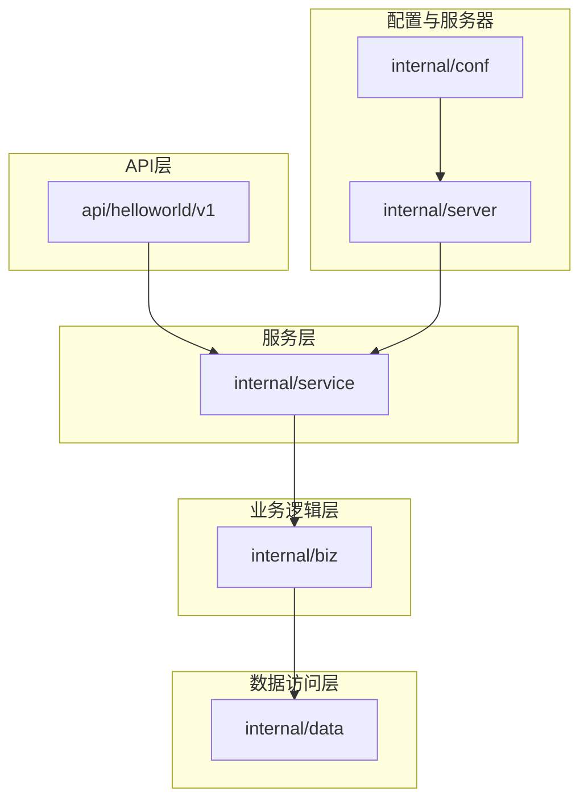
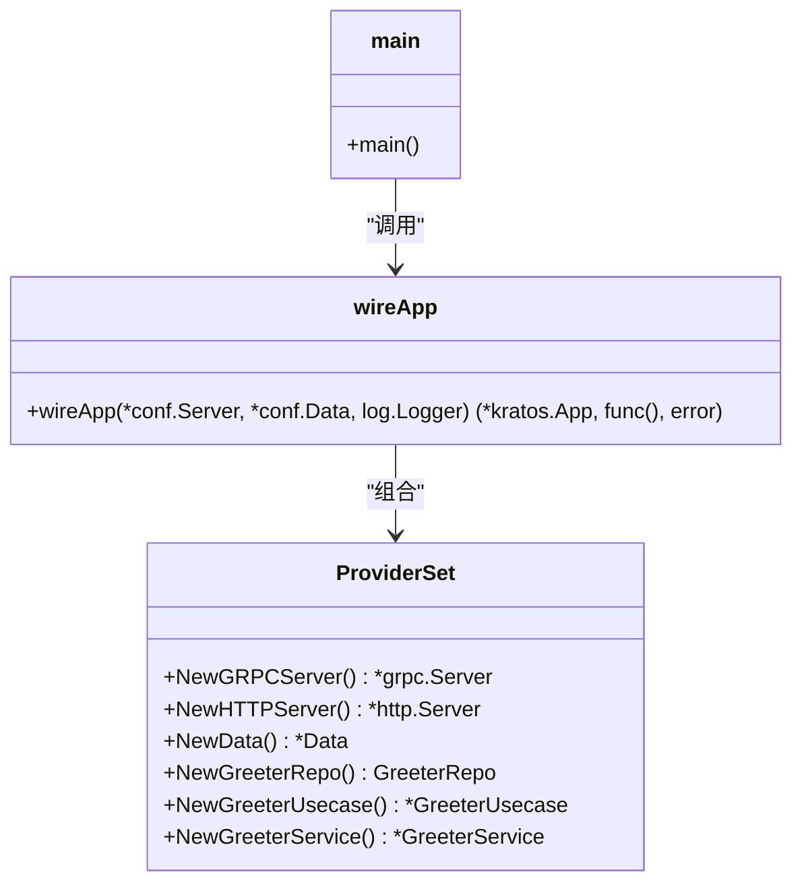

# 开发规范与扩展

<cite>
**本文档引用的文件**  
- [main.go](file://cmd/server/main.go)
- [wire.go](file://cmd/server/wire.go)
- [greeter.go](file://internal/service/greeter.go)
- [greeter.go](file://internal/biz/greeter.go)
- [greeter.go](file://internal/data/greeter.go)
- [Makefile](file://Makefile)
- [server.go](file://internal/server/server.go)
- [conf.proto](file://internal/conf/conf.proto)
- [greeter.proto](file://api/helloworld/v1/greeter.proto)
- [third_party/README.md](file://third_party/README.md)
- [README.md](file://README.md)
- [grpc.go](file://internal/server/grpc.go)
- [http.go](file://internal/server/http.go)
- [data.go](file://internal/data/data.go)
- [biz.go](file://internal/biz/biz.go)
- [service.go](file://internal/service/service.go)
</cite>

## 目录
1. [引言](#引言)
2. [项目结构概览](#项目结构概览)
3. [添加新服务的标准流程](#添加新服务的标准流程)
4. [代码生成机制](#代码生成机制)
5. [第三方Proto文件管理](#第三方proto文件管理)
6. [依赖注入与Wire配置](#依赖注入与wire配置)
7. [代码风格与最佳实践](#代码风格与最佳实践)
8. [扩展点说明](#扩展点说明)
9. [测试与验证](#测试与验证)
10. [结论](#结论)

## 引言
本文档旨在为开发者提供在Kratos项目中遵循现有架构添加新功能的详细指导。通过标准化开发流程、强调代码生成的重要性、规范第三方依赖管理，并提供代码风格和扩展实践，确保新代码与项目整体架构保持一致性和可维护性。

## 项目结构概览
本项目采用分层架构设计，主要分为API层、服务层、业务逻辑层（biz）、数据访问层（data）和配置层。各层职责分明，通过依赖注入实现松耦合。



**Diagram sources**  
- [api/helloworld/v1/greeter.proto](file://api/helloworld/v1/greeter.proto)
- [internal/service/greeter.go](file://internal/service/greeter.go)
- [internal/biz/greeter.go](file://internal/biz/greeter.go)
- [internal/data/greeter.go](file://internal/data/greeter.go)
- [internal/server/server.go](file://internal/server/server.go)

**Section sources**  
- [api/helloworld/v1/greeter.proto](file://api/helloworld/v1/greeter.proto)
- [internal/service/greeter.go](file://internal/service/greeter.go)
- [internal/biz/greeter.go](file://internal/biz/greeter.go)
- [internal/data/greeter.go](file://internal/data/greeter.go)

## 添加新服务的标准流程
在Kratos项目中添加新服务应遵循以下标准流程：

### 1. 定义Proto接口
在`api/<服务名>/v<版本>`目录下创建`.proto`文件，定义gRPC服务接口和消息类型。参考`api/helloworld/v1/greeter.proto`的结构，使用`service`关键字定义服务，`rpc`关键字定义方法，并通过`google.api.http`注解定义HTTP映射。

### 2. 生成代码
使用Makefile中的`api`目标自动生成代码：
```bash
make api
```
该命令会调用protoc编译器，根据proto文件生成Go代码，包括：
- pb.go：基础消息结构
- pb.go：gRPC服务接口
- http.pb.go：HTTP网关代码

### 3. 实现Service
在`internal/service/`目录下创建服务实现文件。服务结构体应嵌入`Unimplemented<服务名>Server`以确保接口兼容性，并通过构造函数注入业务用例（Usecase）。参考`internal/service/greeter.go`中的`GreeterService`实现。

### 4. 编写Biz逻辑
在`internal/biz/`目录下实现业务逻辑。创建Usecase结构体和对应的方法，处理核心业务规则。Usecase应通过接口依赖数据访问层，保持业务逻辑的独立性。参考`internal/biz/greeter.go`中的`GreeterUsecase`实现。

### 5. 实现Data访问
在`internal/data/`目录下实现数据访问逻辑。创建Repository实现类，处理与数据库或其他存储系统的交互。Repository应实现在biz层定义的接口。参考`internal/data/greeter.go`中的`greeterRepo`实现。

### 6. 更新Wire配置
确保各层的ProviderSet已正确定义。每个模块（server、data、biz、service）都应在各自的`provider.go`文件中定义`ProviderSet`变量，使用Wire框架进行依赖注入配置。参考各层的`provider.go`文件。

### 7. 测试验证
编写单元测试和集成测试，验证新功能的正确性。测试应覆盖正常流程和异常情况，确保代码质量。

**Section sources**  
- [api/helloworld/v1/greeter.proto](file://api/helloworld/v1/greeter.proto)
- [internal/service/greeter.go](file://internal/service/greeter.go)
- [internal/biz/greeter.go](file://internal/biz/greeter.go)
- [internal/data/greeter.go](file://internal/data/greeter.go)
- [internal/server/server.go](file://internal/server/server.go)

## 代码生成机制
代码生成是保持项目一致性的重要手段，主要通过Makefile中的`gen`任务实现。

### Makefile中的生成任务
```makefile
.PHONY: api
# 通过proto文件生成API文件（包括：pb.go, http, grpc, validate, swagger）
api:
	protoc --proto_path=./api \
	       --proto_path=./third_party \
 	       --go_out=paths=source_relative:./api \
 	       --go-http_out=paths=source_relative:./api \
 	       --go-grpc_out=paths=source_relative:./api \
	       --openapi_out=fq_schema_naming=true,default_response=false:. \
	       $(API_PROTO_FILES)
```

该任务配置了多个protoc插件：
- `protoc-gen-go`：生成基础Go结构
- `protoc-gen-go-http`：生成HTTP网关代码
- `protoc-gen-go-grpc`：生成gRPC服务代码
- `protoc-gen-openapi`：生成OpenAPI规范

### 生成流程
1. `make init`：安装必要的代码生成工具
2. `make api`：针对API层的proto文件生成代码
3. `make config`：针对内部配置的proto文件生成代码
4. `make all`：执行完整的生成流程

代码生成确保了接口定义与实现的一致性，减少了手动编码错误。

**Section sources**  
- [Makefile](file://Makefile)
- [README.md](file://README.md)

## 第三方Proto文件管理
第三方Proto文件统一存放在`third_party/`目录中，便于集中管理和版本控制。

### 目录结构
```
third_party/
├── errors/
├── google/
│   ├── api/
│   └── protobuf/
├── openapi/v3/
└── validate/
```

### 管理方式
- **集中存放**：所有外部依赖的proto文件都放在`third_party/`目录下
- **路径引用**：在proto文件中通过`import`语句引用第三方文件，如`import "google/api/annotations.proto";`
- **编译路径**：在Makefile中通过`--proto_path`参数指定第三方目录路径，确保编译器能找到依赖文件

### 引入新的外部依赖
1. 将新的proto文件复制到`third_party/`的适当子目录中
2. 在需要的proto文件中使用`import`语句引用
3. 确保Makefile中的`--proto_path`包含新依赖的路径
4. 运行`make api`重新生成代码

这种管理方式确保了项目对第三方依赖的可控性，避免了版本冲突和路径问题。

**Section sources**  
- [third_party/README.md](file://third_party/README.md)
- [api/helloworld/v1/greeter.proto](file://api/helloworld/v1/greeter.proto)
- [Makefile](file://Makefile)

## 依赖注入与Wire配置
项目使用Google Wire实现依赖注入，通过声明式配置管理对象生命周期和依赖关系。

### Wire配置结构
各模块通过`ProviderSet`变量定义依赖提供者集合：

```go
// internal/server/server.go
var ProviderSet = wire.NewSet(NewGRPCServer, NewHTTPServer)

// internal/data/data.go
var ProviderSet = wire.NewSet(NewData, NewGreeterRepo)

// internal/biz/biz.go
var ProviderSet = wire.NewSet(NewGreeterUsecase)

// internal/service/service.go
var ProviderSet = wire.NewSet(NewGreeterService)
```

### 依赖注入流程
1. `cmd/server/wire.go`中定义`wireApp`函数，组合所有模块的`ProviderSet`
2. 运行`wire`命令生成`wire_gen.go`文件
3. `main.go`中调用生成的`wireApp`函数创建应用实例

### 更新依赖配置
当添加新服务时：
1. 在对应模块创建`New<服务名>`构造函数
2. 将构造函数添加到该模块的`ProviderSet`中
3. 重新运行`wire`命令生成新的注入代码

这种方式实现了松耦合的依赖管理，提高了代码的可测试性和可维护性。



**Diagram sources**  
- [cmd/server/wire.go](file://cmd/server/wire.go)
- [internal/server/server.go](file://internal/server/server.go)
- [internal/data/data.go](file://internal/data/data.go)
- [internal/biz/biz.go](file://internal/biz/biz.go)
- [internal/service/service.go](file://internal/service/service.go)

**Section sources**  
- [cmd/server/wire.go](file://cmd/server/wire.go)
- [internal/server/server.go](file://internal/server/server.go)
- [internal/data/data.go](file://internal/data/data.go)
- [internal/biz/biz.go](file://internal/biz/biz.go)
- [internal/service/service.go](file://internal/service/service.go)

## 代码风格与最佳实践
遵循统一的代码风格和最佳实践，确保代码质量和团队协作效率。

### 代码风格
- **命名规范**：使用驼峰命名法，包名使用小写字母
- **注释规范**：为公共类型和方法添加文档注释
- **错误处理**：使用`github.com/go-kratos/kratos/v2/errors`包创建结构化错误
- **日志记录**：使用`github.com/go-kratos/kratos/v2/log`包进行日志输出，添加上下文信息

### 错误处理最佳实践
```go
var ErrUserNotFound = errors.NotFound(v1.ErrorReason_USER_NOT_FOUND.String(), "user not found")
```
使用错误码和用户友好消息，便于客户端处理和日志分析。

### 日志记录最佳实践
```go
uc.log.WithContext(ctx).Infof("CreateGreeter: %v", g.Hello)
```
在日志中包含上下文信息，便于追踪请求链路。

### 测试覆盖
- 单元测试覆盖核心业务逻辑
- 集成测试验证服务间交互
- 使用Go内置测试框架和断言库

**Section sources**  
- [internal/biz/greeter.go](file://internal/biz/greeter.go)
- [internal/service/greeter.go](file://internal/service/greeter.go)

## 扩展点说明
项目设计了多个扩展点，便于添加新功能而不破坏现有架构。

### 添加新的中间件
在`internal/server/grpc.go`和`internal/server/http.go`中，可以通过修改`NewGRPCServer`和`NewHTTPServer`函数的中间件选项来添加新的中间件。

```go
var opts = []grpc.ServerOption{
    grpc.Middleware(
        recovery.Recovery(),
        // 添加新的中间件
    ),
}
```

### 添加新的认证机制
通过实现自定义中间件来添加认证逻辑，如JWT验证、API密钥验证等。中间件可以检查请求头中的认证信息，并将用户信息注入上下文。

### 添加新的监控指标
利用Kratos框架的监控能力，可以添加自定义指标收集。通过中间件收集请求延迟、错误率等指标，并暴露给Prometheus等监控系统。

### 添加新的数据存储
在`internal/data/`包中实现新的Repository，支持不同的数据库或存储系统。通过接口抽象，可以在不修改业务逻辑的情况下切换数据存储。

这些扩展点的设计遵循开闭原则，允许在不修改现有代码的情况下添加新功能。

**Section sources**  
- [internal/server/grpc.go](file://internal/server/grpc.go)
- [internal/server/http.go](file://internal/server/http.go)
- [internal/data/data.go](file://internal/data/data.go)

## 测试与验证
完善的测试是确保代码质量的关键环节。

### 测试策略
- **单元测试**：测试biz层的业务逻辑，使用mock对象隔离依赖
- **集成测试**：测试service层与biz层的集成，验证gRPC和HTTP接口
- **端到端测试**：测试整个服务的运行，包括配置加载和服务器启动

### 测试执行
使用Go的测试框架执行测试：
```bash
go test ./...
```

### 测试覆盖率
目标是达到80%以上的测试覆盖率，重点关注核心业务逻辑和错误处理路径。

**Section sources**  
- [internal/biz/greeter.go](file://internal/biz/greeter.go)
- [internal/service/greeter.go](file://internal/service/greeter.go)

## 结论
本文档详细说明了在Kratos项目中添加新功能的标准流程和最佳实践。通过遵循定义proto接口→生成代码→实现service→编写biz逻辑→实现data访问→更新Wire配置→测试验证的流程，结合代码生成和依赖注入机制，可以确保新代码与项目整体架构保持一致。同时，通过规范第三方依赖管理和提供清晰的扩展点，项目具备良好的可维护性和可扩展性。开发者应严格遵守这些规范，共同维护项目的代码质量和架构完整性。