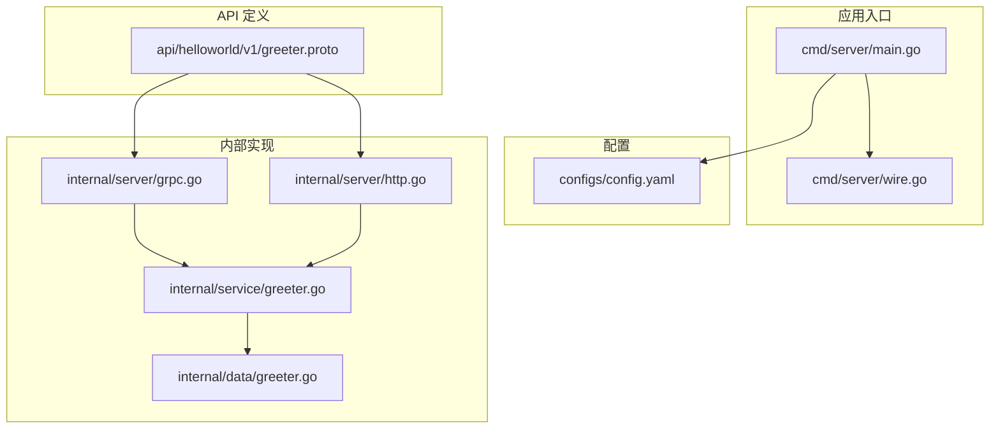
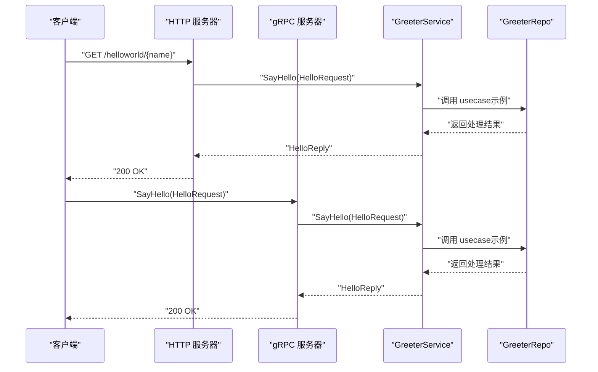
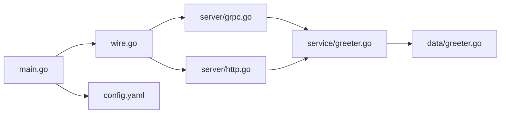

# 快速开始指南

<cite>
**本文引用的文件**
- [README.md](file://README.md)
- [Makefile](file://Makefile)
- [go.mod](file://go.mod)
- [Dockerfile](file://Dockerfile)
- [cmd/server/main.go](file://cmd/server/main.go)
- [cmd/server/wire.go](file://cmd/server/wire.go)
- [configs/config.yaml](file://configs/config.yaml)
- [api/helloworld/v1/greeter.proto](file://api/helloworld/v1/greeter.proto)
- [internal/server/grpc.go](file://internal/server/grpc.go)
- [internal/server/http.go](file://internal/server/http.go)
- [internal/service/greeter.go](file://internal/service/greeter.go)
- [internal/data/greeter.go](file://internal/data/greeter.go)
</cite>

## 目录
1. [简介](#简介)
2. [项目结构](#项目结构)
3. [核心组件](#核心组件)
4. [架构总览](#架构总览)
5. [详细组件分析](#详细组件分析)
6. [依赖关系分析](#依赖关系分析)
7. [性能注意事项](#性能注意事项)
8. [故障排查指南](#故障排查指南)
9. [结论](#结论)
10. [附录](#附录)

## 简介
本指南面向新手开发者，帮助你在10分钟内完成 kratos-layout 项目的本地部署与运行。你将学会：
- 准备环境（Go 版本、Protobuf 编译器）
- 克隆项目与初始化依赖
- 使用 Makefile 生成代码（proto 生成的 Go 文件、Wire 依赖注入代码）
- 启动服务并通过 HTTP 和 gRPC 调用 SayHello 接口
- 基于 Docker 的构建与运行
- 常见问题排查（如 protoc 未安装、端口占用）

## 项目结构
该项目采用 Kratos 模板，遵循“按层+按功能”的组织方式：
- cmd/server：应用入口与依赖注入生成
- configs：运行时配置
- api/helloworld/v1：定义服务契约（proto）
- internal/*：业务分层（biz、data、server、service）
- third_party：第三方 proto 定义
- Dockerfile、Makefile、go.mod、go.sum：构建与依赖管理

图表来源
- [cmd/server/main.go](file://cmd/server/main.go#L1-L88)
- [cmd/server/wire.go](file://cmd/server/wire.go#L1-L24)
- [configs/config.yaml](file://configs/config.yaml#L1-L16)
- [api/helloworld/v1/greeter.proto](file://api/helloworld/v1/greeter.proto#L1-L31)
- [internal/server/grpc.go](file://internal/server/grpc.go#L1-L33)
- [internal/server/http.go](file://internal/server/http.go#L1-L33)
- [internal/service/greeter.go](file://internal/service/greeter.go#L1-L30)
- [internal/data/greeter.go](file://internal/data/greeter.go#L1-L43)

章节来源
- [README.md](file://README.md#L1-L52)
- [Makefile](file://Makefile#L1-L83)
- [go.mod](file://go.mod#L1-L36)

## 核心组件
- 应用入口与生命周期管理：通过 main.go 加载配置、初始化日志、构造 Kratos 应用并启动。
- 依赖注入：使用 Wire 在 wire.go 中声明 ProviderSet，通过 wire 生成注入代码，简化服务组装。
- 配置中心：通过 config.yaml 提供 HTTP/GRPC 地址与超时、数据库与 Redis 连接信息。
- 协议与路由：greeter.proto 定义了 SayHello RPC 与 HTTP 映射路径。
- 服务器层：分别注册 gRPC 与 HTTP 服务，绑定 Greeter 实现。
- 业务与数据层：service 层调用 usecase，data 层提供仓库接口默认实现。

章节来源
- [cmd/server/main.go](file://cmd/server/main.go#L1-L88)
- [cmd/server/wire.go](file://cmd/server/wire.go#L1-L24)
- [configs/config.yaml](file://configs/config.yaml#L1-L16)
- [api/helloworld/v1/greeter.proto](file://api/helloworld/v1/greeter.proto#L1-L31)
- [internal/server/grpc.go](file://internal/server/grpc.go#L1-L33)
- [internal/server/http.go](file://internal/server/http.go#L1-L33)
- [internal/service/greeter.go](file://internal/service/greeter.go#L1-L30)
- [internal/data/greeter.go](file://internal/data/greeter.go#L1-L43)

## 架构总览
下图展示了从请求到响应的关键流程，涵盖 HTTP 与 gRPC 两条路径。

图表来源
- [internal/server/http.go](file://internal/server/http.go#L1-L33)
- [internal/server/grpc.go](file://internal/server/grpc.go#L1-L33)
- [internal/service/greeter.go](file://internal/service/greeter.go#L1-L30)
- [api/helloworld/v1/greeter.proto](file://api/helloworld/v1/greeter.proto#L1-L31)

## 详细组件分析

### 1. 环境准备
- Go 版本要求：项目使用 Go 1.21，工具链为 go1.22.6。
- Protobuf 编译器：需要安装 protoc 及相关插件（protoc-gen-go、protoc-gen-go-grpc、protoc-gen-go-http、protoc-gen-openapi）。
- Wire 工具：用于生成依赖注入代码。

建议操作
- 安装 Go 并设置 GOPATH/GOROOT。
- 安装 protoc（可使用包管理器或官方发布包）。
- 执行初始化命令安装所需插件与工具。

章节来源
- [go.mod](file://go.mod#L1-L36)
- [Makefile](file://Makefile#L18-L27)
- [README.md](file://README.md#L1-L52)

### 2. 克隆与初始化
- 克隆仓库后，执行初始化目标以安装依赖与工具。
- 使用 make api 生成 API 相关代码（pb.go、HTTP、gRPC、OpenAPI）。
- 使用 make all 一键生成 API、配置与 go generate。

章节来源
- [README.md](file://README.md#L24-L33)
- [Makefile](file://Makefile#L28-L64)

### 3. 生成代码与依赖注入
- 生成 API 代码：make api
- 生成配置代码：make config
- 生成 go generate：go generate ./...
- 生成 Wire 注入代码：在 cmd/server 目录执行 wire 命令（会生成 wire_gen.go）

章节来源
- [Makefile](file://Makefile#L36-L64)
- [cmd/server/wire.go](file://cmd/server/wire.go#L1-L24)
- [README.md](file://README.md#L33-L41)

### 4. 启动服务
- 默认配置路径：configs 目录。
- 启动命令：go run cmd/server/main.go -conf ../../configs
- 或者先构建二进制再运行：make build；./bin/server -conf ./configs

章节来源
- [cmd/server/main.go](file://cmd/server/main.go#L32-L34)
- [cmd/server/main.go](file://cmd/server/main.go#L61-L87)
- [configs/config.yaml](file://configs/config.yaml#L1-L16)
- [README.md](file://README.md#L20-L23)

### 5. 测试请求
- HTTP 接口：根据 proto 的 HTTP 映射，访问 GET /helloworld/{name}
- gRPC 接口：使用 grpcurl 或支持 gRPC 的客户端调用 SayHello

预期输出
- 返回包含问候消息的 HelloReply，其中 message 字段为“Hello {name}”。

章节来源
- [api/helloworld/v1/greeter.proto](file://api/helloworld/v1/greeter.proto#L12-L20)
- [internal/service/greeter.go](file://internal/service/greeter.go#L22-L30)

### 6. 基于 Docker 的构建与运行
- 构建镜像：docker build -t kratos-layout .
- 运行容器：映射 8000（HTTP）与 9000（gRPC），挂载配置目录到 /data/conf

章节来源
- [Dockerfile](file://Dockerfile#L1-L25)
- [README.md](file://README.md#L43-L51)

## 依赖关系分析
- 应用入口依赖配置加载、日志、Kratos App 组合器与 Wire 注入。
- 服务器层依赖服务实现与配置项（地址、超时）。
- 服务层依赖业务用例与数据仓库接口。
- 数据层提供仓库接口默认实现（当前返回空值，便于演示）。

图表来源
- [cmd/server/main.go](file://cmd/server/main.go#L1-L88)
- [cmd/server/wire.go](file://cmd/server/wire.go#L1-L24)
- [internal/server/grpc.go](file://internal/server/grpc.go#L1-L33)
- [internal/server/http.go](file://internal/server/http.go#L1-L33)
- [internal/service/greeter.go](file://internal/service/greeter.go#L1-L30)
- [internal/data/greeter.go](file://internal/data/greeter.go#L1-L43)

章节来源
- [cmd/server/main.go](file://cmd/server/main.go#L1-L88)
- [cmd/server/wire.go](file://cmd/server/wire.go#L1-L24)
- [internal/server/grpc.go](file://internal/server/grpc.go#L1-L33)
- [internal/server/http.go](file://internal/server/http.go#L1-L33)
- [internal/service/greeter.go](file://internal/service/greeter.go#L1-L30)
- [internal/data/greeter.go](file://internal/data/greeter.go#L1-L43)

## 性能注意事项
- 合理设置 HTTP/GRPC 超时，避免长连接阻塞。
- 使用 recovery 中间件提升稳定性。
- 生产环境建议启用追踪与指标采集（已在入口中引入 tracing）。
- 依赖 go.uber.org/automaxprocs 自动调整 P。

章节来源
- [cmd/server/main.go](file://cmd/server/main.go#L1-L88)
- [internal/server/grpc.go](file://internal/server/grpc.go#L1-L33)
- [internal/server/http.go](file://internal/server/http.go#L1-L33)

## 故障排查指南
- protoc 未安装或版本过低
  - 症状：make api 报错找不到 protoc 或插件
  - 处理：安装 protoc 与相应插件；参考 Makefile 中的 init 目标安装插件
  - 参考：[Makefile](file://Makefile#L18-L27)

- 端口占用
  - 症状：启动失败提示端口被占用
  - 处理：修改 configs/config.yaml 中的 HTTP/GRPC 地址端口，或释放占用端口
  - 参考：[configs/config.yaml](file://configs/config.yaml#L1-L16)

- Wire 生成失败
  - 症状：wire 命令报错或 wire_gen.go 未生成
  - 处理：确认已安装 wire；在 cmd/server 目录执行 wire；检查 wire.go 中 ProviderSet 是否完整
  - 参考：[README.md](file://README.md#L33-L41)，[cmd/server/wire.go](file://cmd/server/wire.go#L1-L24)

- 依赖下载缓慢
  - 症状：go mod download 慢
  - 处理：设置 GOPROXY；或使用 make init 安装工具后再执行 go mod tidy
  - 参考：[Makefile](file://Makefile#L52-L57)

- Docker 运行配置不生效
  - 症状：容器内无法读取配置
  - 处理：确认挂载路径 /data/conf 正确且包含 config.yaml
  - 参考：[Dockerfile](file://Dockerfile#L16-L24)，[configs/config.yaml](file://configs/config.yaml#L1-L16)

## 结论
通过本指南，你可以在本地快速完成 kratos-layout 项目的环境准备、代码生成、服务启动与接口测试，并掌握基于 Docker 的构建与运行方式。遇到问题时，可依据“故障排查指南”逐项定位与解决。

## 附录

### A. 10 分钟上手清单
- 安装 Go 1.21+ 与 protoc
- 初始化工具：make init
- 生成代码：make all
- 启动服务：go run cmd/server/main.go -conf ../../configs
- 测试接口：HTTP GET /helloworld/{name}；gRPC 调用 SayHello
- Docker 构建与运行：docker build/run

章节来源
- [README.md](file://README.md#L24-L51)
- [Makefile](file://Makefile#L18-L64)
- [cmd/server/main.go](file://cmd/server/main.go#L32-L34)
- [api/helloworld/v1/greeter.proto](file://api/helloworld/v1/greeter.proto#L12-L20)
- [Dockerfile](file://Dockerfile#L1-L25)