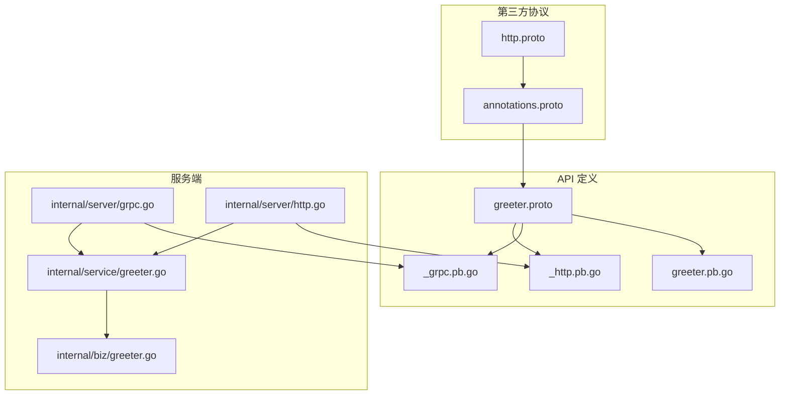
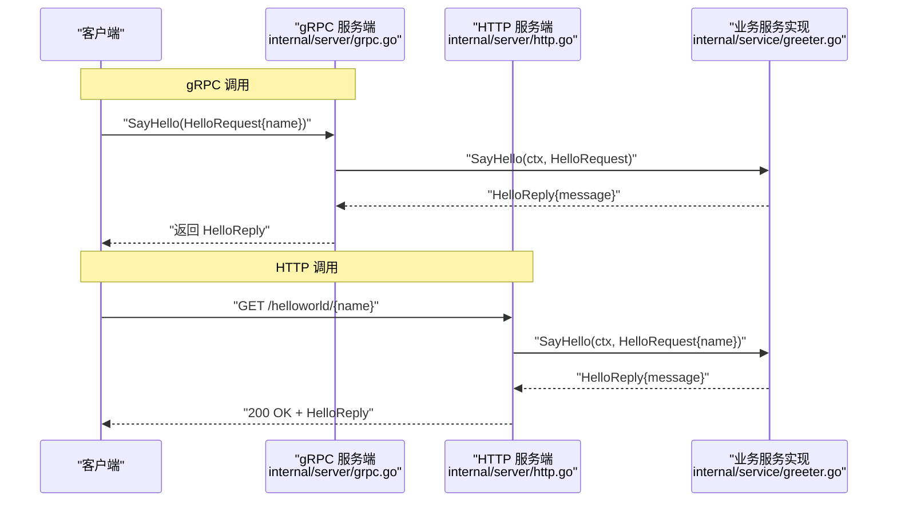
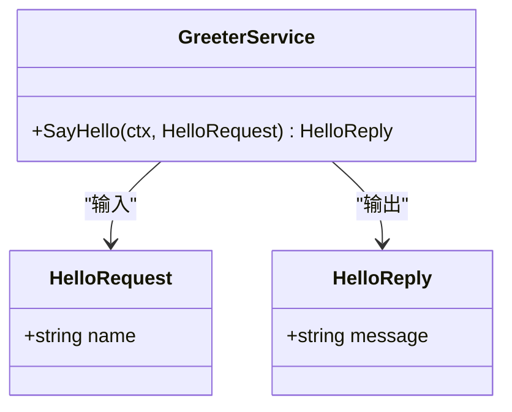
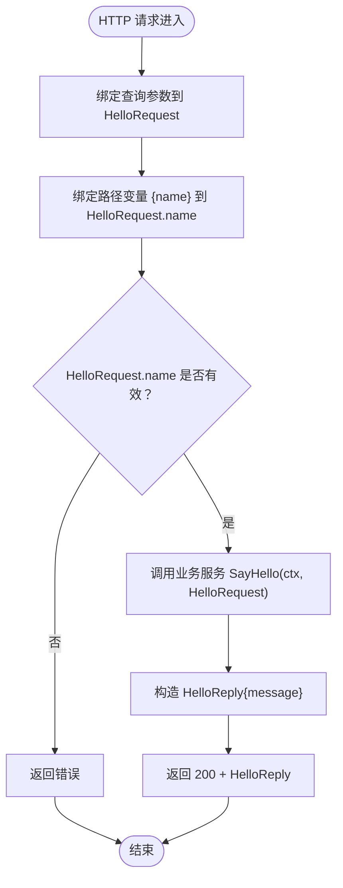
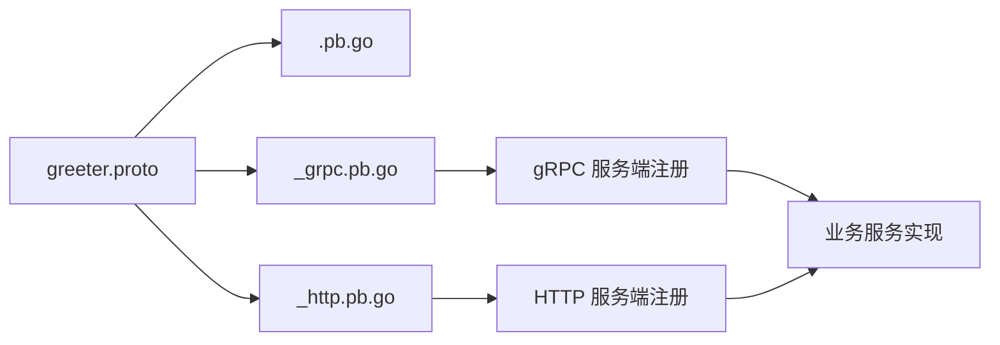
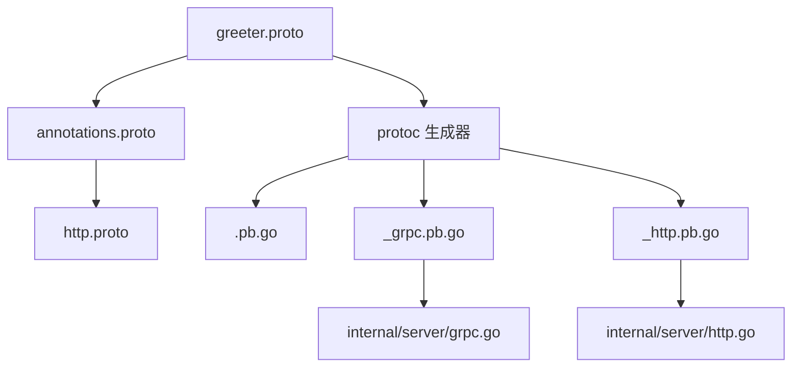

# API接口定义

<cite>
**本文引用的文件**
- [greeter.proto](file://api/helloworld/v1/greeter.proto)
- [greeter.pb.go](file://api/helloworld/v1/greeter.pb.go)
- [greeter_grpc.pb.go](file://api/helloworld/v1/greeter_grpc.pb.go)
- [greeter_http.pb.go](file://api/helloworld/v1/greeter_http.pb.go)
- [annotations.proto](file://third_party/google/api/annotations.proto)
- [http.proto](file://third_party/google/api/http.proto)
- [greeter.go](file://internal/service/greeter.go)
- [grpc.go](file://internal/server/grpc.go)
- [http.go](file://internal/server/http.go)
- [Makefile](file://Makefile)
- [error_reason.proto](file://api/helloworld/v1/error_reason.proto)
- [greeter.go](file://internal/biz/greeter.go)
</cite>

## 目录
1. [简介](#简介)
2. [项目结构](#项目结构)
3. [核心组件](#核心组件)
4. [架构总览](#架构总览)
5. [详细组件分析](#详细组件分析)
6. [依赖关系分析](#依赖关系分析)
7. [性能考量](#性能考量)
8. [故障排查指南](#故障排查指南)
9. [结论](#结论)
10. [附录：新增API编写规范与最佳实践](#附录新增api编写规范与最佳实践)

## 简介
本文件围绕 api/helloworld/v1/greeter.proto 中定义的 gRPC 服务接口与消息结构进行深入解析，重点阐释：
- service Greeter 中 rpc SayHello(HelloRequest) returns (HelloReply) 的语义与字段含义（name、message）。
- 通过 import "google/api/annotations.proto" 实现的 HTTP 映射机制，特别是 option (google.api.http) 中 get: "/helloworld/{name}" 的路径变量绑定规则。
- proto 文件中的 package、option go_package 等声明的作用。
- 如何通过 protoc 工具链生成对应的 .pb.go、_grpc.pb.go 和 _http.pb.go 代码文件。
- 结合实际代码片段展示 gRPC 与 HTTP 双协议统一接口的设计优势，并给出新增 API 的编写规范与最佳实践。

## 项目结构
该仓库采用 Kratos 框架布局，API 定义位于 api 目录下，服务端在 internal/server 中注册并运行 gRPC 与 HTTP 两种传输协议；业务逻辑在 internal/biz 与 internal/service 层实现。

图表来源
- [greeter.proto](file://api/helloworld/v1/greeter.proto#L1-L31)
- [greeter.pb.go](file://api/helloworld/v1/greeter.pb.go#L1-L226)
- [greeter_grpc.pb.go](file://api/helloworld/v1/greeter_grpc.pb.go#L1-L108)
- [greeter_http.pb.go](file://api/helloworld/v1/greeter_http.pb.go#L1-L75)
- [annotations.proto](file://third_party/google/api/annotations.proto#L1-L32)
- [http.proto](file://third_party/google/api/http.proto#L1-L376)
- [grpc.go](file://internal/server/grpc.go#L1-L33)
- [http.go](file://internal/server/http.go#L1-L33)
- [greeter.go](file://internal/service/greeter.go#L1-L30)
- [greeter.go](file://internal/biz/greeter.go#L1-L47)

章节来源
- [greeter.proto](file://api/helloworld/v1/greeter.proto#L1-L31)
- [Makefile](file://Makefile#L36-L45)

## 核心组件
- 服务定义与消息结构
  - service Greeter 提供 SayHello 方法，输入为 HelloRequest，输出为 HelloReply。
  - HelloRequest 字段 name 表示用户名称；HelloReply 字段 message 表示问候消息。
- HTTP 映射
  - 使用 google.api.http 注解将 gRPC 方法映射到 HTTP GET /helloworld/{name}，其中 {name} 绑定到 HelloRequest.name 字段。
- 代码生成
  - 通过 protoc 与插件生成 pb.go、grpc.pb.go、http.pb.go 三类文件，分别承载消息类型、gRPC 客户端/服务端接口与 HTTP 路由与客户端封装。

章节来源
- [greeter.proto](file://api/helloworld/v1/greeter.proto#L12-L31)
- [greeter.pb.go](file://api/helloworld/v1/greeter.pb.go#L24-L118)
- [greeter_grpc.pb.go](file://api/helloworld/v1/greeter_grpc.pb.go#L21-L107)
- [greeter_http.pb.go](file://api/helloworld/v1/greeter_http.pb.go#L20-L75)

## 架构总览
gRPC 与 HTTP 双协议统一接口的关键在于：同一份 proto 定义通过不同插件生成对应代码，服务端同时注册 gRPC 与 HTTP 路由，客户端可按需选择协议调用。

图表来源
- [greeter_grpc.pb.go](file://api/helloworld/v1/greeter_grpc.pb.go#L21-L107)
- [greeter_http.pb.go](file://api/helloworld/v1/greeter_http.pb.go#L20-L75)
- [grpc.go](file://internal/server/grpc.go#L13-L33)
- [http.go](file://internal/server/http.go#L13-L33)
- [greeter.go](file://internal/service/greeter.go#L1-L30)

## 详细组件分析

### 服务与消息模型
- service Greeter
  - 方法 SayHello：接收 HelloRequest，返回 HelloReply。
- HelloRequest
  - 字段 name：字符串类型，作为 HTTP 路径变量 {name} 的来源。
- HelloReply
  - 字段 message：字符串类型，作为 HTTP 响应体内容。

图表来源
- [greeter.proto](file://api/helloworld/v1/greeter.proto#L12-L31)
- [greeter.go](file://internal/service/greeter.go#L1-L30)

章节来源
- [greeter.proto](file://api/helloworld/v1/greeter.proto#L12-L31)
- [greeter.pb.go](file://api/helloworld/v1/greeter.pb.go#L24-L118)
- [greeter.go](file://internal/service/greeter.go#L1-L30)

### HTTP 映射与路径变量绑定
- 导入与扩展
  - 在 greeter.proto 中导入 google/api/annotations.proto，并在方法上使用 option (google.api.http) 扩展。
- 规则定义
  - annotations.proto 将 HttpRule 扩展到 MethodOptions，使每个 RPC 方法可声明 HTTP 映射。
  - http.proto 定义了 HttpRule 的结构，支持 get/put/post/delete/patch/custom 等模式、body、response_body、additional_bindings 等。
- 路径变量绑定
  - option (google.api.http) = { get: "/helloworld/{name}" } 将 HTTP GET 请求映射到 SayHello。
  - 路径变量 {name} 会从 HelloRequest.name 字段绑定，且该字段必须是标量类型（非重复、非消息）。
- 生成的 HTTP 代码
  - _http.pb.go 中注册路由 /helloworld/{name}，并在处理器中将查询参数与路径变量绑定到 HelloRequest，再调用业务服务实现，最后返回 200 + HelloReply。

图表来源
- [greeter_http.pb.go](file://api/helloworld/v1/greeter_http.pb.go#L20-L75)
- [http.proto](file://third_party/google/api/http.proto#L313-L376)
- [annotations.proto](file://third_party/google/api/annotations.proto#L28-L31)

章节来源
- [greeter.proto](file://api/helloworld/v1/greeter.proto#L12-L20)
- [annotations.proto](file://third_party/google/api/annotations.proto#L28-L31)
- [http.proto](file://third_party/google/api/http.proto#L313-L376)
- [greeter_http.pb.go](file://api/helloworld/v1/greeter_http.pb.go#L20-L75)

### gRPC 与 HTTP 的统一接口设计优势
- 单一数据契约：同一份 proto 定义同时驱动 gRPC 与 HTTP，避免数据模型分裂。
- 同步演进：协议差异通过注解与生成器处理，业务逻辑无需重复维护。
- 开发体验：客户端可按场景选择 gRPC 或 HTTP，服务端统一实现，便于测试与调试。

图表来源
- [greeter.proto](file://api/helloworld/v1/greeter.proto#L1-L31)
- [greeter.pb.go](file://api/helloworld/v1/greeter.pb.go#L1-L226)
- [greeter_grpc.pb.go](file://api/helloworld/v1/greeter_grpc.pb.go#L1-L108)
- [greeter_http.pb.go](file://api/helloworld/v1/greeter_http.pb.go#L1-L75)
- [grpc.go](file://internal/server/grpc.go#L13-L33)
- [http.go](file://internal/server/http.go#L13-L33)

章节来源
- [greeter_grpc.pb.go](file://api/helloworld/v1/greeter_grpc.pb.go#L21-L107)
- [greeter_http.pb.go](file://api/helloworld/v1/greeter_http.pb.go#L20-L75)
- [grpc.go](file://internal/server/grpc.go#L13-L33)
- [http.go](file://internal/server/http.go#L13-L33)

### 代码生成流程与工具链
- 插件安装
  - 通过 Makefile 的 init 目标安装 protoc-gen-go、protoc-gen-go-grpc、protoc-gen-go-http、protoc-gen-openapi 等插件。
- 生成命令
  - Makefile 的 api 目标使用 protoc，指定 --proto_path、--go_out、--go-http_out、--go-grpc_out 等参数，对 api 目录下的 .proto 文件进行生成。
- 生成产物
  - .pb.go：消息类型与反射元信息。
  - _grpc.pb.go：gRPC 客户端/服务端接口与服务描述。
  - _http.pb.go：HTTP 路由注册与客户端封装。

章节来源
- [Makefile](file://Makefile#L18-L27)
- [Makefile](file://Makefile#L36-L45)
- [greeter.pb.go](file://api/helloworld/v1/greeter.pb.go#L1-L226)
- [greeter_grpc.pb.go](file://api/helloworld/v1/greeter_grpc.pb.go#L1-L108)
- [greeter_http.pb.go](file://api/helloworld/v1/greeter_http.pb.go#L1-L75)

### 服务端集成与路由注册
- gRPC 服务端
  - internal/server/grpc.go 中通过 v1.RegisterGreeterServer(srv, greeter) 注册 Greeter 服务。
- HTTP 服务端
  - internal/server/http.go 中通过 v1.RegisterGreeterHTTPServer(srv, greeter) 注册 HTTP 路由，内部已绑定 /helloworld/{name}。

章节来源
- [grpc.go](file://internal/server/grpc.go#L13-L33)
- [http.go](file://internal/server/http.go#L13-L33)
- [greeter_http.pb.go](file://api/helloworld/v1/greeter_http.pb.go#L20-L35)

## 依赖关系分析
- proto 依赖
  - greeter.proto 依赖 third_party/google/api/annotations.proto 与 third_party/google/api/http.proto。
- 生成器依赖
  - protoc-gen-go 生成 .pb.go；protoc-gen-go-grpc 生成 _grpc.pb.go；protoc-gen-go-http 生成 _http.pb.go。
- 运行时依赖
  - 服务端通过 Kratos transport/http 与 transport/grpc 提供 HTTP 与 gRPC 传输能力。

图表来源
- [greeter.proto](file://api/helloworld/v1/greeter.proto#L1-L31)
- [annotations.proto](file://third_party/google/api/annotations.proto#L1-L32)
- [http.proto](file://third_party/google/api/http.proto#L1-L376)
- [Makefile](file://Makefile#L36-L45)
- [grpc.go](file://internal/server/grpc.go#L13-L33)
- [http.go](file://internal/server/http.go#L13-L33)

章节来源
- [greeter.proto](file://api/helloworld/v1/greeter.proto#L1-L31)
- [annotations.proto](file://third_party/google/api/annotations.proto#L1-L32)
- [http.proto](file://third_party/google/api/http.proto#L1-L376)
- [Makefile](file://Makefile#L36-L45)

## 性能考量
- 单一数据契约减少序列化与转换开销，提升跨协议一致性。
- HTTP 映射仅绑定标量字段，避免复杂嵌套导致的编码/解码成本。
- 通过中间件统一处理（如 recovery），降低异常传播与日志开销。
- 路由注册与调用链路短，适合高并发场景。

## 故障排查指南
- HTTP 404/405
  - 确认 HTTP 路由是否正确注册（/helloworld/{name}）。
  - 检查请求方法是否为 GET。
- HTTP 400
  - 路径变量 {name} 未传或为空；检查客户端绑定逻辑。
- HTTP 500
  - 服务端 SayHello 抛出异常；查看业务服务日志与错误返回。
- gRPC 501
  - 未实现 SayHello；确认服务端已注册 Greeter 服务。

章节来源
- [greeter_http.pb.go](file://api/helloworld/v1/greeter_http.pb.go#L20-L75)
- [greeter_grpc.pb.go](file://api/helloworld/v1/greeter_grpc.pb.go#L46-L63)
- [grpc.go](file://internal/server/grpc.go#L13-L33)
- [http.go](file://internal/server/http.go#L13-L33)

## 结论
通过在 greeter.proto 中声明 HTTP 映射与 gRPC 接口，配合 Kratos 的多协议传输能力，实现了“一份定义、双协议可用”的高效开发模式。开发者可在保持数据契约一致的前提下，灵活选择 gRPC 或 HTTP 访问方式，简化维护成本并提升系统可扩展性。

## 附录：新增API编写规范与最佳实践
- 数据模型
  - 使用标量字段作为路径变量，避免复杂嵌套与重复字段参与 URL 绑定。
  - 对于需要放入请求体的字段，使用 body 或 * 绑定（遵循 http.proto 规则）。
- HTTP 映射
  - 优先使用幂等方法（GET/PUT/DELETE/PATCH）与清晰的资源路径风格。
  - 复杂场景可使用 additional_bindings 定义多个映射。
- 代码生成
  - 使用 Makefile 的 api 目标统一生成 .pb.go、_grpc.pb.go、_http.pb.go。
  - 确保 --proto_path 包含 api 与 third_party。
- 服务端集成
  - 同时在 gRPC 与 HTTP 服务端注册新服务，保证双协议可用。
  - 在业务服务中集中处理错误与日志，保持一致性。
- 错误与状态
  - 使用枚举或错误类型统一表达错误原因，便于客户端处理与监控。

章节来源
- [http.proto](file://third_party/google/api/http.proto#L313-L376)
- [Makefile](file://Makefile#L36-L45)
- [error_reason.proto](file://api/helloworld/v1/error_reason.proto#L1-L14)
- [greeter.go](file://internal/biz/greeter.go#L1-L47)