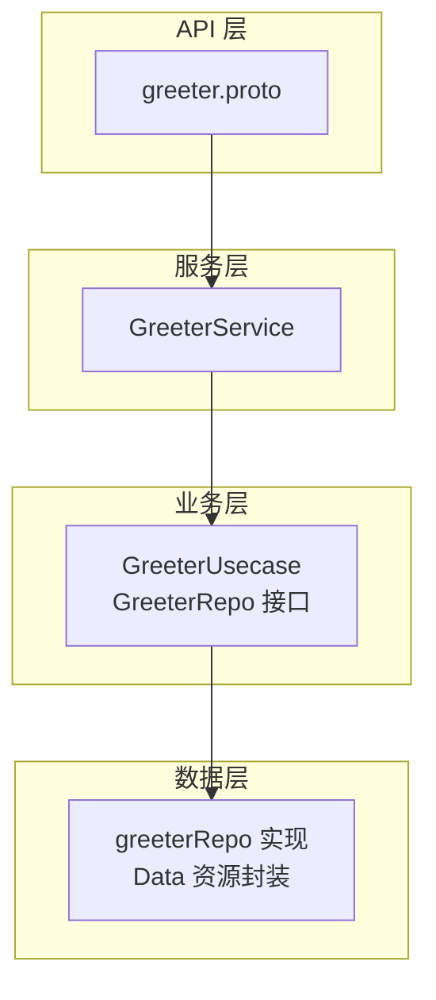
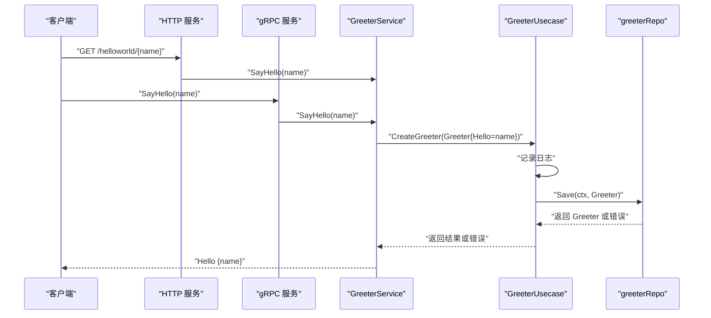
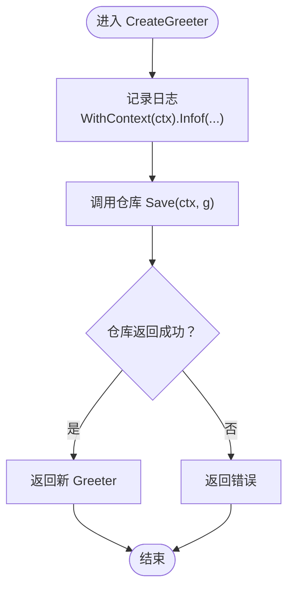
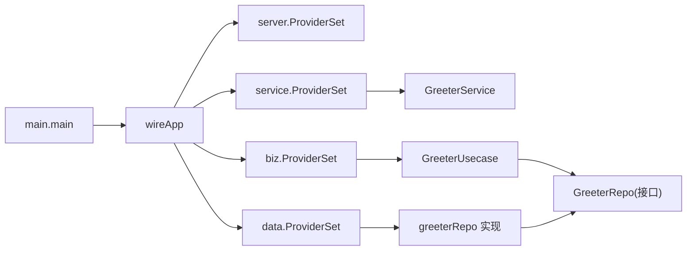

# 业务逻辑层

<cite>
**本文引用的文件列表**
- [internal/biz/greeter.go](file://internal/biz/greeter.go)
- [internal/biz/biz.go](file://internal/biz/biz.go)
- [internal/data/greeter.go](file://internal/data/greeter.go)
- [internal/data/data.go](file://internal/data/data.go)
- [internal/service/greeter.go](file://internal/service/greeter.go)
- [internal/server/grpc.go](file://internal/server/grpc.go)
- [internal/server/http.go](file://internal/server/http.go)
- [cmd/server/main.go](file://cmd/server/main.go)
- [cmd/server/wire.go](file://cmd/server/wire.go)
- [api/helloworld/v1/greeter.proto](file://api/helloworld/v1/greeter.proto)
</cite>

## 目录
1. [引言](#引言)
2. [项目结构](#项目结构)
3. [核心组件](#核心组件)
4. [架构总览](#架构总览)
5. [详细组件分析](#详细组件分析)
6. [依赖关系分析](#依赖关系分析)
7. [性能考量](#性能考量)
8. [故障排查指南](#故障排查指南)
9. [结论](#结论)
10. [附录](#附录)

## 引言
本文件聚焦于 internal/biz/greeter.go 中的业务逻辑组织方式与设计模式，系统性地阐述：
- 领域模型 Greeter 的结构与业务含义
- 数据访问契约 GreeterRepo 接口的五项能力及其在数据抽象层中的作用
- 业务用例 GreeterUsecase 的构造与依赖注入方式，以及 CreateGreeter 方法的日志与流程
- 当前实现中“简单透传”的设计意图与边界
- 在业务层扩展验证、错误码与领域事件的实践建议

## 项目结构
该工程采用分层架构：API 层（协议与传输）、服务层（业务适配器）、业务层（用例与领域模型）、数据层（仓储与基础设施）。Greeter 示例贯穿四层，便于演示依赖注入与用例编排。

图表来源
- [api/helloworld/v1/greeter.proto](file://api/helloworld/v1/greeter.proto#L1-L31)
- [internal/service/greeter.go](file://internal/service/greeter.go#L1-L30)
- [internal/biz/greeter.go](file://internal/biz/greeter.go#L1-L47)
- [internal/data/greeter.go](file://internal/data/greeter.go#L1-L43)
- [internal/data/data.go](file://internal/data/data.go#L1-L25)

章节来源
- [cmd/server/main.go](file://cmd/server/main.go#L50-L88)
- [cmd/server/wire.go](file://cmd/server/wire.go#L1-L24)
- [internal/server/grpc.go](file://internal/server/grpc.go#L1-L33)
- [internal/server/http.go](file://internal/server/http.go#L1-L33)

## 核心组件
- 领域模型 Greeter：承载业务实体的基本属性，此处为 Hello 字段，用于标识问候内容。
- 数据访问接口 GreeterRepo：定义保存、更新、按主键查询、按条件查询列表、全量列表等五项契约，作为数据抽象层的核心。
- 业务用例 GreeterUsecase：通过依赖注入持有 GreeterRepo 与日志助手；对外暴露 CreateGreeter 等用例方法。
- 服务适配器 GreeterService：面向 API 层暴露 SayHello，内部委派给 GreeterUsecase 执行业务逻辑。
- 仓储实现 greeterRepo：对 Data 资源进行封装，提供 GreeterRepo 的具体实现（当前返回空值占位，便于演示流程）。

章节来源
- [internal/biz/greeter.go](file://internal/biz/greeter.go#L12-L47)
- [internal/data/greeter.go](file://internal/data/greeter.go#L1-L43)
- [internal/service/greeter.go](file://internal/service/greeter.go#L1-L30)
- [internal/data/data.go](file://internal/data/data.go#L1-L25)

## 架构总览
下图展示从 API 请求到业务用例再到仓储的完整调用链路，体现依赖注入与分层职责。

图表来源
- [internal/service/greeter.go](file://internal/service/greeter.go#L1-L30)
- [internal/biz/greeter.go](file://internal/biz/greeter.go#L31-L47)
- [internal/data/greeter.go](file://internal/data/greeter.go#L24-L43)
- [internal/server/http.go](file://internal/server/http.go#L1-L33)
- [internal/server/grpc.go](file://internal/server/grpc.go#L1-L33)

## 详细组件分析

### 领域模型 Greeter 与 Hello 字段
- 结构定义：Greeter 是一个简单的领域对象，包含 Hello 字段，用于表达问候语。
- 业务含义：在当前示例中，Hello 即为输入名称，后续可扩展为更复杂的领域属性（如校验规则、唯一性约束、状态机等）。

章节来源
- [internal/biz/greeter.go](file://internal/biz/greeter.go#L17-L21)

### 数据访问契约 GreeterRepo 接口
- 契约清单：
  - Save：创建实体
  - Update：更新实体
  - FindByID：按主键查询单个实体
  - ListByHello：按 Hello 条件查询列表
  - ListAll：查询全部实体
- 抽象价值：以接口隔离具体存储实现，使业务用例不直接依赖数据库/缓存等细节，提升可测试性与可替换性。

章节来源
- [internal/biz/greeter.go](file://internal/biz/greeter.go#L22-L29)

### 仓储实现 greeterRepo
- 实现要点：
  - 通过 NewGreeterRepo 注入 Data 与日志助手
  - 当前各方法返回空值或空切片，用于演示流程；实际项目中应接入真实持久化层
- 设计意图：保持接口契约不变，逐步替换为真实数据访问逻辑。

章节来源
- [internal/data/greeter.go](file://internal/data/greeter.go#L1-L43)
- [internal/data/data.go](file://internal/data/data.go#L1-L25)

### 业务用例 GreeterUsecase
- 依赖注入：
  - NewGreeterUsecase 通过参数接收 GreeterRepo 与日志器，使用 log.NewHelper 包装为 Helper
  - 通过 Google Wire 的 ProviderSet 进行装配
- CreateGreeter 流程：
  - 记录上下文日志，输出 Hello 内容
  - 将保存请求透传给仓库 Save
  - 返回仓库结果或错误

图表来源
- [internal/biz/greeter.go](file://internal/biz/greeter.go#L37-L47)

章节来源
- [internal/biz/greeter.go](file://internal/biz/greeter.go#L31-L47)
- [internal/biz/biz.go](file://internal/biz/biz.go#L1-L7)
- [cmd/server/wire.go](file://cmd/server/wire.go#L1-L24)

### 服务适配器 GreeterService
- 作为 API 与业务层之间的桥梁，SayHello 将请求参数转换为领域模型 Greeter，调用业务用例 CreateGreeter，再组装响应。
- 错误处理：若业务用例返回错误，直接向上抛出。

章节来源
- [internal/service/greeter.go](file://internal/service/greeter.go#L1-L30)

### 错误码定义与领域事件扩展建议
- 当前示例中定义了 ErrUserNotFound，用于表示用户不存在的错误场景。
- 扩展建议（不改变现有代码，仅提供指导）：
  - 在业务层增加输入验证与规则校验，失败时返回相应错误码
  - 对于需要跨模块通知的场景，可在用例完成后发布领域事件，由监听器执行副作用（如发送邮件、写审计日志等）

章节来源
- [internal/biz/greeter.go](file://internal/biz/greeter.go#L12-L16)

## 依赖关系分析
- 依赖注入链路：
  - main 调用 wireApp，构建应用实例
  - wire.Build 组合 server、data、biz、service ProviderSet，完成 GreeterService、GreeterUsecase、greeterRepo 的装配
- 分层耦合：
  - 业务层仅依赖接口 GreeterRepo，降低对数据层的耦合
  - 服务层仅依赖业务用例，避免直接操作仓储

图表来源
- [cmd/server/main.go](file://cmd/server/main.go#L50-L88)
- [cmd/server/wire.go](file://cmd/server/wire.go#L1-L24)
- [internal/biz/biz.go](file://internal/biz/biz.go#L1-L7)
- [internal/data/data.go](file://internal/data/data.go#L1-L25)
- [internal/service/greeter.go](file://internal/service/greeter.go#L1-L30)
- [internal/biz/greeter.go](file://internal/biz/greeter.go#L31-L47)
- [internal/data/greeter.go](file://internal/data/greeter.go#L1-L43)

章节来源
- [cmd/server/main.go](file://cmd/server/main.go#L50-L88)
- [cmd/server/wire.go](file://cmd/server/wire.go#L1-L24)

## 性能考量
- 日志开销：CreateGreeter 中的日志记录为轻量级 I/O，通常影响可忽略；在高并发场景建议使用异步日志或采样策略。
- 仓储透传：当前仓储实现直接返回空值，不会产生额外计算；实际持久化时需关注连接池、批量写入与索引优化。
- 依赖注入成本：Wire 在编译期生成注入代码，运行时几乎无额外开销。

## 故障排查指南
- 问题定位：
  - 若 CreateGreeter 返回空结果，请检查仓储实现是否正确返回实体
  - 若日志未输出，请确认日志器已正确注入并启用
- 常见错误：
  - 依赖注入缺失：确认 ProviderSet 已组合到 wire.Build
  - 传输层未注册：确保 HTTP/gRPC 服务已注册 GreeterServer

章节来源
- [internal/biz/greeter.go](file://internal/biz/greeter.go#L31-L47)
- [internal/data/greeter.go](file://internal/data/greeter.go#L24-L43)
- [internal/server/http.go](file://internal/server/http.go#L1-L33)
- [internal/server/grpc.go](file://internal/server/grpc.go#L1-L33)

## 结论
- 当前实现体现了清晰的分层与依赖注入：业务层通过接口隔离数据层，服务层负责协议适配，仓储实现可替换。
- GreeterUsecase 的 CreateGreeter 采用“简单透传”设计，便于演示与快速迭代；随着业务复杂度提升，应在业务层补充验证、错误码与领域事件，以增强健壮性与可维护性。

## 附录
- 用例扩展参考路径：
  - 输入验证与规则：在 CreateGreeter 前后增加参数校验与业务规则判断
  - 错误码定义：在业务层集中管理错误类型与消息映射
  - 领域事件：在关键步骤发布事件，解耦副作用逻辑
- 仓储替换参考路径：
  - 在 greeterRepo 中接入数据库/缓存客户端，实现 Save/Update/FindByID/ListByHello/ListAll