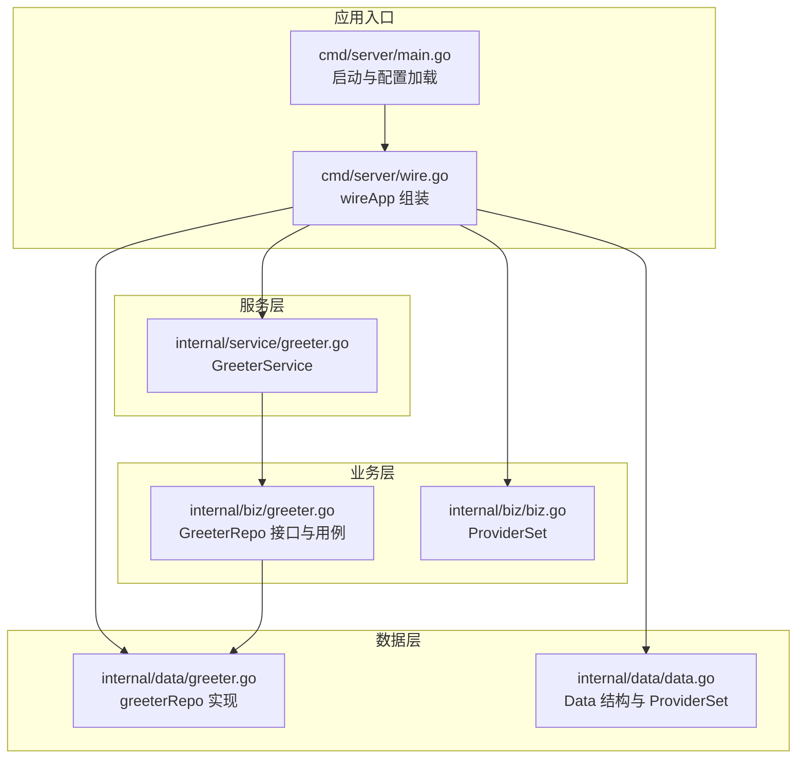
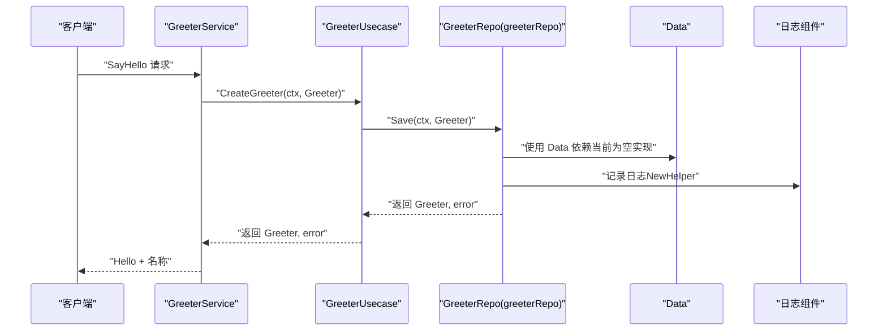
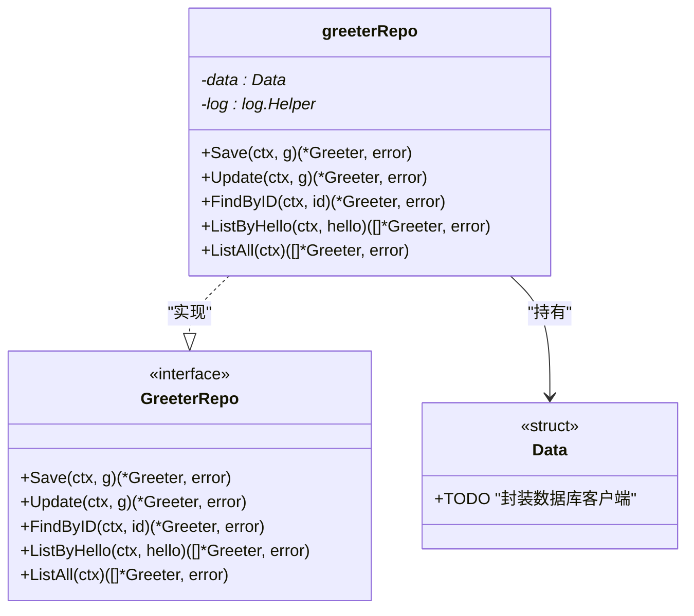
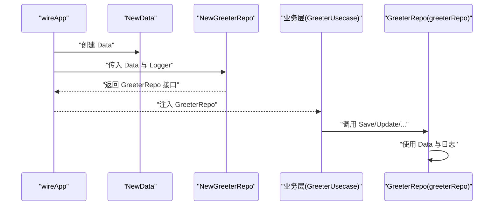
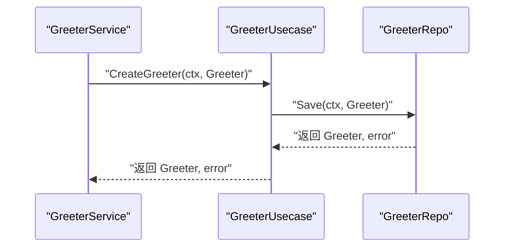
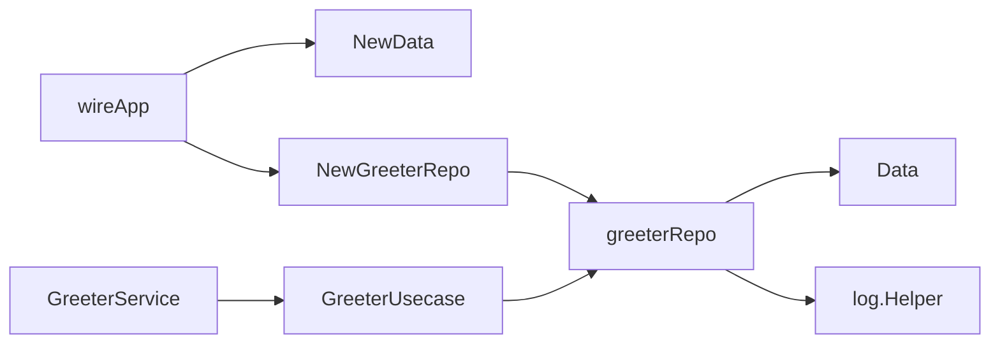

# 数据访问层

<cite>
**本文引用的文件**
- [internal/data/greeter.go](file://internal/data/greeter.go)
- [internal/data/data.go](file://internal/data/data.go)
- [internal/biz/greeter.go](file://internal/biz/greeter.go)
- [internal/biz/biz.go](file://internal/biz/biz.go)
- [cmd/server/wire.go](file://cmd/server/wire.go)
- [cmd/server/main.go](file://cmd/server/main.go)
- [internal/service/greeter.go](file://internal/service/greeter.go)
</cite>

## 目录
1. [引言](#引言)
2. [项目结构](#项目结构)
3. [核心组件](#核心组件)
4. [架构总览](#架构总览)
5. [详细组件分析](#详细组件分析)
6. [依赖分析](#依赖分析)
7. [性能考虑](#性能考虑)
8. [故障排查指南](#故障排查指南)
9. [结论](#结论)
10. [附录](#附录)

## 引言
本文件聚焦于内部数据层（internal/data）中 Greeter DAO 的实现与设计意图，围绕以下目标展开：
- 解析 greeterRepo 结构体如何持有 Data 依赖与日志组件，体现基础设施资源的集中管理。
- 逐项说明 Save、Update、FindByID、ListByHello、ListAll 等方法的签名与返回值设计，并阐明其作为持久化抽象层的扩展能力。
- 阐述 NewGreeterRepo 工厂函数如何将 *data.Data 和 log.Logger 转换为 biz.GreeterRepo 接口，实现依赖倒置原则。
- 展示数据层与业务层的解耦关系，并给出集成 GORM、Redis 等具体存储技术的实践建议（连接管理、事务传播、异常转换等）。

## 项目结构
本项目采用分层架构：API 定义位于 api/；服务端入口在 cmd/server；业务层在 internal/biz；数据层在 internal/data；服务适配器在 internal/service。依赖注入通过 Google Wire 在 cmd/server/wire.go 中组织 ProviderSet 并由 wireApp 组合装配。

图表来源
- [cmd/server/main.go](file://cmd/server/main.go#L50-L88)
- [cmd/server/wire.go](file://cmd/server/wire.go#L20-L24)
- [internal/biz/greeter.go](file://internal/biz/greeter.go#L17-L47)
- [internal/biz/biz.go](file://internal/biz/biz.go#L1-L7)
- [internal/data/greeter.go](file://internal/data/greeter.go#L11-L43)
- [internal/data/data.go](file://internal/data/data.go#L10-L25)
- [internal/service/greeter.go](file://internal/service/greeter.go#L1-L30)

章节来源
- [cmd/server/main.go](file://cmd/server/main.go#L50-L88)
- [cmd/server/wire.go](file://cmd/server/wire.go#L20-L24)
- [internal/biz/greeter.go](file://internal/biz/greeter.go#L17-L47)
- [internal/biz/biz.go](file://internal/biz/biz.go#L1-L7)
- [internal/data/greeter.go](file://internal/data/greeter.go#L11-L43)
- [internal/data/data.go](file://internal/data/data.go#L10-L25)
- [internal/service/greeter.go](file://internal/service/greeter.go#L1-L30)

## 核心组件
- 数据层接口与实现
  - 接口定义：biz.GreeterRepo 提供 Save、Update、FindByID、ListByHello、ListAll 等方法，作为持久化抽象层契约。
  - 实现类型：greeterRepo 结构体承载 data.Data 依赖与日志组件，实现上述接口方法。
- 基础设施资源集中管理
  - Data 结构体用于封装底层基础设施客户端（当前注释提示“待封装数据库客户端”），NewData 返回清理函数，体现资源生命周期管理。
- 工厂与依赖注入
  - NewGreeterRepo 将 *data.Data 与 log.Logger 转换为 biz.GreeterRepo 接口实例，配合 ProviderSet 与 wireApp 完成依赖注入。

章节来源
- [internal/biz/greeter.go](file://internal/biz/greeter.go#L17-L47)
- [internal/data/greeter.go](file://internal/data/greeter.go#L11-L43)
- [internal/data/data.go](file://internal/data/data.go#L10-L25)
- [cmd/server/wire.go](file://cmd/server/wire.go#L20-L24)

## 架构总览
下图展示了从服务层到业务层再到数据层的调用链路，以及依赖注入的装配点。

图表来源
- [internal/service/greeter.go](file://internal/service/greeter.go#L22-L30)
- [internal/biz/greeter.go](file://internal/biz/greeter.go#L31-L47)
- [internal/data/greeter.go](file://internal/data/greeter.go#L16-L43)
- [internal/data/data.go](file://internal/data/data.go#L18-L24)

## 详细组件分析

### greeterRepo 结构体与依赖注入
- 字段与职责
  - data: 持有 *data.Data，作为基础设施资源的统一入口（当前为空实现，便于后续替换为数据库、缓存等客户端）。
  - log: 使用 log.NewHelper(logger) 包装日志组件，提供上下文感知的日志记录能力。
- 工厂函数 NewGreeterRepo
  - 输入：*data.Data 与 log.Logger
  - 输出：biz.GreeterRepo 接口实例
  - 设计要点：通过工厂函数完成依赖倒置，上层仅依赖接口，不关心具体实现。

图表来源
- [internal/data/greeter.go](file://internal/data/greeter.go#L11-L43)
- [internal/data/data.go](file://internal/data/data.go#L13-L24)
- [internal/biz/greeter.go](file://internal/biz/greeter.go#L22-L29)

章节来源
- [internal/data/greeter.go](file://internal/data/greeter.go#L11-L22)
- [internal/data/data.go](file://internal/data/data.go#L13-L24)
- [internal/biz/greeter.go](file://internal/biz/greeter.go#L22-L29)

### 方法签名与返回值设计
- Save(ctx, *Greeter) (*Greeter, error)
  - 设计意图：接收业务模型 Greeter，返回持久化后的 Greeter 及错误。
  - 当前实现：静态返回（占位），体现抽象层契约，便于后续对接数据库或外部 API。
- Update(ctx, *Greeter) (*Greeter, error)
  - 设计意图：更新持久化实体并返回最新状态。
  - 当前实现：静态返回（占位）。
- FindByID(ctx, int64) (*Greeter, error)
  - 设计意图：按主键查询单条记录。
  - 当前实现：静态返回（占位）。
- ListByHello(ctx, string) ([]*Greeter, error)
  - 设计意图：按 Hello 字段过滤列表。
  - 当前实现：静态返回（占位）。
- ListAll(ctx) ([]*Greeter, error)
  - 设计意图：列出所有记录。
  - 当前实现：静态返回（占位）。

扩展能力说明
- 作为持久化抽象层，这些方法签名与返回值设计为未来对接数据库（如 GORM）、缓存（如 Redis）或外部 API 提供了清晰的契约边界。上层业务无需关心底层存储细节，仅依赖接口即可。

章节来源
- [internal/data/greeter.go](file://internal/data/greeter.go#L24-L43)
- [internal/biz/greeter.go](file://internal/biz/greeter.go#L22-L29)

### 依赖倒置与工厂函数
- NewGreeterRepo 将 *data.Data 与 log.Logger 转换为 biz.GreeterRepo 接口，实现依赖倒置：
  - 上层（业务层）仅依赖接口 GreeterRepo，不直接依赖具体实现。
  - 通过工厂函数注入具体实现与基础设施依赖，便于替换与测试。
- ProviderSet 与 wireApp
  - data.ProviderSet 与 biz.ProviderSet 组合，由 wireApp 统一装配 Kratos 应用实例，确保 GreeterRepo 与 Data、Logger 等依赖正确注入。

图表来源
- [cmd/server/wire.go](file://cmd/server/wire.go#L20-L24)
- [internal/data/data.go](file://internal/data/data.go#L18-L24)
- [internal/data/greeter.go](file://internal/data/greeter.go#L16-L22)
- [internal/biz/greeter.go](file://internal/biz/greeter.go#L31-L47)

章节来源
- [cmd/server/wire.go](file://cmd/server/wire.go#L20-L24)
- [internal/data/data.go](file://internal/data/data.go#L10-L25)
- [internal/data/greeter.go](file://internal/data/greeter.go#L16-L22)
- [internal/biz/greeter.go](file://internal/biz/greeter.go#L31-L47)

### 数据层与业务层解耦示例
- 服务层 GreeterService 调用业务用例 GreeterUsecase，后者再调用 GreeterRepo 接口方法。
- 由于 GreeterRepo 由工厂函数注入，业务层无需关心具体实现，从而实现解耦。

图表来源
- [internal/service/greeter.go](file://internal/service/greeter.go#L22-L30)
- [internal/biz/greeter.go](file://internal/biz/greeter.go#L42-L47)
- [internal/data/greeter.go](file://internal/data/greeter.go#L24-L30)

章节来源
- [internal/service/greeter.go](file://internal/service/greeter.go#L1-L30)
- [internal/biz/greeter.go](file://internal/biz/greeter.go#L31-L47)
- [internal/data/greeter.go](file://internal/data/greeter.go#L24-L30)

### 集成 GORM、Redis 等存储技术的实践建议
- 连接管理
  - 在 data.Data 中封装数据库连接池与 Redis 客户端，提供统一初始化与关闭逻辑（参考 NewData 的清理函数模式）。
- 事务传播
  - 在 Save/Update 等写操作中，将 context 传递给底层客户端，确保分布式追踪与事务边界一致。
- 异常转换
  - 将底层错误转换为业务层可识别的错误类型（例如 NotFound、InvalidArgument 等），保持接口层一致性。
- 查询优化
  - ListByHello/ListAll 等方法应结合索引与分页策略，避免全表扫描；对高频查询可引入缓存层（如 Redis）以降低延迟。
- 日志与可观测性
  - 使用 log.Helper 记录关键操作与错误堆栈，结合 TraceID/SpanID 进行链路追踪。

章节来源
- [internal/data/data.go](file://internal/data/data.go#L18-L24)
- [internal/biz/greeter.go](file://internal/biz/greeter.go#L12-L15)

## 依赖分析
- 组件耦合与内聚
  - 数据层 greeterRepo 对 biz.GreeterRepo 接口强依赖，对 data.Data 与 log.Logger 的依赖通过构造函数注入，符合依赖倒置原则。
  - 业务层仅依赖接口，不依赖具体实现，具备良好内聚与低耦合特性。
- 直接与间接依赖
  - wireApp 通过 ProviderSet 组合装配 Data、Repo、Usecase、Service，形成清晰的依赖链。
- 外部依赖与集成点
  - 依赖注入框架 Google Wire；日志组件 Kratos log；业务错误类型 Kratos errors。
- 接口契约与实现细节
  - GreeterRepo 接口定义了持久化抽象层的契约，具体实现可在不破坏上层契约的前提下替换为数据库、缓存或外部 API。

图表来源
- [cmd/server/wire.go](file://cmd/server/wire.go#L20-L24)
- [internal/data/data.go](file://internal/data/data.go#L18-L24)
- [internal/data/greeter.go](file://internal/data/greeter.go#L16-L22)
- [internal/service/greeter.go](file://internal/service/greeter.go#L1-L30)
- [internal/biz/greeter.go](file://internal/biz/greeter.go#L31-L47)

章节来源
- [cmd/server/wire.go](file://cmd/server/wire.go#L20-L24)
- [internal/data/greeter.go](file://internal/data/greeter.go#L11-L22)
- [internal/data/data.go](file://internal/data/data.go#L10-L25)
- [internal/biz/greeter.go](file://internal/biz/greeter.go#L17-L47)
- [internal/service/greeter.go](file://internal/service/greeter.go#L1-L30)

## 性能考虑
- 静态返回的代价
  - 当前实现为静态返回，无实际 I/O，性能开销极低；但作为抽象层契约，需确保未来实现不会引入不必要的网络往返与序列化成本。
- 查询与缓存
  - 对 ListAll/ListByHello 等读取操作，建议引入缓存层与分页策略，减少数据库压力。
- 事务与连接池
  - 数据库操作应复用连接池，避免频繁创建/销毁连接；在长事务中注意锁竞争与超时控制。
- 日志与采样
  - 在高并发场景下，合理控制日志级别与采样率，避免日志成为性能瓶颈。

## 故障排查指南
- 常见问题定位
  - 依赖注入失败：检查 wireApp 是否正确组合 ProviderSet，确认 NewData 与 NewGreeterRepo 的签名与返回值一致。
  - 日志缺失：确认 log.Logger 注入成功，且使用 log.NewHelper 包装；检查服务启动日志是否包含 trace.id/span.id。
  - 接口未实现：若业务层调用报错，检查 greeterRepo 是否实现了 GreeterRepo 全部方法。
- 错误转换
  - 将底层错误转换为业务错误（如 NotFound、InvalidArgument），便于上层统一处理与对外返回。
- 资源清理
  - Data 的清理函数应在应用关闭时执行，确保数据库连接、缓存连接等资源被正确释放。

章节来源
- [cmd/server/wire.go](file://cmd/server/wire.go#L20-L24)
- [internal/data/data.go](file://internal/data/data.go#L18-L24)
- [internal/biz/greeter.go](file://internal/biz/greeter.go#L12-L15)

## 结论
- 数据层通过 greeterRepo 与 Data、Logger 的协作，实现了基础设施资源的集中管理与依赖倒置。
- GreeterRepo 接口定义了清晰的持久化抽象层契约，当前实现为静态返回，体现了良好的扩展性与演进空间。
- 通过工厂函数与 Google Wire 的依赖注入，业务层与数据层实现了解耦，便于后续集成 GORM、Redis 等具体存储技术。
- 建议在演进过程中关注连接管理、事务传播、异常转换与缓存策略，以提升整体性能与可靠性。

## 附录
- 关键路径参考
  - NewGreeterRepo 工厂函数：[internal/data/greeter.go](file://internal/data/greeter.go#L16-L22)
  - GreeterRepo 接口定义：[internal/biz/greeter.go](file://internal/biz/greeter.go#L22-L29)
  - Data 结构与 ProviderSet：[internal/data/data.go](file://internal/data/data.go#L10-L25)
  - wireApp 组装入口：[cmd/server/wire.go](file://cmd/server/wire.go#L20-L24)
  - 服务层调用链：[internal/service/greeter.go](file://internal/service/greeter.go#L22-L30)
  - 业务用例调用：[internal/biz/greeter.go](file://internal/biz/greeter.go#L42-L47)