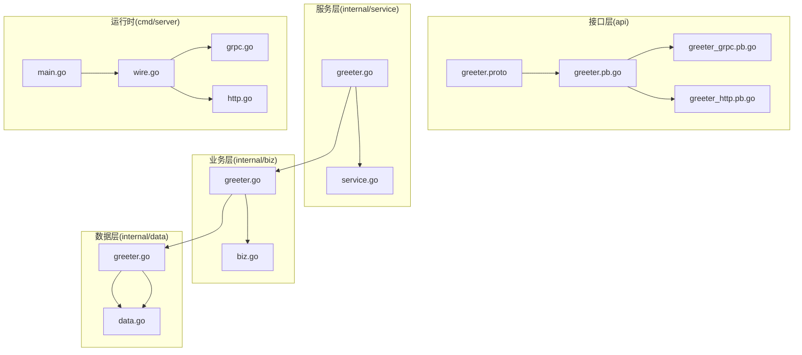
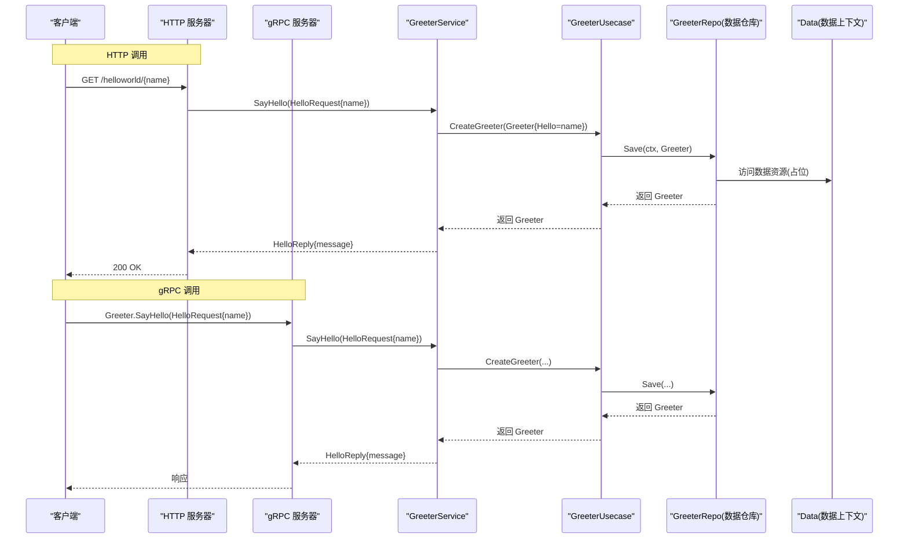
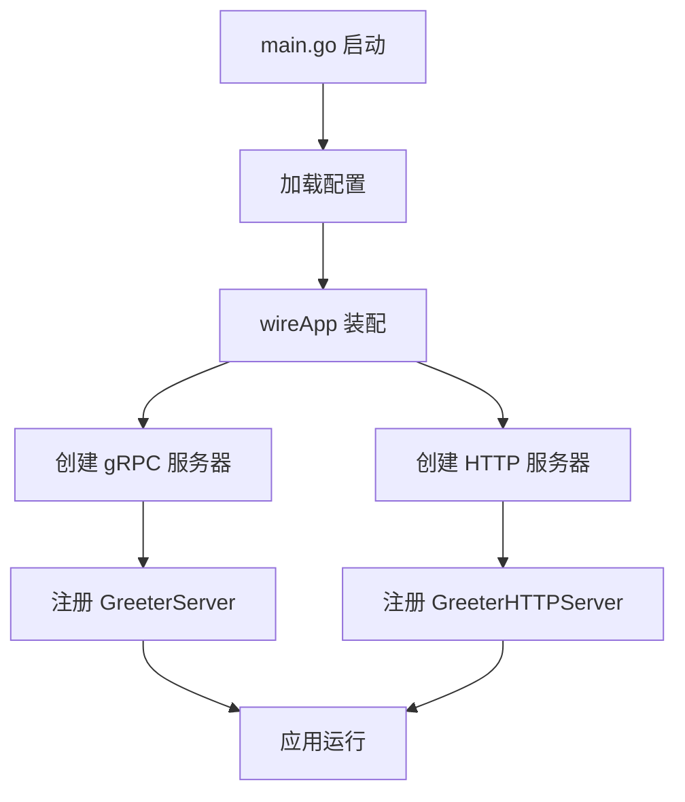
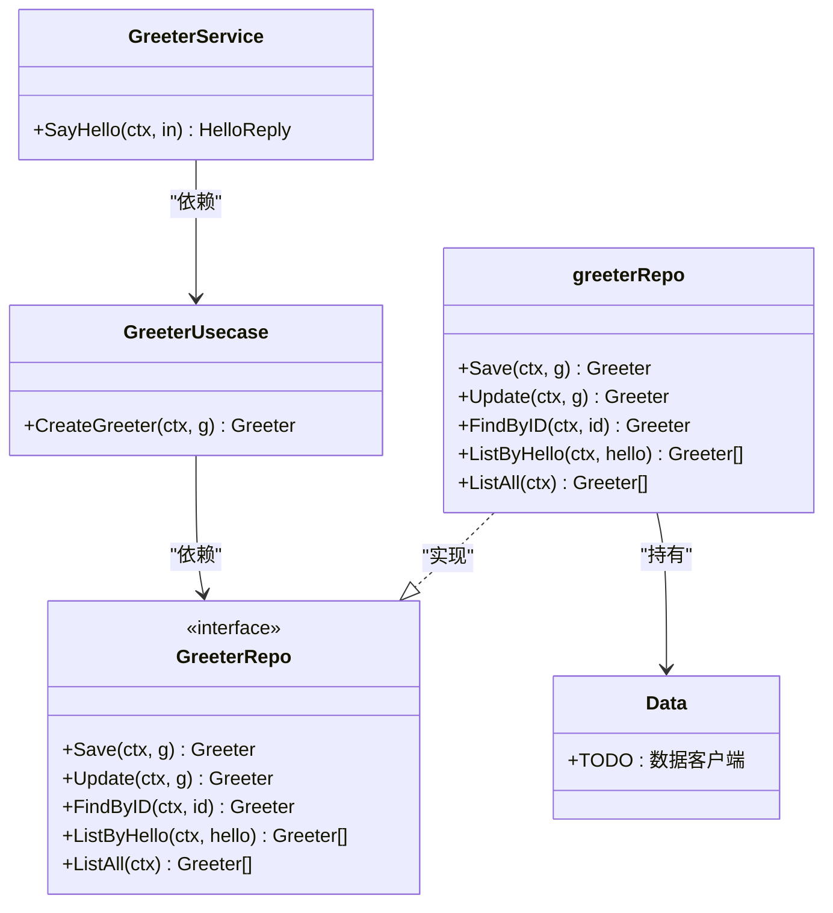

# 服务实现详解

<cite>
**本文引用的文件**
- [greeter.proto](file://api/helloworld/v1/greeter.proto)
- [greeter_http.pb.go](file://api/helloworld/v1/greeter_http.pb.go)
- [greeter.pb.go](file://api/helloworld/v1/greeter.pb.go)
- [greeter_grpc.pb.go](file://api/helloworld/v1/greeter_grpc.pb.go)
- [main.go](file://cmd/server/main.go)
- [wire.go](file://cmd/server/wire.go)
- [grpc.go](file://internal/server/grpc.go)
- [http.go](file://internal/server/http.go)
- [data.go](file://internal/data/data.go)
- [greeter.go](file://internal/data/greeter.go)
- [biz.go](file://internal/biz/biz.go)
- [greeter.go](file://internal/biz/greeter.go)
- [service.go](file://internal/service/service.go)
- [greeter.go](file://internal/service/greeter.go)
</cite>

## 目录
1. [引言](#引言)
2. [项目结构](#项目结构)
3. [核心组件](#核心组件)
4. [架构总览](#架构总览)
5. [详细组件分析](#详细组件分析)
6. [依赖关系分析](#依赖关系分析)
7. [性能考量](#性能考量)
8. [故障排查指南](#故障排查指南)
9. [结论](#结论)
10. [附录](#附录)

## 引言
本文件围绕 Kratos 模板中的“问候服务”（Greeter Service）进行全链路剖析，覆盖从接口定义、gRPC/HTTP 映射、服务实现、业务用例、数据访问到应用装配的完整流程。文档强调依赖倒置原则在分层中的应用，并通过图示与路径引用帮助读者快速定位关键实现位置。

## 项目结构
该工程采用 Kratos 推荐的分层组织：接口定义位于 api 层，服务实现位于 internal/service，业务用例位于 internal/biz，数据访问位于 internal/data，应用入口与装配位于 cmd/server。各层之间通过接口解耦，使用 Wire 进行依赖注入装配。

图表来源
- [greeter.proto](file://api/helloworld/v1/greeter.proto#L1-L31)
- [greeter_http.pb.go](file://api/helloworld/v1/greeter_http.pb.go#L1-L75)
- [greeter.pb.go](file://api/helloworld/v1/greeter.pb.go#L1-L200)
- [greeter_grpc.pb.go](file://api/helloworld/v1/greeter_grpc.pb.go#L1-L200)
- [service.go](file://internal/service/service.go#L1-L7)
- [greeter.go](file://internal/service/greeter.go#L1-L30)
- [biz.go](file://internal/biz/biz.go#L1-L7)
- [greeter.go](file://internal/biz/greeter.go#L1-L47)
- [data.go](file://internal/data/data.go#L1-L25)
- [greeter.go](file://internal/data/greeter.go#L1-L43)
- [main.go](file://cmd/server/main.go#L1-L88)
- [wire.go](file://cmd/server/wire.go#L1-L24)
- [grpc.go](file://internal/server/grpc.go#L1-L33)
- [http.go](file://internal/server/http.go#L1-L33)

章节来源
- [main.go](file://cmd/server/main.go#L1-L88)
- [wire.go](file://cmd/server/wire.go#L1-L24)

## 核心组件
- 接口定义与 HTTP 映射：通过 proto 中的 google.api.http 注解，将 SayHello RPC 映射为 HTTP GET /helloworld/{name}。
- 服务实现：internal/service/greeter.go 将 gRPC 请求委派给业务用例，再由业务用例调用数据仓库接口。
- 业务用例：internal/biz/greeter.go 定义 GreeterRepo 接口与 GreeterUsecase，负责编排业务规则与日志记录。
- 数据访问：internal/data/greeter.go 实现 GreeterRepo 接口，当前为内存态存根；未来可替换为数据库客户端。
- 应用装配：cmd/server/wire.go 使用 Wire 组合各 ProviderSet，构建 Kratos 应用并注册 gRPC/HTTP 服务。

章节来源
- [greeter.proto](file://api/helloworld/v1/greeter.proto#L1-L31)
- [greeter_http.pb.go](file://api/helloworld/v1/greeter_http.pb.go#L1-L75)
- [greeter.go](file://internal/service/greeter.go#L1-L30)
- [greeter.go](file://internal/biz/greeter.go#L1-L47)
- [greeter.go](file://internal/data/greeter.go#L1-L43)
- [wire.go](file://cmd/server/wire.go#L1-L24)

## 架构总览
下图展示了从 HTTP/gRPC 到服务、业务、数据的完整调用链，以及依赖注入装配点。

图表来源
- [greeter_http.pb.go](file://api/helloworld/v1/greeter_http.pb.go#L1-L75)
- [greeter_grpc.pb.go](file://api/helloworld/v1/greeter_grpc.pb.go#L1-L200)
- [greeter.go](file://internal/service/greeter.go#L1-L30)
- [greeter.go](file://internal/biz/greeter.go#L1-L47)
- [greeter.go](file://internal/data/greeter.go#L1-L43)
- [grpc.go](file://internal/server/grpc.go#L1-L33)
- [http.go](file://internal/server/http.go#L1-L33)

## 详细组件分析

### 接口定义与 HTTP 映射（greeter.proto）
- 服务与消息：
  - 服务 Greeter 提供 SayHello 方法，请求消息 HelloRequest 含字段 name，响应消息 HelloReply 含字段 message。
- HTTP 映射：
  - 通过 google.api.http 注解，将 SayHello 映射为 HTTP GET /helloworld/{name}，其中 name 来自路径变量。
- 生成物：
  - greeter.pb.go 定义了 HelloRequest/HelloReply 及服务接口类型。
  - greeter_grpc.pb.go 提供 gRPC 服务端注册方法。
  - greeter_http.pb.go 提供 HTTP 服务器注册与客户端实现，包含路由绑定、参数绑定与中间件包装。

章节来源
- [greeter.proto](file://api/helloworld/v1/greeter.proto#L1-L31)
- [greeter_http.pb.go](file://api/helloworld/v1/greeter_http.pb.go#L1-L75)
- [greeter.pb.go](file://api/helloworld/v1/greeter.pb.go#L1-L200)
- [greeter_grpc.pb.go](file://api/helloworld/v1/greeter_grpc.pb.go#L1-L200)

### 服务实现（internal/service/greeter.go）
- 角色与职责：
  - GreeterService 实现 GreeterServer 接口，作为 gRPC/HTTP 的适配层。
  - 依赖注入 GreeterUsecase，完成请求到业务用例的委派。
- 关键流程：
  - SayHello 接收 HelloRequest，调用 uc.CreateGreeter 创建 Greeter，再组装 HelloReply 返回。
- 设计要点：
  - 保持服务层薄化，不直接操作数据，仅编排业务用例。
  - 遵循依赖倒置：服务层依赖业务用例接口，而非具体实现。

章节来源
- [greeter.go](file://internal/service/greeter.go#L1-L30)

### 业务用例（internal/biz/greeter.go）
- 领域模型：
  - Greeter 结构体承载业务实体（此处为 Hello 字段）。
- 仓储接口：
  - GreeterRepo 定义 Save/Update/FindByID/ListByHello/ListAll 等方法，隔离数据访问细节。
- 用例编排：
  - GreeterUsecase 持有 GreeterRepo 与日志助手，提供 CreateGreeter 编排保存逻辑。
- 设计要点：
  - 业务用例只关心业务规则与流程，不关心数据来源。
  - 日志统一由日志助手输出，便于追踪。

章节来源
- [greeter.go](file://internal/biz/greeter.go#L1-L47)

### 数据访问（internal/data/greeter.go）
- 仓储实现：
  - greeterRepo 实现 GreeterRepo 接口，当前返回静态结果（占位），体现数据抽象层的设计意图。
- 数据上下文：
  - Data 结构体用于承载数据资源（如数据库连接），当前为空实现，预留扩展空间。
- 设计要点：
  - 通过接口与实现分离，未来可无缝替换为真实数据库访问。
  - 依赖注入 Data，避免硬编码配置。

章节来源
- [greeter.go](file://internal/data/greeter.go#L1-L43)
- [data.go](file://internal/data/data.go#L1-L25)

### 应用装配与运行时（cmd/server）
- Wire 装配：
  - wire.go 使用 wire.Build 组合 server、data、biz、service 的 ProviderSet，构建 Kratos 应用。
- 服务器注册：
  - grpc.go 与 http.go 分别注册 GreeterServer 与 GreeterHTTPServer，设置网络、地址、超时等选项。
- 应用启动：
  - main.go 加载配置、初始化日志、调用 wireApp 构建应用并运行。

图表来源
- [main.go](file://cmd/server/main.go#L1-L88)
- [wire.go](file://cmd/server/wire.go#L1-L24)
- [grpc.go](file://internal/server/grpc.go#L1-L33)
- [http.go](file://internal/server/http.go#L1-L33)

章节来源
- [main.go](file://cmd/server/main.go#L1-L88)
- [wire.go](file://cmd/server/wire.go#L1-L24)
- [grpc.go](file://internal/server/grpc.go#L1-L33)
- [http.go](file://internal/server/http.go#L1-L33)

## 依赖关系分析
- 分层依赖方向：
  - 服务层依赖业务用例接口，业务用例依赖仓储接口，仓储实现依赖数据上下文。
- 依赖注入：
  - 通过各层 ProviderSet 与 Wire 组合，实现依赖倒置与可测试性。
- 服务注册：
  - gRPC 与 HTTP 服务器分别注册 GreeterServer/GreeterHTTPServer，形成双协议入口。

图表来源
- [greeter.go](file://internal/service/greeter.go#L1-L30)
- [greeter.go](file://internal/biz/greeter.go#L1-L47)
- [greeter.go](file://internal/data/greeter.go#L1-L43)
- [data.go](file://internal/data/data.go#L1-L25)

章节来源
- [service.go](file://internal/service/service.go#L1-L7)
- [biz.go](file://internal/biz/biz.go#L1-L7)
- [greeter.go](file://internal/biz/greeter.go#L1-L47)
- [greeter.go](file://internal/data/greeter.go#L1-L43)

## 性能考量
- 中间件：
  - gRPC/HTTP 服务器均启用恢复中间件，提升稳定性。
- 超时控制：
  - 通过配置项设置网络、地址与超时，避免阻塞。
- 日志：
  - 使用日志助手输出上下文信息，便于性能与问题定位。
- 仓储实现：
  - 当前为内存态存根，建议后续以数据库连接池与索引优化替代，减少锁竞争与 IO 开销。

章节来源
- [grpc.go](file://internal/server/grpc.go#L1-L33)
- [http.go](file://internal/server/http.go#L1-L33)
- [greeter.go](file://internal/data/greeter.go#L1-L43)

## 故障排查指南
- HTTP 映射异常：
  - 确认 greeter_http.pb.go 中路由是否正确注册，路径模板与变量绑定是否匹配。
- gRPC 服务未启动：
  - 检查 grpc.go 是否成功注册 GreeterServer，Wire 装配是否包含 server ProviderSet。
- 业务用例未执行：
  - 确认 service/greeter.go 的 SayHello 是否调用了 uc.CreateGreeter，日志是否输出。
- 仓储未生效：
  - 检查 data/greeter.go 的 Save/Update 是否被调用，当前实现是否返回期望值。
- 应用无法启动：
  - 查看 main.go 的配置加载与 wireApp 调用，确认配置路径与格式正确。

章节来源
- [greeter_http.pb.go](file://api/helloworld/v1/greeter_http.pb.go#L1-L75)
- [grpc.go](file://internal/server/grpc.go#L1-L33)
- [greeter.go](file://internal/service/greeter.go#L1-L30)
- [greeter.go](file://internal/biz/greeter.go#L1-L47)
- [greeter.go](file://internal/data/greeter.go#L1-L43)
- [main.go](file://cmd/server/main.go#L1-L88)

## 结论
该问候服务遵循 Kratos 分层与依赖倒置原则，接口定义清晰、服务薄化、业务用例独立、数据访问抽象，配合 Wire 装配实现高内聚低耦合。尽管当前数据访问为静态存根，但整体架构已为后续接入真实数据源提供了良好基础。

## 附录
- 关键实现路径参考：
  - 接口与 HTTP 映射：[greeter.proto](file://api/helloworld/v1/greeter.proto#L1-L31)，[greeter_http.pb.go](file://api/helloworld/v1/greeter_http.pb.go#L1-L75)
  - 服务实现：[greeter.go](file://internal/service/greeter.go#L1-L30)
  - 业务用例：[greeter.go](file://internal/biz/greeter.go#L1-L47)
  - 数据访问：[greeter.go](file://internal/data/greeter.go#L1-L43)，[data.go](file://internal/data/data.go#L1-L25)
  - 应用装配与运行：[wire.go](file://cmd/server/wire.go#L1-L24)，[main.go](file://cmd/server/main.go#L1-L88)
  - 服务器注册：[grpc.go](file://internal/server/grpc.go#L1-L33)，[http.go](file://internal/server/http.go#L1-L33)