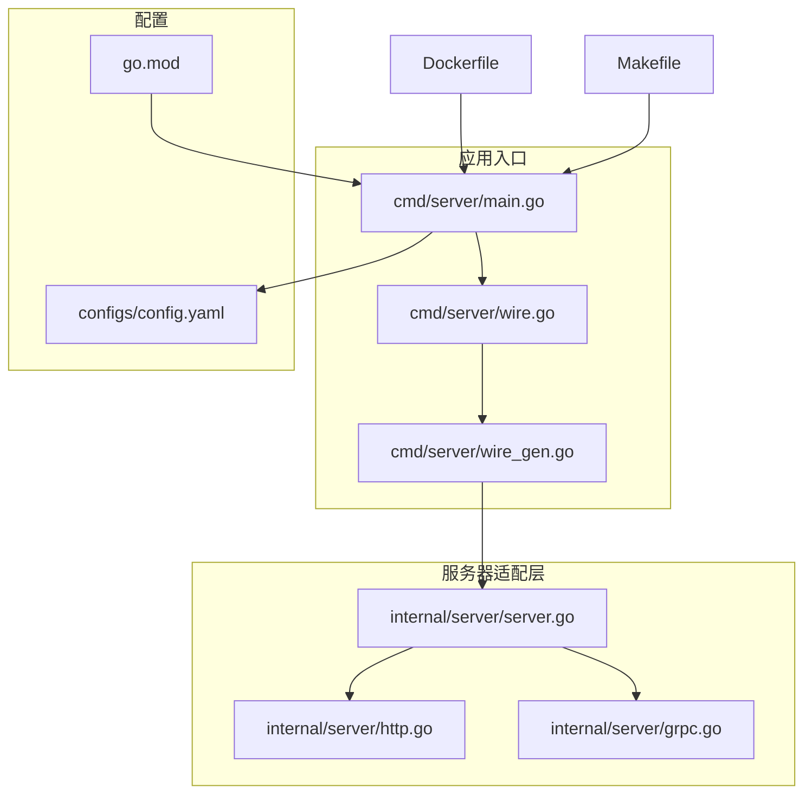
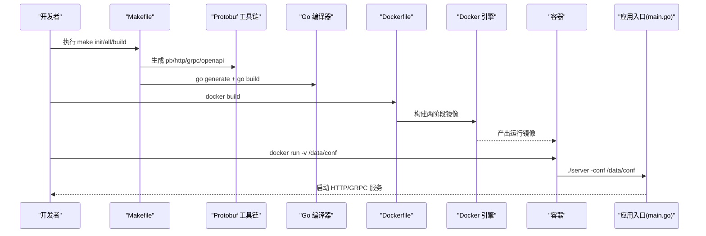
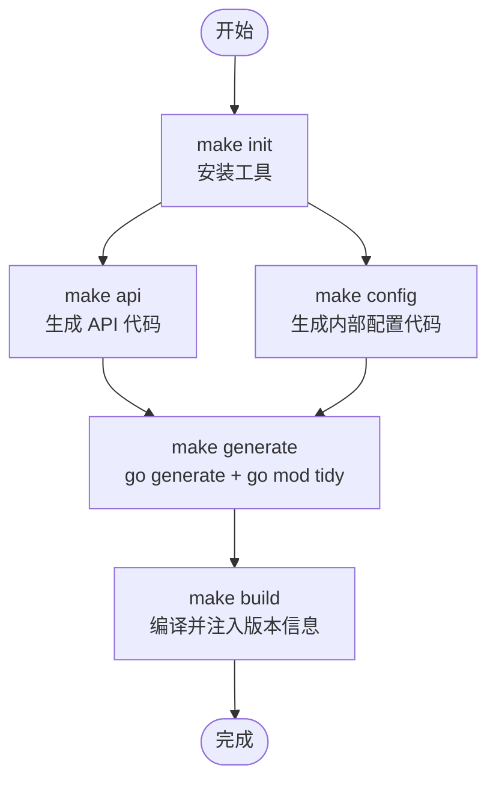
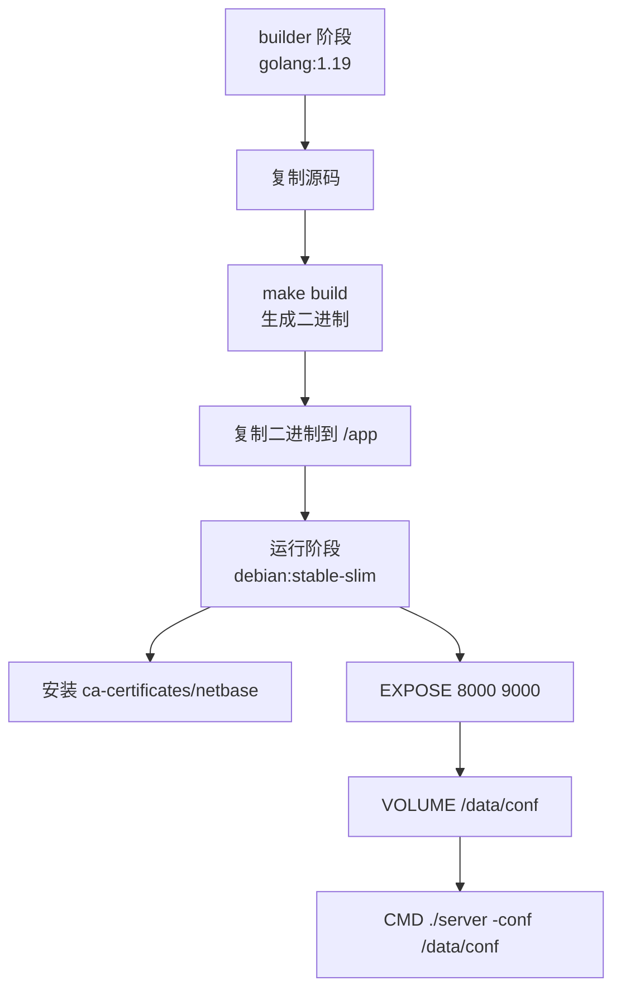
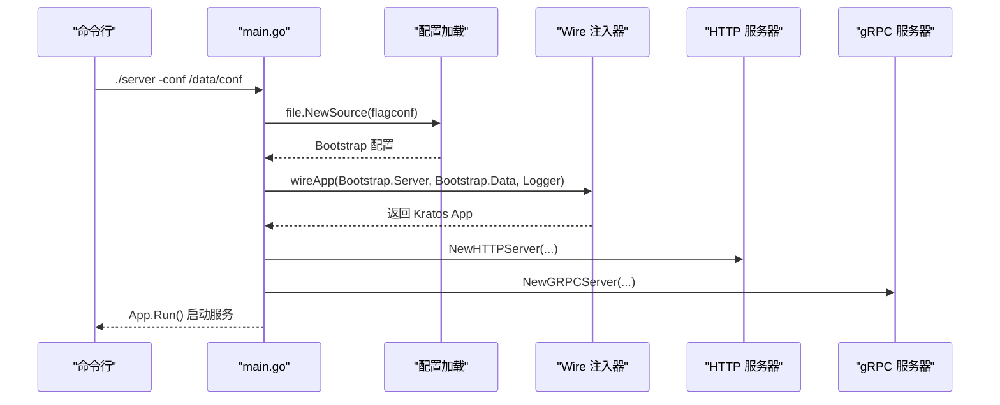
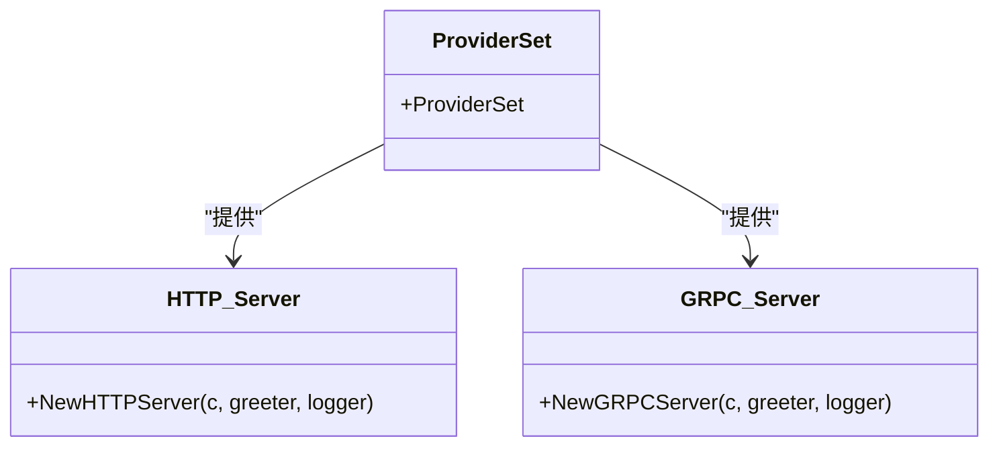
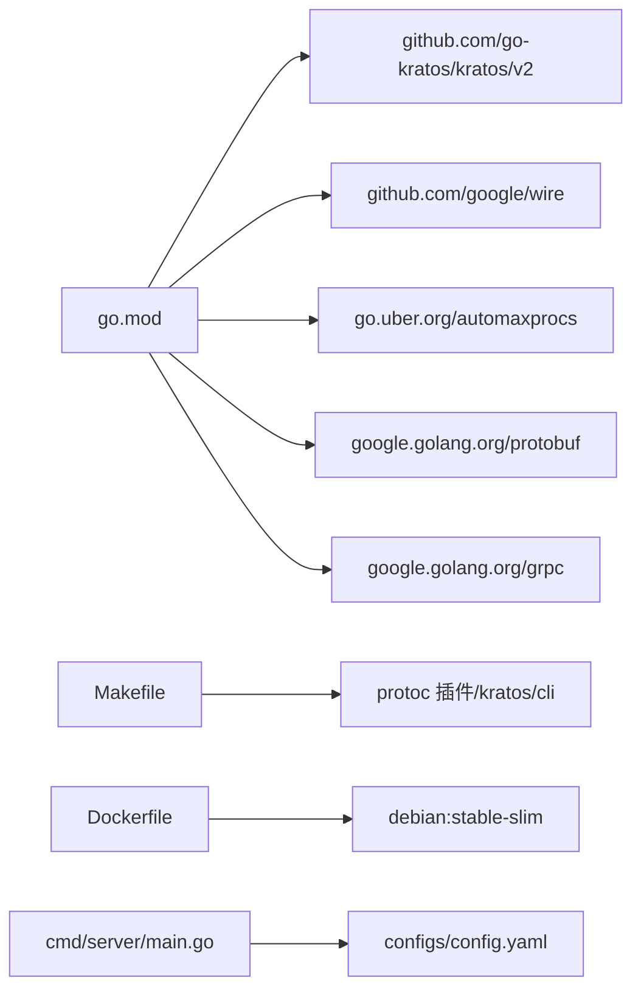

# 构建与部署

<cite>
**本文引用的文件**
- [Makefile](file://Makefile)
- [Dockerfile](file://Dockerfile)
- [cmd/server/main.go](file://cmd/server/main.go)
- [cmd/server/wire.go](file://cmd/server/wire.go)
- [cmd/server/wire_gen.go](file://cmd/server/wire_gen.go)
- [internal/server/server.go](file://internal/server/server.go)
- [internal/server/http.go](file://internal/server/http.go)
- [internal/server/grpc.go](file://internal/server/grpc.go)
- [configs/config.yaml](file://configs/config.yaml)
- [go.mod](file://go.mod)
- [README.md](file://README.md)
</cite>

## 目录
1. [简介](#简介)
2. [项目结构](#项目结构)
3. [核心组件](#核心组件)
4. [架构总览](#架构总览)
5. [详细组件分析](#详细组件分析)
6. [依赖关系分析](#依赖关系分析)
7. [性能考虑](#性能考虑)
8. [故障排查指南](#故障排查指南)
9. [结论](#结论)
10. [附录](#附录)

## 简介
本指南面向使用 Kratos 模板的 Go 服务，提供从本地构建、代码生成、容器化打包到生产部署的完整流程说明。重点覆盖以下方面：
- Makefile 各目标的实现逻辑与执行顺序：init、api、config、build、generate、all、help
- Dockerfile 的分阶段构建策略、基础镜像选择、暴露端口与运行参数
- 服务启动流程、配置加载、Wire 依赖注入、HTTP/gRPC 服务器初始化
- 生产部署建议：Kubernetes 部署要点、环境变量、健康检查、资源限制
- 性能优化建议：GOMAXPROCS 设置、日志级别、pprof 集成

## 项目结构
该仓库采用 Kratos 标准布局，包含 API 协议定义、业务域、数据访问、服务封装、服务器适配层以及命令入口。关键目录与文件如下：
- cmd/server：应用入口、Wire 注入器与生成文件
- internal/*：业务、数据、服务、服务器适配层
- api：协议定义与生成代码
- configs：默认配置文件
- Dockerfile、Makefile：构建与打包脚本
- go.mod：模块与依赖声明

图表来源
- [cmd/server/main.go](file://cmd/server/main.go#L1-L88)
- [cmd/server/wire.go](file://cmd/server/wire.go#L1-L24)
- [cmd/server/wire_gen.go](file://cmd/server/wire_gen.go#L1-L41)
- [internal/server/server.go](file://internal/server/server.go#L1-L9)
- [internal/server/http.go](file://internal/server/http.go#L1-L33)
- [internal/server/grpc.go](file://internal/server/grpc.go#L1-L33)
- [configs/config.yaml](file://configs/config.yaml#L1-L16)
- [go.mod](file://go.mod#L1-L36)
- [Dockerfile](file://Dockerfile#L1-L25)
- [Makefile](file://Makefile#L1-L83)

章节来源
- [Makefile](file://Makefile#L1-L83)
- [Dockerfile](file://Dockerfile#L1-L25)
- [cmd/server/main.go](file://cmd/server/main.go#L1-L88)
- [configs/config.yaml](file://configs/config.yaml#L1-L16)
- [go.mod](file://go.mod#L1-L36)

## 核心组件
- 应用入口与生命周期
  - main.go 负责解析命令行参数、加载配置、初始化日志、构造 Kratos 应用并启动。
  - 通过 flag 解析 -conf 参数，默认指向 configs 目录；支持从文件源加载配置。
- 依赖注入与装配
  - 使用 Wire 在编译时生成注入器，按配置装配 HTTP/GRPC 服务器与业务组件。
- 服务器适配层
  - HTTP/GRPC 服务器根据配置动态设置网络、地址与超时，并注册服务处理器。
- 配置模型
  - 通过 Protobuf 定义 Bootstrap/Server/Data 结构，支持 http、grpc、database、redis 等字段。

章节来源
- [cmd/server/main.go](file://cmd/server/main.go#L1-L88)
- [cmd/server/wire.go](file://cmd/server/wire.go#L1-L24)
- [cmd/server/wire_gen.go](file://cmd/server/wire_gen.go#L1-L41)
- [internal/server/server.go](file://internal/server/server.go#L1-L9)
- [internal/server/http.go](file://internal/server/http.go#L1-L33)
- [internal/server/grpc.go](file://internal/server/grpc.go#L1-L33)
- [configs/config.yaml](file://configs/config.yaml#L1-L16)

## 架构总览
下图展示从构建到运行的关键路径：Makefile 触发代码生成与编译；Dockerfile 进行分阶段构建；容器运行时通过 -conf 挂载配置目录。

图表来源
- [Makefile](file://Makefile#L1-L83)
- [Dockerfile](file://Dockerfile#L1-L25)
- [cmd/server/main.go](file://cmd/server/main.go#L1-L88)

## 详细组件分析

### Makefile 目标与执行流程
- init：安装 Protobuf 插件、Kratos CLI、OpenAPI 生成器、Wire 等工具，确保开发环境具备必要依赖。
- api：扫描 api 目录下的 proto 文件，调用 protoc 生成 Go 代码、HTTP 适配、gRPC 适配与 OpenAPI 文档。
- config：扫描 internal 目录下的 proto 文件，生成 Go 代码，用于内部配置模型。
- build：创建 bin 目录并进行编译，同时注入版本信息（通过 ldflags 指定的 Version 变量）。
- generate：执行 go generate 并整理依赖，保证生成代码与依赖一致。
- all：依次执行 api、config、generate，完成全量生成。
- help：打印可用目标及其简要说明，便于快速查阅。

图表来源
- [Makefile](file://Makefile#L1-L83)

章节来源
- [Makefile](file://Makefile#L1-L83)

### Dockerfile 分阶段构建与运行参数
- 基础镜像与构建阶段
  - builder 阶段：基于官方 golang 镜像，复制源码，设置 GOPROXY，执行 make build 产出二进制。
  - 运行阶段：基于 debian slim，仅安装必要系统 CA 与网络基础包，避免多余依赖。
- 复制与工作目录
  - 将 builder 阶段生成的二进制复制至 /app，设置 WORKDIR 为 /app。
- 端口与卷
  - 暴露 HTTP 8000 与 gRPC 9000 端口；声明 /data/conf 卷用于挂载配置。
- 入口命令
  - CMD 以 ./server 启动，并通过 -conf 指向 /data/conf，实现配置热更新与外部化管理。

图表来源
- [Dockerfile](file://Dockerfile#L1-L25)

章节来源
- [Dockerfile](file://Dockerfile#L1-L25)

### 应用启动与配置加载
- 命令行参数
  - -conf 指定配置目录，默认 ../../configs；可通过容器挂载覆盖。
- 配置加载
  - 通过 file.NewSource 加载配置文件，支持 YAML；加载后映射到 conf.Bootstrap 结构。
- 日志与追踪
  - 初始化日志器，附加时间戳、调用者、服务元数据、追踪 ID 等字段，便于可观测性。
- 依赖注入
  - 使用 Wire 注入器按配置创建 HTTP/GRPC 服务器与业务组件，简化装配复杂度。
- 服务器初始化
  - HTTP/GRPC 服务器根据配置设置网络、地址与超时；注册服务处理器。

图表来源
- [cmd/server/main.go](file://cmd/server/main.go#L1-L88)
- [cmd/server/wire.go](file://cmd/server/wire.go#L1-L24)
- [cmd/server/wire_gen.go](file://cmd/server/wire_gen.go#L1-L41)
- [internal/server/http.go](file://internal/server/http.go#L1-L33)
- [internal/server/grpc.go](file://internal/server/grpc.go#L1-L33)

章节来源
- [cmd/server/main.go](file://cmd/server/main.go#L1-L88)
- [cmd/server/wire.go](file://cmd/server/wire.go#L1-L24)
- [cmd/server/wire_gen.go](file://cmd/server/wire_gen.go#L1-L41)
- [internal/server/http.go](file://internal/server/http.go#L1-L33)
- [internal/server/grpc.go](file://internal/server/grpc.go#L1-L33)

### 服务器适配层（HTTP/gRPC）
- HTTP 服务器
  - 支持设置 network、address、timeout；注册 Greeter HTTP 服务处理器。
- gRPC 服务器
  - 支持设置 network、address、timeout；注册 Greeter gRPC 服务处理器。
- 通用中间件
  - 两者均启用恢复中间件，提升稳定性。

图表来源
- [internal/server/server.go](file://internal/server/server.go#L1-L9)
- [internal/server/http.go](file://internal/server/http.go#L1-L33)
- [internal/server/grpc.go](file://internal/server/grpc.go#L1-L33)

章节来源
- [internal/server/server.go](file://internal/server/server.go#L1-L9)
- [internal/server/http.go](file://internal/server/http.go#L1-L33)
- [internal/server/grpc.go](file://internal/server/grpc.go#L1-L33)

## 依赖关系分析
- 模块与工具链
  - go.mod 声明 Kratos v2、Wire、automaxprocs、protobuf、grpc 等依赖。
  - Makefile 通过 go install 安装 protoc 插件与 Kratos CLI，确保生成链路可用。
- 运行时依赖
  - Dockerfile 运行阶段仅保留必要系统包，降低攻击面与镜像体积。
- 配置模型
  - conf.proto 定义 Bootstrap/Server/Data 结构，main.go 通过 config.New(file) 加载并 Scan 到结构体。

图表来源
- [go.mod](file://go.mod#L1-L36)
- [Makefile](file://Makefile#L1-L83)
- [Dockerfile](file://Dockerfile#L1-L25)
- [cmd/server/main.go](file://cmd/server/main.go#L1-L88)
- [configs/config.yaml](file://configs/config.yaml#L1-L16)

章节来源
- [go.mod](file://go.mod#L1-L36)
- [Makefile](file://Makefile#L1-L83)
- [Dockerfile](file://Dockerfile#L1-L25)
- [cmd/server/main.go](file://cmd/server/main.go#L1-L88)
- [configs/config.yaml](file://configs/config.yaml#L1-L16)

## 性能考虑
- GOMAXPROCS
  - 项目已引入 automaxprocs，可在容器环境中自动设置 P 数量，建议在 Kubernetes 中结合 CPU 资源限制使用。
- 日志级别
  - 默认使用标准输出日志器，可通过环境变量或配置调整日志级别；生产建议使用结构化日志并控制采样率。
- pprof 集成
  - 可在启动参数中开启 pprof HTTP 接口，便于性能分析与火焰图采集；注意仅在受控环境启用。
- 端口与超时
  - HTTP/GRPC 服务器支持通过配置设置超时，建议结合负载均衡与熔断策略进行调优。
- 镜像瘦身
  - Dockerfile 已采用 debian slim 并仅安装必要包；可进一步使用只读根文件系统与最小权限用户运行。

章节来源
- [cmd/server/main.go](file://cmd/server/main.go#L1-L88)
- [Dockerfile](file://Dockerfile#L1-L25)

## 故障排查指南
- 无法生成代码
  - 确认已执行 make init 安装所需插件；检查 proto 文件路径与第三方依赖是否正确。
- 构建失败
  - 查看 make build 输出的 ldflags 注入是否成功；确认 go.mod 依赖已同步。
- 容器启动无配置
  - 确认 -v 挂载了正确的配置目录；检查容器内 /data/conf 是否存在有效配置文件。
- 端口冲突
  - 修改 configs/config.yaml 或 Docker EXPOSE/映射端口；确保宿主机未占用 8000/9000。
- 依赖注入问题
  - 确认 wire 生成文件存在且最新；必要时重新生成 wire 注入器。

章节来源
- [Makefile](file://Makefile#L1-L83)
- [Dockerfile](file://Dockerfile#L1-L25)
- [cmd/server/main.go](file://cmd/server/main.go#L1-L88)
- [configs/config.yaml](file://configs/config.yaml#L1-L16)

## 结论
本指南梳理了从代码生成、本地构建、容器化打包到运行时配置加载与服务器装配的完整流程。通过 Makefile 的统一入口与 Dockerfile 的分阶段构建，能够稳定复现构建过程；借助 Wire 与配置模型，应用启动与扩展更加清晰可控。生产部署时建议结合 Kubernetes 资源限制、健康检查与日志策略，持续优化性能与可靠性。

## 附录
- 本地构建与运行
  - 安装工具：make init
  - 生成代码：make api / make config / make all
  - 编译：make build
  - 运行：./bin/server -conf ../../configs
- 容器化部署
  - 构建镜像：docker build -t <镜像名> .
  - 运行容器：docker run --rm -p 8000:8000 -p 9000:9000 -v </path/to/configs>:/data/conf <镜像名>
- Kubernetes 部署要点
  - 资源请求与限制：CPU/内存配额与 QoS
  - 健康检查：liveness/readiness 探针指向 /health 或 HTTP/GRPC 健康端点
  - 配置管理：ConfigMap/Secret 挂载至 /data/conf
  - 日志：stdout/stderr 输出，结合集中式日志收集
  - 安全：只读根文件系统、非 root 用户、最小权限 RBAC

章节来源
- [README.md](file://README.md#L1-L52)
- [Dockerfile](file://Dockerfile#L1-L25)
- [cmd/server/main.go](file://cmd/server/main.go#L1-L88)
- [configs/config.yaml](file://configs/config.yaml#L1-L16)