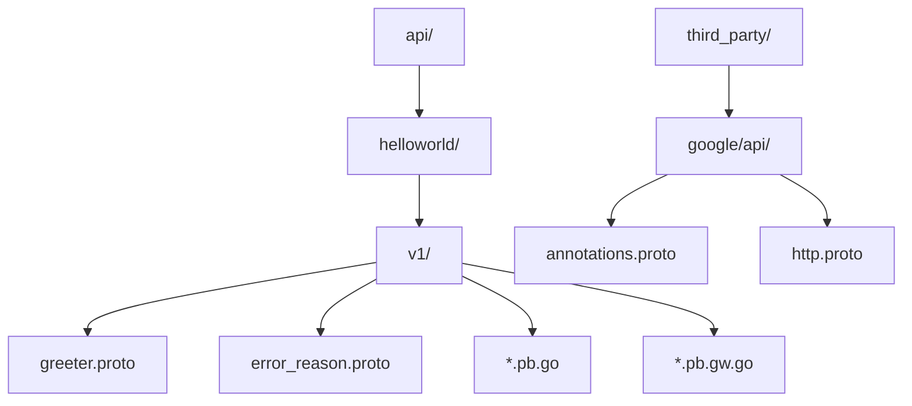
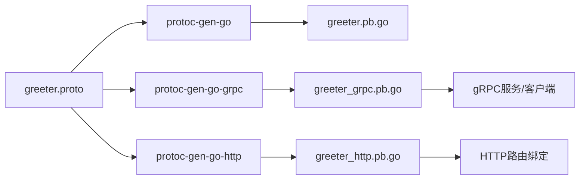
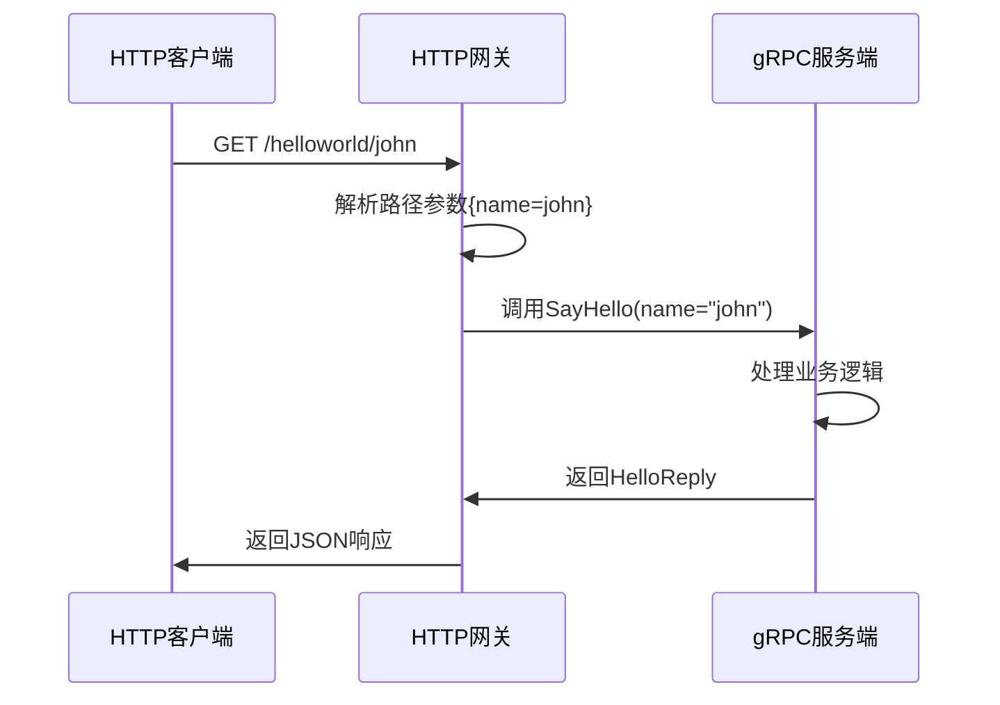
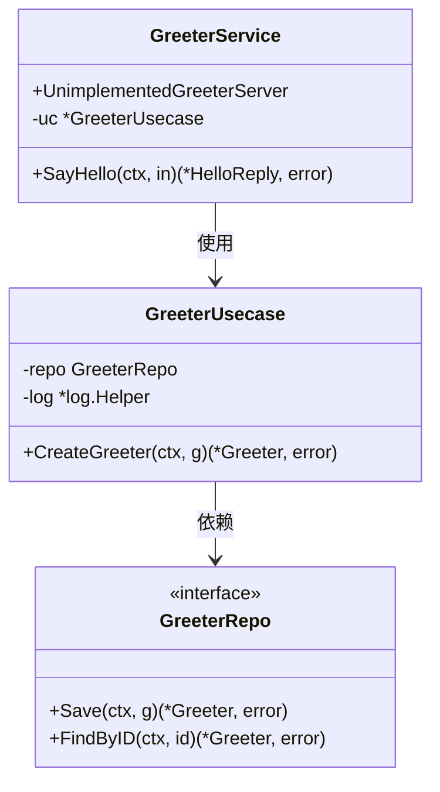

# API定义层

<cite>
**本文档中引用的文件**   
- [greeter.proto](file://api/helloworld/v1/greeter.proto)
- [error_reason.proto](file://api/helloworld/v1/error_reason.proto)
- [greeter.pb.go](file://api/helloworld/v1/greeter.pb.go)
- [greeter_grpc.pb.go](file://api/helloworld/v1/greeter_grpc.pb.go)
- [greeter_http.pb.go](file://api/helloworld/v1/greeter_http.pb.go)
- [annotations.proto](file://third_party/google/api/annotations.proto)
- [http.proto](file://third_party/google/api/http.proto)
- [greeter.go](file://internal/service/greeter.go)
- [grpc.go](file://internal/server/grpc.go)
- [http.go](file://internal/server/http.go)
</cite>

## 目录
1. [项目结构](#项目结构)
2. [Protocol Buffer文件设计](#protocol-buffer文件设计)
3. [代码生成机制](#代码生成机制)
4. [HTTP/gRPC双协议映射](#httpgrpc双协议映射)
5. [API版本控制与错误码机制](#api版本控制与错误码机制)
6. [服务接口实现分析](#服务接口实现分析)
7. [添加新API接口指南](#添加新api接口指南)

## 项目结构

Kratos项目的API定义层位于`api/`目录下，采用分层版本化的设计模式。每个服务都有独立的命名空间和版本号，确保API的演进不会影响现有客户端。



**图示来源**
- [greeter.proto](file://api/helloworld/v1/greeter.proto#L1-L31)
- [annotations.proto](file://third_party/google/api/annotations.proto#L1-L32)

**本节来源**
- [api/helloworld/v1/greeter.proto](file://api/helloworld/v1/greeter.proto#L1-L31)
- [third_party/google/api/annotations.proto](file://third_party/google/api/annotations.proto#L1-L32)

## Protocol Buffer文件设计

Protocol Buffer（简称Proto）文件是Kratos框架中API定义的核心。通过`.proto`文件，开发者可以声明性地定义服务接口、请求/响应消息结构以及协议映射规则。

### 服务接口定义

在`greeter.proto`文件中，使用`service`关键字定义了一个名为`Greeter`的服务：

```proto
service Greeter {
  rpc SayHello (HelloRequest) returns (HelloReply) {
    option (google.api.http) = {
      get: "/helloworld/{name}"
    };
  }
}
```

该服务包含一个名为`SayHello`的远程过程调用（RPC），接收`HelloRequest`类型的请求参数，返回`HelloReply`类型的响应结果。

### 消息结构定义

Proto文件通过`message`关键字定义数据结构。在示例中定义了两个消息类型：

```proto
message HelloRequest {
  string name = 1;
}

message HelloReply {
  string message = 1;
}
```

每个字段都有唯一的数字标识符（如`1`），用于在序列化时标识字段。这种设计保证了向后兼容性，允许在未来添加新字段而不破坏现有客户端。

### 包与选项配置

Proto文件通过`package`声明命名空间，避免名称冲突：

```proto
package helloworld.v1;
```

同时使用`option`配置代码生成行为：

```proto
option go_package = "github.com/go-kratos/kratos-layout/api/helloworld/v1;v1";
```

此选项指定生成的Go代码的包路径和别名，确保正确导入。

**本节来源**
- [greeter.proto](file://api/helloworld/v1/greeter.proto#L1-L31)

## 代码生成机制

Kratos框架利用Protocol Buffer的代码生成能力，将`.proto`文件编译为多种目标语言的代码文件。这一过程通过不同的代码生成插件实现。

### 数据结构生成（.pb.go）

`protoc-gen-go`插件将`.proto`文件中的消息定义转换为Go语言的结构体。例如，`HelloRequest`消息被转换为：

```go
type HelloRequest struct {
	Name string `protobuf:"bytes,1,opt,name=name,proto3" json:"name,omitempty"`
}
```

生成的代码包含完整的序列化/反序列化逻辑、反射支持和JSON编解码标签，确保高效的数据交换。

### gRPC服务桩生成（_grpc.pb.go）

`protoc-gen-go-grpc`插件生成gRPC服务接口和客户端存根。对于`Greeter`服务，生成以下接口：

```go
type GreeterServer interface {
	SayHello(context.Context, *HelloRequest) (*HelloReply, error)
	mustEmbedUnimplementedGreeterServer()
}
```

服务端需实现此接口，而客户端可通过`NewGreeterClient`创建代理对象进行远程调用。

### HTTP网关绑定生成（_http.pb.go）

`protoc-gen-go-http`插件生成HTTP路由绑定代码，实现RESTful API到gRPC的映射。生成的代码包含：

```go
func RegisterGreeterHTTPServer(s *http.Server, srv GreeterHTTPServer)
```

该函数将服务注册到HTTP服务器，并根据`google.api.http`注解自动设置路由规则。



**图示来源**
- [greeter.pb.go](file://api/helloworld/v1/greeter.pb.go#L1-L226)
- [greeter_grpc.pb.go](file://api/helloworld/v1/greeter_grpc.pb.go#L1-L108)
- [greeter_http.pb.go](file://api/helloworld/v1/greeter_http.pb.go#L1-L75)

**本节来源**
- [greeter.pb.go](file://api/helloworld/v1/greeter.pb.go#L1-L226)
- [greeter_grpc.pb.go](file://api/helloworld/v1/greeter_grpc.pb.go#L1-L108)
- [greeter_http.pb.go](file://api/helloworld/v1/greeter_http.pb.go#L1-L75)

## HTTP/gRPC双协议映射

Kratos框架通过`google.api.http`注解实现gRPC与HTTP/REST的无缝映射，使同一服务接口可同时支持两种协议。

### google.api.http注解使用

在`greeter.proto`中，通过`option (google.api.http)`指定HTTP映射规则：

```proto
rpc SayHello (HelloRequest) returns (HelloReply) {
  option (google.api.http) = {
    get: "/helloworld/{name}"
  };
}
```

此注解声明了该RPC方法可通过HTTP GET请求访问，URL路径中的`{name}`占位符映射到`HelloRequest`消息的`name`字段。

### 路径模板语法

路径模板支持多种语法：
- `{field}`：单段变量，自动解码
- `{field=prefix/*}`：多段匹配
- `**`：零或多段通配

支持的HTTP方法包括`get`、`put`、`post`、`delete`、`patch`等，可灵活映射不同操作。

### 请求参数映射规则

根据gRPC Transcoding规范，请求参数按以下规则映射：
1. **路径参数**：在路径模板中声明的字段
2. **查询参数**：未在路径中使用的非消息类型字段
3. **请求体**：通过`body`字段指定的消息部分

例如，若扩展`HelloRequest`包含`age`字段，则`/helloworld/john?age=30`会自动映射。



**图示来源**
- [greeter.proto](file://api/helloworld/v1/greeter.proto#L15-L18)
- [http.proto](file://third_party/google/api/http.proto#L1-L376)
- [greeter_http.pb.go](file://api/helloworld/v1/greeter_http.pb.go#L1-L75)

**本节来源**
- [greeter.proto](file://api/helloworld/v1/greeter.proto#L15-L18)
- [http.proto](file://third_party/google/api/http.proto#L1-L376)

## API版本控制与错误码机制

Kratos框架提供了一套完整的API版本控制和错误处理机制，确保服务的稳定演进。

### API版本控制策略

采用`v1`、`v2`等目录划分版本，每个版本独立维护：

```
api/
└── helloworld/
    ├── v1/
    │   ├── greeter.proto
    │   └── error_reason.proto
    └── v2/
        ├── greeter.proto
        └── error_reason.proto
```

这种设计允许：
- 向后兼容的增量更新
- 重大变更的版本升级
- 新旧版本并行运行

### 错误码定义机制

通过`error_reason.proto`定义枚举类型的错误码：

```proto
enum ErrorReason {
  GREETER_UNSPECIFIED = 0;
  USER_NOT_FOUND = 1;
}
```

在业务逻辑中使用Kratos的errors包创建结构化错误：

```go
ErrUserNotFound = errors.NotFound(v1.ErrorReason_USER_NOT_FOUND.String(), "user not found")
```

生成的错误包含：
- 状态码（如404）
- 错误原因（USER_NOT_FOUND）
- 人类可读消息
- 可选的详细信息

**本节来源**
- [error_reason.proto](file://api/helloworld/v1/error_reason.proto#L1-L14)
- [greeter.go](file://internal/biz/greeter.go#L12-L15)

## 服务接口实现分析

在Kratos框架中，Proto定义的服务接口需要在`internal/service/`目录下实现。

### 服务实现结构

`GreeterService`结构体实现`GreeterServer`接口：

```go
type GreeterService struct {
	v1.UnimplementedGreeterServer
	uc *biz.GreeterUsecase
}
```

通过嵌入`UnimplementedGreeterServer`，确保向前兼容性，即使Proto文件添加新方法也不会导致编译错误。

### 方法实现

`SayHello`方法的实现展示了典型的分层架构：

```go
func (s *GreeterService) SayHello(ctx context.Context, in *v1.HelloRequest) (*v1.HelloReply, error) {
	g, err := s.uc.CreateGreeter(ctx, &biz.Greeter{Hello: in.Name})
	if err != nil {
		return nil, err
	}
	return &v1.HelloReply{Message: "Hello " + g.Hello}, nil
}
```

调用流程为：HTTP/gRPC → Service → UseCase → Repository，实现了关注点分离。

### 服务器注册

在`internal/server/`中完成服务注册：

```go
// gRPC注册
v1.RegisterGreeterServer(srv, greeter)

// HTTP注册
v1.RegisterGreeterHTTPServer(srv, greeter)
```

两个注册函数分别将同一服务实例绑定到gRPC和HTTP服务器，实现双协议支持。



**图示来源**
- [greeter.go](file://internal/service/greeter.go#L1-L30)
- [greeter.go](file://internal/biz/greeter.go#L1-L47)
- [grpc.go](file://internal/server/grpc.go#L1-L33)
- [http.go](file://internal/server/http.go#L1-L33)

**本节来源**
- [greeter.go](file://internal/service/greeter.go#L1-L30)
- [greeter.go](file://internal/biz/greeter.go#L1-L47)

## 添加新API接口指南

要向Kratos项目添加新的API接口，需遵循以下步骤：

### 1. 创建Proto文件

在相应版本目录下创建新的`.proto`文件，例如`api/helloworld/v1/user.proto`：

```proto
syntax = "proto3";

package helloworld.v1;

import "google/api/annotations.proto";

option go_package = "github.com/go-kratos/kratos-layout/api/helloworld/v1;v1";

service UserService {
  rpc GetUser (GetUserRequest) returns (GetUserResponse) {
    option (google.api.http) = {
      get: "/v1/users/{id}"
    };
  }
}

message GetUserRequest {
  int64 id = 1;
}

message GetUserResponse {
  User user = 1;
}

message User {
  int64 id = 1;
  string name = 2;
  string email = 3;
}
```

### 2. 生成代码

运行代码生成命令：

```bash
make api
```

这将生成对应的`.pb.go`、`_grpc.pb.go`和`_http.pb.go`文件。

### 3. 实现服务

在`internal/service/`目录下创建服务实现：

```go
type UserService struct {
	v1.UnimplementedUserServiceServer
	uc *biz.UserUsecase
}

func (s *UserService) GetUser(ctx context.Context, req *v1.GetUserRequest) (*v1.GetUserResponse, error) {
	user, err := s.uc.GetUser(ctx, req.Id)
	if err != nil {
		return nil, err
	}
	return &v1.GetUserResponse{User: &v1.User{
		Id:    user.Id,
		Name:  user.Name,
		Email: user.Email,
	}}, nil
}
```

### 4. 注册服务

在`internal/server/`的gRPC和HTTP服务器中注册新服务：

```go
// 在NewGRPCServer中
v1.RegisterUserServiceServer(srv, userService)

// 在NewHTTPServer中  
v1.RegisterUserServiceHTTPServer(srv, userService)
```

### 5. 更新依赖注入

修改`wire.go`以包含新服务的依赖注入：

```go
func initApp(conf.Server, conf.Data, log.Logger) (*kratos.App, func(), error) {
	// ...
	userService := service.NewUserService(userUsecase)
	// ...
}
```

通过以上步骤，即可成功添加新的API接口，并确保与Kratos框架完全兼容。

**本节来源**
- [greeter.proto](file://api/helloworld/v1/greeter.proto#L1-L31)
- [greeter.go](file://internal/service/greeter.go#L1-L30)
- [grpc.go](file://internal/server/grpc.go#L1-L33)
- [http.go](file://internal/server/http.go#L1-L33)