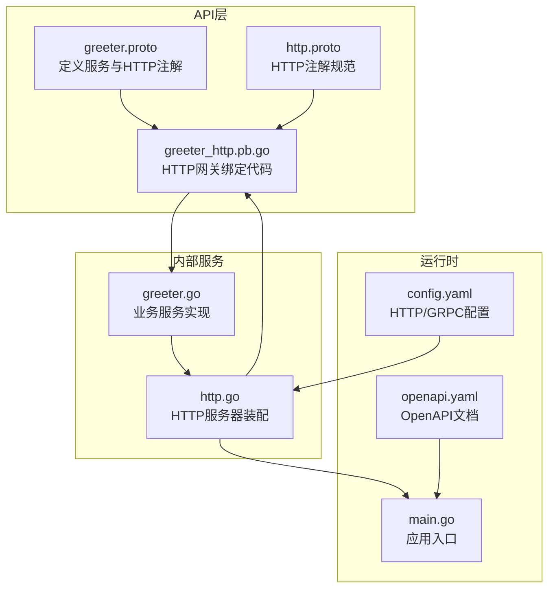
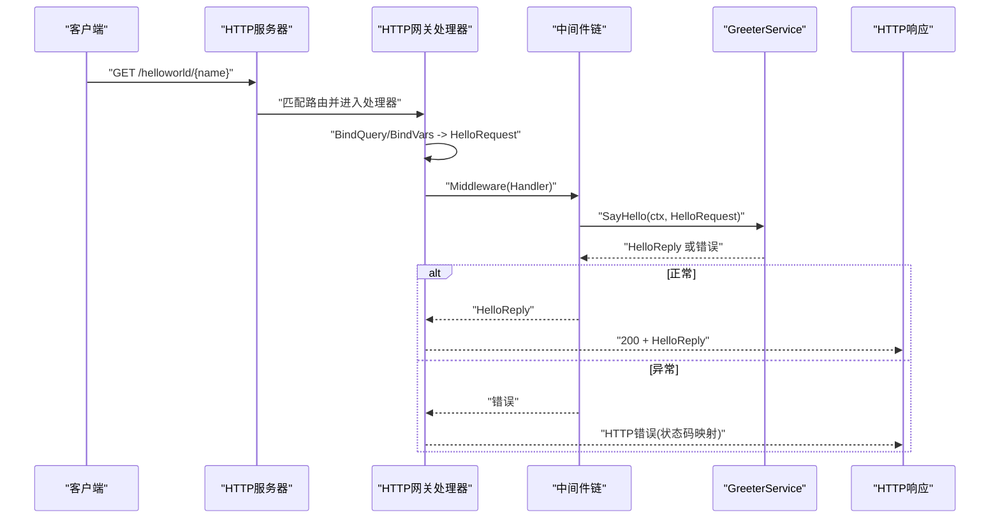
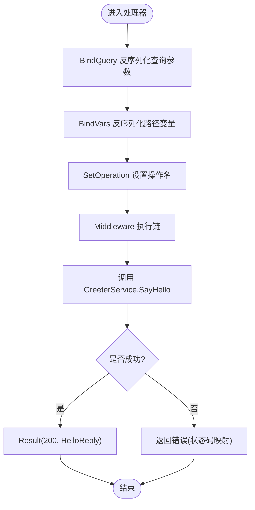
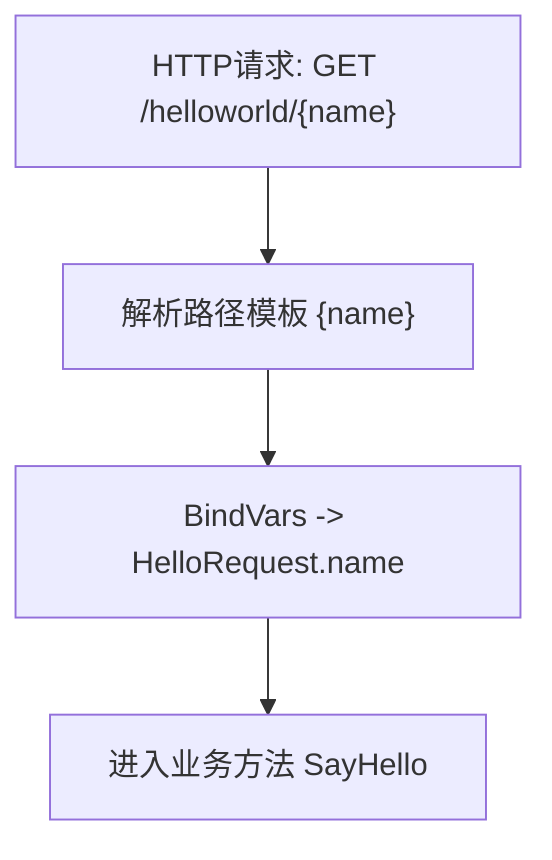
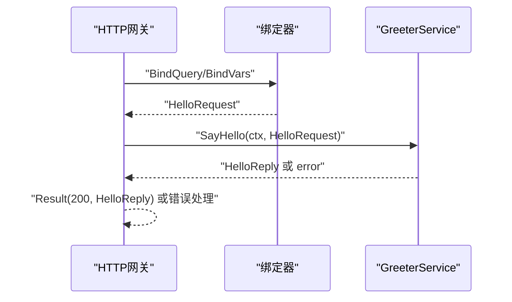
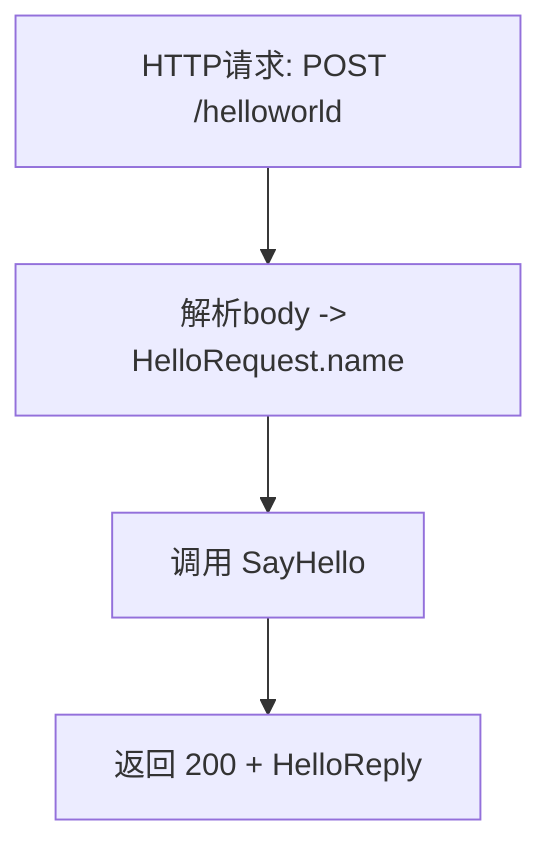
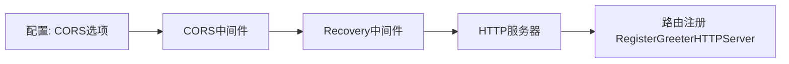
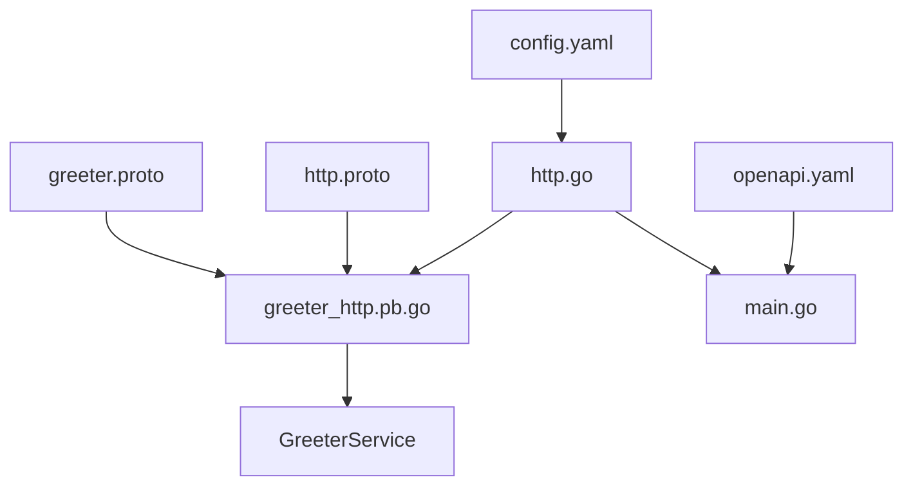

# HTTP网关映射

<cite>
**本文引用的文件**
- [greeter_http.pb.go](file://api/helloworld/v1/greeter_http.pb.go)
- [greeter.proto](file://api/helloworld/v1/greeter.proto)
- [http.proto](file://third_party/google/api/http.proto)
- [http.go](file://internal/server/http.go)
- [main.go](file://cmd/server/main.go)
- [config.yaml](file://configs/config.yaml)
- [openapi.yaml](file://openapi.yaml)
- [greeter.go](file://internal/service/greeter.go)
</cite>

## 目录
1. [简介](#简介)
2. [项目结构](#项目结构)
3. [核心组件](#核心组件)
4. [架构总览](#架构总览)
5. [详细组件分析](#详细组件分析)
6. [依赖关系分析](#依赖关系分析)
7. [性能考量](#性能考量)
8. [故障排查指南](#故障排查指南)
9. [结论](#结论)
10. [附录](#附录)

## 简介
本文件围绕由 protoc-gen-go-http 生成的 HTTP 网关绑定代码进行深入解析，重点说明如何将 gRPC 服务通过 google.api.http 注解暴露为 RESTful HTTP 接口。结合 greeter.proto 中的 get: "/helloworld/{name}" 配置，解释路径参数 {name} 到 HelloRequest.name 字段的自动映射机制；梳理 HTTP 请求的反序列化、gRPC 调用转发、响应序列化的完整流程；说明 HTTP 状态码映射与 gRPC 错误码到 HTTP 错误的转换规则；并给出扩展支持 POST/PUT 等其他 HTTP 动词及 JSON 请求体绑定的方式，以及跨域（CORS）配置与 HTTP 中间件集成的最佳实践，确保 HTTP 网关具备生产就绪能力。

## 项目结构
本仓库采用按功能模块组织的结构，HTTP 网关代码位于 api 层的 v1 包中，服务端启动逻辑在 internal/server 中，配置文件在 configs 下。OpenAPI 文档由 OpenAPI 生成器自动生成，便于前端对接与文档化。

图表来源
- [greeter_http.pb.go](file://api/helloworld/v1/greeter_http.pb.go#L1-L75)
- [greeter.proto](file://api/helloworld/v1/greeter.proto#L1-L31)
- [http.proto](file://third_party/google/api/http.proto#L1-L376)
- [http.go](file://internal/server/http.go#L1-L33)
- [main.go](file://cmd/server/main.go#L1-L88)
- [config.yaml](file://configs/config.yaml#L1-L16)
- [openapi.yaml](file://openapi.yaml#L1-L40)

章节来源
- [greeter_http.pb.go](file://api/helloworld/v1/greeter_http.pb.go#L1-L75)
- [greeter.proto](file://api/helloworld/v1/greeter.proto#L1-L31)
- [http.proto](file://third_party/google/api/http.proto#L1-L376)
- [http.go](file://internal/server/http.go#L1-L33)
- [main.go](file://cmd/server/main.go#L1-L88)
- [config.yaml](file://configs/config.yaml#L1-L16)
- [openapi.yaml](file://openapi.yaml#L1-L40)

## 核心组件
- HTTP 网关绑定：由 protoc-gen-go-http 基于 greeter.proto 的 google.api.http 注解生成，负责将 HTTP 请求映射到 gRPC 方法，并完成请求反序列化、gRPC 调用转发与响应序列化。
- gRPC 服务实现：GreeterService 实现 SayHello，接收 HelloRequest 并返回 HelloReply。
- HTTP 服务器装配：NewHTTPServer 将 HTTP 中间件与路由注册到 Kratos HTTP 服务器实例。
- 应用入口与配置：main.go 加载配置并通过 Wire 组装应用；config.yaml 提供 HTTP 地址与超时等基础配置。

章节来源
- [greeter_http.pb.go](file://api/helloworld/v1/greeter_http.pb.go#L1-L75)
- [greeter.go](file://internal/service/greeter.go#L1-L30)
- [http.go](file://internal/server/http.go#L1-L33)
- [main.go](file://cmd/server/main.go#L1-L88)
- [config.yaml](file://configs/config.yaml#L1-L16)

## 架构总览
HTTP 网关的核心职责是：
- 将 HTTP GET /helloworld/{name} 映射到 Greeter.SayHello
- 自动从路径参数 {name} 反序列化到 HelloRequest.name
- 通过中间件链路调用 GreeterService.SayHello
- 将 HelloReply 序列化为 HTTP 200 响应

图表来源
- [greeter_http.pb.go](file://api/helloworld/v1/greeter_http.pb.go#L24-L49)
- [greeter.go](file://internal/service/greeter.go#L22-L30)
- [http.go](file://internal/server/http.go#L14-L31)

## 详细组件分析

### HTTP 网关绑定与路由注册
- 路由注册：RegisterGreeterHTTPServer 在 HTTP 服务器上注册根路由下的 GET /helloworld/{name}，指向内部处理器函数。
- 处理器函数：_Greeter_SayHello0_HTTP_Handler 完成请求反序列化、中间件调用与响应序列化。
- 中间件：ctx.Middleware 提供统一的拦截与链式调用能力，便于接入日志、限流、鉴权等。

图表来源
- [greeter_http.pb.go](file://api/helloworld/v1/greeter_http.pb.go#L24-L49)

章节来源
- [greeter_http.pb.go](file://api/helloworld/v1/greeter_http.pb.go#L24-L49)

### 路径参数到请求字段的自动映射
- greeter.proto 中通过 google.api.http 指定 get: "/helloworld/{name}"，其中 {name} 对应 HelloRequest.name 字段。
- 生成的 HTTP 网关在处理器中调用 BindVars，将路径参数自动填充到 HelloRequest 结构体对应字段。
- 这一映射遵循 google.api.http 的规则：路径模板中的变量名需与请求消息字段名一致（或可被正确解析）。

图表来源
- [greeter.proto](file://api/helloworld/v1/greeter.proto#L12-L20)
- [greeter_http.pb.go](file://api/helloworld/v1/greeter_http.pb.go#L31-L37)

章节来源
- [greeter.proto](file://api/helloworld/v1/greeter.proto#L12-L20)
- [greeter_http.pb.go](file://api/helloworld/v1/greeter_http.pb.go#L31-L37)

### HTTP 请求反序列化、gRPC 调用与响应序列化
- 反序列化：处理器先 BindQuery（查询参数），再 BindVars（路径变量），最终得到 HelloRequest。
- gRPC 调用：通过 ctx.Middleware 包裹的 Handler 调用 GreeterService.SayHello，传入上下文与 HelloRequest。
- 响应序列化：若无错误，将 HelloReply 以 200 状态码返回；错误则交由错误处理流程映射为合适的 HTTP 状态码。

图表来源
- [greeter_http.pb.go](file://api/helloworld/v1/greeter_http.pb.go#L29-L49)
- [greeter.go](file://internal/service/greeter.go#L22-L30)

章节来源
- [greeter_http.pb.go](file://api/helloworld/v1/greeter_http.pb.go#L29-L49)
- [greeter.go](file://internal/service/greeter.go#L22-L30)

### HTTP 状态码映射与 gRPC 错误转换
- 当前生成代码对成功响应直接返回 200；错误会透传给调用方，具体 HTTP 状态码取决于中间件与框架的错误处理策略。
- 生产环境中建议在中间件层统一将 gRPC 状态码映射为标准 HTTP 状态码，例如：
  - gRPC NotFound -> 404 Not Found
  - gRPC AlreadyExists -> 409 Conflict
  - gRPC InvalidArgument -> 400 Bad Request
  - gRPC Unavailable -> 503 Service Unavailable
  - 其他未映射错误 -> 500 Internal Server Error
- 可通过自定义中间件或框架提供的错误适配器实现该映射。

章节来源
- [greeter_http.pb.go](file://api/helloworld/v1/greeter_http.pb.go#L46-L49)

### 扩展支持 POST/PUT 等其他 HTTP 动词与 JSON 请求体绑定
- 在 greeter.proto 中为 SayHello 添加 additional_bindings 或自定义 pattern，例如：
  - post: "/helloworld"
  - body: "name"
- 生成的 HTTP 网关将把请求体 JSON 反序列化到 HelloRequest.name 字段，从而支持 POST/PUT 等动词。
- 若 body 使用 "*"，表示将未绑定到路径的所有字段放入请求体，此时不应再有 URL 查询参数。

图表来源
- [http.proto](file://third_party/google/api/http.proto#L313-L366)
- [greeter_http.pb.go](file://api/helloworld/v1/greeter_http.pb.go#L63-L74)

章节来源
- [http.proto](file://third_party/google/api/http.proto#L313-L366)
- [greeter_http.pb.go](file://api/helloworld/v1/greeter_http.pb.go#L63-L74)

### 跨域（CORS）配置与 HTTP 中间件集成
- CORS 配置建议：
  - 允许来源：开发环境可设置为 *，生产环境建议精确到域名。
  - 允许方法：GET、POST、PUT、DELETE、OPTIONS 等。
  - 允许头：Content-Type、Authorization 等。
  - 暴露头：根据需要暴露必要响应头。
  - 凭据：如需携带 Cookie，需允许 Credentials。
- 中间件集成：
  - 在 NewHTTPServer 中通过 http.Middleware 注册 CORS 中间件，确保其位于 Recovery 等通用中间件之前，以便在 CORS 预检阶段正确处理。
  - 可结合日志、限流、鉴权等中间件形成完整的安全与可观测性体系。

图表来源
- [http.go](file://internal/server/http.go#L14-L31)

章节来源
- [http.go](file://internal/server/http.go#L14-L31)

## 依赖关系分析
- greeter_http.pb.go 依赖：
  - Kratos HTTP 传输与绑定库，用于路由注册、参数绑定与响应输出。
  - GreeterHTTPServer 接口，作为 HTTP 网关的适配层。
- greeter.proto 依赖：
  - google.api.http 注解，定义 HTTP 与 gRPC 的映射规则。
- 服务实现：
  - GreeterService 实现 SayHello，接收 HelloRequest 返回 HelloReply。
- 服务器装配：
  - NewHTTPServer 注册中间件与路由，构建 HTTP 服务器实例。

图表来源
- [greeter_http.pb.go](file://api/helloworld/v1/greeter_http.pb.go#L1-L75)
- [greeter.proto](file://api/helloworld/v1/greeter.proto#L1-L31)
- [http.proto](file://third_party/google/api/http.proto#L1-L376)
- [http.go](file://internal/server/http.go#L1-L33)
- [main.go](file://cmd/server/main.go#L1-L88)
- [config.yaml](file://configs/config.yaml#L1-L16)
- [openapi.yaml](file://openapi.yaml#L1-L40)

章节来源
- [greeter_http.pb.go](file://api/helloworld/v1/greeter_http.pb.go#L1-L75)
- [greeter.proto](file://api/helloworld/v1/greeter.proto#L1-L31)
- [http.proto](file://third_party/google/api/http.proto#L1-L376)
- [http.go](file://internal/server/http.go#L1-L33)
- [main.go](file://cmd/server/main.go#L1-L88)
- [config.yaml](file://configs/config.yaml#L1-L16)
- [openapi.yaml](file://openapi.yaml#L1-L40)

## 性能考量
- 路由与绑定开销：路径参数与查询参数绑定为轻量级操作，通常不会成为瓶颈。
- 中间件链：中间件数量与顺序直接影响延迟，建议仅保留必要的中间件，避免重复编码/解码。
- 超时控制：通过 config.yaml 的 timeout 控制 HTTP 超时，避免请求堆积导致资源耗尽。
- 编解码：JSON 编解码成本与消息大小相关，建议对大对象使用压缩或分页策略。
- 并发与连接池：合理配置网络参数与连接池，避免高并发场景下的连接抖动。

## 故障排查指南
- 路由不匹配：
  - 检查路由注册是否正确，确认路径模板与注解一致。
  - 确认 HTTP 方法与注解匹配（GET/POST/PUT/DELETE/PATCH）。
- 参数绑定失败：
  - 确认路径变量名与请求消息字段名一致。
  - 检查查询参数类型与字段类型兼容。
- gRPC 错误未正确映射：
  - 在中间件层添加统一错误映射逻辑，确保 gRPC 状态码转为标准 HTTP 状态码。
- CORS 预检失败：
  - 检查预检请求的允许方法与头是否包含实际请求所需项。
  - 确认允许来源与凭据配置正确。
- 服务不可用：
  - 查看 HTTP 超时配置，适当增大 timeout。
  - 检查 gRPC 服务端可达性与负载均衡配置。

章节来源
- [greeter_http.pb.go](file://api/helloworld/v1/greeter_http.pb.go#L24-L49)
- [http.go](file://internal/server/http.go#L14-L31)
- [config.yaml](file://configs/config.yaml#L1-L16)

## 结论
本文件系统性解析了由 protoc-gen-go-http 生成的 HTTP 网关绑定代码，阐明了从 HTTP 请求到 gRPC 方法的完整映射链路，覆盖路径参数绑定、请求反序列化、中间件调用、响应序列化与错误映射。同时给出了扩展支持多 HTTP 动词与 JSON 请求体绑定的方法，并提供了 CORS 与中间件集成的生产级建议，帮助读者构建稳定可靠的 HTTP 网关。

## 附录
- OpenAPI 文档：openapi.yaml 自动生成，包含 /helloworld/{name} 的 GET 接口定义，便于前端对接与自动化测试。
- 配置参考：config.yaml 提供 HTTP 地址与超时等基础配置，可在部署时按需调整。

章节来源
- [openapi.yaml](file://openapi.yaml#L1-L40)
- [config.yaml](file://configs/config.yaml#L1-L16)