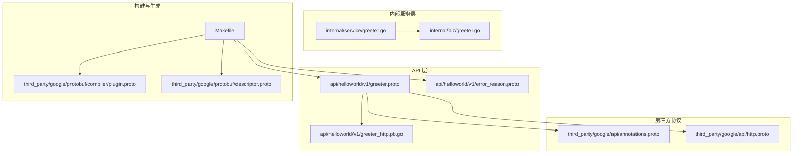
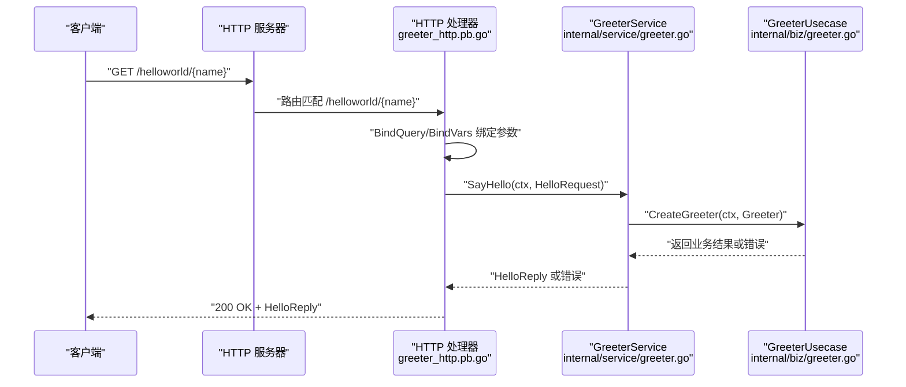
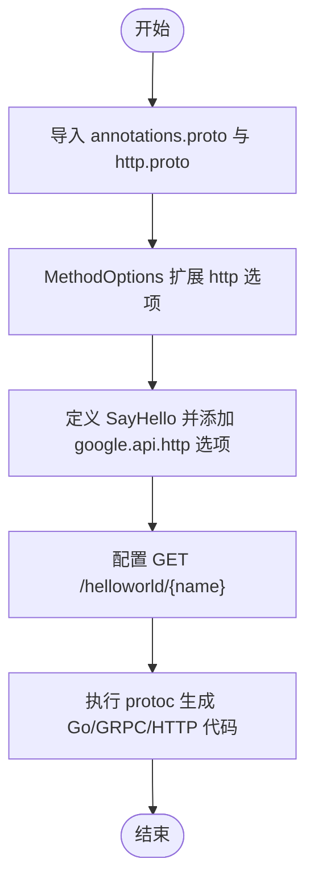
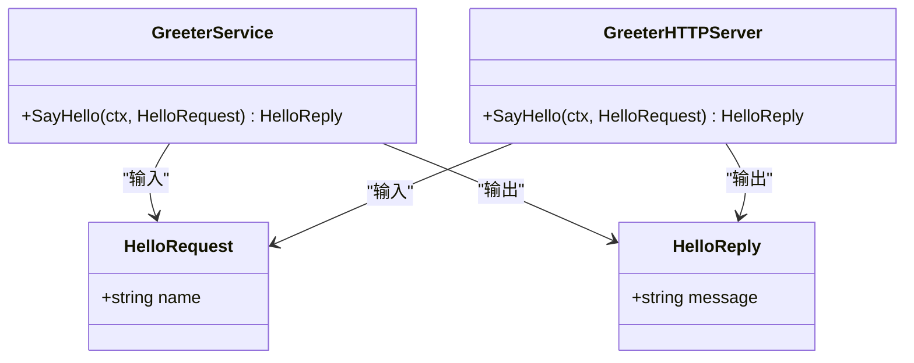
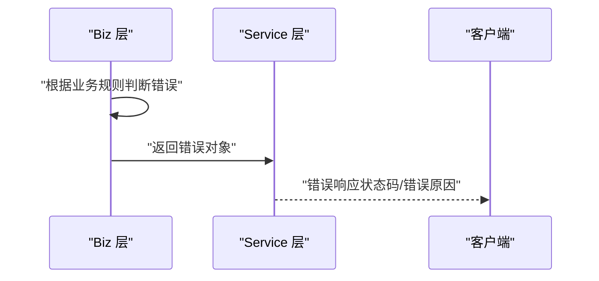
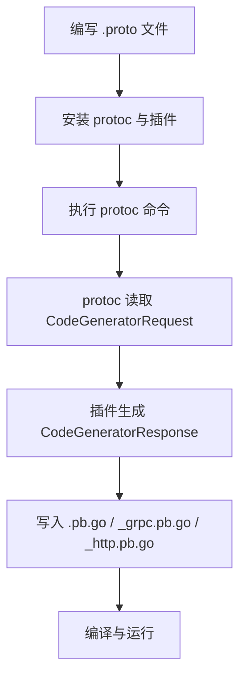
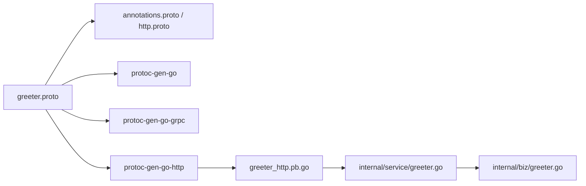

# Proto接口设计

<cite>
**本文引用的文件列表**
- [greeter.proto](file://api/helloworld/v1/greeter.proto)
- [error_reason.proto](file://api/helloworld/v1/error_reason.proto)
- [annotations.proto](file://third_party/google/api/annotations.proto)
- [http.proto](file://third_party/google/api/http.proto)
- [greeter_http.pb.go](file://api/helloworld/v1/greeter_http.pb.go)
- [greeter.go](file://internal/service/greeter.go)
- [greeter.go](file://internal/biz/greeter.go)
- [Makefile](file://Makefile)
- [plugin.proto](file://third_party/google/protobuf/compiler/plugin.proto)
- [descriptor.proto](file://third_party/google/protobuf/descriptor.proto)
</cite>

## 目录
1. [简介](#简介)
2. [项目结构](#项目结构)
3. [核心组件](#核心组件)
4. [架构总览](#架构总览)
5. [详细组件分析](#详细组件分析)
6. [依赖关系分析](#依赖关系分析)
7. [性能与可维护性考量](#性能与可维护性考量)
8. [故障排查指南](#故障排查指南)
9. [结论](#结论)
10. [附录：新增RPC与消息类型示例](#附录新增rpc与消息类型示例)

## 简介
本文件围绕 greeter.proto 的服务接口与消息定义进行系统化解析，重点覆盖：
- 语法与命名空间：syntax、package、option go_package 等选项的作用及对代码生成的影响
- 服务与RPC：service、rpc 方法、HTTP 映射注解的前置条件与使用方式
- 消息体设计：HelloRequest 与 HelloReply 的字段设计原则与数据类型选择
- 版本控制：通过 v1 命名空间实现 API 版本演进
- 自定义错误码：error_reason.proto 的枚举设计与业务集成
- 新增扩展：添加新 RPC 与消息类型的完整示例与最佳实践
- 代码生成流程：基于 Makefile 的 protoc 插件链路与生成产物

## 项目结构
本项目采用 Kratos 框架布局，API 层以版本化目录组织 proto 文件，third_party 引入 Google 官方注解与 HTTP 映射协议，内部服务层通过 usecase 与 biz 抽象对接业务。

图表来源
- [greeter.proto](file://api/helloworld/v1/greeter.proto#L1-L31)
- [error_reason.proto](file://api/helloworld/v1/error_reason.proto#L1-L14)
- [annotations.proto](file://third_party/google/api/annotations.proto#L1-L32)
- [http.proto](file://third_party/google/api/http.proto#L1-L376)
- [greeter_http.pb.go](file://api/helloworld/v1/greeter_http.pb.go#L1-L75)
- [greeter.go](file://internal/service/greeter.go#L1-L30)
- [greeter.go](file://internal/biz/greeter.go#L1-L47)
- [Makefile](file://Makefile#L1-L83)
- [plugin.proto](file://third_party/google/protobuf/compiler/plugin.proto#L52-L138)
- [descriptor.proto](file://third_party/google/protobuf/descriptor.proto#L400-L921)

章节来源
- [Makefile](file://Makefile#L1-L83)

## 核心组件
- 服务定义与 HTTP 映射：Greeter 服务通过 google.api.http 注解将 SayHello 映射为 HTTP GET /helloworld/{name}
- 请求/响应消息：HelloRequest 仅包含 name 字段；HelloReply 包含 message 字段
- 错误码定义：helloworld.v1.ErrorReason 枚举用于统一错误语义
- 生成产物：protoc-gen-go、protoc-gen-go-grpc、protoc-gen-go-http 生成 Go 代码与 HTTP 路由绑定

章节来源
- [greeter.proto](file://api/helloworld/v1/greeter.proto#L1-L31)
- [error_reason.proto](file://api/helloworld/v1/error_reason.proto#L1-L14)
- [greeter_http.pb.go](file://api/helloworld/v1/greeter_http.pb.go#L1-L75)

## 架构总览
下图展示了从 proto 到运行时的端到端调用链：客户端发起 HTTP 请求，经 HTTP 适配器绑定参数后调用服务实现，服务实现再委托 usecase 执行业务逻辑。

图表来源
- [greeter_http.pb.go](file://api/helloworld/v1/greeter_http.pb.go#L1-L75)
- [greeter.go](file://internal/service/greeter.go#L1-L30)
- [greeter.go](file://internal/biz/greeter.go#L1-L47)

## 详细组件分析

### 语法与命名空间：syntax、package、option go_package
- syntax：使用 proto3 语法，具备字段编号分配、JSON 序列化兼容等特性
- package：helloworld.v1 作为命名空间，确保跨语言生成的包路径一致
- option go_package：指定 Go 生成路径与导入别名，便于模块内引用与版本隔离
- 其他语言选项：java_multiple_files、java_package、java_outer_classname、objc_class_prefix 等，用于多语言生成一致性

章节来源
- [greeter.proto](file://api/helloworld/v1/greeter.proto#L1-L11)
- [error_reason.proto](file://api/helloworld/v1/error_reason.proto#L1-L9)

### 服务与 RPC：service、rpc 方法、HTTP 映射注解
- service Greeter：定义 Greeter 服务
- rpc SayHello：单向请求-响应模型
- HTTP 映射：通过 import "google/api/annotations.proto" 与 option (google.api.http) = {...} 实现 REST 映射
- 前置条件：需要在 proto 中 import http.proto 并在 MethodOptions 上扩展 http 选项

图表来源
- [annotations.proto](file://third_party/google/api/annotations.proto#L28-L31)
- [http.proto](file://third_party/google/api/http.proto#L313-L376)
- [greeter.proto](file://api/helloworld/v1/greeter.proto#L12-L20)

章节来源
- [greeter.proto](file://api/helloworld/v1/greeter.proto#L5-L20)
- [annotations.proto](file://third_party/google/api/annotations.proto#L28-L31)
- [http.proto](file://third_party/google/api/http.proto#L313-L376)

### 请求/响应消息：HelloRequest 与 HelloReply
- HelloRequest：仅包含字符串字段 name，字段编号为 1
- HelloReply：仅包含字符串字段 message，字段编号为 1
- 设计原则：
  - 单一职责：每个消息只承载必要字段
  - 可扩展性：预留未使用的字段编号，避免破坏二进制兼容
  - 类型选择：字符串类型满足通用性与可读性
  - HTTP 绑定：name 字段被映射为路径变量 {name}

图表来源
- [greeter.proto](file://api/helloworld/v1/greeter.proto#L22-L31)
- [greeter_http.pb.go](file://api/helloworld/v1/greeter_http.pb.go#L20-L28)

章节来源
- [greeter.proto](file://api/helloworld/v1/greeter.proto#L22-L31)
- [greeter_http.pb.go](file://api/helloworld/v1/greeter_http.pb.go#L20-L28)

### API 版本控制：v1 命名空间
- 通过 package helloworld.v1 将 API 放置于 v1 命名空间，实现版本隔离
- 后续新增 v2 时可保持现有 v1 不变，逐步迁移
- 生成路径与导入别名由 option go_package 控制，避免包冲突

章节来源
- [greeter.proto](file://api/helloworld/v1/greeter.proto#L3-L3)
- [error_reason.proto](file://api/helloworld/v1/error_reason.proto#L1-L3)

### 自定义错误码：error_reason.proto 与业务集成
- 错误码枚举：helloworld.v1.ErrorReason，包含未指定与用户不存在等语义
- 业务集成：在 biz 层通过 errors.NotFound 使用枚举值构造标准错误
- 服务层：在业务失败时直接返回错误，交由框架处理

图表来源
- [error_reason.proto](file://api/helloworld/v1/error_reason.proto#L10-L14)
- [greeter.go](file://internal/biz/greeter.go#L12-L16)
- [greeter.go](file://internal/service/greeter.go#L22-L30)

章节来源
- [error_reason.proto](file://api/helloworld/v1/error_reason.proto#L10-L14)
- [greeter.go](file://internal/biz/greeter.go#L12-L16)
- [greeter.go](file://internal/service/greeter.go#L22-L30)

### 代码生成流程：protoc 插件链路
- 插件安装：Makefile 中安装 protoc-gen-go、protoc-gen-go-grpc、protoc-gen-go-http、protoc-gen-openapi
- 生成命令：api 目标同时生成 --go、--go-grpc、--go-http 与 OpenAPI
- 插件协议：CodeGeneratorRequest/Response 通过 stdin/stdout 通信，支持插入点与元信息标注
- 生成产物：.pb.go、_grpc.pb.go、_http.pb.go 等

图表来源
- [Makefile](file://Makefile#L18-L46)
- [plugin.proto](file://third_party/google/protobuf/compiler/plugin.proto#L52-L138)
- [descriptor.proto](file://third_party/google/protobuf/descriptor.proto#L400-L921)

章节来源
- [Makefile](file://Makefile#L18-L46)
- [plugin.proto](file://third_party/google/protobuf/compiler/plugin.proto#L52-L138)
- [descriptor.proto](file://third_party/google/protobuf/descriptor.proto#L400-L921)

## 依赖关系分析
- Greeter 服务依赖 HTTP 注解协议，需导入 annotations.proto 与 http.proto
- 生成阶段依赖 protoc 插件生态，生成 Go 代码与 HTTP 路由绑定
- 运行时依赖 Kratos HTTP/GRPC 传输层，HTTP 适配器将 REST 调用转为 gRPC 调用

图表来源
- [greeter.proto](file://api/helloworld/v1/greeter.proto#L1-L20)
- [annotations.proto](file://third_party/google/api/annotations.proto#L1-L32)
- [http.proto](file://third_party/google/api/http.proto#L1-L376)
- [greeter_http.pb.go](file://api/helloworld/v1/greeter_http.pb.go#L1-L75)
- [greeter.go](file://internal/service/greeter.go#L1-L30)
- [greeter.go](file://internal/biz/greeter.go#L1-L47)

章节来源
- [greeter.proto](file://api/helloworld/v1/greeter.proto#L1-L20)
- [greeter_http.pb.go](file://api/helloworld/v1/greeter_http.pb.go#L1-L75)
- [greeter.go](file://internal/service/greeter.go#L1-L30)
- [greeter.go](file://internal/biz/greeter.go#L1-L47)

## 性能与可维护性考量
- 字段编号复用与扩展：建议预留未使用编号，避免破坏二进制兼容
- 数据类型选择：优先使用基础类型与非重复消息，便于 HTTP 映射与序列化
- HTTP 映射简洁性：尽量减少查询参数数量，提升缓存与代理友好度
- 生成产物管理：通过 Makefile 统一生成，避免手工修改生成文件
- 错误码标准化：统一使用枚举与框架错误类型，便于可观测与告警

## 故障排查指南
- HTTP 404/405：检查 google.api.http 配置是否与路由一致
- 参数绑定失败：确认路径变量与查询参数绑定是否正确
- 生成失败：检查 protoc 插件是否安装、proto_path 是否包含第三方依赖
- 错误码不生效：确认 biz 层返回的错误类型与枚举值是否匹配

章节来源
- [greeter_http.pb.go](file://api/helloworld/v1/greeter_http.pb.go#L24-L49)
- [Makefile](file://Makefile#L18-L46)

## 结论
本项目通过清晰的版本化命名空间、简洁的消息定义与标准的 HTTP 映射注解，实现了 gRPC 与 REST 的统一 API 设计。借助 Kratos 与 protoc 插件生态，能够高效生成多语言代码并快速集成到业务服务中。建议在后续迭代中延续字段编号预留策略与错误码标准化，确保长期可维护性与兼容性。

## 附录：新增RPC与消息类型示例
以下为新增一个带请求体的 RPC 与消息类型的完整示例步骤（不含具体代码内容，仅提供路径与要点）：
- 在 greeter.proto 中新增消息类型（如 CreateGreeterRequest/Reply），并为每个字段分配唯一编号
- 定义新的 rpc 方法（如 CreateGreeter），并在方法上添加 google.api.http 注解（如 POST /helloworld/users，body: "*"）
- 在 internal/service/greeter.go 中实现新方法，调用 internal/biz 层的 usecase
- 在 internal/biz/greeter.go 中新增对应 usecase 接口与实现
- 在 api/helloworld/v1 下执行 make api 重新生成代码
- 在 cmd/server 中注册 HTTP/GRPC 服务，确保路由生效

章节来源
- [greeter.proto](file://api/helloworld/v1/greeter.proto#L1-L31)
- [greeter_http.pb.go](file://api/helloworld/v1/greeter_http.pb.go#L24-L49)
- [greeter.go](file://internal/service/greeter.go#L22-L30)
- [greeter.go](file://internal/biz/greeter.go#L31-L47)
- [Makefile](file://Makefile#L36-L46)