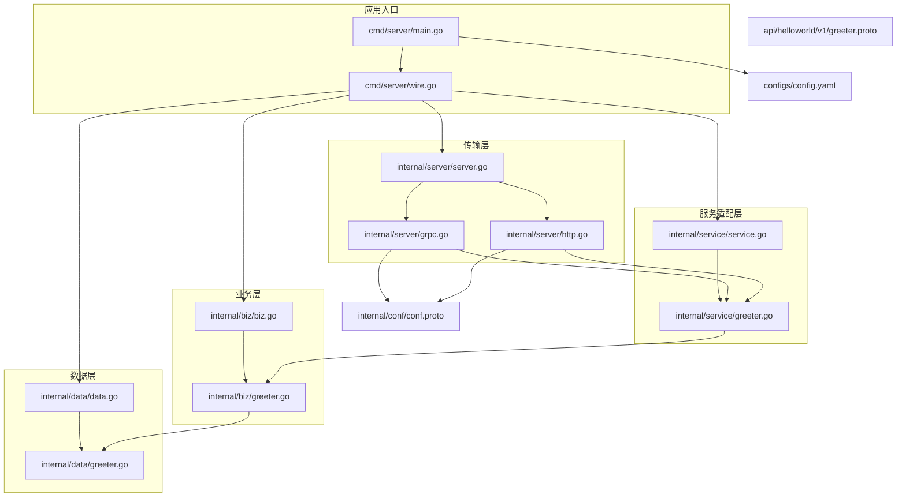
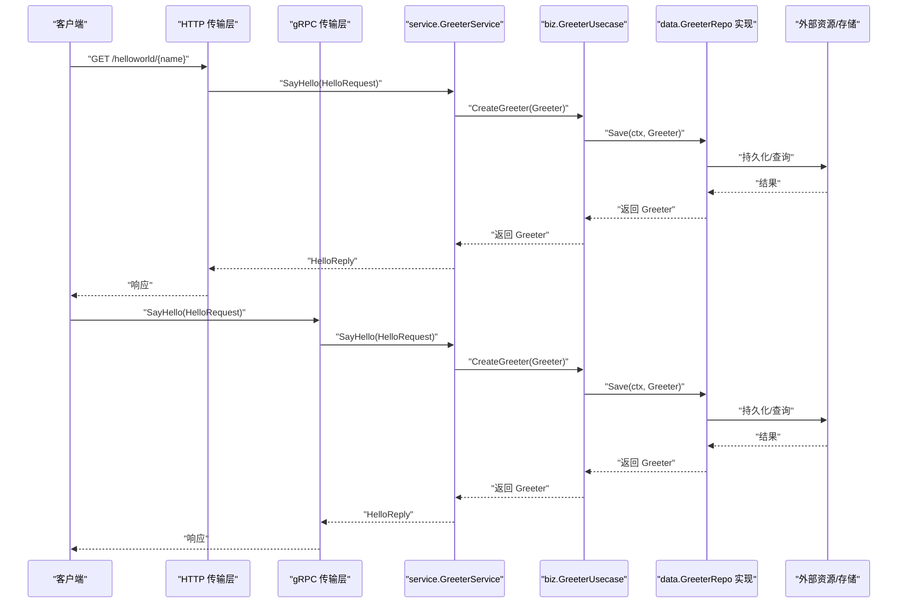
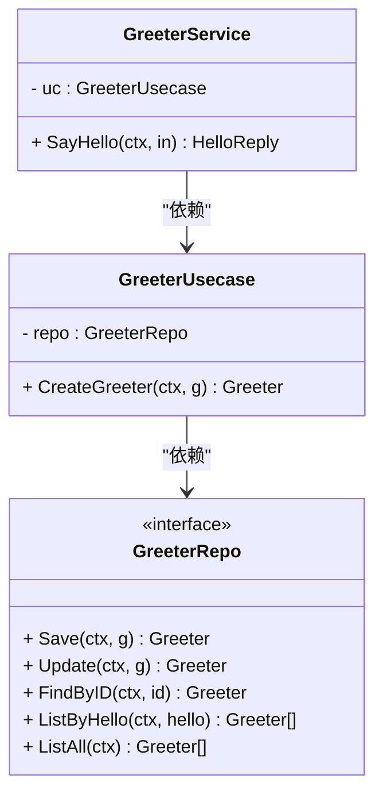
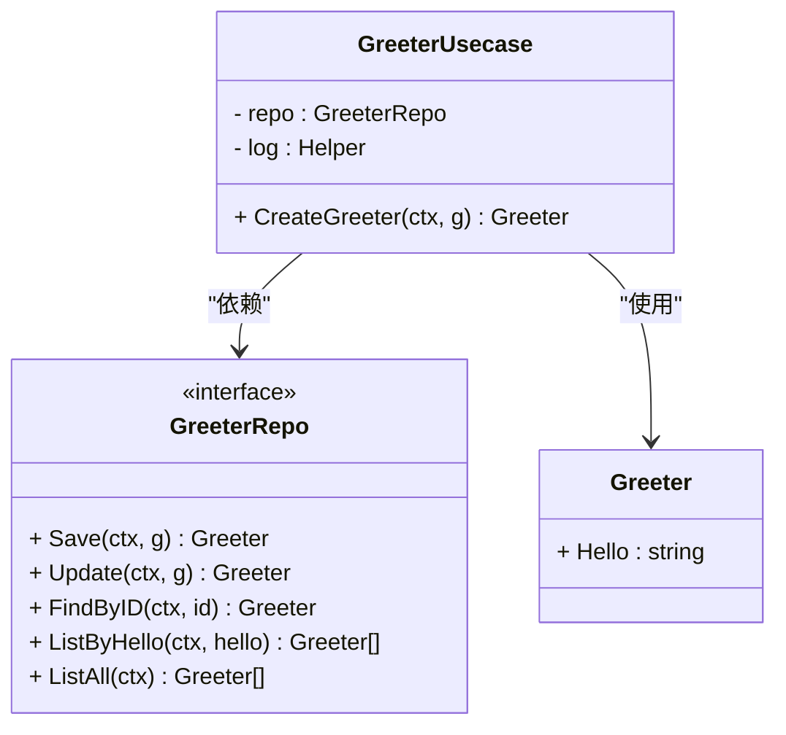
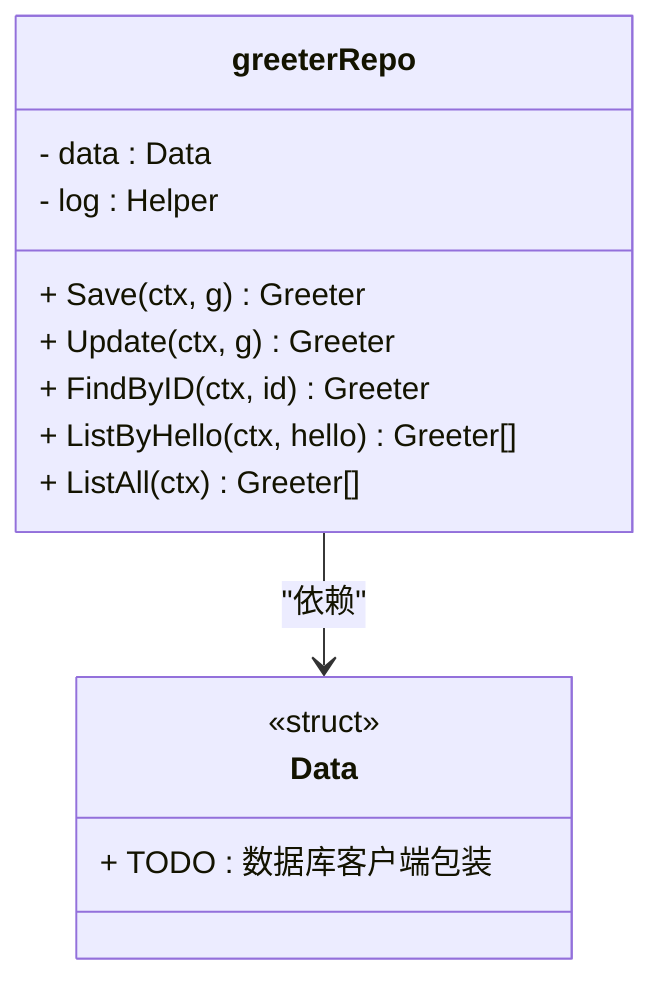
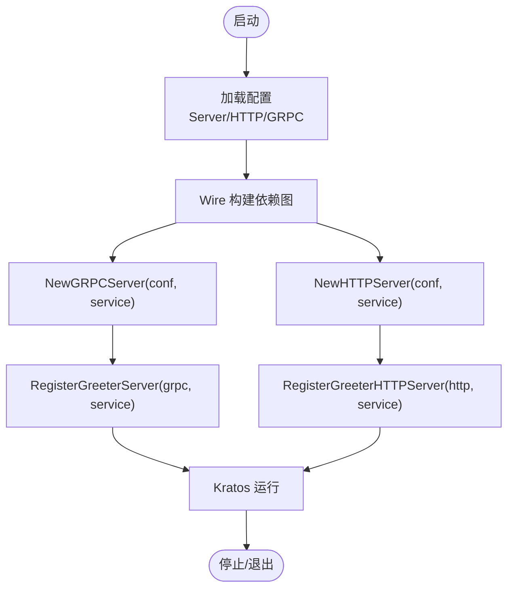
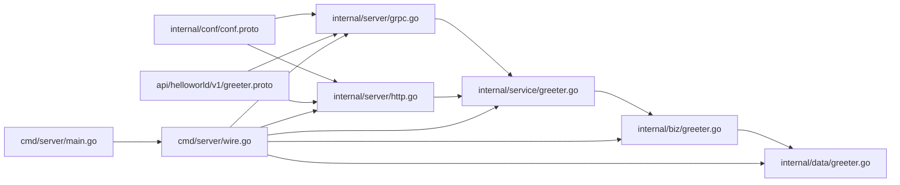

# 内部实现层

<cite>
**本文引用的文件**
- [internal/service/service.go](file://internal/service/service.go)
- [internal/service/greeter.go](file://internal/service/greeter.go)
- [internal/biz/biz.go](file://internal/biz/biz.go)
- [internal/biz/greeter.go](file://internal/biz/greeter.go)
- [internal/data/data.go](file://internal/data/data.go)
- [internal/data/greeter.go](file://internal/data/greeter.go)
- [internal/server/server.go](file://internal/server/server.go)
- [internal/server/grpc.go](file://internal/server/grpc.go)
- [internal/server/http.go](file://internal/server/http.go)
- [cmd/server/main.go](file://cmd/server/main.go)
- [cmd/server/wire.go](file://cmd/server/wire.go)
- [api/helloworld/v1/greeter.proto](file://api/helloworld/v1/greeter.proto)
- [internal/conf/conf.proto](file://internal/conf/conf.proto)
- [configs/config.yaml](file://configs/config.yaml)
</cite>

## 目录
1. [引言](#引言)
2. [项目结构](#项目结构)
3. [核心组件](#核心组件)
4. [架构总览](#架构总览)
5. [详细组件分析](#详细组件分析)
6. [依赖分析](#依赖分析)
7. [性能考虑](#性能考虑)
8. [故障排查指南](#故障排查指南)
9. [结论](#结论)
10. [附录](#附录)

## 引言
本文件系统性解析 internal/ 目录下的四层架构设计：service、biz、data、server。围绕 greeter 服务的完整调用链（HTTP/gRPC → service → biz → data），阐明各层职责与边界：
- service 层：作为 API 与业务逻辑的适配器，将 proto 定义的服务方法映射为具体实现，并向 biz 层发起业务用例调用。
- biz 层：封装核心业务用例，定义领域模型与仓储接口，体现领域逻辑与用例编排。
- data 层：负责数据持久化与外部资源访问，实现 biz 层定义的仓储接口。
- server 层：初始化 gRPC 和 HTTP 传输层，注册服务并应用中间件。

同时，强调依赖倒置原则与接口抽象在解耦中的作用，并给出各层编写规范与最佳实践。

## 项目结构
项目采用分层组织方式，按功能域划分模块，便于维护与扩展：
- api：协议与传输定义（proto 文件及其生成的 pb.go、http、grpc 等）
- internal：核心业务实现
  - internal/service：服务适配层（面向 API 的实现）
  - internal/biz：业务用例与领域模型
  - internal/data：数据访问与外部资源
  - internal/server：传输层初始化与注册
  - internal/conf：配置模型
- cmd/server：应用入口与依赖注入
- configs：运行时配置

图表来源
- [cmd/server/main.go](file://cmd/server/main.go#L50-L88)
- [cmd/server/wire.go](file://cmd/server/wire.go#L20-L24)
- [internal/server/server.go](file://internal/server/server.go#L1-L9)
- [internal/server/grpc.go](file://internal/server/grpc.go#L13-L33)
- [internal/server/http.go](file://internal/server/http.go#L13-L33)
- [internal/service/service.go](file://internal/service/service.go#L1-L7)
- [internal/service/greeter.go](file://internal/service/greeter.go#L1-L30)
- [internal/biz/biz.go](file://internal/biz/biz.go#L1-L7)
- [internal/biz/greeter.go](file://internal/biz/greeter.go#L1-L47)
- [internal/data/data.go](file://internal/data/data.go#L1-L25)
- [internal/data/greeter.go](file://internal/data/greeter.go#L1-L43)
- [internal/conf/conf.proto](file://internal/conf/conf.proto#L1-L42)
- [api/helloworld/v1/greeter.proto](file://api/helloworld/v1/greeter.proto#L1-L31)
- [configs/config.yaml](file://configs/config.yaml#L1-L16)

章节来源
- [cmd/server/main.go](file://cmd/server/main.go#L50-L88)
- [cmd/server/wire.go](file://cmd/server/wire.go#L20-L24)
- [internal/server/server.go](file://internal/server/server.go#L1-L9)
- [internal/server/grpc.go](file://internal/server/grpc.go#L13-L33)
- [internal/server/http.go](file://internal/server/http.go#L13-L33)
- [internal/service/service.go](file://internal/service/service.go#L1-L7)
- [internal/service/greeter.go](file://internal/service/greeter.go#L1-L30)
- [internal/biz/biz.go](file://internal/biz/biz.go#L1-L7)
- [internal/biz/greeter.go](file://internal/biz/greeter.go#L1-L47)
- [internal/data/data.go](file://internal/data/data.go#L1-L25)
- [internal/data/greeter.go](file://internal/data/greeter.go#L1-L43)
- [internal/conf/conf.proto](file://internal/conf/conf.proto#L1-L42)
- [api/helloworld/v1/greeter.proto](file://api/helloworld/v1/greeter.proto#L1-L31)
- [configs/config.yaml](file://configs/config.yaml#L1-L16)

## 核心组件
- service 层 ProviderSet：通过 Google Wire 集合 service 包内提供者，当前包含 GreeterService 工厂函数。
- biz 层 ProviderSet：集合 GreeterUsecase 工厂函数，依赖 GreeterRepo 接口。
- data 层 ProviderSet：集合 Data 结构体与 GreeterRepo 实现工厂函数。
- server 层 ProviderSet：集合 gRPC 与 HTTP 服务器工厂函数。
- 应用入口 main：加载配置、构建依赖注入图、启动 Kratos 应用。
- 依赖注入 wire：以 ProviderSet 为边界，自动装配各层对象。

章节来源
- [internal/service/service.go](file://internal/service/service.go#L1-L7)
- [internal/biz/biz.go](file://internal/biz/biz.go#L1-L7)
- [internal/data/data.go](file://internal/data/data.go#L1-L25)
- [internal/server/server.go](file://internal/server/server.go#L1-L9)
- [cmd/server/main.go](file://cmd/server/main.go#L50-L88)
- [cmd/server/wire.go](file://cmd/server/wire.go#L20-L24)

## 架构总览
greeter 服务的调用链从 HTTP/gRPC 入口开始，经 service 适配层进入 biz 用例，再由 data 层完成数据访问。依赖注入确保各层通过接口解耦，server 层仅负责传输注册与中间件。

图表来源
- [internal/server/http.go](file://internal/server/http.go#L13-L33)
- [internal/server/grpc.go](file://internal/server/grpc.go#L13-L33)
- [internal/service/greeter.go](file://internal/service/greeter.go#L22-L30)
- [internal/biz/greeter.go](file://internal/biz/greeter.go#L42-L47)
- [internal/data/greeter.go](file://internal/data/greeter.go#L24-L43)
- [api/helloworld/v1/greeter.proto](file://api/helloworld/v1/greeter.proto#L12-L20)

## 详细组件分析

### service 层：API 适配器
- 职责
  - 将 API 层的请求消息转换为 biz 层可消费的领域模型。
  - 调用 biz 层用例，处理错误并返回 API 层的响应消息。
  - 保持对上层 API 的无侵入，不直接操作数据或外部资源。
- 关键点
  - GreeterService 实现了 API 生成的服务接口，持有 biz.GreeterUsecase 的引用。
  - 通过构造函数注入用例，遵循依赖倒置原则。
  - 方法内仅做参数转换与用例调用，避免业务逻辑下沉。
- 依赖注入
  - service.ProviderSet 汇聚 NewGreeterService，供上层装配。

图表来源
- [internal/service/greeter.go](file://internal/service/greeter.go#L1-L30)
- [internal/biz/greeter.go](file://internal/biz/greeter.go#L1-L47)

章节来源
- [internal/service/greeter.go](file://internal/service/greeter.go#L1-L30)
- [internal/service/service.go](file://internal/service/service.go#L1-L7)

### biz 层：业务用例与领域模型
- 职责
  - 定义领域模型 Greeter 与仓储接口 GreeterRepo。
  - 封装业务用例 GreeterUsecase，协调仓储完成业务目标。
  - 通过日志与错误工具输出上下文信息与错误码。
- 关键点
  - 用例仅编排业务流程，不关心数据来源与传输细节。
  - 通过接口隔离外部实现，便于替换与测试。
- 依赖注入
  - biz.ProviderSet 汇聚 NewGreeterUsecase，依赖 GreeterRepo 接口。

图表来源
- [internal/biz/greeter.go](file://internal/biz/greeter.go#L1-L47)

章节来源
- [internal/biz/greeter.go](file://internal/biz/greeter.go#L1-L47)
- [internal/biz/biz.go](file://internal/biz/biz.go#L1-L7)

### data 层：数据持久化与外部资源
- 职责
  - 实现 GreeterRepo 接口，完成实际的数据访问与外部资源交互。
  - 提供 Data 结构体承载配置与清理逻辑，支持生命周期管理。
- 关键点
  - 当前实现为占位，返回空值/空结果，便于演示与扩展。
  - 通过 NewData 与 NewGreeterRepo 工厂函数装配依赖。
- 依赖注入
  - data.ProviderSet 汇聚 NewData 与 NewGreeterRepo。

图表来源
- [internal/data/data.go](file://internal/data/data.go#L1-L25)
- [internal/data/greeter.go](file://internal/data/greeter.go#L1-L43)

章节来源
- [internal/data/data.go](file://internal/data/data.go#L1-L25)
- [internal/data/greeter.go](file://internal/data/greeter.go#L1-L43)

### server 层：传输层初始化
- 职责
  - 初始化 gRPC 与 HTTP 服务器，注册 Greeter 服务。
  - 应用通用中间件（如恢复中间件）。
  - 依据配置设置网络、地址与超时等参数。
- 关键点
  - 通过 ProviderSet 汇聚 NewGRPCServer 与 NewHTTPServer。
  - 传输层仅依赖 service.GreeterService，不感知 biz/data 实现。
- 依赖注入
  - server.ProviderSet 汇聚服务器工厂函数。

图表来源
- [internal/server/grpc.go](file://internal/server/grpc.go#L13-L33)
- [internal/server/http.go](file://internal/server/http.go#L13-L33)
- [internal/server/server.go](file://internal/server/server.go#L1-L9)
- [cmd/server/main.go](file://cmd/server/main.go#L50-L88)
- [cmd/server/wire.go](file://cmd/server/wire.go#L20-L24)

章节来源
- [internal/server/grpc.go](file://internal/server/grpc.go#L13-L33)
- [internal/server/http.go](file://internal/server/http.go#L13-L33)
- [internal/server/server.go](file://internal/server/server.go#L1-L9)
- [cmd/server/main.go](file://cmd/server/main.go#L50-L88)
- [cmd/server/wire.go](file://cmd/server/wire.go#L20-L24)

## 依赖分析
- 依赖方向
  - 上层依赖下层：server 依赖 service；service 依赖 biz；biz 依赖 data。
  - 依赖倒置：上层仅依赖抽象接口（GreeterRepo），下层实现接口。
- 解耦策略
  - 通过接口隔离与工厂函数注入，降低耦合度。
  - 使用 Google Wire 统一装配，避免手动管理复杂依赖。
- 可能的循环依赖
  - 当前结构清晰，未发现循环依赖迹象。
- 外部依赖
  - Kratos 核心库、Google Wire、proto 生成代码。

图表来源
- [internal/conf/conf.proto](file://internal/conf/conf.proto#L1-L42)
- [api/helloworld/v1/greeter.proto](file://api/helloworld/v1/greeter.proto#L1-L31)
- [internal/server/grpc.go](file://internal/server/grpc.go#L13-L33)
- [internal/server/http.go](file://internal/server/http.go#L13-L33)
- [internal/service/greeter.go](file://internal/service/greeter.go#L1-L30)
- [internal/biz/greeter.go](file://internal/biz/greeter.go#L1-L47)
- [internal/data/greeter.go](file://internal/data/greeter.go#L1-L43)
- [cmd/server/wire.go](file://cmd/server/wire.go#L20-L24)
- [cmd/server/main.go](file://cmd/server/main.go#L50-L88)

章节来源
- [cmd/server/wire.go](file://cmd/server/wire.go#L20-L24)
- [internal/server/grpc.go](file://internal/server/grpc.go#L13-L33)
- [internal/server/http.go](file://internal/server/http.go#L13-L33)
- [internal/service/greeter.go](file://internal/service/greeter.go#L1-L30)
- [internal/biz/greeter.go](file://internal/biz/greeter.go#L1-L47)
- [internal/data/greeter.go](file://internal/data/greeter.go#L1-L43)
- [internal/conf/conf.proto](file://internal/conf/conf.proto#L1-L42)
- [api/helloworld/v1/greeter.proto](file://api/helloworld/v1/greeter.proto#L1-L31)
- [cmd/server/main.go](file://cmd/server/main.go#L50-L88)

## 性能考虑
- 中间件与超时
  - 传输层已启用恢复中间件，建议结合限流、熔断与链路追踪中间件提升稳定性。
  - 配置文件中为 HTTP/GRPC 设置了超时，应根据实际业务场景调整。
- 日志与可观测性
  - 业务层使用日志助手输出上下文信息，建议统一采样与字段结构化。
- 数据访问
  - data 层当前为占位实现，建议在真实实现中引入连接池、缓存与批量操作优化。
- 依赖注入
  - 使用 Wire 减少运行时反射成本，确保在构建阶段完成装配。

章节来源
- [internal/server/grpc.go](file://internal/server/grpc.go#L13-L33)
- [internal/server/http.go](file://internal/server/http.go#L13-L33)
- [configs/config.yaml](file://configs/config.yaml#L1-L16)
- [internal/biz/greeter.go](file://internal/biz/greeter.go#L42-L47)

## 故障排查指南
- 启动失败
  - 检查配置路径与格式，确认配置文件存在且可被加载。
  - 查看依赖注入是否成功，Wire 构建是否报错。
- 传输层问题
  - 确认端口占用与网络可达性；核对 HTTP/GRPC 地址与超时配置。
  - 若中间件导致异常，检查恢复中间件是否生效。
- 业务层错误
  - 关注业务用例的日志输出，定位参数与流程问题。
  - 错误码与原因可通过领域错误常量进行识别。
- 数据层问题
  - 当前实现返回空值，若期望有副作用，请在 data 层实现中补充持久化逻辑。

章节来源
- [cmd/server/main.go](file://cmd/server/main.go#L50-L88)
- [cmd/server/wire.go](file://cmd/server/wire.go#L20-L24)
- [internal/server/grpc.go](file://internal/server/grpc.go#L13-L33)
- [internal/server/http.go](file://internal/server/http.go#L13-L33)
- [internal/biz/greeter.go](file://internal/biz/greeter.go#L12-L16)

## 结论
该四层架构通过依赖倒置与接口抽象实现了清晰的分层与解耦：
- service 层专注于 API 映射与用例编排；
- biz 层聚焦领域模型与业务规则；
- data 层负责数据与外部资源访问；
- server 层统一传输初始化与注册。
配合 Google Wire 的依赖注入，整体结构具备良好的可维护性与扩展性。后续可在 data 层完善真实持久化实现，并在传输层增加更多中间件与监控能力。

## 附录

### 各层编写规范与最佳实践
- service 层
  - 仅做参数转换与用例调用，避免业务逻辑下沉。
  - 对外暴露 API 响应结构，内部使用领域模型。
  - 保持对上层 API 的无侵入，不直接依赖具体数据实现。
- biz 层
  - 以用例为中心组织业务流程，接口隔离外部实现。
  - 使用日志助手记录上下文信息，便于追踪与审计。
  - 错误处理遵循统一错误码与原因枚举。
- data 层
  - 实现 GreeterRepo 接口，提供稳定的 CRUD 能力。
  - 在 NewData 中提供资源清理回调，确保生命周期管理。
  - 优先使用连接池、缓存与事务控制，提升性能与一致性。
- server 层
  - 传输层仅注册服务与应用中间件，不参与业务逻辑。
  - 依据配置动态设置网络、地址与超时，支持多环境部署。
  - 使用 ProviderSet 汇聚工厂函数，便于统一装配与测试替换。
- 依赖注入
  - 通过 ProviderSet 汇聚工厂函数，减少手动依赖管理。
  - 保持上层仅依赖抽象接口，下层实现接口，避免循环依赖。

章节来源
- [internal/service/greeter.go](file://internal/service/greeter.go#L1-L30)
- [internal/biz/greeter.go](file://internal/biz/greeter.go#L1-L47)
- [internal/data/data.go](file://internal/data/data.go#L1-L25)
- [internal/data/greeter.go](file://internal/data/greeter.go#L1-L43)
- [internal/server/grpc.go](file://internal/server/grpc.go#L13-L33)
- [internal/server/http.go](file://internal/server/http.go#L13-L33)
- [cmd/server/wire.go](file://cmd/server/wire.go#L20-L24)