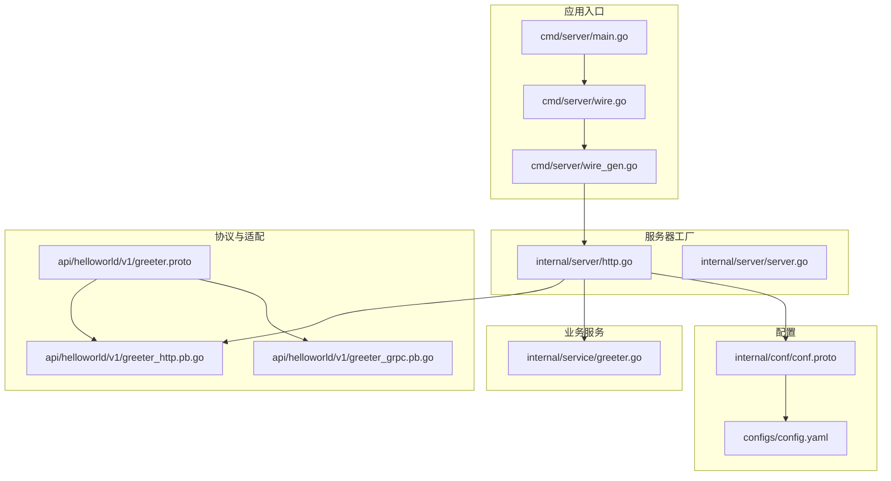
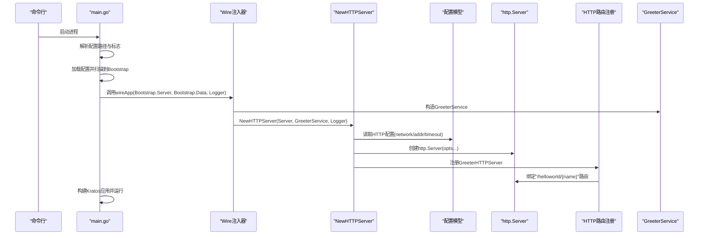
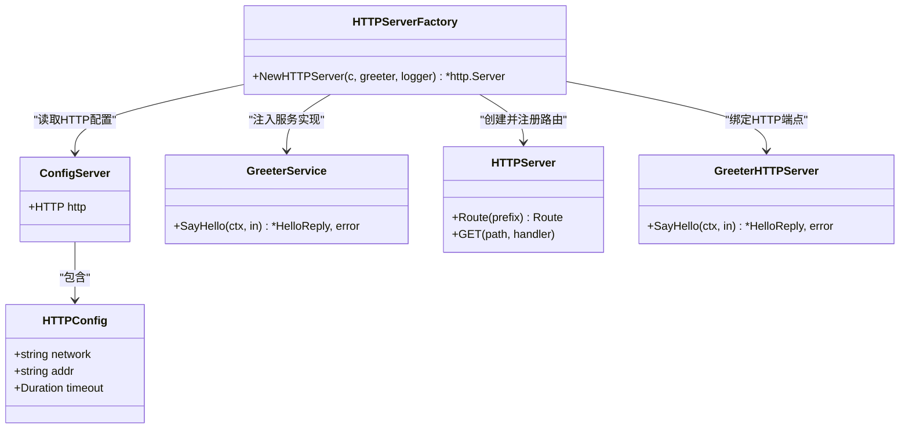
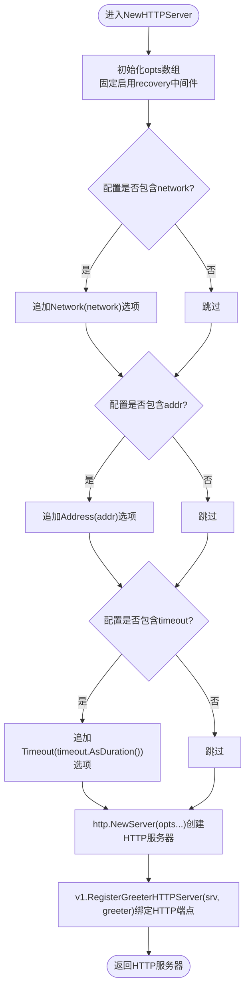
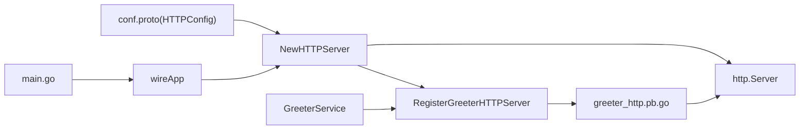

# HTTP服务器

<cite>
**本文引用的文件**
- [cmd/server/main.go](file://cmd/server/main.go)
- [cmd/server/wire.go](file://cmd/server/wire.go)
- [cmd/server/wire_gen.go](file://cmd/server/wire_gen.go)
- [internal/server/http.go](file://internal/server/http.go)
- [internal/server/server.go](file://internal/server/server.go)
- [internal/conf/conf.proto](file://internal/conf/conf.proto)
- [configs/config.yaml](file://configs/config.yaml)
- [api/helloworld/v1/greeter.proto](file://api/helloworld/v1/greeter.proto)
- [api/helloworld/v1/greeter_http.pb.go](file://api/helloworld/v1/greeter_http.pb.go)
- [api/helloworld/v1/greeter_grpc.pb.go](file://api/helloworld/v1/greeter_grpc.pb.go)
- [internal/service/greeter.go](file://internal/service/greeter.go)
</cite>

## 目录
1. [简介](#简介)
2. [项目结构](#项目结构)
3. [核心组件](#核心组件)
4. [架构总览](#架构总览)
5. [详细组件分析](#详细组件分析)
6. [依赖关系分析](#依赖关系分析)
7. [性能考量](#性能考量)
8. [故障排查指南](#故障排查指南)
9. [结论](#结论)
10. [附录](#附录)

## 简介
本节聚焦于NewHTTPServer函数如何基于Kratos框架创建HTTP服务器实例，围绕以下关键点展开：
- 参数解析与作用：*conf.Server用于加载HTTP协议配置（网络类型、地址、超时）；*service.GreeterService作为服务实现的依赖注入实例；log.Logger用于日志记录。
- opts选项数组的构造：固定启用recovery中间件；根据配置动态追加网络、地址、超时选项。
- 服务器创建与服务绑定：http.NewServer(opts...)创建HTTP服务器，并通过v1.RegisterGreeterHTTPServer(srv, greeter)将GreeterService的HTTP端点注册到路由。
- 协议映射与REST化：结合proto文件中的HTTP映射规则（google.api.http注解），解释gRPC服务如何被转换为RESTful API。
- 应用初始化流程：展示NewHTTPServer如何被Wire框架调用，以及main.go中的应用初始化流程。
- 配置示例与扩展：提供config.yaml中HTTP服务器配置示例，并说明如何自定义HTTP路由与中间件。

## 项目结构
本项目采用分层与按功能模块组织的结构，其中与HTTP服务器直接相关的文件分布如下：
- 应用入口与依赖注入：cmd/server/main.go、cmd/server/wire.go、cmd/server/wire_gen.go
- 服务器工厂与集合：internal/server/http.go、internal/server/server.go
- 配置模型与扫描：internal/conf/conf.proto、configs/config.yaml
- 协议与HTTP适配：api/helloworld/v1/greeter.proto、api/helloworld/v1/greeter_http.pb.go、api/helloworld/v1/greeter_grpc.pb.go
- 业务服务实现：internal/service/greeter.go

图表来源
- [cmd/server/main.go](file://cmd/server/main.go#L1-L88)
- [cmd/server/wire.go](file://cmd/server/wire.go#L1-L24)
- [cmd/server/wire_gen.go](file://cmd/server/wire_gen.go#L1-L41)
- [internal/server/http.go](file://internal/server/http.go#L1-L33)
- [internal/server/server.go](file://internal/server/server.go#L1-L9)
- [internal/conf/conf.proto](file://internal/conf/conf.proto#L1-L42)
- [configs/config.yaml](file://configs/config.yaml#L1-L16)
- [api/helloworld/v1/greeter.proto](file://api/helloworld/v1/greeter.proto#L1-L31)
- [api/helloworld/v1/greeter_http.pb.go](file://api/helloworld/v1/greeter_http.pb.go#L1-L75)
- [api/helloworld/v1/greeter_grpc.pb.go](file://api/helloworld/v1/greeter_grpc.pb.go#L1-L108)
- [internal/service/greeter.go](file://internal/service/greeter.go#L1-L30)

章节来源
- [cmd/server/main.go](file://cmd/server/main.go#L1-L88)
- [cmd/server/wire.go](file://cmd/server/wire.go#L1-L24)
- [cmd/server/wire_gen.go](file://cmd/server/wire_gen.go#L1-L41)
- [internal/server/http.go](file://internal/server/http.go#L1-L33)
- [internal/server/server.go](file://internal/server/server.go#L1-L9)
- [internal/conf/conf.proto](file://internal/conf/conf.proto#L1-L42)
- [configs/config.yaml](file://configs/config.yaml#L1-L16)
- [api/helloworld/v1/greeter.proto](file://api/helloworld/v1/greeter.proto#L1-L31)
- [api/helloworld/v1/greeter_http.pb.go](file://api/helloworld/v1/greeter_http.pb.go#L1-L75)
- [api/helloworld/v1/greeter_grpc.pb.go](file://api/helloworld/v1/greeter_grpc.pb.go#L1-L108)
- [internal/service/greeter.go](file://internal/service/greeter.go#L1-L30)

## 核心组件
- NewHTTPServer函数：负责构建HTTP服务器实例，组装opts选项数组，创建http.Server并注册Greeter服务的HTTP端点。
- 配置模型：conf.proto定义了Server.HTTP字段，包含network、addr、timeout等字段，供NewHTTPServer读取。
- GreeterService：业务服务实现，承载SayHello业务逻辑。
- HTTP适配器：greeter_http.pb.go由proto生成，提供HTTP路由注册与请求处理桥接。
- 应用初始化：main.go通过Wire注入GreeterService与配置，创建并运行Kratos应用。

章节来源
- [internal/server/http.go](file://internal/server/http.go#L1-L33)
- [internal/conf/conf.proto](file://internal/conf/conf.proto#L1-L42)
- [internal/service/greeter.go](file://internal/service/greeter.go#L1-L30)
- [api/helloworld/v1/greeter_http.pb.go](file://api/helloworld/v1/greeter_http.pb.go#L1-L75)
- [cmd/server/main.go](file://cmd/server/main.go#L1-L88)
- [cmd/server/wire_gen.go](file://cmd/server/wire_gen.go#L1-L41)

## 架构总览
下图展示了从应用启动到HTTP服务器创建与服务绑定的整体流程，以及各组件之间的依赖关系。

图表来源
- [cmd/server/main.go](file://cmd/server/main.go#L1-L88)
- [cmd/server/wire.go](file://cmd/server/wire.go#L1-L24)
- [cmd/server/wire_gen.go](file://cmd/server/wire_gen.go#L1-L41)
- [internal/server/http.go](file://internal/server/http.go#L1-L33)
- [api/helloworld/v1/greeter_http.pb.go](file://api/helloworld/v1/greeter_http.pb.go#L1-L75)
- [internal/service/greeter.go](file://internal/service/greeter.go#L1-L30)

## 详细组件分析

### NewHTTPServer函数与参数
- 参数说明
  - *conf.Server：包含HTTP配置（network、addr、timeout）。NewHTTPServer会读取这些字段以决定监听网络、监听地址与请求超时。
  - *service.GreeterService：Greeter业务服务实例，作为HTTP端点的后端实现。
  - log.Logger：日志记录器，贯穿应用生命周期。
- opts选项数组构造
  - 固定启用recovery中间件，确保HTTP请求异常时能恢复并返回错误响应。
  - 条件追加：
    - 若配置存在network，则追加Network选项。
    - 若配置存在addr，则追加Address选项。
    - 若配置存在timeout，则追加Timeout选项。
- 服务器创建与服务绑定
  - 使用http.NewServer(opts...)创建HTTP服务器。
  - 通过v1.RegisterGreeterHTTPServer(srv, greeter)将GreeterService的HTTP端点注册到srv上。

章节来源
- [internal/server/http.go](file://internal/server/http.go#L1-L33)
- [internal/conf/conf.proto](file://internal/conf/conf.proto#L1-L42)
- [api/helloworld/v1/greeter_http.pb.go](file://api/helloworld/v1/greeter_http.pb.go#L1-L75)

### 配置模型与应用初始化
- 配置模型
  - conf.proto定义了Server.HTTP字段，包含network、addr、timeout，对应NewHTTPServer的读取逻辑。
  - configs/config.yaml提供具体值，例如http.addr与http.timeout。
- 应用初始化流程
  - main.go解析配置文件路径，加载配置并扫描到Bootstrap结构体。
  - main.go调用wireApp(Bootstrap.Server, Bootstrap.Data, logger)，由Wire注入器完成GreeterService与HTTP/GRPC服务器的创建。
  - 最终通过kratos.App统一管理并运行。

章节来源
- [internal/conf/conf.proto](file://internal/conf/conf.proto#L1-L42)
- [configs/config.yaml](file://configs/config.yaml#L1-L16)
- [cmd/server/main.go](file://cmd/server/main.go#L1-L88)
- [cmd/server/wire.go](file://cmd/server/wire.go#L1-L24)
- [cmd/server/wire_gen.go](file://cmd/server/wire_gen.go#L1-L41)

### gRPC到REST的映射与HTTP端点
- 协议映射规则
  - 在greeter.proto中，SayHello方法通过google.api.http注解定义了HTTP映射：GET "/helloworld/{name}"。
- 代码生成与路由绑定
  - 生成的greeter_http.pb.go提供了RegisterGreeterHTTPServer函数，内部通过s.Route("/")绑定"/helloworld/{name}"路由，并将HTTP请求转发到GreeterService.SayHello。
  - 请求处理流程：
    - 从查询参数与路径变量中绑定HelloRequest。
    - 设置操作名以便追踪。
    - 通过中间件链路调用GreeterService.SayHello。
    - 返回HelloReply给客户端。
- gRPC侧对照
  - greeter_grpc.pb.go定义了GreeterServer接口与SayHello方法签名，作为gRPC端点的实现契约。

章节来源
- [api/helloworld/v1/greeter.proto](file://api/helloworld/v1/greeter.proto#L1-L31)
- [api/helloworld/v1/greeter_http.pb.go](file://api/helloworld/v1/greeter_http.pb.go#L1-L75)
- [api/helloworld/v1/greeter_grpc.pb.go](file://api/helloworld/v1/greeter_grpc.pb.go#L1-L108)

### Wire注入与NewHTTPServer调用
- Wire注入器
  - wire.go中定义wireApp函数，使用wire.Build聚合ProviderSet并返回Kratos应用。
  - wire_gen.go由Wire生成，内部按顺序：
    - 初始化数据层与领域用例
    - 构造GreeterService
    - 调用NewHTTPServer(confServer, greeterService, logger)
    - 调用NewGRPCServer(confServer, greeterService, logger)
    - newApp(logger, grpcServer, httpServer)构建Kratos应用
- 调用链
  - main.go -> wireApp -> wire_gen.go -> NewHTTPServer

章节来源
- [cmd/server/wire.go](file://cmd/server/wire.go#L1-L24)
- [cmd/server/wire_gen.go](file://cmd/server/wire_gen.go#L1-L41)
- [internal/server/server.go](file://internal/server/server.go#L1-L9)
- [cmd/server/main.go](file://cmd/server/main.go#L1-L88)

### 类关系与依赖图

图表来源
- [internal/server/http.go](file://internal/server/http.go#L1-L33)
- [internal/conf/conf.proto](file://internal/conf/conf.proto#L1-L42)
- [internal/service/greeter.go](file://internal/service/greeter.go#L1-L30)
- [api/helloworld/v1/greeter_http.pb.go](file://api/helloworld/v1/greeter_http.pb.go#L1-L75)

### NewHTTPServer选项构造流程

图表来源
- [internal/server/http.go](file://internal/server/http.go#L1-L33)

## 依赖关系分析
- 组件耦合与内聚
  - NewHTTPServer对配置模型与业务服务有直接依赖，但通过Wire注入器降低外部耦合度。
  - HTTP适配器greeter_http.pb.go与GreeterService通过接口契约解耦。
- 外部依赖与集成点
  - Kratos HTTP传输层与中间件生态（recovery等）。
  - Protobuf编译产物（greeter_http.pb.go、greeter_grpc.pb.go）提供协议与路由桥接。
- 潜在循环依赖
  - 当前结构未见循环依赖迹象，Wire注入器负责组装依赖关系。

图表来源
- [internal/conf/conf.proto](file://internal/conf/conf.proto#L1-L42)
- [internal/server/http.go](file://internal/server/http.go#L1-L33)
- [api/helloworld/v1/greeter_http.pb.go](file://api/helloworld/v1/greeter_http.pb.go#L1-L75)
- [internal/service/greeter.go](file://internal/service/greeter.go#L1-L30)
- [cmd/server/main.go](file://cmd/server/main.go#L1-L88)
- [cmd/server/wire.go](file://cmd/server/wire.go#L1-L24)

章节来源
- [internal/conf/conf.proto](file://internal/conf/conf.proto#L1-L42)
- [internal/server/http.go](file://internal/server/http.go#L1-L33)
- [api/helloworld/v1/greeter_http.pb.go](file://api/helloworld/v1/greeter_http.pb.go#L1-L75)
- [internal/service/greeter.go](file://internal/service/greeter.go#L1-L30)
- [cmd/server/main.go](file://cmd/server/main.go#L1-L88)
- [cmd/server/wire.go](file://cmd/server/wire.go#L1-L24)

## 性能考量
- 中间件开销：recovery中间件提供异常恢复能力，通常开销较低，但在高并发场景建议配合限流与熔断策略。
- 路由匹配：HTTP路由由生成的适配器注册，匹配复杂度与路径模板数量相关，建议保持路径简洁。
- 超时控制：通过配置timeout限制请求处理时间，避免资源长时间占用。
- 日志成本：日志记录应避免在高频路径中进行昂贵操作，合理设置采样与级别。

## 故障排查指南
- HTTP服务器无法启动
  - 检查配置文件路径与格式，确认http.addr与http.timeout有效。
  - 确认端口未被占用或权限不足。
- 路由不生效
  - 确认greeter_http.pb.go已重新生成且与proto一致。
  - 检查RegisterGreeterHTTPServer是否被调用。
- 业务逻辑异常
  - 查看recovery中间件输出的日志，定位panic或错误返回。
  - 检查GreeterService.SayHello实现与依赖注入链路。

章节来源
- [configs/config.yaml](file://configs/config.yaml#L1-L16)
- [api/helloworld/v1/greeter_http.pb.go](file://api/helloworld/v1/greeter_http.pb.go#L1-L75)
- [internal/server/http.go](file://internal/server/http.go#L1-L33)
- [internal/service/greeter.go](file://internal/service/greeter.go#L1-L30)

## 结论
NewHTTPServer通过Wire注入器与Kratos框架的HTTP传输层，实现了从配置驱动到HTTP服务器创建与服务绑定的完整闭环。其核心在于：
- 明确的参数职责划分与可选配置扩展；
- 固定启用recovery中间件提升稳定性；
- 基于proto注解的gRPC到REST映射，简化API暴露；
- 与Wire注入器协同，保证依赖注入与应用生命周期管理的一致性。

## 附录

### 配置示例：HTTP服务器
- 示例配置项
  - server.http.addr：监听地址，如 "0.0.0.0:8000"
  - server.http.timeout：请求超时，如 "1s"
- 参考路径
  - [configs/config.yaml](file://configs/config.yaml#L1-L16)

章节来源
- [configs/config.yaml](file://configs/config.yaml#L1-L16)

### 自定义HTTP路由与中间件
- 自定义路由
  - 在NewHTTPServer中，除RegisterGreeterHTTPServer外，可继续调用srv.Route(...)与srv.GET/POST等方法注册自定义路由。
- 自定义中间件
  - 在opts数组中追加自定义中间件，例如：
    - http.Middleware(yourMiddleware())
  - 注意中间件顺序与职责边界，避免覆盖或干扰已有中间件（如recovery）。

章节来源
- [internal/server/http.go](file://internal/server/http.go#L1-L33)