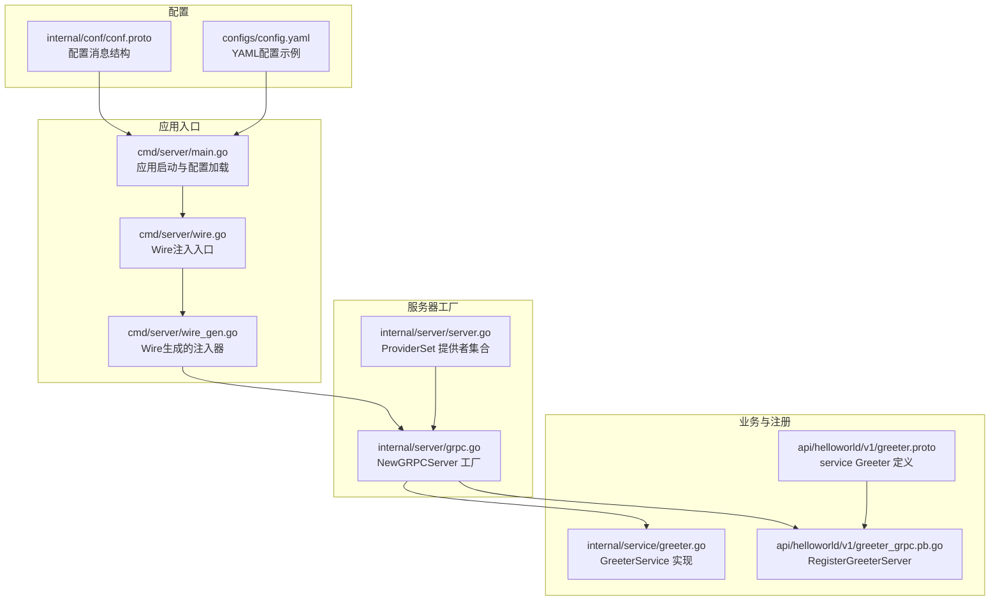
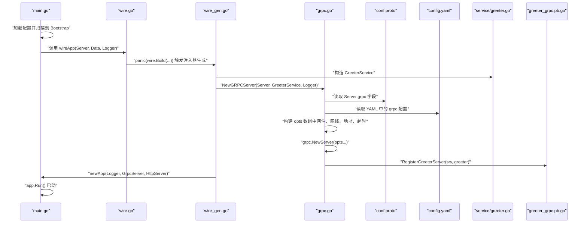
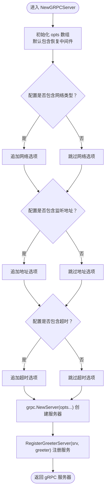
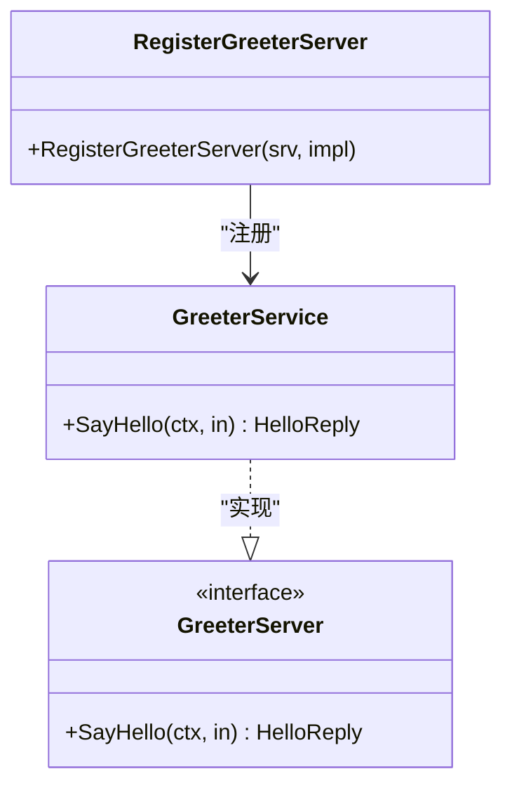
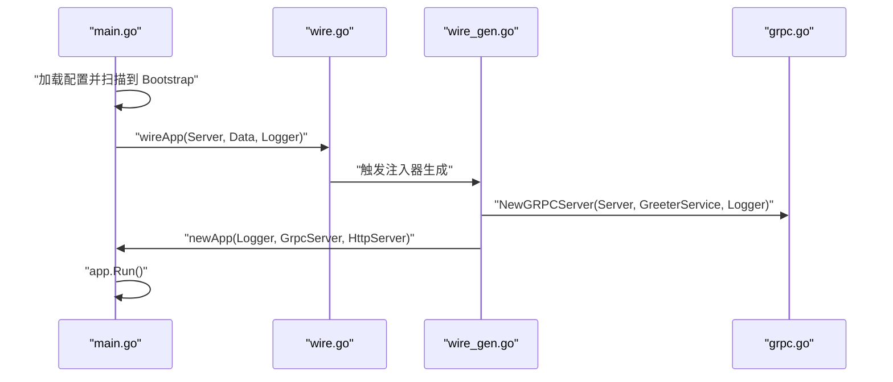
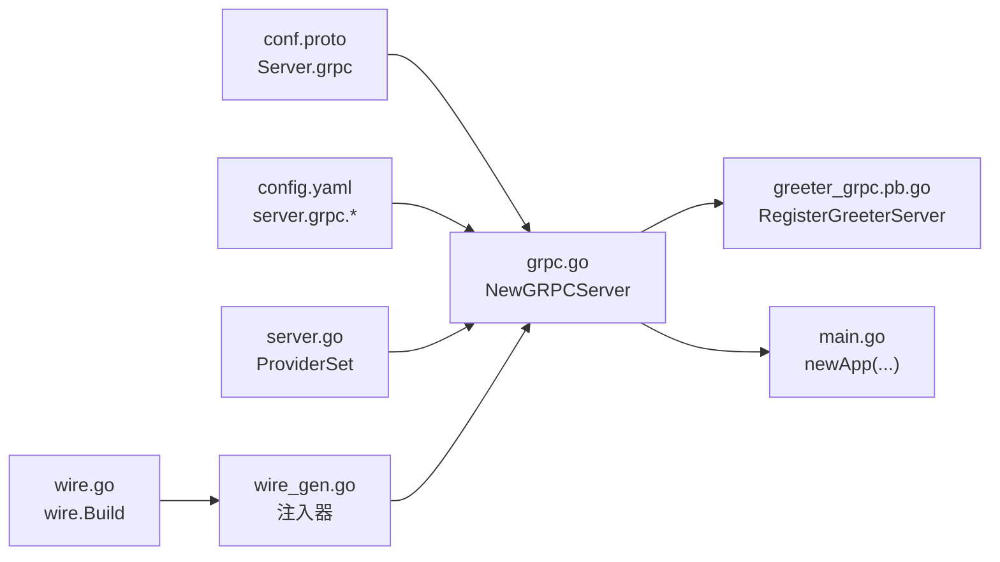

# gRPC服务器

<cite>
**本文引用的文件**
- [cmd/server/main.go](file://cmd/server/main.go)
- [cmd/server/wire.go](file://cmd/server/wire.go)
- [cmd/server/wire_gen.go](file://cmd/server/wire_gen.go)
- [internal/server/grpc.go](file://internal/server/grpc.go)
- [internal/server/server.go](file://internal/server/server.go)
- [internal/conf/conf.proto](file://internal/conf/conf.proto)
- [configs/config.yaml](file://configs/config.yaml)
- [api/helloworld/v1/greeter.proto](file://api/helloworld/v1/greeter.proto)
- [api/helloworld/v1/greeter_grpc.pb.go](file://api/helloworld/v1/greeter_grpc.pb.go)
- [internal/service/greeter.go](file://internal/service/greeter.go)
</cite>

## 目录
1. [简介](#简介)
2. [项目结构](#项目结构)
3. [核心组件](#核心组件)
4. [架构总览](#架构总览)
5. [详细组件分析](#详细组件分析)
6. [依赖关系分析](#依赖关系分析)
7. [性能考虑](#性能考虑)
8. [故障排查指南](#故障排查指南)
9. [结论](#结论)
10. [附录](#附录)

## 简介
本文件围绕 Kratos 框架下的 gRPC 服务器工厂方法 NewGRPCServer 展开，系统性阐述其如何基于配置、中间件与服务实现创建并注册 gRPC 服务器实例。文档重点覆盖：
- NewGRPCServer 的参数来源与作用：*conf.Server 用于加载 gRPC 协议配置（网络类型、监听地址、超时），*service.GreeterService 为业务服务实现的依赖注入实例，log.Logger 用于日志记录。
- opts 选项数组的构建过程：恢复中间件的注册、网络配置、监听地址与超时的条件性添加。
- grpc.NewServer(opts...) 如何应用这些选项创建服务器实例，并通过 v1.RegisterGreeterServer(srv, greeter) 将 GreeterService 注册到 gRPC 服务器。
- 结合 main.go 中的 Wire 依赖注入流程，说明 NewGRPCServer 的调用与应用启动集成。
- 在 config.yaml 中配置 gRPC 参数的示例及其与 proto 文件中 service 定义的映射关系。

## 项目结构
该项目采用 Kratos 推荐的分层与模块化组织方式，gRPC 服务器相关代码主要分布在以下位置：
- 应用入口与依赖注入：cmd/server/main.go、cmd/server/wire.go、cmd/server/wire_gen.go
- gRPC 服务器工厂：internal/server/grpc.go
- 配置模型与 YAML：internal/conf/conf.proto、configs/config.yaml
- 业务服务与注册：internal/service/greeter.go、api/helloworld/v1/greeter_grpc.pb.go
- 服务提供者集合：internal/server/server.go

图表来源
- [cmd/server/main.go](file://cmd/server/main.go#L50-L88)
- [cmd/server/wire.go](file://cmd/server/wire.go#L20-L24)
- [cmd/server/wire_gen.go](file://cmd/server/wire_gen.go#L25-L41)
- [internal/server/grpc.go](file://internal/server/grpc.go#L13-L33)
- [internal/server/server.go](file://internal/server/server.go#L7-L9)
- [internal/conf/conf.proto](file://internal/conf/conf.proto#L13-L26)
- [configs/config.yaml](file://configs/config.yaml#L1-L16)
- [internal/service/greeter.go](file://internal/service/greeter.go#L10-L30)
- [api/helloworld/v1/greeter_grpc.pb.go](file://api/helloworld/v1/greeter_grpc.pb.go#L71-L73)
- [api/helloworld/v1/greeter.proto](file://api/helloworld/v1/greeter.proto#L12-L20)

章节来源
- [cmd/server/main.go](file://cmd/server/main.go#L50-L88)
- [cmd/server/wire.go](file://cmd/server/wire.go#L20-L24)
- [cmd/server/wire_gen.go](file://cmd/server/wire_gen.go#L25-L41)
- [internal/server/grpc.go](file://internal/server/grpc.go#L13-L33)
- [internal/server/server.go](file://internal/server/server.go#L7-L9)
- [internal/conf/conf.proto](file://internal/conf/conf.proto#L13-L26)
- [configs/config.yaml](file://configs/config.yaml#L1-L16)
- [internal/service/greeter.go](file://internal/service/greeter.go#L10-L30)
- [api/helloworld/v1/greeter_grpc.pb.go](file://api/helloworld/v1/greeter_grpc.pb.go#L71-L73)
- [api/helloworld/v1/greeter.proto](file://api/helloworld/v1/greeter.proto#L12-L20)

## 核心组件
- NewGRPCServer 工厂方法：接收配置、业务服务与日志，构建并返回 gRPC 服务器实例。
- Wire 注入链路：从 main 启动加载配置，通过 wireApp 构建 GreeterService 并调用 NewGRPCServer 创建 gRPC 服务器。
- 配置模型：conf.proto 定义了 Server.grpc 字段（network、addr、timeout）；config.yaml 提供实际值。
- 业务服务：GreeterService 实现 GreeterServer 接口，SayHello 方法由 usecase 调用数据层后返回响应。
- 服务注册：使用 v1.RegisterGreeterServer 将 GreeterService 注册到 gRPC 服务器。

章节来源
- [internal/server/grpc.go](file://internal/server/grpc.go#L13-L33)
- [cmd/server/wire_gen.go](file://cmd/server/wire_gen.go#L25-L41)
- [internal/conf/conf.proto](file://internal/conf/conf.proto#L13-L26)
- [configs/config.yaml](file://configs/config.yaml#L1-L16)
- [internal/service/greeter.go](file://internal/service/greeter.go#L10-L30)
- [api/helloworld/v1/greeter_grpc.pb.go](file://api/helloworld/v1/greeter_grpc.pb.go#L71-L73)

## 架构总览
下图展示了 NewGRPCServer 在整体应用中的位置与调用关系，以及配置与业务服务如何参与其中。

图表来源
- [cmd/server/main.go](file://cmd/server/main.go#L50-L88)
- [cmd/server/wire.go](file://cmd/server/wire.go#L20-L24)
- [cmd/server/wire_gen.go](file://cmd/server/wire_gen.go#L25-L41)
- [internal/server/grpc.go](file://internal/server/grpc.go#L13-L33)
- [internal/conf/conf.proto](file://internal/conf/conf.proto#L13-L26)
- [configs/config.yaml](file://configs/config.yaml#L1-L16)
- [internal/service/greeter.go](file://internal/service/greeter.go#L10-L30)
- [api/helloworld/v1/greeter_grpc.pb.go](file://api/helloworld/v1/greeter_grpc.pb.go#L71-L73)

## 详细组件分析

### NewGRPCServer 工厂方法
- 参数说明
  - *conf.Server：承载 gRPC 配置（network、addr、timeout）。这些字段来自 conf.proto 的 Server.grpc 嵌套消息。
  - *service.GreeterService：业务服务实现，负责处理 SayHello 请求。
  - log.Logger：日志记录器，贯穿整个工厂与业务流程。
- 选项数组构建
  - 默认注册恢复中间件，确保服务异常时能安全恢复。
  - 条件性添加网络类型、监听地址与超时：
    - 若配置存在网络类型，则追加网络选项。
    - 若配置存在监听地址，则追加地址选项。
    - 若配置存在超时（非空），则追加超时选项。
- 创建与注册
  - 使用 grpc.NewServer(opts...) 应用上述选项创建 gRPC 服务器。
  - 通过 v1.RegisterGreeterServer(srv, greeter) 将 GreeterService 注册到服务器上，使其可被客户端调用。

图表来源
- [internal/server/grpc.go](file://internal/server/grpc.go#L13-L33)

章节来源
- [internal/server/grpc.go](file://internal/server/grpc.go#L13-L33)

### 配置模型与 YAML 映射
- 配置结构
  - conf.proto 定义了 Server.grpc 字段，包含 network、addr、timeout 三个子字段。
- YAML 示例
  - config.yaml 提供了 grpc.addr 与 grpc.timeout 的示例值，分别对应监听地址与请求超时。
- 映射关系
  - YAML 中的 server.grpc.addr 对应 conf.proto 中 Server.grpc.addr。
  - YAML 中的 server.grpc.timeout 对应 conf.proto 中 Server.grpc.timeout（以秒为单位，内部转换为 Duration）。

章节来源
- [internal/conf/conf.proto](file://internal/conf/conf.proto#L13-L26)
- [configs/config.yaml](file://configs/config.yaml#L1-L16)

### 业务服务与服务注册
- GreeterService
  - 实现 GreeterServer 接口，SayHello 方法委托 usecase 执行业务逻辑，并返回响应。
- 服务注册
  - 通过 v1.RegisterGreeterServer(srv, greeter) 将 GreeterService 注册到 gRPC 服务器，使客户端可通过 proto 中定义的 service Greeter 的 SayHello 方法访问。

图表来源
- [internal/service/greeter.go](file://internal/service/greeter.go#L10-L30)
- [api/helloworld/v1/greeter_grpc.pb.go](file://api/helloworld/v1/greeter_grpc.pb.go#L71-L73)

章节来源
- [internal/service/greeter.go](file://internal/service/greeter.go#L10-L30)
- [api/helloworld/v1/greeter_grpc.pb.go](file://api/helloworld/v1/greeter_grpc.pb.go#L71-L73)

### Wire 依赖注入与应用启动
- Wire 注入链路
  - main.go 加载配置并扫描到 Bootstrap，随后调用 wireApp(Server, Data, Logger)。
  - wire.go 中的 panic(wire.Build(...)) 触发注入器生成，最终在 wire_gen.go 中完成依赖装配。
  - 注入器会先构造 GreeterService，再调用 NewGRPCServer(Server, GreeterService, Logger) 创建 gRPC 服务器。
- 应用启动
  - 注入器返回 *kratos.App，main.go 调用 app.Run() 启动应用，此时 gRPC 服务器已就绪。

图表来源
- [cmd/server/main.go](file://cmd/server/main.go#L50-L88)
- [cmd/server/wire.go](file://cmd/server/wire.go#L20-L24)
- [cmd/server/wire_gen.go](file://cmd/server/wire_gen.go#L25-L41)
- [internal/server/grpc.go](file://internal/server/grpc.go#L13-L33)

章节来源
- [cmd/server/main.go](file://cmd/server/main.go#L50-L88)
- [cmd/server/wire.go](file://cmd/server/wire.go#L20-L24)
- [cmd/server/wire_gen.go](file://cmd/server/wire_gen.go#L25-L41)
- [internal/server/grpc.go](file://internal/server/grpc.go#L13-L33)

### proto 与 gRPC 服务映射
- service Greeter 定义
  - proto 文件定义了 service Greeter 及其 SayHello 方法，客户端通过该方法发起请求。
- 服务实现与注册
  - GreeterService 实现 GreeterServer 接口，SayHello 方法处理请求。
  - RegisterGreeterServer 将 GreeterService 注册到 gRPC 服务器，使客户端可调用 SayHello。
- HTTP 注解
  - proto 中还定义了 google.api.http 注解，用于将同一业务映射到 HTTP 接口（与 gRPC 并存）。

章节来源
- [api/helloworld/v1/greeter.proto](file://api/helloworld/v1/greeter.proto#L12-L20)
- [internal/service/greeter.go](file://internal/service/greeter.go#L10-L30)
- [api/helloworld/v1/greeter_grpc.pb.go](file://api/helloworld/v1/greeter_grpc.pb.go#L71-L73)

## 依赖关系分析
- 组件耦合
  - NewGRPCServer 依赖 conf.Server（配置）、service.GreeterService（业务实现）、log.Logger（日志）。
  - 通过 v1.RegisterGreeterServer 将 GreeterService 与 gRPC 服务器绑定。
- ProviderSet
  - internal/server/server.go 中的 ProviderSet 将 NewGRPCServer 与其他服务器工厂一起提供给 Wire 注入。
- 注入器生成
  - wire_gen.go 中的注入器按依赖顺序构造 GreeterService，再调用 NewGRPCServer 创建 gRPC 服务器。

图表来源
- [internal/conf/conf.proto](file://internal/conf/conf.proto#L13-L26)
- [configs/config.yaml](file://configs/config.yaml#L1-L16)
- [internal/server/grpc.go](file://internal/server/grpc.go#L13-L33)
- [api/helloworld/v1/greeter_grpc.pb.go](file://api/helloworld/v1/greeter_grpc.pb.go#L71-L73)
- [cmd/server/main.go](file://cmd/server/main.go#L36-L48)
- [internal/server/server.go](file://internal/server/server.go#L7-L9)
- [cmd/server/wire.go](file://cmd/server/wire.go#L20-L24)
- [cmd/server/wire_gen.go](file://cmd/server/wire_gen.go#L25-L41)

章节来源
- [internal/server/server.go](file://internal/server/server.go#L7-L9)
- [cmd/server/wire.go](file://cmd/server/wire.go#L20-L24)
- [cmd/server/wire_gen.go](file://cmd/server/wire_gen.go#L25-L41)
- [internal/server/grpc.go](file://internal/server/grpc.go#L13-L33)

## 性能考虑
- 中间件开销：恢复中间件对异常进行捕获与恢复，建议在生产环境保持开启，避免异常导致进程崩溃。
- 超时控制：合理设置 grpc.timeout，避免请求长时间占用资源；同时结合业务侧重试策略。
- 网络与地址：根据部署环境选择合适的 network 与 addr，避免不必要的网络层开销。
- 日志级别：在高并发场景下，适当降低日志级别或采样，减少 I/O 压力。

## 故障排查指南
- 无法启动 gRPC 服务器
  - 检查 config.yaml 中 server.grpc.addr 是否冲突或不可绑定。
  - 确认 NewGRPCServer 是否正确读取 conf.Server.grpc 并追加网络、地址、超时选项。
- 服务未注册
  - 确认 v1.RegisterGreeterServer(srv, greeter) 是否被调用。
  - 检查 GreeterService 是否实现了 GreeterServer 接口。
- 注入失败
  - 确认 wire_gen.go 中 GreeterService 的构造链路完整，且 NewGRPCServer 被调用。
  - 检查 ProviderSet 是否包含 NewGRPCServer。

章节来源
- [internal/server/grpc.go](file://internal/server/grpc.go#L13-L33)
- [cmd/server/wire_gen.go](file://cmd/server/wire_gen.go#L25-L41)
- [api/helloworld/v1/greeter_grpc.pb.go](file://api/helloworld/v1/greeter_grpc.pb.go#L71-L73)

## 结论
NewGRPCServer 通过统一的配置驱动与中间件机制，将业务服务 GreeterService 注册到 gRPC 服务器上，并与 Wire 依赖注入流程无缝集成。借助 conf.proto 与 config.yaml 的清晰映射，开发者可以灵活地调整网络、地址与超时等参数，满足不同运行环境的需求。同时，GreeterService 的实现与 proto 定义保持一致，保证了 gRPC 与 HTTP 的一致性体验。

## 附录
- 配置示例（来自 config.yaml）
  - server.grpc.addr：监听地址
  - server.grpc.timeout：请求超时
- proto 映射要点
  - service Greeter 的 SayHello 方法与 GreeterService.SayHello 对应。
  - RegisterGreeterServer 将 GreeterService 注册到 gRPC 服务器。

章节来源
- [configs/config.yaml](file://configs/config.yaml#L1-L16)
- [api/helloworld/v1/greeter.proto](file://api/helloworld/v1/greeter.proto#L12-L20)
- [api/helloworld/v1/greeter_grpc.pb.go](file://api/helloworld/v1/greeter_grpc.pb.go#L71-L73)