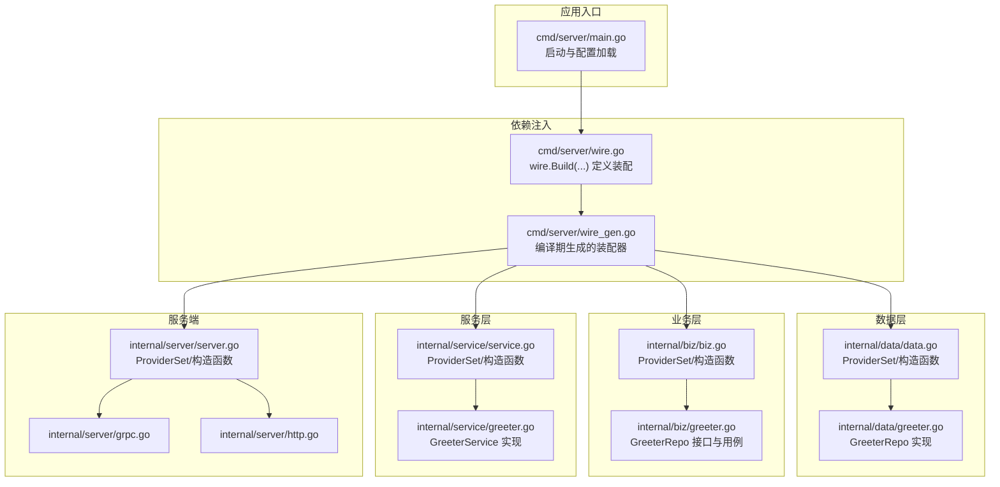
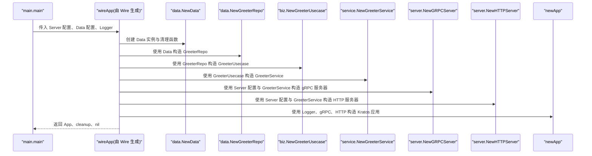
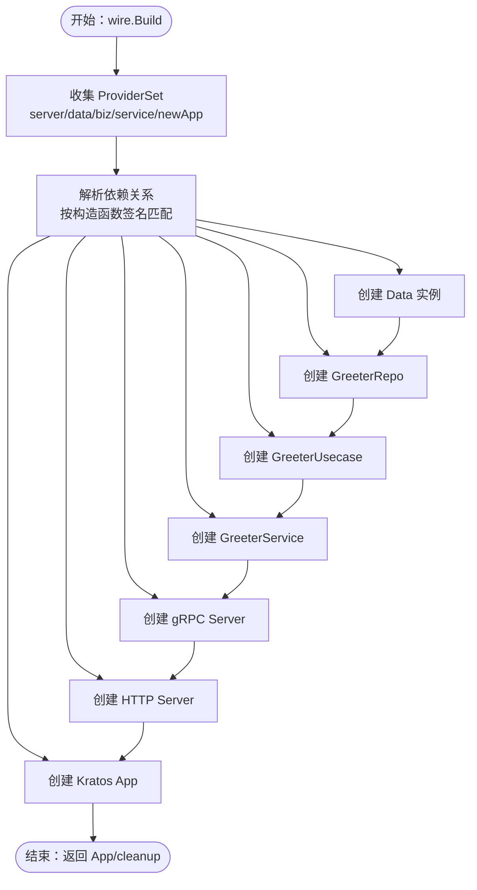
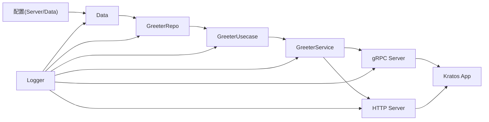

# 依赖注入配置

<cite>
**本文引用的文件**
- [cmd/server/wire.go](file://cmd/server/wire.go)
- [cmd/server/wire_gen.go](file://cmd/server/wire_gen.go)
- [cmd/server/main.go](file://cmd/server/main.go)
- [internal/data/data.go](file://internal/data/data.go)
- [internal/data/greeter.go](file://internal/data/greeter.go)
- [internal/biz/biz.go](file://internal/biz/biz.go)
- [internal/biz/greeter.go](file://internal/biz/greeter.go)
- [internal/service/service.go](file://internal/service/service.go)
- [internal/service/greeter.go](file://internal/service/greeter.go)
- [internal/server/server.go](file://internal/server/server.go)
- [internal/server/grpc.go](file://internal/server/grpc.go)
- [internal/server/http.go](file://internal/server/http.go)
- [go.mod](file://go.mod)
</cite>

## 目录
1. [引言](#引言)
2. [项目结构](#项目结构)
3. [核心组件](#核心组件)
4. [架构总览](#架构总览)
5. [详细组件分析](#详细组件分析)
6. [依赖关系分析](#依赖关系分析)
7. [性能考虑](#性能考虑)
8. [故障排查指南](#故障排查指南)
9. [结论](#结论)
10. [附录](#附录)

## 引言
本文件围绕基于 Google Wire 的编译期依赖注入机制进行深入解析，重点说明以下内容：
- 在 wire.go 中通过 wire.Build(server.ProviderSet, data.ProviderSet, biz.ProviderSet, service.ProviderSet, newApp) 组织 ProviderSet 的方式与依赖链构建逻辑；
- wire_gen.go 的生成原理及其在构建时自动解析依赖关系的作用；
- build tag（//go:build wireinject）如何控制文件在开发与生产环境中的不同行为；
- 如何向 ProviderSet 添加新服务组件的实践指导，包括接口绑定、构造函数声明与生成代码更新流程，并结合 wireApp 函数签名说明参数传递与返回值设计。

## 项目结构
该项目采用 Kratos 框架布局，按领域分层组织代码，依赖注入通过 Google Wire 在编译期生成装配器函数，入口位于 cmd/server/main.go，依赖装配由 cmd/server/wire.go 定义，生成文件为 cmd/server/wire_gen.go。

图表来源
- [cmd/server/main.go](file://cmd/server/main.go#L50-L88)
- [cmd/server/wire.go](file://cmd/server/wire.go#L20-L23)
- [cmd/server/wire_gen.go](file://cmd/server/wire_gen.go#L25-L40)
- [internal/data/data.go](file://internal/data/data.go#L10-L12)
- [internal/data/greeter.go](file://internal/data/greeter.go#L16-L22)
- [internal/biz/biz.go](file://internal/biz/biz.go#L5-L6)
- [internal/biz/greeter.go](file://internal/biz/greeter.go#L23-L40)
- [internal/service/service.go](file://internal/service/service.go#L5-L6)
- [internal/service/greeter.go](file://internal/service/greeter.go#L17-L20)
- [internal/server/server.go](file://internal/server/server.go#L6-L8)
- [internal/server/grpc.go](file://internal/server/grpc.go#L13-L32)
- [internal/server/http.go](file://internal/server/http.go#L13-L32)

章节来源
- [cmd/server/main.go](file://cmd/server/main.go#L50-L88)
- [cmd/server/wire.go](file://cmd/server/wire.go#L20-L23)
- [cmd/server/wire_gen.go](file://cmd/server/wire_gen.go#L25-L40)

## 核心组件
- wire.go：定义 wireApp 装配函数，使用 wire.Build 将各层 ProviderSet 与 newApp 组合，形成完整的应用装配入口。
- wire_gen.go：编译期生成的装配器函数，包含从配置到 Kratos 应用的完整依赖链调用序列。
- 各 ProviderSet：分别在 data、biz、service、server 层定义，暴露构造函数供 Wire 解析依赖。
- newApp：应用构造函数，接收日志、gRPC 与 HTTP 服务器，返回 Kratos 应用实例。

章节来源
- [cmd/server/wire.go](file://cmd/server/wire.go#L20-L23)
- [cmd/server/wire_gen.go](file://cmd/server/wire_gen.go#L25-L40)
- [internal/data/data.go](file://internal/data/data.go#L10-L12)
- [internal/biz/biz.go](file://internal/biz/biz.go#L5-L6)
- [internal/service/service.go](file://internal/service/service.go#L5-L6)
- [internal/server/server.go](file://internal/server/server.go#L6-L8)
- [cmd/server/main.go](file://cmd/server/main.go#L36-L48)

## 架构总览
下图展示 wireApp 的装配流程：从配置与日志开始，逐步创建数据层、业务层、服务层与服务端组件，最终组装为 Kratos 应用。

图表来源
- [cmd/server/wire_gen.go](file://cmd/server/wire_gen.go#L25-L40)
- [cmd/server/main.go](file://cmd/server/main.go#L77-L81)

章节来源
- [cmd/server/wire_gen.go](file://cmd/server/wire_gen.go#L25-L40)
- [cmd/server/main.go](file://cmd/server/main.go#L77-L81)

## 详细组件分析

### wire.Build 与 ProviderSet 组织逻辑
- wire.Build(server.ProviderSet, data.ProviderSet, biz.ProviderSet, service.ProviderSet, newApp) 将四个层次的 ProviderSet 与 newApp 作为“根节点”输入给 Wire，Wire 基于这些构造函数的签名与依赖关系自动生成装配器函数。
- 各 ProviderSet 的职责：
  - data.ProviderSet：提供数据层基础设施（如数据库包装、仓库实现）的构造函数。
  - biz.ProviderSet：提供业务用例对象的构造函数，依赖数据层接口。
  - service.ProviderSet：提供服务层对象的构造函数，依赖业务用例。
  - server.ProviderSet：提供 gRPC/HTTP 服务器对象的构造函数，依赖服务层对象与配置。
  - newApp：最终将服务器与日志等整合为 Kratos 应用。

图表来源
- [cmd/server/wire.go](file://cmd/server/wire.go#L20-L23)
- [internal/server/server.go](file://internal/server/server.go#L6-L8)
- [internal/data/data.go](file://internal/data/data.go#L10-L12)
- [internal/biz/biz.go](file://internal/biz/biz.go#L5-L6)
- [internal/service/service.go](file://internal/service/service.go#L5-L6)

章节来源
- [cmd/server/wire.go](file://cmd/server/wire.go#L20-L23)

### wire_gen.go 的生成原理与作用
- 编译期生成：wire_gen.go 由 Wire 工具在未启用 wireinject 构建标签时生成，其中包含 wireApp 的完整实现，按依赖顺序依次调用各构造函数，确保依赖满足且生命周期可管理。
- 生命周期管理：生成的 wireApp 返回一个 cleanup 函数，用于释放数据层资源（例如关闭数据库连接），main.main 在 defer 中调用该函数保证资源回收。
- 生成注释与构建标签：文件顶部包含生成注释与 //go:build !wireinject 标签，确保在正常构建时不包含生成的桩代码，仅在 wireinject 构建场景下使用 wire.go 的桩函数。

章节来源
- [cmd/server/wire_gen.go](file://cmd/server/wire_gen.go#L1-L40)

### build tag（//go:build wireinject）的行为控制
- wireinject 构建标签：当启用 wireinject 标签时，wire.go 中的桩函数生效，wire.Build 触发 Wire 的依赖解析与 panic 触发生成器；否则 wire_gen.go 生效，直接使用生成的装配器。
- 开发与生产环境差异：
  - 开发环境：通常使用 wireinject 标签，便于在修改 ProviderSet 或构造函数后触发重新生成。
  - 生产环境：默认不带 wireinject 标签，使用已生成的 wire_gen.go，避免引入 Wire 生成器依赖，提升构建确定性与安全性。

章节来源
- [cmd/server/wire.go](file://cmd/server/wire.go#L1-L5)
- [cmd/server/wire_gen.go](file://cmd/server/wire_gen.go#L3-L6)

### wireApp 函数签名与参数、返回值设计
- 参数：wireApp 接收 Server 配置、Data 配置与日志记录器，作为装配的外部输入。
- 返回值：返回 Kratos 应用、清理函数与错误。清理函数负责释放数据层资源，main.main 在 defer 中调用以确保资源释放。
- newApp 设计：newApp 将 gRPC 与 HTTP 服务器注册到 Kratos 应用中，统一对外提供服务。

章节来源
- [cmd/server/wire.go](file://cmd/server/wire.go#L20-L23)
- [cmd/server/wire_gen.go](file://cmd/server/wire_gen.go#L25-L40)
- [cmd/server/main.go](file://cmd/server/main.go#L36-L48)

### 数据层 ProviderSet（data）
- ProviderSet：包含 NewData 与 NewGreeterRepo，分别负责创建数据基础设施与仓库实现。
- NewData：接收 Data 配置与日志器，返回 Data 实例与清理函数。
- NewGreeterRepo：接收 Data 实例与日志器，返回 GreeterRepo 接口实现。

章节来源
- [internal/data/data.go](file://internal/data/data.go#L10-L12)
- [internal/data/data.go](file://internal/data/data.go#L18-L24)
- [internal/data/greeter.go](file://internal/data/greeter.go#L16-L22)

### 业务层 ProviderSet（biz）
- ProviderSet：包含 NewGreeterUsecase，依赖 GreeterRepo 接口。
- GreeterRepo 接口：定义仓库操作方法集合，便于替换实现与测试。
- GreeterUsecase：封装业务逻辑，通过日志助手输出信息。

章节来源
- [internal/biz/biz.go](file://internal/biz/biz.go#L5-L6)
- [internal/biz/greeter.go](file://internal/biz/greeter.go#L23-L40)

### 服务层 ProviderSet（service）
- ProviderSet：包含 NewGreeterService，依赖 GreeterUsecase。
- GreeterService：实现 API 服务接口，调用业务用例完成请求处理。

章节来源
- [internal/service/service.go](file://internal/service/service.go#L5-L6)
- [internal/service/greeter.go](file://internal/service/greeter.go#L17-L20)

### 服务端 ProviderSet（server）
- ProviderSet：包含 NewGRPCServer 与 NewHTTPServer，依赖 Server 配置与 GreeterService。
- gRPC/HTTP 服务器：根据配置设置网络、地址与超时等选项，并注册服务实现。

章节来源
- [internal/server/server.go](file://internal/server/server.go#L6-L8)
- [internal/server/grpc.go](file://internal/server/grpc.go#L13-L32)
- [internal/server/http.go](file://internal/server/http.go#L13-L32)

## 依赖关系分析
- 依赖方向：配置与日志向下驱动数据层，数据层向上提供仓库接口，业务层依赖仓库接口，服务层依赖业务层，服务端层依赖服务层与配置。
- 依赖耦合：通过接口（GreeterRepo）降低耦合，便于替换实现与单元测试。
- 生命周期：数据层提供清理函数，由 wireApp 返回并在 main.main 中统一释放。

图表来源
- [cmd/server/wire_gen.go](file://cmd/server/wire_gen.go#L25-L40)
- [internal/data/data.go](file://internal/data/data.go#L18-L24)
- [internal/data/greeter.go](file://internal/data/greeter.go#L16-L22)
- [internal/biz/greeter.go](file://internal/biz/greeter.go#L23-L40)
- [internal/service/greeter.go](file://internal/service/greeter.go#L17-L20)
- [internal/server/grpc.go](file://internal/server/grpc.go#L13-L32)
- [internal/server/http.go](file://internal/server/http.go#L13-L32)

章节来源
- [cmd/server/wire_gen.go](file://cmd/server/wire_gen.go#L25-L40)

## 性能考虑
- 编译期生成装配器：Wire 在编译期解析依赖并生成装配器，运行时无需反射或动态查找，具备零开销的依赖注入特性。
- 资源释放：通过返回的清理函数集中释放资源，避免内存泄漏与连接泄露。
- 构造函数幂等性：建议构造函数保持幂等与无副作用，确保多次调用不会产生意外状态。

## 故障排查指南
- 生成失败或未生成：
  - 确认启用 wireinject 构建标签以触发生成器。
  - 检查 wire.go 中 wire.Build 的 ProviderSet 是否齐全且构造函数签名正确。
- 依赖解析错误：
  - 确保各层构造函数的参数类型与返回类型与上游依赖一致。
  - 检查接口绑定是否正确（如 GreeterRepo）。
- 运行时崩溃：
  - 检查 wire_gen.go 是否存在未处理的错误分支。
  - 确认 main.main 正确调用 wireApp 并在 defer 中执行 cleanup。
- 版本与依赖：
  - 确认 go.mod 中 Wire 与 Kratos 版本兼容。

章节来源
- [cmd/server/wire.go](file://cmd/server/wire.go#L20-L23)
- [cmd/server/wire_gen.go](file://cmd/server/wire_gen.go#L25-L40)
- [cmd/server/main.go](file://cmd/server/main.go#L77-L81)
- [go.mod](file://go.mod#L7-L14)

## 结论
本项目通过 Google Wire 在编译期完成依赖注入装配，利用 ProviderSet 将数据层、业务层、服务层与服务端组件有机串联，形成清晰的依赖链与可维护的架构。build tag 控制了开发与生产环境的不同行为，wire_gen.go 提供了高性能、零反射的运行时装配实现。遵循本文的实践指导，可以安全地扩展新的服务组件并保持依赖关系的稳定性。

## 附录

### 向 ProviderSet 添加新服务组件的实践步骤
- 定义接口与实现：
  - 在对应层定义接口（如仓库接口），并在实现文件中提供构造函数。
- 注册到 ProviderSet：
  - 在该层的 data.go/biz.go/service.go/server.go 中，将新构造函数加入 ProviderSet。
- 更新 wire.Build：
  - 在 wire.go 中将新增的 ProviderSet 加入 wire.Build，确保依赖解析顺序正确。
- 生成与验证：
  - 使用 wireinject 构建标签触发生成器，检查 wire_gen.go 是否包含新组件的装配逻辑。
  - 运行程序验证依赖链是否完整，资源释放是否正常。

章节来源
- [internal/data/data.go](file://internal/data/data.go#L10-L12)
- [internal/biz/biz.go](file://internal/biz/biz.go#L5-L6)
- [internal/service/service.go](file://internal/service/service.go#L5-L6)
- [internal/server/server.go](file://internal/server/server.go#L6-L8)
- [cmd/server/wire.go](file://cmd/server/wire.go#L20-L23)
- [cmd/server/wire_gen.go](file://cmd/server/wire_gen.go#L25-L40)