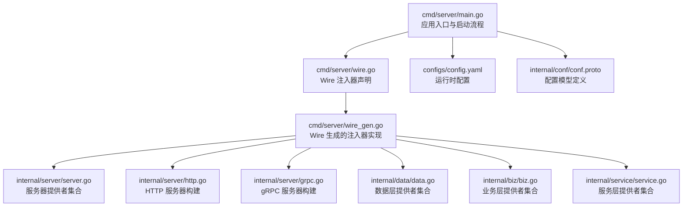
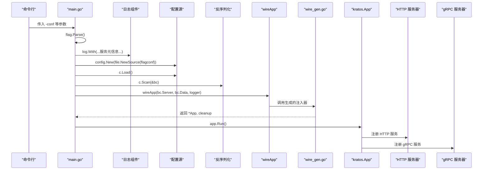
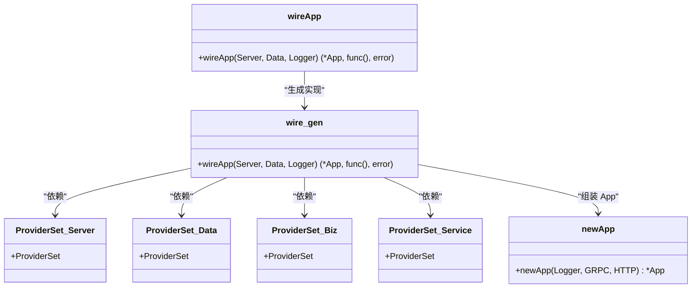
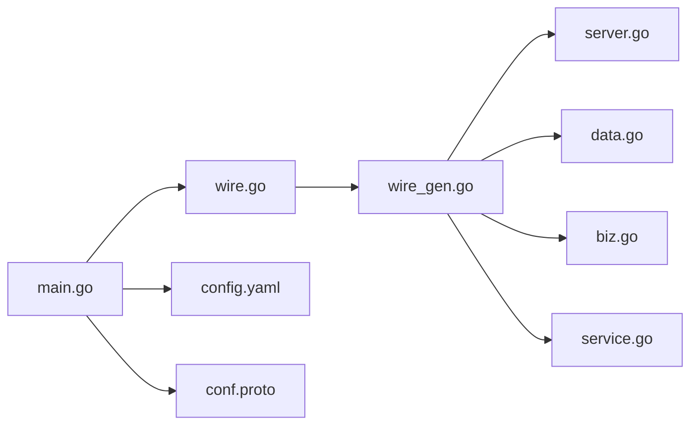

# 应用初始化流程

<cite>
**本文引用的文件**
- [cmd/server/main.go](file://cmd/server/main.go)
- [cmd/server/wire.go](file://cmd/server/wire.go)
- [cmd/server/wire_gen.go](file://cmd/server/wire_gen.go)
- [configs/config.yaml](file://configs/config.yaml)
- [internal/conf/conf.proto](file://internal/conf/conf.proto)
- [internal/server/server.go](file://internal/server/server.go)
- [internal/server/http.go](file://internal/server/http.go)
- [internal/server/grpc.go](file://internal/server/grpc.go)
- [internal/data/data.go](file://internal/data/data.go)
- [internal/data/greeter.go](file://internal/data/greeter.go)
- [internal/biz/biz.go](file://internal/biz/biz.go)
- [internal/biz/greeter.go](file://internal/biz/greeter.go)
- [internal/service/service.go](file://internal/service/service.go)
- [internal/service/greeter.go](file://internal/service/greeter.go)
</cite>

## 目录
1. [引言](#引言)
2. [项目结构](#项目结构)
3. [核心组件](#核心组件)
4. [架构总览](#架构总览)
5. [详细组件分析](#详细组件分析)
6. [依赖关系分析](#依赖关系分析)
7. [性能考虑](#性能考虑)
8. [故障排查指南](#故障排查指南)
9. [结论](#结论)

## 引言
本节聚焦 Kratos 应用启动流程，从命令行参数解析开始，逐步展开到日志上下文注入、配置加载与反序列化、依赖注入容器的构建，最终通过 Kratos App 启动并监听系统信号。文档将重点解释：
- 配置文件路径的默认值与可配置性
- 日志上下文中服务元信息（ID、名称、版本）的注入方式
- 初始化阶段 panic 错误处理机制的合理性
- Kratos 框架的 App 生命周期管理

## 项目结构
该仓库采用 Kratos 官方布局，入口位于 cmd/server/main.go，配置定义于 configs/config.yaml，并通过 internal/conf/conf.proto 描述配置模型。依赖注入使用 Google Wire，在 cmd/server/wire.go 中声明注入器，在生成文件 cmd/server/wire_gen.go 中提供具体实现。

图表来源
- [cmd/server/main.go](file://cmd/server/main.go#L1-L88)
- [cmd/server/wire.go](file://cmd/server/wire.go#L1-L24)
- [cmd/server/wire_gen.go](file://cmd/server/wire_gen.go#L1-L41)
- [configs/config.yaml](file://configs/config.yaml#L1-L16)
- [internal/conf/conf.proto](file://internal/conf/conf.proto#L1-L42)
- [internal/server/server.go](file://internal/server/server.go#L1-L9)
- [internal/server/http.go](file://internal/server/http.go#L1-L33)
- [internal/server/grpc.go](file://internal/server/grpc.go#L1-L33)
- [internal/data/data.go](file://internal/data/data.go#L1-L25)
- [internal/biz/biz.go](file://internal/biz/biz.go#L1-L7)
- [internal/service/service.go](file://internal/service/service.go#L1-L7)

章节来源
- [cmd/server/main.go](file://cmd/server/main.go#L1-L88)
- [configs/config.yaml](file://configs/config.yaml#L1-L16)
- [internal/conf/conf.proto](file://internal/conf/conf.proto#L1-L42)

## 核心组件
- 命令行参数与版本标识：通过 flag 定义 -conf 参数，默认值为 ../../configs；同时通过编译期 ldflags 注入 Name 与 Version。
- 配置加载与反序列化：使用 Kratos 配置源 file.NewSource(flagconf) 加载 YAML，再通过 c.Scan(&bc) 反序列化到 conf.Bootstrap 结构体。
- 日志上下文注入：通过 log.With 将时间戳、调用者、服务元信息（ID、名称、版本）、链路追踪 ID 等键值注入日志上下文。
- 依赖注入容器：通过 wireApp(bc.Server, bc.Data, logger) 构建 App，内部完成数据层、业务层、服务层与服务器的装配。
- App 生命周期：newApp(...) 创建 Kratos App 并注册 gRPC/HTTP 服务器，随后 app.Run() 启动并等待系统信号。

章节来源
- [cmd/server/main.go](file://cmd/server/main.go#L20-L88)
- [cmd/server/wire.go](file://cmd/server/wire.go#L1-L24)
- [cmd/server/wire_gen.go](file://cmd/server/wire_gen.go#L1-L41)
- [internal/conf/conf.proto](file://internal/conf/conf.proto#L1-L42)

## 架构总览
下图展示从 main 函数到 Kratos App 的完整启动链路，包括配置加载、依赖注入与服务器注册。

图表来源
- [cmd/server/main.go](file://cmd/server/main.go#L50-L88)
- [cmd/server/wire.go](file://cmd/server/wire.go#L1-L24)
- [cmd/server/wire_gen.go](file://cmd/server/wire_gen.go#L1-L41)

## 详细组件分析

### 命令行参数与版本标识
- 默认配置路径：通过 flag.StringVar 绑定 -conf 参数，默认值为 ../../configs，可在启动时覆盖。
- 版本与名称：通过编译期 ldflags 注入 Name 与 Version，用于日志上下文与 App 元信息。
- 主机 ID：通过 os.Hostname() 获取服务 ID，作为日志上下文键 service.id 的值。

章节来源
- [cmd/server/main.go](file://cmd/server/main.go#L20-L40)

### 配置加载与反序列化
- 配置源：使用 file.NewSource(flagconf) 指向配置目录，Kratos 会读取该目录下的配置文件（如 config.yaml）。
- 加载与关闭：c.Load() 后需在函数退出前调用 c.Close() 进行资源释放。
- 反序列化：c.Scan(&bc) 将配置映射到 conf.Bootstrap 结构体，其中包含 Server 与 Data 两部分，分别对应 HTTP/gRPC 与数据库/Redis 等配置。

章节来源
- [cmd/server/main.go](file://cmd/server/main.go#L61-L75)
- [configs/config.yaml](file://configs/config.yaml#L1-L16)
- [internal/conf/conf.proto](file://internal/conf/conf.proto#L1-L42)

### 日志上下文注入
- 注入内容：时间戳、调用者、服务 ID、服务名称、服务版本、链路追踪 ID。
- 使用场景：贯穿整个应用生命周期，便于定位问题与审计。

章节来源
- [cmd/server/main.go](file://cmd/server/main.go#L50-L60)

### 依赖注入容器与 App 构建
- 注入器声明：在 wire.go 中定义 wireApp，使用 wire.Build 聚合各模块 ProviderSet，并以 newApp 组装 Kratos App。
- 生成实现：wire_gen.go 中生成 wireApp 的具体实现，按顺序创建数据层、业务层、服务层与服务器，最终返回 App 与清理函数。
- 服务器注册：newApp(...) 将 gRPC 与 HTTP 服务器注册到 App，供后续 app.Run() 启动。

图表来源
- [cmd/server/wire.go](file://cmd/server/wire.go#L1-L24)
- [cmd/server/wire_gen.go](file://cmd/server/wire_gen.go#L1-L41)
- [internal/server/server.go](file://internal/server/server.go#L1-L9)
- [internal/data/data.go](file://internal/data/data.go#L1-L25)
- [internal/biz/biz.go](file://internal/biz/biz.go#L1-L7)
- [internal/service/service.go](file://internal/service/service.go#L1-L7)

章节来源
- [cmd/server/wire.go](file://cmd/server/wire.go#L1-L24)
- [cmd/server/wire_gen.go](file://cmd/server/wire_gen.go#L1-L41)
- [cmd/server/main.go](file://cmd/server/main.go#L36-L48)

### 服务器配置与中间件
- HTTP 服务器：根据 conf.Server.Http 配置网络、地址与超时，注册 Greeter HTTP 服务，启用 recovery 中间件。
- gRPC 服务器：根据 conf.Server.Grpc 配置网络、地址与超时，注册 Greeter 服务，启用 recovery 中间件。
- 两者均通过 wire 注入器在 wire_gen.go 中被创建并交由 newApp 注册到 App。

章节来源
- [internal/server/http.go](file://internal/server/http.go#L1-L33)
- [internal/server/grpc.go](file://internal/server/grpc.go#L1-L33)
- [cmd/server/wire_gen.go](file://cmd/server/wire_gen.go#L1-L41)

### 数据层与业务层装配
- 数据层：NewData 接收 conf.Data 并返回 Data 实例，提供清理函数；GreeterRepo 依赖 Data。
- 业务层：NewGreeterUsecase 接收 GreeterRepo，封装业务逻辑。
- 服务层：NewGreeterService 接收业务用例，实现 API 层接口。

章节来源
- [internal/data/data.go](file://internal/data/data.go#L1-L25)
- [internal/data/greeter.go](file://internal/data/greeter.go#L1-L43)
- [internal/biz/biz.go](file://internal/biz/biz.go#L1-L7)
- [internal/biz/greeter.go](file://internal/biz/greeter.go#L1-L47)
- [internal/service/service.go](file://internal/service/service.go#L1-L7)
- [internal/service/greeter.go](file://internal/service/greeter.go#L1-L30)

### Kratos App 生命周期管理
- 创建：newApp(...) 构造 Kratos App，注入 ID、Name、Version、Metadata、Logger 与多个 Server。
- 启动：app.Run() 启动所有注册的服务器并监听系统信号，等待优雅停机。
- 清理：wireApp 返回的清理函数会在 main 退出时执行，确保资源回收。

章节来源
- [cmd/server/main.go](file://cmd/server/main.go#L36-L48)
- [cmd/server/main.go](file://cmd/server/main.go#L83-L87)
- [cmd/server/wire_gen.go](file://cmd/server/wire_gen.go#L1-L41)

## 依赖关系分析
- main.go 依赖配置源与日志组件，负责启动流程编排。
- wire.go/wire_gen.go 依赖 internal/* 下的 ProviderSet，完成跨层装配。
- 服务器层依赖服务层，服务层依赖业务层，业务层依赖数据层。
- 配置模型 conf.Bootstrap 由 conf.proto 定义，main.go 通过 c.Scan 反序列化到该结构体。

图表来源
- [cmd/server/main.go](file://cmd/server/main.go#L1-L88)
- [cmd/server/wire.go](file://cmd/server/wire.go#L1-L24)
- [cmd/server/wire_gen.go](file://cmd/server/wire_gen.go#L1-L41)
- [internal/server/server.go](file://internal/server/server.go#L1-L9)
- [internal/data/data.go](file://internal/data/data.go#L1-L25)
- [internal/biz/biz.go](file://internal/biz/biz.go#L1-L7)
- [internal/service/service.go](file://internal/service/service.go#L1-L7)
- [configs/config.yaml](file://configs/config.yaml#L1-L16)
- [internal/conf/conf.proto](file://internal/conf/conf.proto#L1-L42)

章节来源
- [cmd/server/main.go](file://cmd/server/main.go#L1-L88)
- [cmd/server/wire.go](file://cmd/server/wire.go#L1-L24)
- [cmd/server/wire_gen.go](file://cmd/server/wire_gen.go#L1-L41)

## 性能考虑
- 配置加载：建议将配置文件放置在本地磁盘或挂载卷中，避免频繁 IO；必要时可引入缓存策略减少重复解析。
- 日志上下文：仅注入必要字段，避免过度键值导致日志体积膨胀。
- 服务器超时：合理设置 HTTP/gRPC 超时，防止慢请求阻塞线程池。
- 中间件：recovery 中间件有助于快速暴露异常，但应配合熔断与限流策略使用。

## 故障排查指南
- 配置路径无效：检查 -conf 是否指向正确的配置目录；确认 config.yaml 存在且格式正确。
- 反序列化失败：核对 conf.Bootstrap 字段与 config.yaml 结构一致；注意类型匹配（如字符串、Duration）。
- 注入失败：确认 wire.Build 聚合的 ProviderSet 正确无遗漏；检查构造函数签名与依赖类型。
- App 启动失败：查看 app.Run() 返回的错误；检查端口占用与权限问题。
- 日志缺失：确认 log.With 已正确注入服务元信息；检查日志输出目标是否可达。

章节来源
- [cmd/server/main.go](file://cmd/server/main.go#L61-L87)
- [cmd/server/wire.go](file://cmd/server/wire.go#L1-L24)
- [cmd/server/wire_gen.go](file://cmd/server/wire_gen.go#L1-L41)
- [configs/config.yaml](file://configs/config.yaml#L1-L16)
- [internal/conf/conf.proto](file://internal/conf/conf.proto#L1-L42)

## 结论
本文从命令行参数解析出发，梳理了 Kratos 应用的启动流程：配置加载与反序列化、日志上下文注入、依赖注入容器构建、App 生命周期管理与服务器注册。默认配置路径 ../../configs 可通过 -conf 覆盖；服务元信息（ID、名称、版本）通过日志上下文注入，便于可观测性与运维；初始化阶段使用 panic 快速暴露错误，有助于尽早发现配置与注入问题。整体流程清晰、层次分明，适合在生产环境中进行扩展与监控。