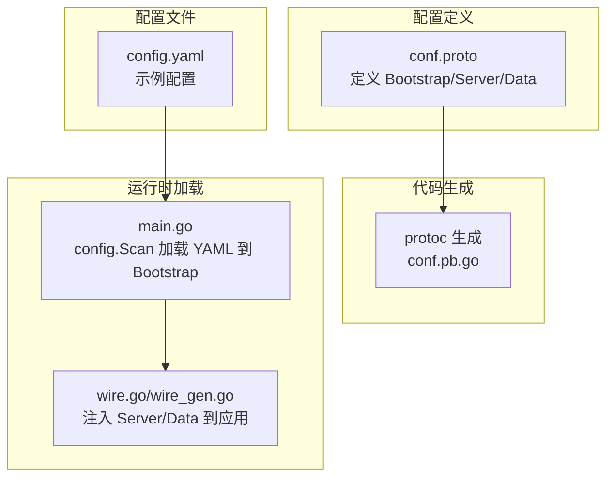
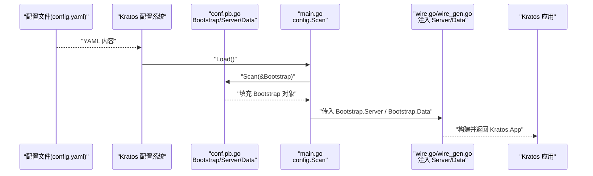
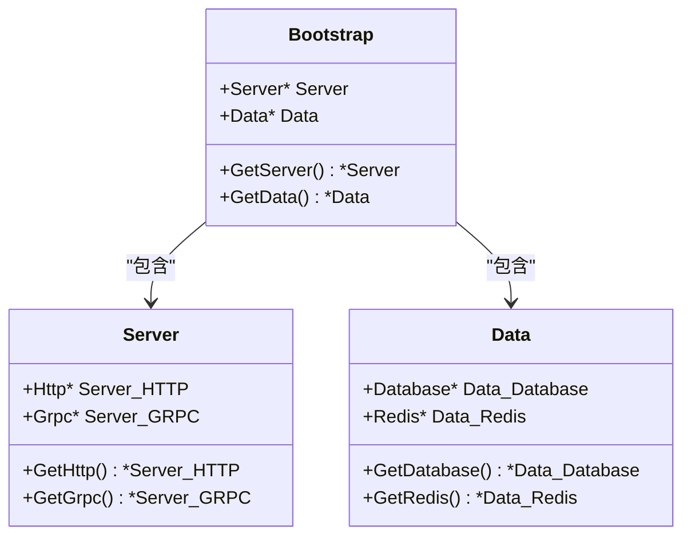
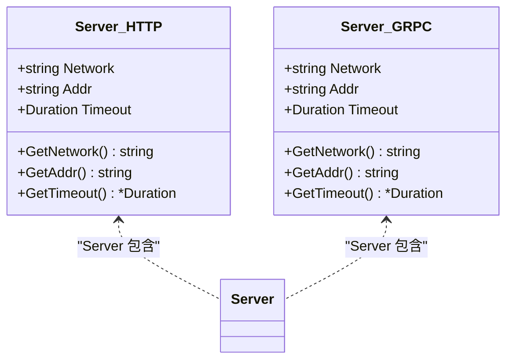
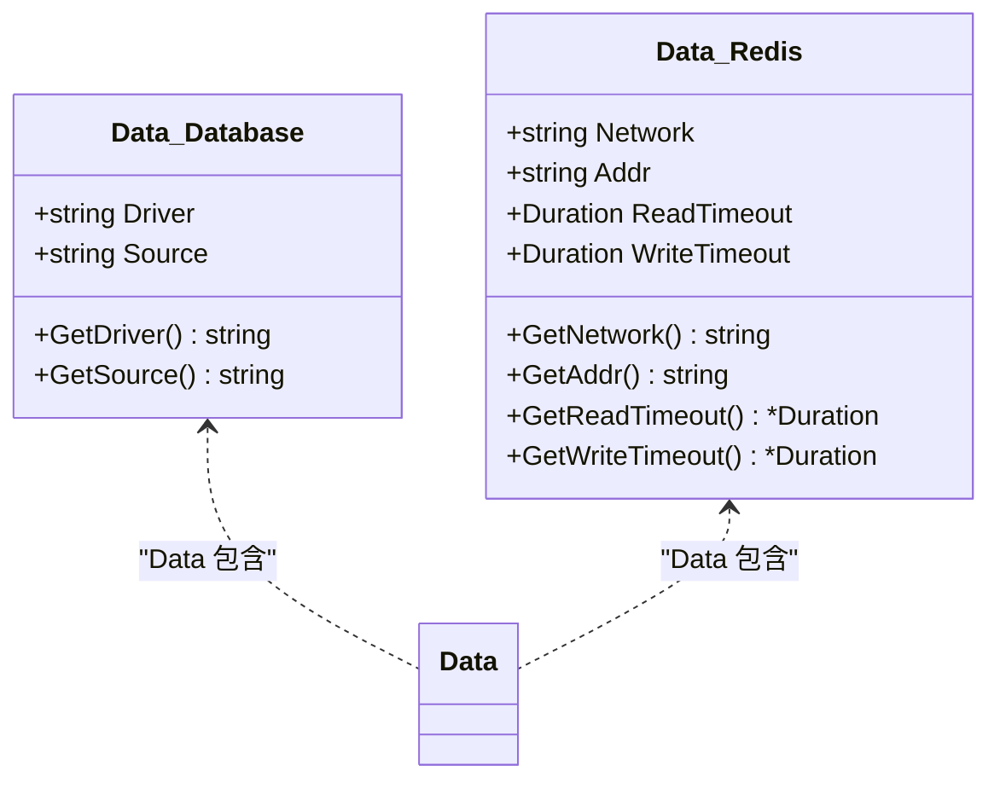
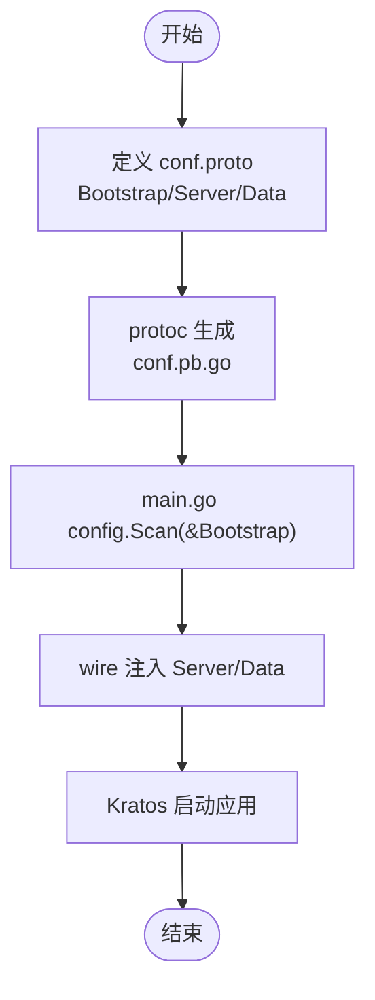
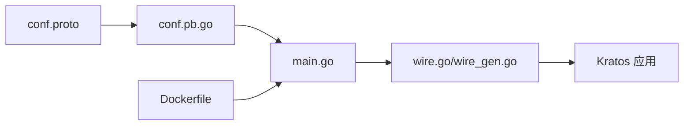

# 配置结构定义

<cite>
**本文引用的文件列表**
- [conf.proto](file://internal/conf/conf.proto)
- [conf.pb.go](file://internal/conf/conf.pb.go)
- [main.go](file://cmd/server/main.go)
- [wire.go](file://cmd/server/wire.go)
- [wire_gen.go](file://cmd/server/wire_gen.go)
- [config.yaml](file://configs/config.yaml)
- [Dockerfile](file://Dockerfile)
</cite>

## 目录
1. [简介](#简介)
2. [项目结构](#项目结构)
3. [核心组件](#核心组件)
4. [架构总览](#架构总览)
5. [详细组件分析](#详细组件分析)
6. [依赖关系分析](#依赖关系分析)
7. [性能与可维护性考量](#性能与可维护性考量)
8. [故障排查指南](#故障排查指南)
9. [结论](#结论)

## 简介
本文件围绕 Kratos 布局工程中的配置契约定义进行深入解析，重点聚焦于 Protocol Buffer 文件 conf.proto 中的 Bootstrap、Server、Data 消息结构，阐明其如何通过强类型协议精确描述服务配置，并展示 protoc 工具如何生成 Go 结构体及 Getter 方法，最终在运行时由 Kratos 配置系统加载并注入到应用启动流程中。文档同时总结使用 Proto 作为配置定义语言带来的跨语言兼容性、版本演进支持与类型安全等核心优势。

## 项目结构
- 配置契约定义位于 internal/conf/conf.proto，采用 proto3 语法，声明了三层嵌套的消息结构：Bootstrap（根配置）、Server（网络层配置）、Data（数据层配置）。
- 生成的 Go 代码位于 internal/conf/conf.pb.go，包含 Bootstrap、Server、Data 及其子消息的结构体与 Getter 方法。
- 运行时加载与注入：
  - cmd/server/main.go 使用 Kratos 配置源从 configs 目录读取 YAML，再通过 c.Scan(&bc) 将配置映射到 conf.Bootstrap。
  - cmd/server/wire.go/wire_gen.go 将 conf.Bootstrap 解析出的 Server 与 Data 注入到服务与数据层初始化流程。

图表来源
- [conf.proto](file://internal/conf/conf.proto#L1-L42)
- [conf.pb.go](file://internal/conf/conf.pb.go#L1-L120)
- [main.go](file://cmd/server/main.go#L61-L76)
- [wire.go](file://cmd/server/wire.go#L20-L23)
- [wire_gen.go](file://cmd/server/wire_gen.go#L25-L40)
- [config.yaml](file://configs/config.yaml#L1-L16)

章节来源
- [conf.proto](file://internal/conf/conf.proto#L1-L42)
- [conf.pb.go](file://internal/conf/conf.pb.go#L1-L120)
- [main.go](file://cmd/server/main.go#L61-L76)
- [wire.go](file://cmd/server/wire.go#L20-L23)
- [wire_gen.go](file://cmd/server/wire_gen.go#L25-L40)
- [config.yaml](file://configs/config.yaml#L1-L16)

## 核心组件
- Bootstrap（根配置）
  - 字段：server（Server）、data（Data），均为可选嵌套消息。
  - 作用：作为配置的顶层容器，承载服务端口、超时、数据库与 Redis 等全部配置。
- Server（网络配置）
  - 子消息：HTTP、GRPC
  - 字段：network（网络类型，如 tcp）、addr（监听地址）、timeout（Duration 超时）
  - 作用：统一管理 HTTP 与 gRPC 的网络参数。
- Data（数据配置）
  - 子消息：Database、Redis
  - Database 字段：driver（驱动名，如 mysql）、source（DSN）
  - Redis 字段：network、addr、read_timeout、write_timeout（均为 Duration）

章节来源
- [conf.proto](file://internal/conf/conf.proto#L8-L41)
- [conf.pb.go](file://internal/conf/conf.pb.go#L24-L187)

## 架构总览
下图展示了从配置文件到运行时对象的映射与注入路径，体现 Proto 配置契约在应用启动阶段的关键作用。

图表来源
- [config.yaml](file://configs/config.yaml#L1-L16)
- [main.go](file://cmd/server/main.go#L61-L76)
- [conf.pb.go](file://internal/conf/conf.pb.go#L24-L187)
- [wire.go](file://cmd/server/wire.go#L20-L23)
- [wire_gen.go](file://cmd/server/wire_gen.go#L25-L40)

章节来源
- [main.go](file://cmd/server/main.go#L61-L76)
- [wire.go](file://cmd/server/wire.go#L20-L23)
- [wire_gen.go](file://cmd/server/wire_gen.go#L25-L40)

## 详细组件分析

### Bootstrap 作为根配置对象
- 设计原理
  - 以 Bootstrap 为单一入口，聚合 Server 与 Data，确保配置层次清晰、职责单一。
  - 通过 proto 的嵌套消息实现“组合优于继承”的配置模型，便于扩展与演进。
- 生成结构
  - Go 结构体包含指针字段 Server 与 Data，便于空值判断与可选配置处理。
  - 提供 GetServer()、GetData() Getter 方法，用于安全访问嵌套配置。
- 使用方式
  - 运行时通过 config.Scan(&bc) 将 YAML 映射到 Bootstrap，随后拆解为 Server 与 Data 注入到服务与数据层。

图表来源
- [conf.pb.go](file://internal/conf/conf.pb.go#L24-L187)

章节来源
- [conf.proto](file://internal/conf/conf.proto#L8-L11)
- [conf.pb.go](file://internal/conf/conf.pb.go#L24-L187)
- [main.go](file://cmd/server/main.go#L72-L76)

### Server 消息：HTTP 与 GRPC 的网络配置
- 字段说明
  - network：网络类型字符串，如 tcp。
  - addr：监听地址字符串，如 0.0.0.0:8000。
  - timeout：Duration 类型，表示请求超时时间。
- 类型安全优势
  - 使用 google.protobuf.Duration 替代字符串或秒数，避免解析错误与单位混淆。
  - Go 侧通过 durationpb.Duration 访问，保证序列化/反序列化一致性。
- 实际用途
  - HTTP/GRPC 服务器分别读取各自的 HTTP/GRPC 子消息，设置监听地址与超时策略。

图表来源
- [conf.proto](file://internal/conf/conf.proto#L13-L26)
- [conf.pb.go](file://internal/conf/conf.pb.go#L189-L313)

章节来源
- [conf.proto](file://internal/conf/conf.proto#L13-L26)
- [conf.pb.go](file://internal/conf/conf.pb.go#L189-L313)
- [config.yaml](file://configs/config.yaml#L1-L8)

### Data 消息：数据库与 Redis 的连接配置
- Database
  - driver：数据库驱动名称（如 mysql）。
  - source：完整 DSN 字符串。
- Redis
  - network、addr：网络与地址。
  - read_timeout、write_timeout：读写超时（Duration）。
- 实际用途
  - 数据层根据 Database.source 初始化数据库客户端；根据 Redis.addr 与超时配置初始化 Redis 客户端。

图表来源
- [conf.proto](file://internal/conf/conf.proto#L28-L41)
- [conf.pb.go](file://internal/conf/conf.pb.go#L315-L439)

章节来源
- [conf.proto](file://internal/conf/conf.proto#L28-L41)
- [conf.pb.go](file://internal/conf/conf.pb.go#L315-L439)
- [config.yaml](file://configs/config.yaml#L9-L16)

### protoc 生成流程与 Go 结构体映射
- 生成产物
  - 生成的 Go 结构体与 Getter 方法均来自 conf.proto 的消息定义，字段类型与 JSON 标签与 proto 字段一一对应。
- 关键映射点
  - Bootstrap.GetServer()/GetData() 返回嵌套消息指针，便于判空与可选配置。
  - Server.GetHttp()/GetGrpc()、Data.GetDatabase()/GetRedis() 提供安全访问。
  - HTTP/GRPC、Redis 的 timeout/read_timeout/write_timeout 使用 google.protobuf.Duration，确保类型一致。
- 运行时绑定
  - main.go 中通过 config.Scan(&bc) 将 YAML 映射到 conf.Bootstrap，随后在 wire 注入链中传递给服务与数据层。

图表来源
- [conf.proto](file://internal/conf/conf.proto#L1-L42)
- [conf.pb.go](file://internal/conf/conf.pb.go#L1-L120)
- [main.go](file://cmd/server/main.go#L61-L76)
- [wire.go](file://cmd/server/wire.go#L20-L23)
- [wire_gen.go](file://cmd/server/wire_gen.go#L25-L40)

章节来源
- [conf.proto](file://internal/conf/conf.proto#L1-L42)
- [conf.pb.go](file://internal/conf/conf.pb.go#L1-L120)
- [main.go](file://cmd/server/main.go#L61-L76)
- [wire.go](file://cmd/server/wire.go#L20-L23)
- [wire_gen.go](file://cmd/server/wire_gen.go#L25-L40)

## 依赖关系分析
- 配置契约与运行时的耦合
  - conf.proto 仅定义契约，不包含业务逻辑；conf.pb.go 提供类型安全的结构体与 Getter。
  - main.go 通过 Kratos 配置系统加载 YAML 并映射到 Bootstrap；wire 注入链将 Server/Data 传递给服务与数据层。
- 外部依赖
  - 使用 google.protobuf.Duration 保证超时字段的类型一致性。
  - Dockerfile 指定 -conf 参数指向 /data/conf，与 configs 目录形成约定式配置挂载。

图表来源
- [conf.proto](file://internal/conf/conf.proto#L1-L42)
- [conf.pb.go](file://internal/conf/conf.pb.go#L1-L120)
- [main.go](file://cmd/server/main.go#L61-L76)
- [wire.go](file://cmd/server/wire.go#L20-L23)
- [wire_gen.go](file://cmd/server/wire_gen.go#L25-L40)
- [Dockerfile](file://Dockerfile#L16-L24)

章节来源
- [conf.proto](file://internal/conf/conf.proto#L1-L42)
- [conf.pb.go](file://internal/conf/conf.pb.go#L1-L120)
- [main.go](file://cmd/server/main.go#L61-L76)
- [wire.go](file://cmd/server/wire.go#L20-L23)
- [wire_gen.go](file://cmd/server/wire_gen.go#L25-L40)
- [Dockerfile](file://Dockerfile#L16-L24)

## 性能与可维护性考量
- 类型安全与零解析成本
  - 使用 Duration 类型避免字符串解析开销与潜在错误，提升配置读取与序列化性能。
- 版本演进友好
  - proto3 支持向后兼容字段扩展，新增字段默认可选，不影响既有配置。
- 跨语言兼容
  - 通过 protoc 生成多语言绑定（Go、Java、Python 等），便于团队协作与生态集成。
- 可观测与可审计
  - JSON 标签与结构体字段清晰，便于日志记录与配置校验。

[本节为通用指导，无需列出具体文件来源]

## 故障排查指南
- 配置未生效
  - 检查 -conf 指向是否正确（Dockerfile 中默认挂载 /data/conf），以及 YAML 键名与 proto 字段是否一致。
  - 确认 main.go 中 config.Scan(&bc) 是否成功执行且未报错。
- 字段类型不匹配
  - 超时字段必须为 Duration（如 1s、0.2s），避免使用整数秒或字符串。
  - addr 必须为字符串格式，network 建议使用 tcp。
- Getter 返回空指针
  - 若某子消息未在 YAML 中提供，对应的 GetServer()/GetHttp() 等 Getter 可能返回 nil，需在业务层做好判空处理。

章节来源
- [main.go](file://cmd/server/main.go#L61-L76)
- [Dockerfile](file://Dockerfile#L16-L24)
- [config.yaml](file://configs/config.yaml#L1-L16)
- [conf.pb.go](file://internal/conf/conf.pb.go#L24-L187)

## 结论
conf.proto 通过简洁而强类型的协议定义，将服务的网络与数据配置以清晰的嵌套结构呈现。protoc 生成的 conf.pb.go 在 Go 侧提供了类型安全的结构体与 Getter 方法，配合 Kratos 配置系统与 Wire 注入链，实现了从配置文件到运行时对象的无缝映射。该方案具备跨语言兼容、版本演进友好、类型安全与可维护性强等优势，是现代微服务配置治理的理想选择。