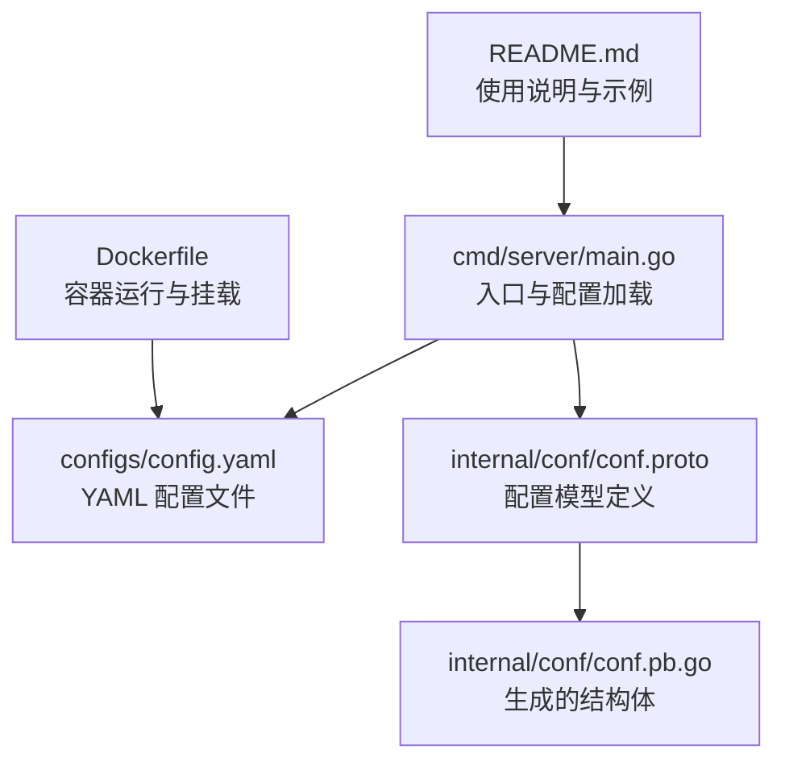
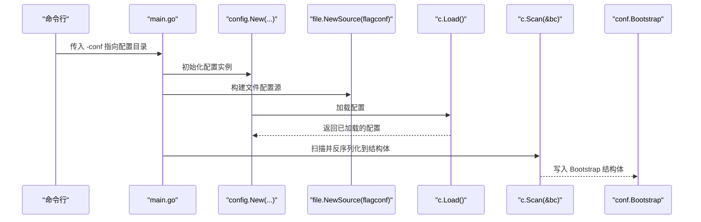
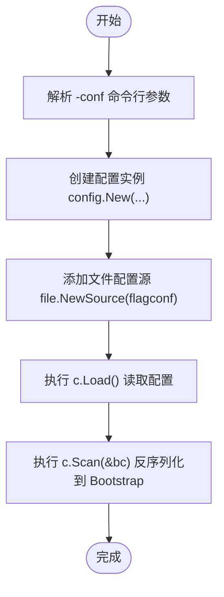
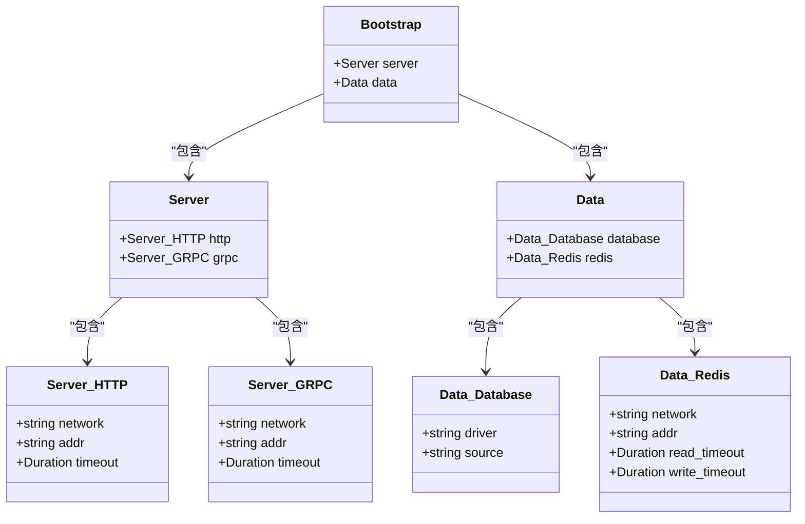
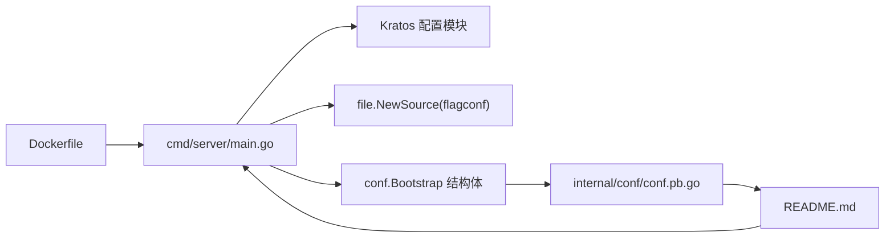

# 配置加载与解析机制

<cite>
**本文引用的文件列表**
- [cmd/server/main.go](file://cmd/server/main.go)
- [configs/config.yaml](file://configs/config.yaml)
- [internal/conf/conf.proto](file://internal/conf/conf.proto)
- [internal/conf/conf.pb.go](file://internal/conf/conf.pb.go)
- [Dockerfile](file://Dockerfile)
- [README.md](file://README.md)
- [go.mod](file://go.mod)
</cite>

## 目录
1. [引言](#引言)
2. [项目结构](#项目结构)
3. [核心组件](#核心组件)
4. [架构总览](#架构总览)
5. [详细组件分析](#详细组件分析)
6. [依赖关系分析](#依赖关系分析)
7. [性能考量](#性能考量)
8. [故障排查指南](#故障排查指南)
9. [结论](#结论)
10. [附录](#附录)

## 引言
本文件围绕 Kratos 框架的配置加载流程进行系统性剖析，重点覆盖以下方面：
- 从入口程序 main.go 的命令行参数解析与配置源初始化开始，说明如何通过 flag 指定配置路径。
- 详述配置加载 c.Load() 如何读取 YAML 文件并解析为内部结构，以及 c.Scan(&bc) 如何将 YAML 数据反序列化到由 conf.proto 生成的 Bootstrap 结构体中。
- 结合 config.yaml 实际内容，逐项解释 server.http.addr、data.database.source 等配置项如何映射到 Go 结构体字段。
- 说明 Kratos 配置模块支持的多种配置源（文件、环境变量、etcd 等）及其加载优先级。
- 提供配置加载失败的常见原因与排查方法，并演示如何在启动时打印配置辅助调试。

## 项目结构
该仓库采用 Kratos 官方模板布局，关键配置相关文件分布如下：
- 入口程序：cmd/server/main.go
- 配置定义：internal/conf/conf.proto（定义 Bootstrap/Server/Data 等结构）
- 配置实现：internal/conf/conf.pb.go（由 proto 生成的 Go 结构体）
- 配置样例：configs/config.yaml
- 运行方式：README.md 与 Dockerfile 展示了本地与容器运行时的配置挂载与传参方式

图表来源
- [cmd/server/main.go](file://cmd/server/main.go#L50-L87)
- [configs/config.yaml](file://configs/config.yaml#L1-L16)
- [internal/conf/conf.proto](file://internal/conf/conf.proto#L1-L42)
- [internal/conf/conf.pb.go](file://internal/conf/conf.pb.go#L24-L187)
- [Dockerfile](file://Dockerfile#L1-L24)
- [README.md](file://README.md#L1-L52)

章节来源
- [cmd/server/main.go](file://cmd/server/main.go#L50-L87)
- [configs/config.yaml](file://configs/config.yaml#L1-L16)
- [internal/conf/conf.proto](file://internal/conf/conf.proto#L1-L42)
- [internal/conf/conf.pb.go](file://internal/conf/conf.pb.go#L24-L187)
- [Dockerfile](file://Dockerfile#L1-L24)
- [README.md](file://README.md#L1-L52)

## 核心组件
- 命令行参数与配置源初始化
  - 在入口处通过 flag 定义 -conf 参数，默认值指向 configs 目录；随后以 file.NewSource(flagconf) 构建文件型配置源。
- 配置加载与扫描
  - 使用 config.New(...) 创建配置实例，添加 file 配置源后调用 c.Load() 读取配置；再通过 c.Scan(&bc) 将配置反序列化到 Bootstrap 结构体。
- 配置模型与映射
  - conf.proto 定义了 Bootstrap/Server/Data 及其子结构；conf.pb.go 生成对应的 Go 结构体，字段名与 JSON 标签与 proto 字段一致，便于 YAML 解析。

章节来源
- [cmd/server/main.go](file://cmd/server/main.go#L32-L34)
- [cmd/server/main.go](file://cmd/server/main.go#L61-L75)
- [internal/conf/conf.proto](file://internal/conf/conf.proto#L8-L42)
- [internal/conf/conf.pb.go](file://internal/conf/conf.pb.go#L24-L187)

## 架构总览
下图展示了从命令行到配置结构体的端到端流程：

图表来源
- [cmd/server/main.go](file://cmd/server/main.go#L61-L75)
- [configs/config.yaml](file://configs/config.yaml#L1-L16)
- [internal/conf/conf.proto](file://internal/conf/conf.proto#L8-L42)
- [internal/conf/conf.pb.go](file://internal/conf/conf.pb.go#L24-L187)

## 详细组件分析

### 命令行参数与配置源初始化
- -conf 参数默认值指向 configs 目录，可通过命令行覆盖。
- 使用 file.NewSource(flagconf) 将配置目录作为 Kratos 配置源注入。
- 该设计允许同时叠加多个配置源（例如文件、环境变量、etcd 等），并通过优先级策略合并。

章节来源
- [cmd/server/main.go](file://cmd/server/main.go#L32-L34)
- [cmd/server/main.go](file://cmd/server/main.go#L61-L65)
- [README.md](file://README.md#L20-L23)
- [Dockerfile](file://Dockerfile#L20-L24)

### 配置加载与解析流程
- c.Load() 负责从已注册的配置源读取并解析为内存中的配置树。
- c.Scan(&bc) 将配置树反序列化到 conf.Bootstrap 结构体，要求结构体字段与配置键名一致（JSON 标签与 proto 字段名一致）。

图表来源
- [cmd/server/main.go](file://cmd/server/main.go#L61-L75)

章节来源
- [cmd/server/main.go](file://cmd/server/main.go#L61-L75)

### 配置模型与字段映射
- conf.proto 定义了三层结构：Bootstrap（包含 Server 与 Data）、Server（包含 HTTP 与 GRPC）、Data（包含 Database 与 Redis）。
- conf.pb.go 生成的结构体字段与 proto 字段一一对应，且带有 JSON 标签，确保 YAML 键名与结构体字段一致。

图表来源
- [internal/conf/conf.proto](file://internal/conf/conf.proto#L8-L42)
- [internal/conf/conf.pb.go](file://internal/conf/conf.pb.go#L24-L187)

章节来源
- [internal/conf/conf.proto](file://internal/conf/conf.proto#L8-L42)
- [internal/conf/conf.pb.go](file://internal/conf/conf.pb.go#L24-L187)

### YAML 配置项与结构体字段映射详解
- server.http.addr → Bootstrap.Server.HTTP.addr
- server.http.timeout → Bootstrap.Server.HTTP.timeout（Duration 类型）
- server.grpc.addr → Bootstrap.Server.GRPC.addr
- server.grpc.timeout → Bootstrap.Server.GRPC.timeout（Duration 类型）
- data.database.driver → Bootstrap.Data.Database.driver
- data.database.source → Bootstrap.Data.Database.source
- data.redis.addr → Bootstrap.Data.Redis.addr
- data.redis.read_timeout → Bootstrap.Data.Redis.read_timeout（Duration 类型）
- data.redis.write_timeout → Bootstrap.Data.Redis.write_timeout（Duration 类型）

章节来源
- [configs/config.yaml](file://configs/config.yaml#L1-L16)
- [internal/conf/conf.proto](file://internal/conf/conf.proto#L8-L42)
- [internal/conf/conf.pb.go](file://internal/conf/conf.pb.go#L190-L250)
- [internal/conf/conf.pb.go](file://internal/conf/conf.pb.go#L252-L313)
- [internal/conf/conf.pb.go](file://internal/conf/conf.pb.go#L315-L368)
- [internal/conf/conf.pb.go](file://internal/conf/conf.pb.go#L370-L439)

### 多配置源与优先级
- Kratos 支持多种配置源组合，典型包括：
  - 文件源：从本地文件系统读取（本项目使用 file.NewSource）
  - 环境变量源：从环境变量读取（可选）
  - etcd/consul 等远程配置中心（可选）
- 优先级策略通常遵循“后注册者覆盖先注册者”的原则，即靠后的配置源会覆盖前面的同名键值。
- 在本项目中，仅注册了文件源；若需启用其他源，可在 config.New(...) 中继续添加 WithSource(...)。

章节来源
- [cmd/server/main.go](file://cmd/server/main.go#L61-L65)
- [go.mod](file://go.mod#L7-L14)

### 启动时打印配置辅助调试
- 建议在应用启动前，将 conf.Bootstrap 的内容输出到日志，以便快速核对加载结果。
- 可在 main.go 中于 c.Scan(&bc) 之后、wireApp 之前加入日志输出，打印 bc 的关键字段（如 server.http.addr、data.database.source 等）。

章节来源
- [cmd/server/main.go](file://cmd/server/main.go#L72-L75)
- [cmd/server/main.go](file://cmd/server/main.go#L77-L81)

## 依赖关系分析
- main.go 依赖 Kratos 配置模块与文件源模块，用于构建配置实例与加载配置。
- 配置模型依赖 protobuf 生成的结构体，保证字段名与 JSON 标签与 YAML 键名一致。
- 运行时依赖 README.md 与 Dockerfile 提供的命令行参数与容器挂载方式。

图表来源
- [cmd/server/main.go](file://cmd/server/main.go#L61-L75)
- [internal/conf/conf.proto](file://internal/conf/conf.proto#L1-L42)
- [internal/conf/conf.pb.go](file://internal/conf/conf.pb.go#L24-L187)
- [Dockerfile](file://Dockerfile#L1-L24)
- [README.md](file://README.md#L1-L52)

章节来源
- [cmd/server/main.go](file://cmd/server/main.go#L61-L75)
- [internal/conf/conf.proto](file://internal/conf/conf.proto#L1-L42)
- [internal/conf/conf.pb.go](file://internal/conf/conf.pb.go#L24-L187)
- [Dockerfile](file://Dockerfile#L1-L24)
- [README.md](file://README.md#L1-L52)

## 性能考量
- 配置加载为一次性操作，通常开销很小；但在多源合并场景下，建议合理安排源顺序，避免不必要的覆盖。
- 对于大体量配置，建议拆分为多个文件并通过文件源聚合，减少单文件体积。
- 使用容器部署时，将配置挂载到只读卷，避免频繁 IO 干扰。

## 故障排查指南
- 文件路径错误
  - 症状：c.Load() 抛错或返回空配置。
  - 排查：确认 -conf 指向的目录存在且包含 config.yaml；参考 README.md 与 Dockerfile 中的示例路径。
- YAML 格式问题
  - 症状：c.Scan() 反序列化失败或字段缺失。
  - 排查：检查缩进、冒号后空格、布尔/数值类型写法是否符合 YAML 规范；确保字段名与 conf.proto/JSON 标签一致。
- 字段类型不匹配
  - 症状：Duration 类型解析失败或整数/字符串类型不兼容。
  - 排查：确认 timeout、read_timeout、write_timeout 等应为 Duration 文本格式；driver/source 等应为字符串。
- 字段名不匹配
  - 症状：某些配置未生效。
  - 排查：对照 conf.proto 与 conf.pb.go 的 JSON 标签，确保 YAML 键名完全一致（大小写、下划线/驼峰等）。
- 多源覆盖冲突
  - 症状：期望的配置被覆盖。
  - 排查：检查配置源注册顺序，必要时移除或调整优先级更高的源。

章节来源
- [cmd/server/main.go](file://cmd/server/main.go#L68-L75)
- [configs/config.yaml](file://configs/config.yaml#L1-L16)
- [internal/conf/conf.proto](file://internal/conf/conf.proto#L8-L42)
- [internal/conf/conf.pb.go](file://internal/conf/conf.pb.go#L190-L250)
- [internal/conf/conf.pb.go](file://internal/conf/conf.pb.go#L252-L313)
- [internal/conf/conf.pb.go](file://internal/conf/conf.pb.go#L315-L368)
- [internal/conf/conf.pb.go](file://internal/conf/conf.pb.go#L370-L439)
- [README.md](file://README.md#L20-L23)
- [Dockerfile](file://Dockerfile#L20-L24)

## 结论
本项目通过 Kratos 配置模块实现了从命令行参数到 YAML 配置文件的完整加载链路，并借助 protobuf 生成的结构体确保配置键名与字段映射的准确性。结合多配置源能力与合理的优先级策略，可灵活适配本地开发、容器化部署与分布式配置中心等多种场景。建议在启动阶段打印关键配置项，以提升可观测性与排障效率。

## 附录
- 常用命令参考
  - 本地运行：./bin/server -conf ./configs
  - 容器运行：docker run ... -v </path/to/your/configs>:/data/conf <image> ./server -conf /data/conf
- 关键文件定位
  - 入口与加载：cmd/server/main.go
  - 配置样例：configs/config.yaml
  - 模型定义与生成：internal/conf/conf.proto、internal/conf/conf.pb.go
  - 运行示例：README.md、Dockerfile