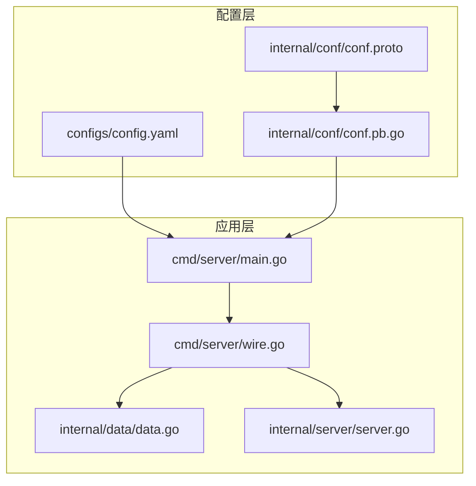
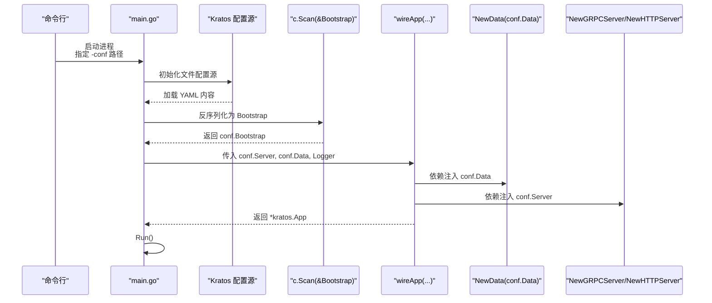
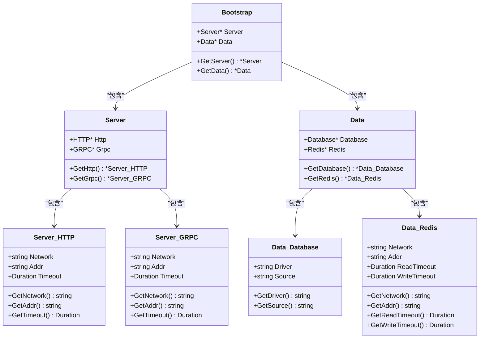
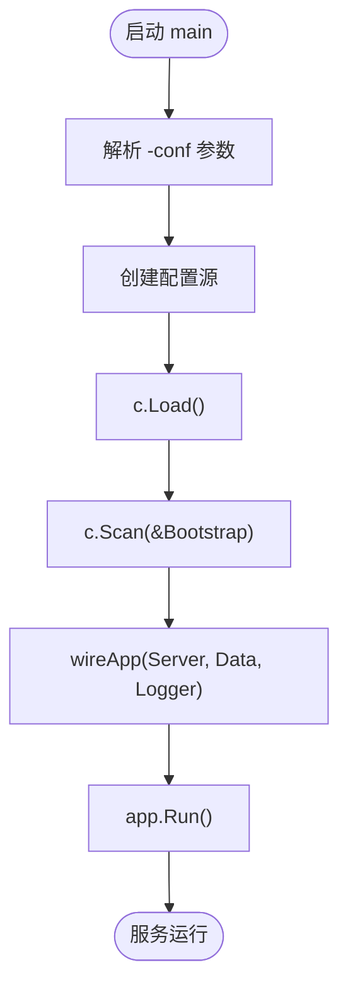
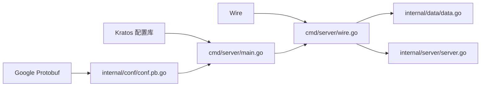
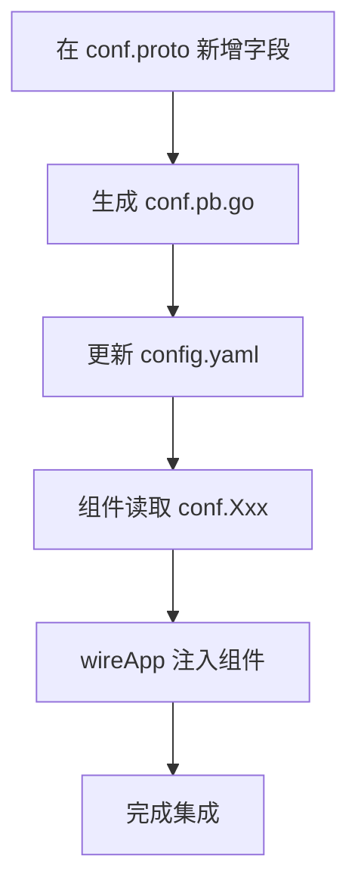

# 配置管理

<cite>
**本文引用的文件**
- [config.yaml](file://configs/config.yaml)
- [conf.proto](file://internal/conf/conf.proto)
- [conf.pb.go](file://internal/conf/conf.pb.go)
- [main.go](file://cmd/server/main.go)
- [wire.go](file://cmd/server/wire.go)
- [data.go](file://internal/data/data.go)
- [server.go](file://internal/server/server.go)
- [go.mod](file://go.mod)
</cite>

## 目录
1. [简介](#简介)
2. [项目结构](#项目结构)
3. [核心组件](#核心组件)
4. [架构总览](#架构总览)
5. [详细组件分析](#详细组件分析)
6. [依赖关系分析](#依赖关系分析)
7. [性能考量](#性能考量)
8. [故障排查指南](#故障排查指南)
9. [结论](#结论)
10. [附录](#附录)

## 简介
本文件系统性阐述该 Kratos 项目的配置管理系统，覆盖以下方面：
- 配置文件 config.yaml 的结构设计、字段含义与加载机制
- 通过 conf.proto 定义的 Protocol Buffer Schema 及其生成的 Go 结构体 conf.pb.go，实现类型安全的配置访问
- Kratos 框架在 main.go 中如何解析并注入配置到各组件
- 自定义配置项的添加方法：proto 定义、yaml 更新、代码读取的完整流程
- 配置的环境隔离（开发/测试/生产）与敏感信息处理（如密码）的最佳实践
- 配置热更新的可能性与建议

## 项目结构
配置相关的核心位置如下：
- 配置文件：configs/config.yaml
- 配置 Schema：internal/conf/conf.proto
- 生成的 Go 结构体：internal/conf/conf.pb.go
- 应用入口与配置加载：cmd/server/main.go
- 依赖注入入口：cmd/server/wire.go
- 组件使用配置示例：internal/data/data.go、internal/server/server.go
- 依赖声明：go.mod

图表来源
- [config.yaml](file://configs/config.yaml#L1-L16)
- [conf.proto](file://internal/conf/conf.proto#L1-L42)
- [conf.pb.go](file://internal/conf/conf.pb.go#L1-L653)
- [main.go](file://cmd/server/main.go#L1-L88)
- [wire.go](file://cmd/server/wire.go#L1-L24)
- [data.go](file://internal/data/data.go#L1-L25)
- [server.go](file://internal/server/server.go#L1-L9)

章节来源
- [config.yaml](file://configs/config.yaml#L1-L16)
- [conf.proto](file://internal/conf/conf.proto#L1-L42)
- [conf.pb.go](file://internal/conf/conf.pb.go#L1-L653)
- [main.go](file://cmd/server/main.go#L1-L88)
- [wire.go](file://cmd/server/wire.go#L1-L24)
- [data.go](file://internal/data/data.go#L1-L25)
- [server.go](file://internal/server/server.go#L1-L9)
- [go.mod](file://go.mod#L1-L36)

## 核心组件
- 配置文件 config.yaml：以 YAML 形式描述服务端口、超时、数据库与 Redis 连接等运行期参数。
- Protocol Buffer Schema（conf.proto）：以强类型消息定义 Bootstrap、Server、Data 等配置模型，支持嵌套结构与 Duration 类型。
- 生成的 Go 结构体（conf.pb.go）：基于 proto 生成的类型安全结构体，包含 Getter 方法与 JSON 映射，便于在应用中直接使用。
- Kratos 配置加载（main.go）：通过 Kratos 配置源加载 YAML，反序列化为 Bootstrap 结构体，再注入到依赖注入容器。
- 依赖注入（wire.go）：将 conf.Server、conf.Data 注入到具体组件构造函数，形成可测试、可替换的模块化结构。
- 组件使用（data.go、server.go）：组件从注入的 conf 结构体中读取所需配置，例如数据库驱动、连接串、网络地址、超时等。

章节来源
- [config.yaml](file://configs/config.yaml#L1-L16)
- [conf.proto](file://internal/conf/conf.proto#L1-L42)
- [conf.pb.go](file://internal/conf/conf.pb.go#L1-L653)
- [main.go](file://cmd/server/main.go#L50-L88)
- [wire.go](file://cmd/server/wire.go#L1-L24)
- [data.go](file://internal/data/data.go#L1-L25)
- [server.go](file://internal/server/server.go#L1-L9)

## 架构总览
下图展示从配置文件到组件使用的整体流程。

图表来源
- [main.go](file://cmd/server/main.go#L50-L88)
- [wire.go](file://cmd/server/wire.go#L1-L24)
- [data.go](file://internal/data/data.go#L1-L25)

章节来源
- [main.go](file://cmd/server/main.go#L50-L88)
- [wire.go](file://cmd/server/wire.go#L1-L24)
- [data.go](file://internal/data/data.go#L1-L25)

## 详细组件分析

### 配置文件 config.yaml 结构与字段含义
- 结构层级
  - server.http.addr / server.grpc.addr：监听地址
  - server.http.timeout / server.grpc.timeout：请求超时
  - data.database.driver / data.database.source：数据库驱动与连接串
  - data.redis.addr / data.redis.read_timeout / data.redis.write_timeout：Redis 地址与读写超时
- 字段映射关系
  - YAML 键名与 conf.proto 中字段名一致，便于直接反序列化
  - Duration 类型字段在 YAML 中以字符串形式表示（如“1s”、“0.2s”），由 Kratos 配置库解析为 Duration

章节来源
- [config.yaml](file://configs/config.yaml#L1-L16)

### Protocol Buffer Schema（conf.proto）与生成的 Go 结构体（conf.pb.go）
- Schema 设计要点
  - 使用 google.protobuf.Duration 表达超时类配置，保证跨语言一致性
  - 嵌套消息结构清晰表达 server.http/grpc、data.database/redis 的层次关系
  - go_package 指定生成包路径，便于导入与使用
- 生成结构体特性
  - 提供 GetXxx() 访问器，返回指针或基础类型，便于判空与默认值处理
  - 支持 JSON 标签映射，兼容 YAML 反序列化
  - 包含 ProtoReflect、ProtoMessage 等反射接口，便于与其他 Protobuf 工具链协作

图表来源
- [conf.proto](file://internal/conf/conf.proto#L1-L42)
- [conf.pb.go](file://internal/conf/conf.pb.go#L1-L653)

章节来源
- [conf.proto](file://internal/conf/conf.proto#L1-L42)
- [conf.pb.go](file://internal/conf/conf.pb.go#L1-L653)

### Kratos 配置加载与注入流程（main.go）
- 关键步骤
  - 解析命令行参数 -conf，指向配置目录
  - 创建 Kratos 配置源并加载
  - 扫描（Scan）为 conf.Bootstrap 结构体
  - 通过 wireApp 将 conf.Server、conf.Data 注入到组件构造函数
- 优点
  - 类型安全：YAML 与 Go 结构体一一对应
  - 可扩展：新增字段无需改动加载逻辑
  - 可测试：通过注入解耦，便于单元测试

图表来源
- [main.go](file://cmd/server/main.go#L50-L88)
- [wire.go](file://cmd/server/wire.go#L1-L24)

章节来源
- [main.go](file://cmd/server/main.go#L50-L88)
- [wire.go](file://cmd/server/wire.go#L1-L24)

### 组件读取配置（data.go、server.go）
- data.go
  - NewData 接收 *conf.Data，可从中读取 Database/Redis 配置
  - 清理函数用于资源关闭与日志输出
- server.go
  - ProviderSet 汇聚 HTTP/GRPC 服务器提供者，通常也从 conf.Server 读取地址与超时

章节来源
- [data.go](file://internal/data/data.go#L1-L25)
- [server.go](file://internal/server/server.go#L1-L9)

## 依赖关系分析
- 外部依赖
  - Kratos 配置库：负责从文件源加载 YAML 并反序列化
  - Google Protobuf：提供 Duration 类型与反射能力
  - Wire：依赖注入工具，将 conf 结构体注入到组件
- 内部依赖
  - main.go 依赖 conf.pb.go 的结构体
  - wire.go 依赖 conf.Server、conf.Data
  - data.go、server.go 依赖 conf.Data、conf.Server

图表来源
- [main.go](file://cmd/server/main.go#L1-L88)
- [wire.go](file://cmd/server/wire.go#L1-L24)
- [data.go](file://internal/data/data.go#L1-L25)
- [server.go](file://internal/server/server.go#L1-L9)
- [conf.pb.go](file://internal/conf/conf.pb.go#L1-L653)
- [go.mod](file://go.mod#L1-L36)

章节来源
- [go.mod](file://go.mod#L1-L36)
- [main.go](file://cmd/server/main.go#L1-L88)
- [wire.go](file://cmd/server/wire.go#L1-L24)
- [conf.pb.go](file://internal/conf/conf.pb.go#L1-L653)

## 性能考量
- 配置加载
  - YAML 文件较小，加载开销极低；建议将配置集中于单一目录，避免多源切换带来的复杂度
- 反序列化
  - 使用 Protobuf Duration 与结构体扫描，内存占用与 CPU 开销可控
- 依赖注入
  - Wire 在编译期生成注入代码，运行时无反射成本
- 建议
  - 对于高频变更配置（如限流阈值），可在业务层缓存并定期刷新，避免每次调用都访问配置源

[本节为通用指导，不直接分析具体文件]

## 故障排查指南
- 配置无法加载
  - 检查 -conf 指向是否正确，确保目录内存在 config.yaml
  - 确认 YAML 缩进与键名与 conf.proto 保持一致
- 反序列化失败
  - 若字段类型不匹配（如超时应为字符串格式），请修正 YAML
  - 确保 Duration 字符串格式符合预期（如“1s”、“0.2s”）
- 注入失败
  - 确认 wireApp 的参数顺序与类型与 conf.Server、conf.Data 一致
  - 检查 ProviderSet 是否包含所需提供者
- 运行异常
  - 查看日志中的 trace.id/span.id，结合服务端口与超时设置定位问题

章节来源
- [main.go](file://cmd/server/main.go#L50-L88)
- [wire.go](file://cmd/server/wire.go#L1-L24)
- [data.go](file://internal/data/data.go#L1-L25)

## 结论
该配置管理体系以 Protocol Buffer Schema 为核心，结合 Kratos 配置库与 Wire 依赖注入，实现了类型安全、可维护、可扩展的配置管理方案。通过标准化的 YAML 结构与生成的 Go 结构体，开发者可以快速添加新配置项并在组件中安全读取。建议在实际项目中进一步完善环境隔离与敏感信息处理策略，并评估热更新需求以提升运维效率。

[本节为总结性内容，不直接分析具体文件]

## 附录

### 自定义配置项添加流程（从零到一）
- 步骤一：在 conf.proto 中定义字段
  - 在相应消息中新增字段，选择合适类型（字符串、Duration 等）
  - 如需嵌套，新增子消息或复用现有消息
- 步骤二：生成 Go 结构体
  - 使用 protoc-gen-go 生成 conf.pb.go
  - 确认生成文件未被手动修改，避免后续冲突
- 步骤三：更新 config.yaml
  - 在对应层级添加新键值，键名与 proto 字段保持一致
  - Duration 类型使用字符串格式（如“1s”、“0.2s”）
- 步骤四：在组件中读取
  - 在组件构造函数中接收 *conf.Xxx，使用 GetXxx() 获取字段
  - 在业务逻辑中按需使用配置值
- 步骤五：集成到依赖注入
  - 在 wireApp 中将 conf.Xxx 注入到组件
  - 确保 ProviderSet 包含所需提供者

图表来源
- [conf.proto](file://internal/conf/conf.proto#L1-L42)
- [conf.pb.go](file://internal/conf/conf.pb.go#L1-L653)
- [config.yaml](file://configs/config.yaml#L1-L16)
- [wire.go](file://cmd/server/wire.go#L1-L24)
- [data.go](file://internal/data/data.go#L1-L25)

章节来源
- [conf.proto](file://internal/conf/conf.proto#L1-L42)
- [conf.pb.go](file://internal/conf/conf.pb.go#L1-L653)
- [config.yaml](file://configs/config.yaml#L1-L16)
- [wire.go](file://cmd/server/wire.go#L1-L24)
- [data.go](file://internal/data/data.go#L1-L25)

### 环境隔离与敏感信息处理最佳实践
- 环境隔离
  - 使用不同配置目录或文件区分 dev/test/prod，通过 -conf 指定
  - 对外暴露的敏感字段（如密码）不在 YAML 中直接出现，采用密钥管理服务或环境变量注入
- 敏感信息处理
  - 数据库连接串中的密码建议通过外部密管或环境变量替换
  - 避免将明文密码写入版本控制
- 配置热更新
  - 当前实现为一次性加载，适合静态配置
  - 如需热更新，可引入配置中心（如 etcd、Consul）并配合监听器动态刷新 conf 结构体，或在业务层增加缓存与刷新策略

[本节为通用指导，不直接分析具体文件]