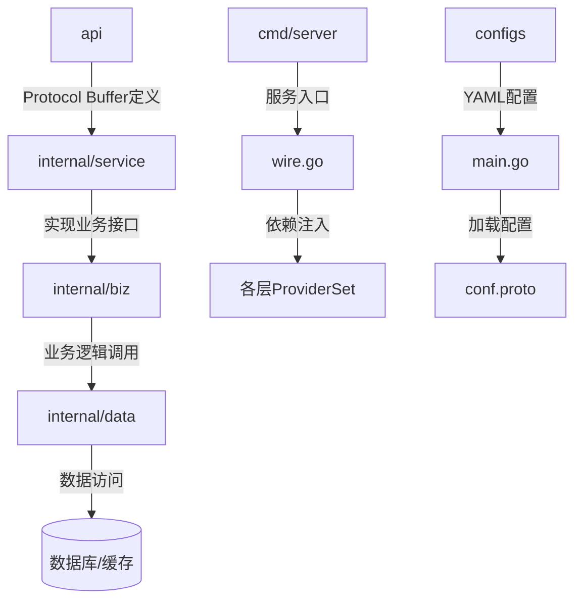
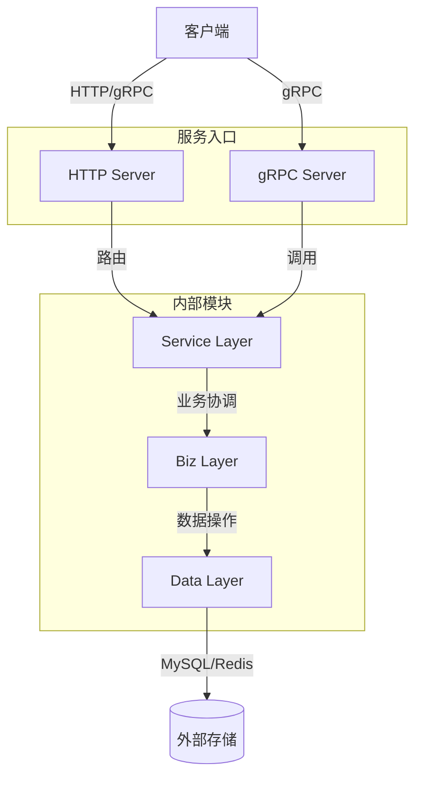
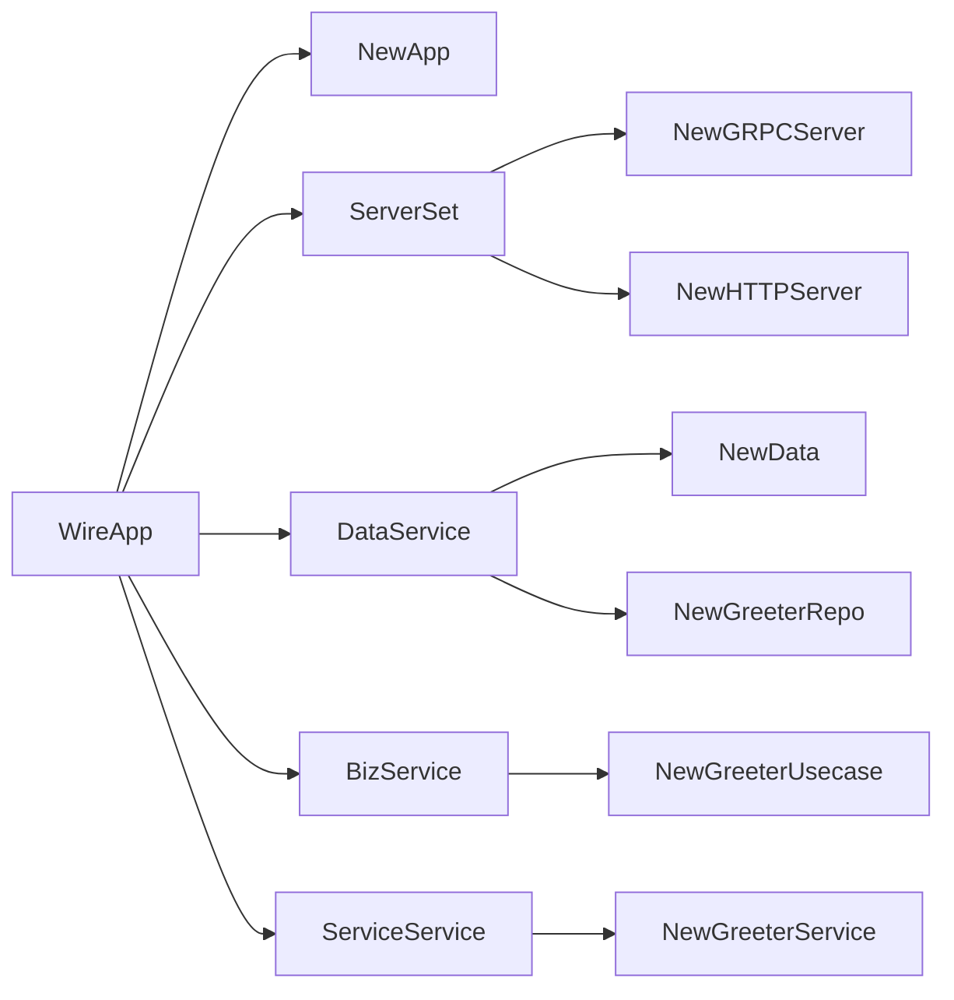
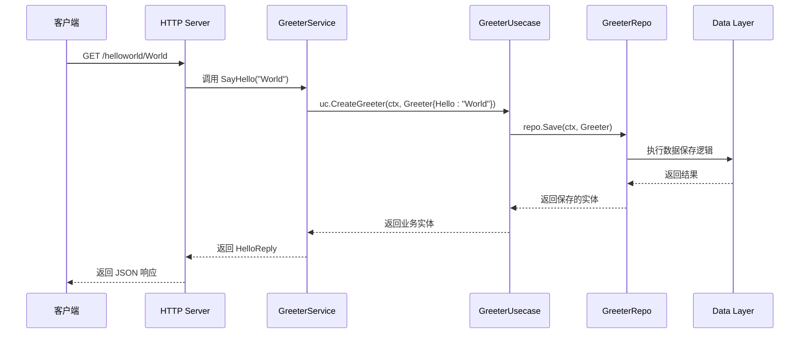
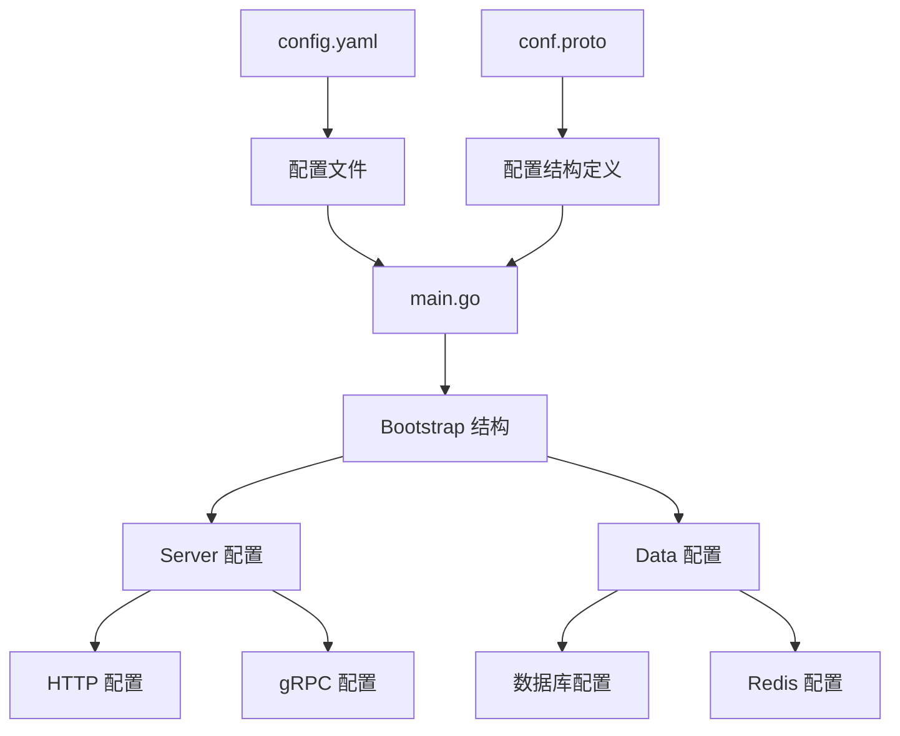

# 项目概述

<cite>
**本文档引用的文件**  
- [main.go](file://cmd/server/main.go)
- [wire.go](file://cmd/server/wire.go)
- [greeter.proto](file://api/helloworld/v1/greeter.proto)
- [greeter.go](file://internal/service/greeter.go)
- [biz/greeter.go](file://internal/biz/greeter.go)
- [data/greeter.go](file://internal/data/greeter.go)
- [http.go](file://internal/server/http.go)
- [grpc.go](file://internal/server/grpc.go)
- [server.go](file://internal/server/server.go)
- [biz.go](file://internal/biz/biz.go)
- [data.go](file://internal/data/data.go)
- [service.go](file://internal/service/service.go)
- [conf.proto](file://internal/conf/conf.proto)
- [config.yaml](file://configs/config.yaml)
- [README.md](file://README.md)
- [go.mod](file://go.mod)
</cite>

## 目录

1. [引言](#引言)
2. [项目结构](#项目结构)
3. [核心组件](#核心组件)
4. [架构设计](#架构设计)
5. [依赖注入与Wire](#依赖注入与wire)
6. [典型请求流程分析](#典型请求流程分析)
7. [配置管理](#配置管理)
8. [适用场景与优势](#适用场景与优势)
9. [与其他模板的对比](#与其他模板的对比)
10. [总结](#总结)

## 引言

kratos-layout 是一个基于 Go 语言和 Kratos 框架的微服务项目模板，旨在为开发者提供标准化、可扩展的微服务脚手架。该项目支持 gRPC 与 HTTP 双协议通信，采用清晰的分层架构（API-Service-Biz-Data），并通过 Google Wire 实现依赖注入，提升代码的可测试性与模块化程度。本项目不仅适用于快速启动新服务，也为团队协作提供了统一的开发规范。

**kratos-layout** 的设计目标是降低微服务开发的复杂性，通过预设最佳实践帮助开发者专注于业务逻辑实现，而非基础设施搭建。其核心价值在于提供了一套完整的、生产就绪的技术栈，涵盖服务启动、配置加载、依赖管理、协议支持等关键环节。

## 项目结构

kratos-layout 采用功能导向的目录结构，各目录职责明确，便于维护和扩展：

**Diagram sources**  
- [api/helloworld/v1/greeter.proto](file://api/helloworld/v1/greeter.proto)
- [internal/service/greeter.go](file://internal/service/greeter.go)
- [internal/biz/greeter.go](file://internal/biz/greeter.go)
- [internal/data/greeter.go](file://internal/data/greeter.go)
- [cmd/server/main.go](file://cmd/server/main.go)
- [internal/conf/conf.proto](file://internal/conf/conf.proto)

**Section sources**  
- [README.md](file://README.md)

## 核心组件

kratos-layout 的核心组件遵循清晰的分层架构，每一层都有明确的职责边界：

- **API 层**：位于 `api/` 目录，使用 Protocol Buffer 定义服务接口，生成强类型的 gRPC 和 HTTP 客户端/服务端代码。
- **Service 层**：位于 `internal/service/`，实现 API 层定义的服务接口，协调业务用例的执行。
- **Biz 层**：位于 `internal/biz/`，包含核心业务逻辑和用例（Usecase），是业务规则的主要承载者。
- **Data 层**：位于 `internal/data/`，负责数据持久化，封装对数据库、缓存等外部资源的访问。
- **Server 层**：位于 `internal/server/`，构建并配置 gRPC 和 HTTP 服务器实例。

这种分层设计实现了关注点分离，使得各层可以独立演化，提高了代码的可维护性和可测试性。

**Section sources**  
- [internal/service/greeter.go](file://internal/service/greeter.go#L1-L30)
- [internal/biz/greeter.go](file://internal/biz/greeter.go#L1-L47)
- [internal/data/greeter.go](file://internal/data/greeter.go#L1-L43)

## 架构设计

kratos-layout 采用经典的 Clean Architecture 分层模式，结合微服务最佳实践，形成稳定的技术架构：

**Diagram sources**  
- [internal/server/http.go](file://internal/server/http.go#L1-L33)
- [internal/server/grpc.go](file://internal/server/grpc.go#L1-L33)
- [internal/service/greeter.go](file://internal/service/greeter.go#L1-L30)

**Section sources**  
- [internal/server/http.go](file://internal/server/http.go#L1-L33)
- [internal/server/grpc.go](file://internal/server/grpc.go#L1-L33)

## 依赖注入与Wire

kratos-layout 使用 Google Wire 实现编译时依赖注入，避免了运行时反射带来的性能开销和不确定性。通过定义 `ProviderSet`，将各层的构造函数集中管理：

在 `cmd/server/wire.go` 中，`wireApp` 函数通过 `wire.Build` 声明了应用所需的全部依赖集合，包括服务器、数据、业务和服务层的 ProviderSet。这种方式使得依赖关系清晰可见，便于调试和测试。

**Diagram sources**  
- [cmd/server/wire.go](file://cmd/server/wire.go#L20-L22)
- [internal/server/server.go](file://internal/server/server.go#L7-L9)
- [internal/data/data.go](file://internal/data/data.go#L10-L11)
- [internal/biz/biz.go](file://internal/biz/biz.go#L5-L7)
- [internal/service/service.go](file://internal/service/service.go#L5-L7)

**Section sources**  
- [cmd/server/wire.go](file://cmd/server/wire.go#L1-L24)
- [internal/server/server.go](file://internal/server/server.go#L7-L9)

## 典型请求流程分析

以 `SayHello` 接口为例，展示从客户端请求到响应返回的完整数据流路径：

1. 客户端发起 HTTP 请求 `GET /helloworld/World`
2. HTTP 服务器路由到 `GreeterService.SayHello`
3. 服务层调用业务用例 `CreateGreeter`
4. 业务层通过仓库接口 `Save` 持久化数据
5. 数据层执行具体的数据操作
6. 结果沿调用链逐层返回，最终生成响应

**Diagram sources**  
- [internal/server/http.go](file://internal/server/http.go#L30-L31)
- [internal/service/greeter.go](file://internal/service/greeter.go#L23-L29)
- [internal/biz/greeter.go](file://internal/biz/greeter.go#L42-L46)
- [internal/data/greeter.go](file://internal/data/greeter.go#L24-L25)

**Section sources**  
- [api/helloworld/v1/greeter.proto](file://api/helloworld/v1/greeter.proto#L15-L18)
- [internal/service/greeter.go](file://internal/service/greeter.go#L23-L29)

## 配置管理

kratos-layout 使用 Protocol Buffer 定义配置结构，通过 YAML 文件加载配置值，实现了类型安全的配置管理：

`conf.proto` 定义了 `Bootstrap` 消息类型，包含 `Server` 和 `Data` 子消息。`config.yaml` 文件中的配置项与 proto 结构一一对应，通过 Kratos 的配置模块加载并反序列化为 Go 结构体，确保了配置的类型安全和结构一致性。

**Diagram sources**  
- [configs/config.yaml](file://configs/config.yaml#L1-L16)
- [internal/conf/conf.proto](file://internal/conf/conf.proto#L8-L26)
- [cmd/server/main.go](file://cmd/server/main.go#L72-L75)

**Section sources**  
- [configs/config.yaml](file://configs/config.yaml#L1-L16)
- [internal/conf/conf.proto](file://internal/conf/conf.proto#L1-L42)

## 适用场景与优势

kratos-layout 特别适用于以下场景：

- **微服务架构项目**：需要快速搭建标准化微服务的团队
- **多协议支持需求**：同时需要 gRPC 高性能和 HTTP 广泛兼容性的场景
- **大型团队协作**：需要统一代码风格和架构规范的组织
- **云原生应用**：易于容器化部署，支持配置外置

其主要优势包括：

- **标准化**：提供一致的项目结构和开发模式
- **高性能**：基于 gRPC 和 Protocol Buffer 的高效通信
- **可测试性**：依赖注入和分层架构便于单元测试和集成测试
- **可维护性**：清晰的职责划分和模块化设计
- **生产就绪**：内置日志、追踪、恢复等生产级特性

## 与其他模板的对比

| 特性 | kratos-layout | 标准库模板 | Gin 基础模板 | 其他微服务框架 |
|------|---------------|------------|--------------|----------------|
| 分层架构 | ✅ 清晰分层 | ❌ 无 | ❌ 通常无 | ⭕ 部分支持 |
| gRPC 支持 | ✅ 原生支持 | ❌ 需手动集成 | ❌ 无 | ⭕ 视框架而定 |
| 依赖注入 | ✅ Wire 编译时注入 | ❌ 无 | ❌ 无 | ⭕ 部分支持 |
| 配置类型安全 | ✅ Proto + YAML | ❌ 纯 YAML | ❌ 纯 YAML | ⭕ 部分支持 |
| 双协议支持 | ✅ HTTP + gRPC | ⭕ 需手动实现 | ✅ HTTP 为主 | ⭕ 视框架而定 |
| 生产级特性 | ✅ 内置日志、追踪等 | ❌ 需自行添加 | ❌ 需自行添加 | ⭕ 部分支持 |

kratos-layout 在架构规范性、技术先进性和生产可用性方面具有明显优势，特别适合追求高质量和长期可维护性的项目。

## 总结

kratos-layout 作为一个现代化的 Go 微服务模板，通过整合 Kratos 框架的强大功能和 Google Wire 的依赖注入机制，为开发者提供了一个功能完整、架构清晰、易于扩展的项目起点。其采用的分层架构和 Protocol Buffer 接口定义，不仅提升了代码质量和可维护性，也增强了服务间的契约保障。对于希望快速构建生产级微服务应用的团队而言，kratos-layout 是一个值得推荐的选择。