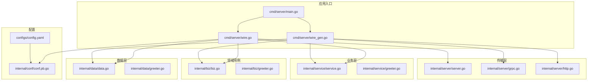
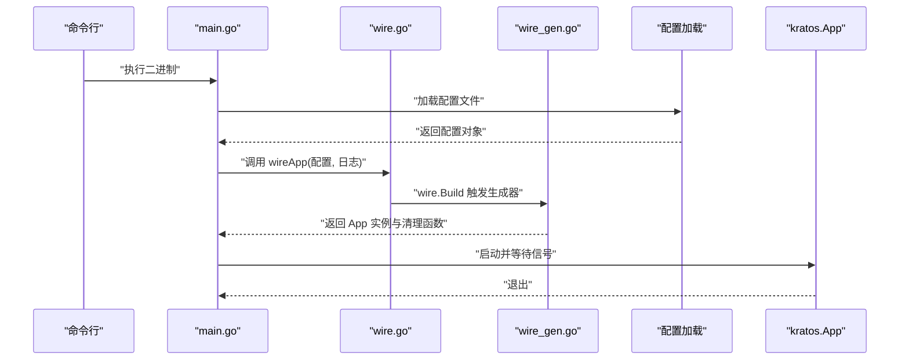
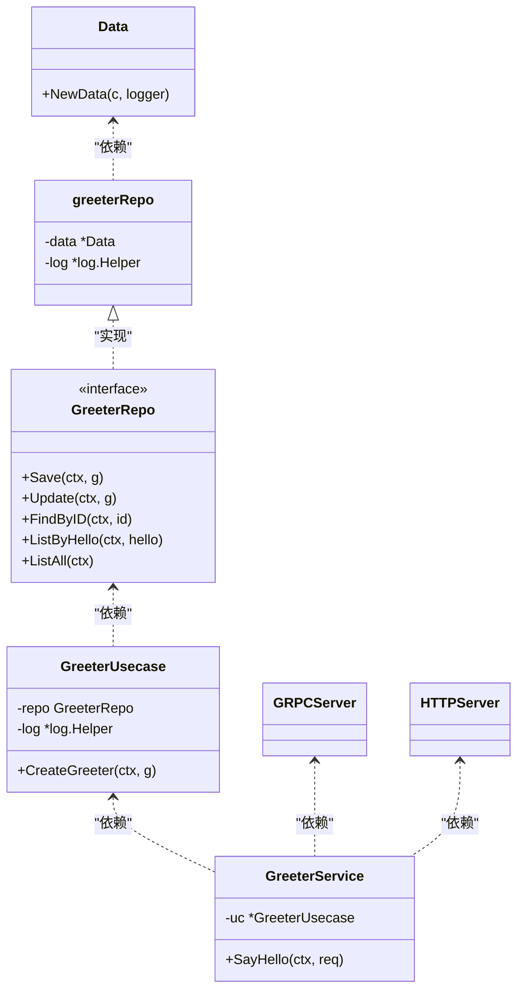
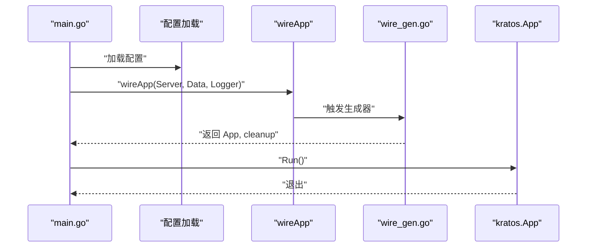
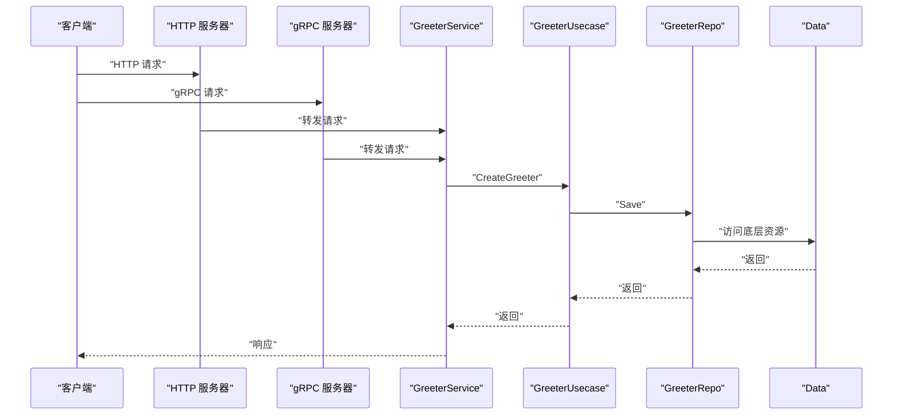
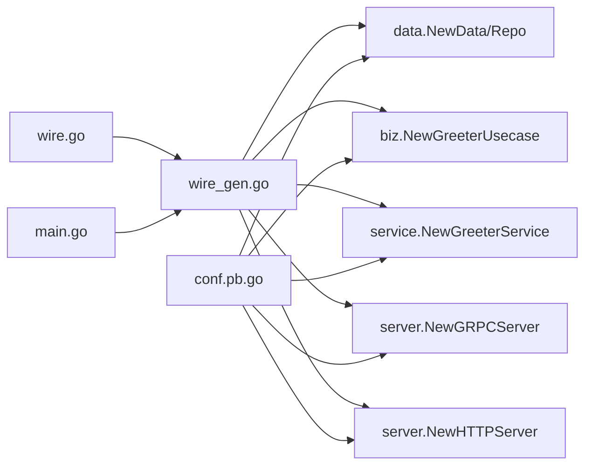

# 依赖注入（Wire）

<cite>
**本文引用的文件**
- [cmd/server/wire.go](file://cmd/server/wire.go)
- [cmd/server/wire_gen.go](file://cmd/server/wire_gen.go)
- [cmd/server/main.go](file://cmd/server/main.go)
- [internal/biz/biz.go](file://internal/biz/biz.go)
- [internal/biz/greeter.go](file://internal/biz/greeter.go)
- [internal/data/data.go](file://internal/data/data.go)
- [internal/data/greeter.go](file://internal/data/greeter.go)
- [internal/server/server.go](file://internal/server/server.go)
- [internal/server/grpc.go](file://internal/server/grpc.go)
- [internal/server/http.go](file://internal/server/http.go)
- [internal/service/service.go](file://internal/service/service.go)
- [internal/service/greeter.go](file://internal/service/greeter.go)
- [internal/conf/conf.pb.go](file://internal/conf/conf.pb.go)
- [configs/config.yaml](file://configs/config.yaml)
- [go.mod](file://go.mod)
- [README.md](file://README.md)
</cite>

## 目录
1. [引言](#引言)
2. [项目结构](#项目结构)
3. [核心组件](#核心组件)
4. [架构总览](#架构总览)
5. [详细组件分析](#详细组件分析)
6. [依赖关系分析](#依赖关系分析)
7. [性能考量](#性能考量)
8. [故障排查指南](#故障排查指南)
9. [结论](#结论)
10. [附录：新增服务/仓库的完整步骤](#附录新增服务仓库的完整步骤)

## 引言
本项目采用 Google Wire 进行依赖注入，通过 Provider Set 将 Service、Biz、Data 等层次的构造函数组织为可编译期验证的依赖图，并由 wire 生成器在构建时输出静态注入器代码。该方式避免运行时反射开销，提升启动性能与类型安全，同时在编译阶段即可发现缺失依赖或循环依赖问题。

## 项目结构
- cmd/server：应用入口与 Wire 注入器所在目录
  - main.go：解析配置、创建日志、调用 wireApp 启动应用
  - wire.go：声明 wireApp 的注入器模板（wire.Build）
  - wire_gen.go：由 wire 生成的静态注入器实现
- internal/*：分层业务模块
  - biz：领域用例层，定义 ProviderSet 与 GreeterUsecase
  - data：数据访问层，定义 ProviderSet 与 GreeterRepo 实现
  - service：服务层，定义 ProviderSet 与 GreeterService
  - server：传输层，定义 ProviderSet 与 gRPC/HTTP 服务器
- internal/conf：配置模型（由 proto 生成）
- configs：运行时配置文件
- go.mod：依赖声明（包含 google/wire）

图表来源
- [cmd/server/main.go](file://cmd/server/main.go#L1-L88)
- [cmd/server/wire.go](file://cmd/server/wire.go#L1-L24)
- [cmd/server/wire_gen.go](file://cmd/server/wire_gen.go#L1-L41)
- [internal/conf/conf.pb.go](file://internal/conf/conf.pb.go#L1-L653)
- [configs/config.yaml](file://configs/config.yaml#L1-L16)
- [internal/service/service.go](file://internal/service/service.go#L1-L7)
- [internal/service/greeter.go](file://internal/service/greeter.go#L1-L30)
- [internal/biz/biz.go](file://internal/biz/biz.go#L1-L7)
- [internal/biz/greeter.go](file://internal/biz/greeter.go#L1-L47)
- [internal/data/data.go](file://internal/data/data.go#L1-L25)
- [internal/data/greeter.go](file://internal/data/greeter.go#L1-L43)
- [internal/server/server.go](file://internal/server/server.go#L1-L9)
- [internal/server/grpc.go](file://internal/server/grpc.go#L1-L33)
- [internal/server/http.go](file://internal/server/http.go#L1-L33)

章节来源
- [cmd/server/main.go](file://cmd/server/main.go#L1-L88)
- [cmd/server/wire.go](file://cmd/server/wire.go#L1-L24)
- [cmd/server/wire_gen.go](file://cmd/server/wire_gen.go#L1-L41)
- [go.mod](file://go.mod#L1-L36)

## 核心组件
- Provider Set 定义
  - 数据层：在 data 包中以 ProviderSet 汇聚 NewData、NewGreeterRepo
  - 领域用例层：在 biz 包中以 ProviderSet 汇聚 NewGreeterUsecase
  - 服务层：在 service 包中以 ProviderSet 汇聚 NewGreeterService
  - 传输层：在 server 包中以 ProviderSet 汇聚 NewGRPCServer、NewHTTPServer
- 注入器 wireApp
  - 在 wire.go 中通过 wire.Build 聚合各 ProviderSet，并显式声明返回值类型与清理函数签名
  - 在 wire_gen.go 中由 wire 生成器产出完整的依赖装配逻辑
- 应用入口 main
  - 解析配置文件，加载到内部配置结构体
  - 调用 wireApp 获取 App 实例与清理函数
  - 启动应用并等待退出信号

章节来源
- [internal/data/data.go](file://internal/data/data.go#L1-L25)
- [internal/biz/biz.go](file://internal/biz/biz.go#L1-L7)
- [internal/service/service.go](file://internal/service/service.go#L1-L7)
- [internal/server/server.go](file://internal/server/server.go#L1-L9)
- [cmd/server/wire.go](file://cmd/server/wire.go#L1-L24)
- [cmd/server/wire_gen.go](file://cmd/server/wire_gen.go#L1-L41)
- [cmd/server/main.go](file://cmd/server/main.go#L1-L88)

## 架构总览
Wire 通过“注入器模板 + 静态生成”的方式，将多层 Provider 组织成一个可编译的依赖图。wire.go 中的 wire.Build 声明了依赖关系与返回值契约；wire 生成器在构建时根据依赖图生成 wire_gen.go，其中包含按顺序构造 Data、Repo、Usecase、Service、gRPC/HTTP 服务器以及最终 App 的完整流程。

图表来源
- [cmd/server/main.go](file://cmd/server/main.go#L1-L88)
- [cmd/server/wire.go](file://cmd/server/wire.go#L1-L24)
- [cmd/server/wire_gen.go](file://cmd/server/wire_gen.go#L1-L41)

## 详细组件分析

### Provider Set 定义与组织
- 数据层 ProviderSet
  - 聚合 NewData、NewGreeterRepo，前者负责资源初始化与清理回调，后者实现领域接口
- 领域用例层 ProviderSet
  - 聚合 NewGreeterUsecase，接收 Repo 与 Logger
- 服务层 ProviderSet
  - 聚合 NewGreeterService，接收 Usecase
- 传输层 ProviderSet
  - 聚合 NewGRPCServer、NewHTTPServer，接收配置与 Service

图表来源
- [internal/data/data.go](file://internal/data/data.go#L1-L25)
- [internal/data/greeter.go](file://internal/data/greeter.go#L1-L43)
- [internal/biz/greeter.go](file://internal/biz/greeter.go#L1-L47)
- [internal/service/greeter.go](file://internal/service/greeter.go#L1-L30)
- [internal/server/grpc.go](file://internal/server/grpc.go#L1-L33)
- [internal/server/http.go](file://internal/server/http.go#L1-L33)

章节来源
- [internal/data/data.go](file://internal/data/data.go#L1-L25)
- [internal/data/greeter.go](file://internal/data/greeter.go#L1-L43)
- [internal/biz/biz.go](file://internal/biz/biz.go#L1-L7)
- [internal/biz/greeter.go](file://internal/biz/greeter.go#L1-L47)
- [internal/service/service.go](file://internal/service/service.go#L1-L7)
- [internal/service/greeter.go](file://internal/service/greeter.go#L1-L30)
- [internal/server/server.go](file://internal/server/server.go#L1-L9)
- [internal/server/grpc.go](file://internal/server/grpc.go#L1-L33)
- [internal/server/http.go](file://internal/server/http.go#L1-L33)

### wire.go 中的注入器模板
- wire.Build 聚合 ProviderSet 并声明返回值类型为 (*kratos.App, func(), error)，确保生成器能正确推导依赖链
- 通过 panic(wire.Build(...)) 触发 wire 生成器在 wireinject 构建标签下生成注入器

章节来源
- [cmd/server/wire.go](file://cmd/server/wire.go#L1-L24)

### wire_gen.go 的生成过程与作用
- wire 生成器在非 wireinject 构建标签下忽略 wire.go 的桩代码，仅使用生成的注入器
- 生成器根据 wire.Build 的依赖关系，按顺序构造 Data、Repo、Usecase、Service、gRPC/HTTP 服务器，并最终组合为 App
- 清理函数会依次释放 Data 资源，保证资源生命周期管理

章节来源
- [cmd/server/wire_gen.go](file://cmd/server/wire_gen.go#L1-L41)

### main.go 的依赖注入调用链
- main 解析命令行参数，加载配置文件到内部结构
- 调用 wireApp 获取 App 与清理函数
- 启动 App 并等待退出信号

图表来源
- [cmd/server/main.go](file://cmd/server/main.go#L1-L88)
- [cmd/server/wire.go](file://cmd/server/wire.go#L1-L24)
- [cmd/server/wire_gen.go](file://cmd/server/wire_gen.go#L1-L41)

章节来源
- [cmd/server/main.go](file://cmd/server/main.go#L1-L88)

### 依赖注入调用链（从客户端到服务）
- 客户端请求到达 HTTP 或 gRPC 服务器
- 服务器将请求交给 GreeterService
- Service 调用 Usecase 创建 Greeter
- Usecase 通过 Repo 保存并返回结果

图表来源
- [internal/server/http.go](file://internal/server/http.go#L1-L33)
- [internal/server/grpc.go](file://internal/server/grpc.go#L1-L33)
- [internal/service/greeter.go](file://internal/service/greeter.go#L1-L30)
- [internal/biz/greeter.go](file://internal/biz/greeter.go#L1-L47)
- [internal/data/greeter.go](file://internal/data/greeter.go#L1-L43)
- [internal/data/data.go](file://internal/data/data.go#L1-L25)

## 依赖关系分析
- wire.go 作为注入器模板，聚合各层 ProviderSet，形成跨包依赖
- wire_gen.go 作为注入器实现，按依赖顺序构造对象并返回 App
- main.go 仅依赖注入器接口，不关心具体构造细节
- 配置通过 conf.pb.go 生成的结构体注入到各层构造函数

图表来源
- [cmd/server/wire.go](file://cmd/server/wire.go#L1-L24)
- [cmd/server/wire_gen.go](file://cmd/server/wire_gen.go#L1-L41)
- [cmd/server/main.go](file://cmd/server/main.go#L1-L88)
- [internal/conf/conf.pb.go](file://internal/conf/conf.pb.go#L1-L653)

章节来源
- [cmd/server/wire.go](file://cmd/server/wire.go#L1-L24)
- [cmd/server/wire_gen.go](file://cmd/server/wire_gen.go#L1-L41)
- [cmd/server/main.go](file://cmd/server/main.go#L1-L88)
- [internal/conf/conf.pb.go](file://internal/conf/conf.pb.go#L1-L653)

## 性能考量
- 静态代码生成：wire 在构建时生成注入器，避免运行时反射，启动更快、内存占用更低
- 编译时检查：wire.Build 会在编译阶段验证依赖完整性，提前暴露缺失或冲突
- 资源清理：Data 构造函数返回清理函数，wire_gen 会按顺序调用，确保资源释放

章节来源
- [cmd/server/wire_gen.go](file://cmd/server/wire_gen.go#L1-L41)
- [internal/data/data.go](file://internal/data/data.go#L1-L25)

## 故障排查指南
- 生成失败
  - 确认已安装 wire 并在 cmd/server 目录执行生成命令
  - 检查 wire.go 中 wire.Build 是否包含所有必需 ProviderSet
- 构造失败
  - 检查各 NewXxx 函数签名是否与 ProviderSet 声明一致
  - 确保依赖类型匹配（例如 Service 依赖的 Usecase、Repo 接口实现）
- 启动异常
  - 检查配置文件路径与格式
  - 确认配置结构体字段与 config.yaml 对应

章节来源
- [README.md](file://README.md#L1-L52)
- [cmd/server/wire.go](file://cmd/server/wire.go#L1-L24)
- [configs/config.yaml](file://configs/config.yaml#L1-L16)

## 结论
本项目通过 Google Wire 将 Service、Biz、Data、Server 四层清晰解耦，借助 Provider Set 与注入器模板实现强类型、可编译期验证的依赖装配。wire 生成器产出的静态注入器在启动时直接构造对象并管理资源生命周期，显著提升性能与可靠性。相比反射式 DI，Wire 在 Go 生态中具备更优的性能与可维护性。

## 附录：新增服务/仓库的完整步骤
- 新增仓库
  1) 在 data 包新增仓库实现与构造函数，并将其加入 data.ProviderSet
  2) 在 biz 层的 NewGreeterUsecase 中注入该仓库接口
  3) 在 biz.ProviderSet 中加入 NewGreeterUsecase
  4) 在 service 层的 NewGreeterService 中注入 Usecase
  5) 在 service.ProviderSet 中加入 NewGreeterService
  6) 在 server 层的 NewGRPCServer/NewHTTPServer 中注入 Service
  7) 在 server.ProviderSet 中加入 NewGRPCServer/NewHTTPServer
  8) 在 wire.go 的 wire.Build 中追加对应 ProviderSet
  9) 在 cmd/server 目录执行 wire 生成注入器
  10) 重新编译并验证启动
- 新增服务
  1) 在 service 包新增服务结构体与方法
  2) 在 service.ProviderSet 中注册服务构造函数
  3) 在 server 层的 NewGRPCServer/NewHTTPServer 中注入新服务
  4) 在 wire.go 的 wire.Build 中追加对应 ProviderSet
  5) 执行 wire 生成并编译验证

章节来源
- [internal/data/data.go](file://internal/data/data.go#L1-L25)
- [internal/data/greeter.go](file://internal/data/greeter.go#L1-L43)
- [internal/biz/biz.go](file://internal/biz/biz.go#L1-L7)
- [internal/biz/greeter.go](file://internal/biz/greeter.go#L1-L47)
- [internal/service/service.go](file://internal/service/service.go#L1-L7)
- [internal/service/greeter.go](file://internal/service/greeter.go#L1-L30)
- [internal/server/server.go](file://internal/server/server.go#L1-L9)
- [internal/server/grpc.go](file://internal/server/grpc.go#L1-L33)
- [internal/server/http.go](file://internal/server/http.go#L1-L33)
- [cmd/server/wire.go](file://cmd/server/wire.go#L1-L24)
- [README.md](file://README.md#L1-L52)