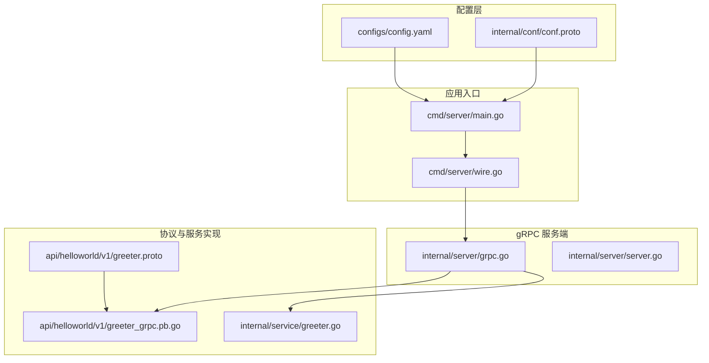
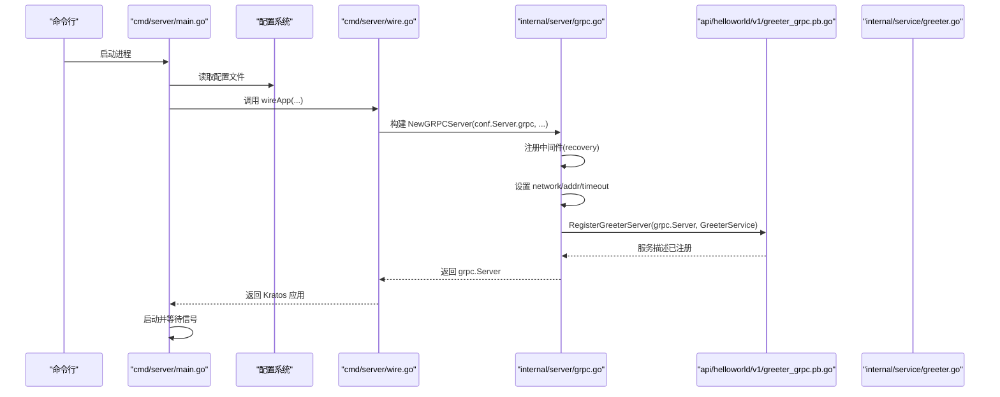
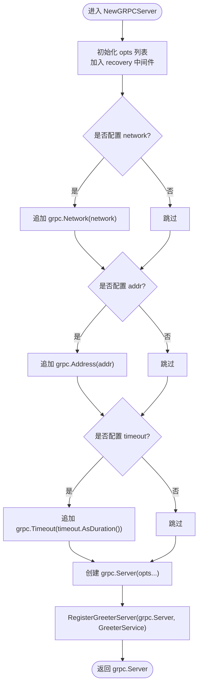
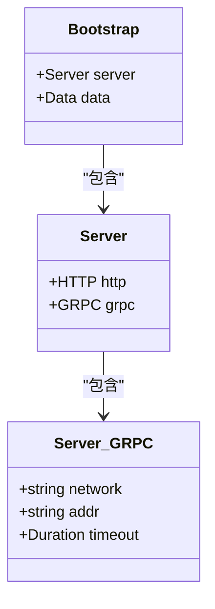
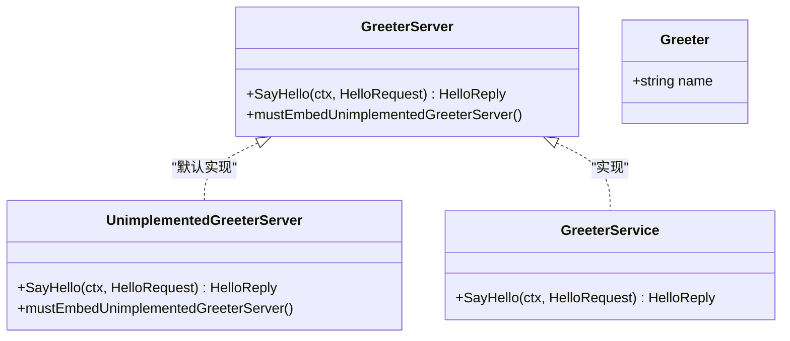
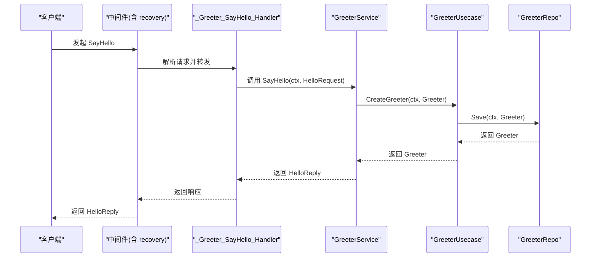
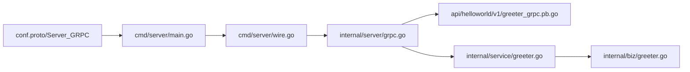

# gRPC 支持

<cite>
**本文引用的文件**
- [internal/server/grpc.go](file://internal/server/grpc.go)
- [internal/conf/conf.proto](file://internal/conf/conf.proto)
- [api/helloworld/v1/greeter_grpc.pb.go](file://api/helloworld/v1/greeter_grpc.pb.go)
- [api/helloworld/v1/greeter.proto](file://api/helloworld/v1/greeter.proto)
- [internal/service/greeter.go](file://internal/service/greeter.go)
- [cmd/server/main.go](file://cmd/server/main.go)
- [cmd/server/wire.go](file://cmd/server/wire.go)
- [configs/config.yaml](file://configs/config.yaml)
- [internal/server/server.go](file://internal/server/server.go)
- [internal/biz/greeter.go](file://internal/biz/greeter.go)
</cite>

## 目录
1. [简介](#简介)
2. [项目结构](#项目结构)
3. [核心组件](#核心组件)
4. [架构总览](#架构总览)
5. [详细组件分析](#详细组件分析)
6. [依赖关系分析](#依赖关系分析)
7. [性能考量](#性能考量)
8. [故障排查指南](#故障排查指南)
9. [结论](#结论)
10. [附录](#附录)

## 简介
本章节聚焦于项目中 gRPC 服务的实现机制，围绕 Kratos 框架在 internal/server/grpc.go 中的 NewGRPCServer 函数展开，系统说明：
- 如何通过 Kratos 的 grpc.ServerOption 注册中间件（如 recovery）
- 如何从 conf.proto 的 Server_GRPC 结构体加载运行时配置，并与 grpc.ServerOption 集成
- api/helloworld/v1/greeter_grpc.pb.go 中 RegisterGreeterServer 的作用及 GreeterServer 接口的定义与服务注册流程
- 提供 gRPC 客户端调用示例（如使用 grpcurl），说明 SayHello 方法的请求格式与响应结构
- 指导开发者如何为新服务添加 gRPC 支持，并确保与依赖注入（Wire）系统的兼容性

## 项目结构
该项目采用 Kratos 标准布局，gRPC 相关代码主要分布在以下位置：
- 配置模型：internal/conf/conf.proto 定义了 Server.grpc 字段（network、addr、timeout）
- gRPC 服务端：internal/server/grpc.go 使用 Kratos 初始化 gRPC 服务器，注册中间件与服务
- 协议与桩代码：api/helloworld/v1/greeter.proto 生成的 greeter_grpc.pb.go
- 业务服务实现：internal/service/greeter.go 实现 GreeterServer.SayHello
- 应用入口与依赖注入：cmd/server/main.go 加载配置并通过 Wire 构建应用；cmd/server/wire.go 组装 ProviderSet
- 运行配置：configs/config.yaml 提供默认运行参数

图表来源
- [internal/server/grpc.go](file://internal/server/grpc.go#L1-L33)
- [internal/conf/conf.proto](file://internal/conf/conf.proto#L1-L42)
- [api/helloworld/v1/greeter_grpc.pb.go](file://api/helloworld/v1/greeter_grpc.pb.go#L1-L108)
- [api/helloworld/v1/greeter.proto](file://api/helloworld/v1/greeter.proto#L1-L31)
- [cmd/server/main.go](file://cmd/server/main.go#L1-L88)
- [cmd/server/wire.go](file://cmd/server/wire.go#L1-L24)

章节来源
- [internal/server/grpc.go](file://internal/server/grpc.go#L1-L33)
- [internal/conf/conf.proto](file://internal/conf/conf.proto#L1-L42)
- [api/helloworld/v1/greeter_grpc.pb.go](file://api/helloworld/v1/greeter_grpc.pb.go#L1-L108)
- [api/helloworld/v1/greeter.proto](file://api/helloworld/v1/greeter.proto#L1-L31)
- [cmd/server/main.go](file://cmd/server/main.go#L1-L88)
- [cmd/server/wire.go](file://cmd/server/wire.go#L1-L24)

## 核心组件
- NewGRPCServer：基于 conf.Server.grpc 初始化 gRPC 服务器，注册 recovery 中间件，并根据配置设置 network、address、timeout，最后注册 Greeter 服务
- Server_GRPC：conf.proto 中的 GRPC 子结构，包含 network、addr、timeout 字段，用于运行时配置
- RegisterGreeterServer：将 GreeterServer 实例注册到 grpc.Server
- GreeterServer 接口：定义 SayHello 方法，作为 gRPC 服务的实现契约
- GreeterService：GreeterServer 的具体实现，调用 usecase 并返回 HelloReply
- Wire ProviderSet：将 NewGRPCServer 纳入依赖注入，由 wireApp 统一构建 Kratos 应用

章节来源
- [internal/server/grpc.go](file://internal/server/grpc.go#L1-L33)
- [internal/conf/conf.proto](file://internal/conf/conf.proto#L1-L42)
- [api/helloworld/v1/greeter_grpc.pb.go](file://api/helloworld/v1/greeter_grpc.pb.go#L1-L108)
- [internal/service/greeter.go](file://internal/service/greeter.go#L1-L30)
- [internal/server/server.go](file://internal/server/server.go#L1-L9)
- [cmd/server/wire.go](file://cmd/server/wire.go#L1-L24)

## 架构总览
下图展示了从配置加载到 gRPC 服务启动与注册的关键路径，以及 Wire 依赖注入的组装过程。

图表来源
- [cmd/server/main.go](file://cmd/server/main.go#L1-L88)
- [cmd/server/wire.go](file://cmd/server/wire.go#L1-L24)
- [internal/server/grpc.go](file://internal/server/grpc.go#L1-L33)
- [api/helloworld/v1/greeter_grpc.pb.go](file://api/helloworld/v1/greeter_grpc.pb.go#L1-L108)
- [internal/service/greeter.go](file://internal/service/greeter.go#L1-L30)

## 详细组件分析

### NewGRPCServer 函数与中间件、网络配置、地址绑定、超时设置
- 中间件注册：通过 grpc.Middleware 注册 recovery 中间件，用于捕获 panic 并返回标准错误
- 网络配置：当 conf.Server.grpc.network 非空时，使用 grpc.Network 将其传入 grpc.ServerOption
- 地址绑定：当 conf.Server.grpc.addr 非空时，使用 grpc.Address 将监听地址传入 grpc.ServerOption
- 超时设置：当 conf.Server.grpc.timeout 非空时，使用 grpc.Timeout 将持续时间传入 grpc.ServerOption
- 服务注册：创建 grpc.Server 后，调用 RegisterGreeterServer 将 GreeterService 实例注册到服务器

图表来源
- [internal/server/grpc.go](file://internal/server/grpc.go#L1-L33)

章节来源
- [internal/server/grpc.go](file://internal/server/grpc.go#L1-L33)

### 配置加载与 Server_GRPC 集成
- conf.proto 定义了 Server.grpc 子结构，包含 network、addr、timeout 字段
- conf.pb.go 生成了 Server_GRPC 结构体，其中包含与 proto 对应的字段
- cmd/server/main.go 通过配置源加载 config.yaml，扫描到 conf.Bootstrap 后，将 conf.Server 传递给 wireApp
- wireApp 通过 ProviderSet 将 NewGRPCServer 注入，最终构建 Kratos 应用

图表来源
- [internal/conf/conf.proto](file://internal/conf/conf.proto#L1-L42)
- [internal/conf/conf.pb.go](file://internal/conf/conf.pb.go#L246-L310)
- [cmd/server/main.go](file://cmd/server/main.go#L1-L88)
- [cmd/server/wire.go](file://cmd/server/wire.go#L1-L24)

章节来源
- [internal/conf/conf.proto](file://internal/conf/conf.proto#L1-L42)
- [internal/conf/conf.pb.go](file://internal/conf/conf.pb.go#L246-L310)
- [cmd/server/main.go](file://cmd/server/main.go#L1-L88)
- [cmd/server/wire.go](file://cmd/server/wire.go#L1-L24)

### GreeterServer 接口定义与服务注册流程
- GreeterServer 接口定义了 SayHello 方法，作为服务契约
- RegisterGreeterServer 将 GreeterServer 实例与服务描述绑定，注册到 grpc.Server
- 内部处理器 _Greeter_SayHello_Handler 将 unary 调用转发到 GreeterServer.SayHello
- UnimplementedGreeterServer 提供默认未实现行为，保证向后兼容

图表来源
- [api/helloworld/v1/greeter_grpc.pb.go](file://api/helloworld/v1/greeter_grpc.pb.go#L1-L108)
- [internal/service/greeter.go](file://internal/service/greeter.go#L1-L30)

章节来源
- [api/helloworld/v1/greeter_grpc.pb.go](file://api/helloworld/v1/greeter_grpc.pb.go#L1-L108)
- [internal/service/greeter.go](file://internal/service/greeter.go#L1-L30)

### 业务链路与数据流
- 客户端发起 SayHello 请求
- gRPC 服务器经中间件处理后，调用 GreeterService.SayHello
- 服务调用 usecase 层进行业务处理，返回 HelloReply
- 响应通过拦截器返回客户端

图表来源
- [api/helloworld/v1/greeter_grpc.pb.go](file://api/helloworld/v1/greeter_grpc.pb.go#L1-L108)
- [internal/service/greeter.go](file://internal/service/greeter.go#L1-L30)
- [internal/biz/greeter.go](file://internal/biz/greeter.go#L1-L47)

章节来源
- [api/helloworld/v1/greeter_grpc.pb.go](file://api/helloworld/v1/greeter_grpc.pb.go#L1-L108)
- [internal/service/greeter.go](file://internal/service/greeter.go#L1-L30)
- [internal/biz/greeter.go](file://internal/biz/greeter.go#L1-L47)

### gRPC 客户端调用示例（grpcurl）
- 服务端监听地址来自配置：configs/config.yaml 中 grpc.addr
- 方法全名：/helloworld.v1.Greeter/SayHello
- 请求消息结构：HelloRequest.name
- 响应消息结构：HelloReply.message

示例调用步骤（概念性说明，不展示具体命令）：
- 使用 grpcurl 连接到 gRPC 服务器地址
- 指定服务方法为 /helloworld.v1.Greeter/SayHello
- 请求体为包含 name 字段的对象
- 观察返回的 message 字段

章节来源
- [configs/config.yaml](file://configs/config.yaml#L1-L16)
- [api/helloworld/v1/greeter.proto](file://api/helloworld/v1/greeter.proto#L1-L31)
- [api/helloworld/v1/greeter_grpc.pb.go](file://api/helloworld/v1/greeter_grpc.pb.go#L1-L108)

### 新增 gRPC 服务的步骤与 Wire 兼容性
- 定义协议：在 api/your_service/v1 下新增 .proto 文件，定义 service 与消息类型
- 生成桩代码：执行 protoc-gen-go-grpc 生成 *_grpc.pb.go
- 实现服务：在 internal/service 下新增对应服务实现，实现 GreeterServer 类似的接口
- 注册服务：在 internal/server/grpc.go 中调用 RegisterYourServer(...) 将服务实例注册到 grpc.Server
- 配置运行参数：在 configs/config.yaml 中为 grpc 添加 addr/timeout 等字段
- 集成 Wire：在 internal/server/server.go 的 ProviderSet 中包含你的 NewYourServer(...)，并在 cmd/server/wire.go 中纳入 ProviderSet

章节来源
- [api/helloworld/v1/greeter.proto](file://api/helloworld/v1/greeter.proto#L1-L31)
- [api/helloworld/v1/greeter_grpc.pb.go](file://api/helloworld/v1/greeter_grpc.pb.go#L1-L108)
- [internal/server/grpc.go](file://internal/server/grpc.go#L1-L33)
- [internal/server/server.go](file://internal/server/server.go#L1-L9)
- [cmd/server/wire.go](file://cmd/server/wire.go#L1-L24)
- [configs/config.yaml](file://configs/config.yaml#L1-L16)

## 依赖关系分析
- NewGRPCServer 依赖 conf.Server.grpc（network/addr/timeout）、recovery 中间件、RegisterGreeterServer
- GreeterService 实现 GreeterServer 接口，依赖 usecase 层
- Wire 通过 ProviderSet 将 NewGRPCServer 注入到应用构建流程
- main.go 通过配置源加载 config.yaml，扫描 conf.Bootstrap，再交由 wireApp 构建 Kratos 应用

图表来源
- [internal/conf/conf.proto](file://internal/conf/conf.proto#L1-L42)
- [cmd/server/main.go](file://cmd/server/main.go#L1-L88)
- [cmd/server/wire.go](file://cmd/server/wire.go#L1-L24)
- [internal/server/grpc.go](file://internal/server/grpc.go#L1-L33)
- [api/helloworld/v1/greeter_grpc.pb.go](file://api/helloworld/v1/greeter_grpc.pb.go#L1-L108)
- [internal/service/greeter.go](file://internal/service/greeter.go#L1-L30)
- [internal/biz/greeter.go](file://internal/biz/greeter.go#L1-L47)

章节来源
- [internal/conf/conf.proto](file://internal/conf/conf.proto#L1-L42)
- [cmd/server/main.go](file://cmd/server/main.go#L1-L88)
- [cmd/server/wire.go](file://cmd/server/wire.go#L1-L24)
- [internal/server/grpc.go](file://internal/server/grpc.go#L1-L33)
- [api/helloworld/v1/greeter_grpc.pb.go](file://api/helloworld/v1/greeter_grpc.pb.go#L1-L108)
- [internal/service/greeter.go](file://internal/service/greeter.go#L1-L30)
- [internal/biz/greeter.go](file://internal/biz/greeter.go#L1-L47)

## 性能考量
- 中间件开销：recovery 中间件会增加少量调用栈成本，但可显著提升稳定性
- 超时控制：合理设置 grpc.Timeout 可避免请求堆积与资源占用
- 网络与地址：network/addr 的选择影响连接建立与监听效率，建议结合部署环境优化
- 依赖注入：通过 Wire 统一管理依赖，减少重复初始化与配置遗漏

## 故障排查指南
- 无法启动 gRPC 服务
  - 检查 configs/config.yaml 中 grpc.addr 是否被其他进程占用
  - 确认 conf.proto 与 conf.pb.go 一致，且配置扫描成功
- SayHello 未生效
  - 确认 RegisterGreeterServer 已在 NewGRPCServer 中调用
  - 检查 GreeterService 是否正确实现 SayHello
- 调用异常或崩溃
  - recovery 中间件会捕获 panic 并返回错误，查看日志定位具体错误
- Wire 构建失败
  - 确保 ProviderSet 包含 NewGRPCServer，并在 wireApp 中正确组装

章节来源
- [configs/config.yaml](file://configs/config.yaml#L1-L16)
- [internal/server/grpc.go](file://internal/server/grpc.go#L1-L33)
- [internal/service/greeter.go](file://internal/service/greeter.go#L1-L30)
- [cmd/server/wire.go](file://cmd/server/wire.go#L1-L24)

## 结论
本项目以 Kratos 为核心，通过 NewGRPCServer 将中间件、网络配置、地址绑定与超时设置统一集成，并借助 conf.proto 的 Server_GRPC 结构体实现运行时配置驱动。GreeterServer 接口与 GreeterService 的实现清晰分离了协议与业务逻辑，配合 Wire 依赖注入，形成可扩展、可维护的 gRPC 服务架构。新增服务时，遵循协议定义、桩代码生成、服务实现、注册与配置的流程即可快速接入。

## 附录
- 配置样例参考：configs/config.yaml
- 协议样例参考：api/helloworld/v1/greeter.proto
- 服务端实现参考：internal/service/greeter.go
- gRPC 服务注册参考：internal/server/grpc.go