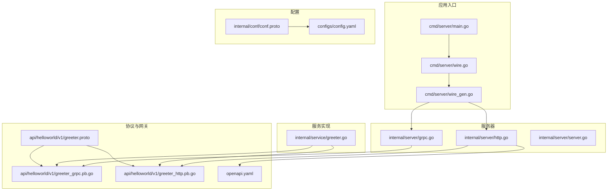
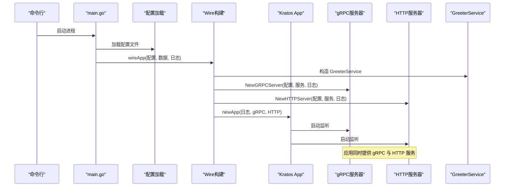
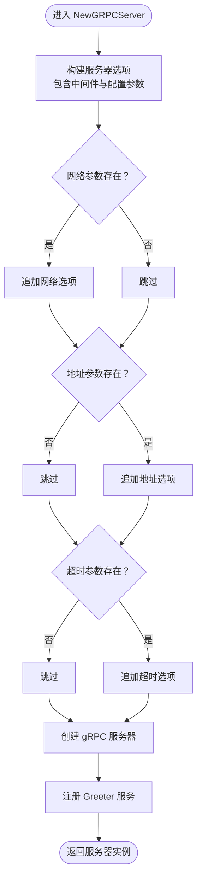
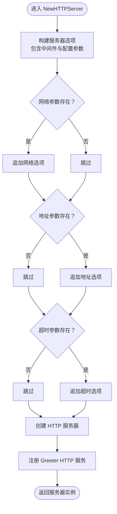
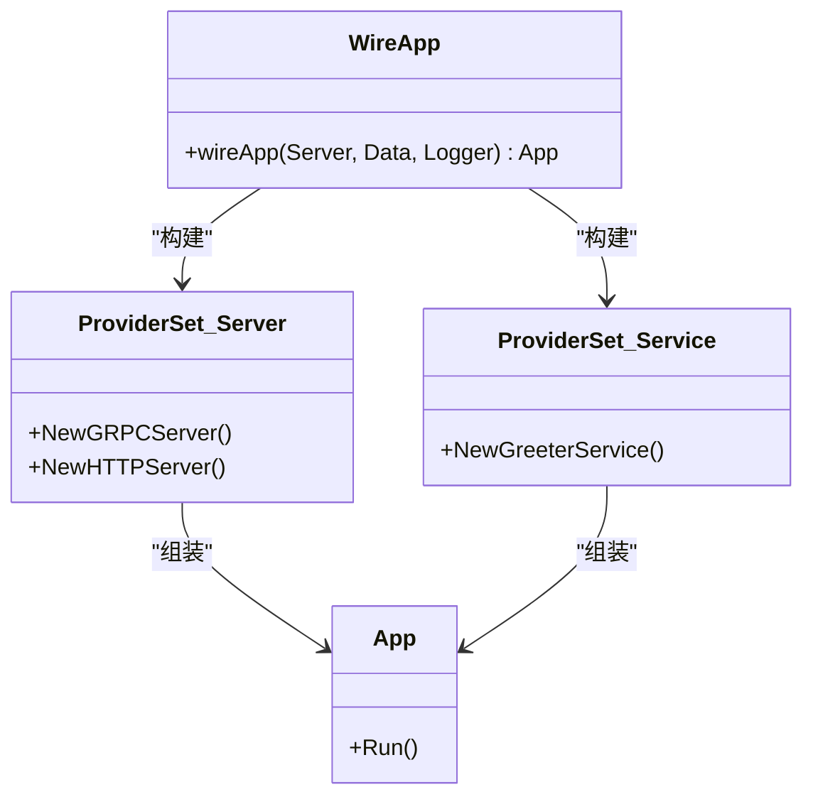
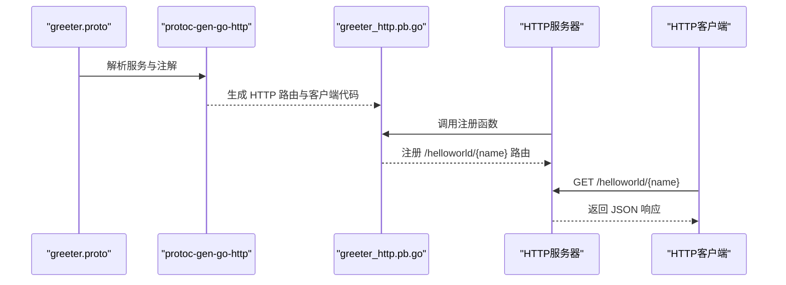
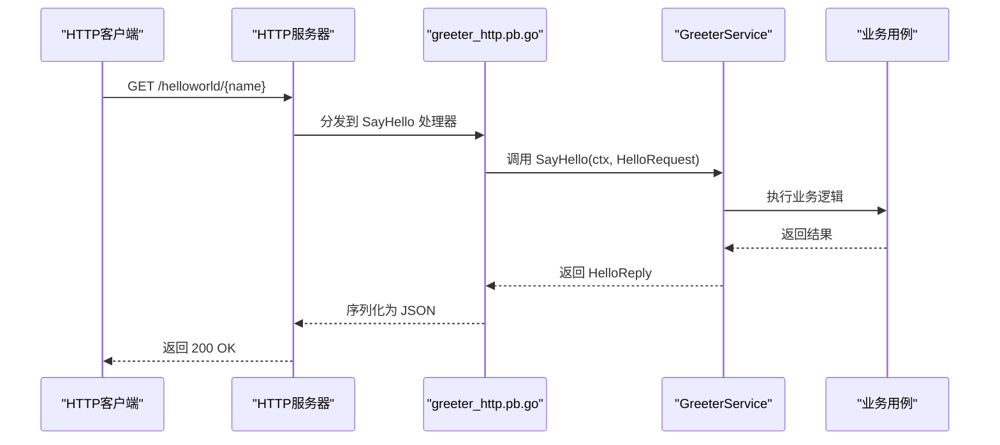
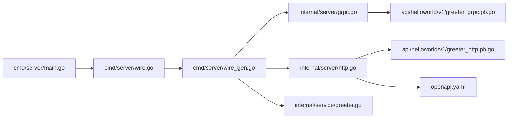

# 双协议支持

<cite>
**本文引用的文件**
- [internal/server/grpc.go](file://internal/server/grpc.go)
- [internal/server/http.go](file://internal/server/http.go)
- [internal/server/server.go](file://internal/server/server.go)
- [cmd/server/main.go](file://cmd/server/main.go)
- [cmd/server/wire.go](file://cmd/server/wire.go)
- [cmd/server/wire_gen.go](file://cmd/server/wire_gen.go)
- [internal/conf/conf.proto](file://internal/conf/conf.proto)
- [configs/config.yaml](file://configs/config.yaml)
- [api/helloworld/v1/greeter.proto](file://api/helloworld/v1/greeter.proto)
- [api/helloworld/v1/greeter_grpc.pb.go](file://api/helloworld/v1/greeter_grpc.pb.go)
- [api/helloworld/v1/greeter_http.pb.go](file://api/helloworld/v1/greeter_http.pb.go)
- [openapi.yaml](file://openapi.yaml)
- [internal/service/greeter.go](file://internal/service/greeter.go)
- [third_party/google/api/annotations.proto](file://third_party/google/api/annotations.proto)
</cite>

## 目录
1. [简介](#简介)
2. [项目结构](#项目结构)
3. [核心组件](#核心组件)
4. [架构总览](#架构总览)
5. [详细组件分析](#详细组件分析)
6. [依赖关系分析](#依赖关系分析)
7. [性能考量](#性能考量)
8. [故障排查指南](#故障排查指南)
9. [结论](#结论)
10. [附录：新增服务双协议支持指南](#附录新增服务双协议支持指南)

## 简介
本项目在 Kratos 框架基础上实现了同时支持 gRPC 和 HTTP 的双协议服务。通过 Protocol Buffer 定义服务契约，并利用 grpc-gateway 将 HTTP 注解转换为 RESTful 路由，再由 Kratos HTTP 服务器注册到统一的应用生命周期管理中。配置文件提供端口与超时参数，Wire 依赖注入负责组装应用实例。OpenAPI 规范文件由 protoc-gen-openapi 生成，用于对外暴露 HTTP API 的 OpenAPI 规范。

## 项目结构
- 协议与路由层
  - gRPC 服务器初始化与中间件注册：internal/server/grpc.go
  - HTTP 服务器初始化与中间件注册：internal/server/http.go
  - 服务器集合 ProviderSet：internal/server/server.go
- 应用入口与依赖注入
  - 应用入口 main：cmd/server/main.go
  - Wire 构建入口：cmd/server/wire.go
  - Wire 生成文件：cmd/server/wire_gen.go
- 配置与运行参数
  - 配置模型定义：internal/conf/conf.proto
  - 运行配置样例：configs/config.yaml
- 协议与网关
  - gRPC 服务定义与注解：api/helloworld/v1/greeter.proto
  - gRPC 服务桩：api/helloworld/v1/greeter_grpc.pb.go
  - HTTP 网关桩：api/helloworld/v1/greeter_http.pb.go
  - OpenAPI 规范：openapi.yaml
- 业务与服务层
  - 业务服务实现：internal/service/greeter.go

图表来源
- [cmd/server/main.go](file://cmd/server/main.go#L36-L48)
- [cmd/server/wire.go](file://cmd/server/wire.go#L20-L23)
- [cmd/server/wire_gen.go](file://cmd/server/wire_gen.go#L25-L40)
- [internal/conf/conf.proto](file://internal/conf/conf.proto#L13-L26)
- [configs/config.yaml](file://configs/config.yaml#L1-L16)
- [api/helloworld/v1/greeter.proto](file://api/helloworld/v1/greeter.proto#L12-L20)
- [api/helloworld/v1/greeter_grpc.pb.go](file://api/helloworld/v1/greeter_grpc.pb.go#L71-L73)
- [api/helloworld/v1/greeter_http.pb.go](file://api/helloworld/v1/greeter_http.pb.go#L24-L27)
- [internal/server/grpc.go](file://internal/server/grpc.go#L14-L32)
- [internal/server/http.go](file://internal/server/http.go#L14-L32)
- [internal/server/server.go](file://internal/server/server.go#L7-L9)
- [internal/service/greeter.go](file://internal/service/greeter.go#L10-L30)

章节来源
- [cmd/server/main.go](file://cmd/server/main.go#L36-L48)
- [cmd/server/wire.go](file://cmd/server/wire.go#L20-L23)
- [cmd/server/wire_gen.go](file://cmd/server/wire_gen.go#L25-L40)
- [internal/conf/conf.proto](file://internal/conf/conf.proto#L13-L26)
- [configs/config.yaml](file://configs/config.yaml#L1-L16)
- [api/helloworld/v1/greeter.proto](file://api/helloworld/v1/greeter.proto#L12-L20)
- [api/helloworld/v1/greeter_grpc.pb.go](file://api/helloworld/v1/greeter_grpc.pb.go#L71-L73)
- [api/helloworld/v1/greeter_http.pb.go](file://api/helloworld/v1/greeter_http.pb.go#L24-L27)
- [internal/server/grpc.go](file://internal/server/grpc.go#L14-L32)
- [internal/server/http.go](file://internal/server/http.go#L14-L32)
- [internal/server/server.go](file://internal/server/server.go#L7-L9)
- [internal/service/greeter.go](file://internal/service/greeter.go#L10-L30)

## 核心组件
- gRPC 服务器初始化
  - 中间件：恢复中间件
  - 端口绑定：从配置读取网络类型、地址与超时
  - 服务注册：将 GreeterService 注册到 gRPC 服务器
- HTTP 服务器初始化
  - 中间件：恢复中间件
  - 端口绑定：从配置读取网络类型、地址与超时
  - 服务注册：通过 greeter_http.pb.go 提供的 HTTP 注册函数注册 GreeterService
- 应用生命周期
  - 使用 Kratos App 同时启动 gRPC 与 HTTP 服务器
  - 通过 Wire 统一装配 GreeterService、服务器与日志器
- OpenAPI 规范
  - 由 protoc-gen-openapi 基于 proto 注解生成，描述 HTTP 接口路径、参数与响应

章节来源
- [internal/server/grpc.go](file://internal/server/grpc.go#L14-L32)
- [internal/server/http.go](file://internal/server/http.go#L14-L32)
- [cmd/server/main.go](file://cmd/server/main.go#L36-L48)
- [cmd/server/wire.go](file://cmd/server/wire.go#L20-L23)
- [cmd/server/wire_gen.go](file://cmd/server/wire_gen.go#L25-L40)
- [openapi.yaml](file://openapi.yaml#L1-L40)

## 架构总览
下图展示了从应用启动到双协议服务运行的关键流程，包括配置加载、依赖注入、服务器初始化与服务注册。

图表来源
- [cmd/server/main.go](file://cmd/server/main.go#L61-L87)
- [cmd/server/wire.go](file://cmd/server/wire.go#L20-L23)
- [cmd/server/wire_gen.go](file://cmd/server/wire_gen.go#L25-L40)
- [internal/server/grpc.go](file://internal/server/grpc.go#L14-L32)
- [internal/server/http.go](file://internal/server/http.go#L14-L32)

## 详细组件分析

### gRPC 服务器初始化（internal/server/grpc.go）
- 端口绑定
  - 通过配置对象读取网络类型、监听地址与超时，动态设置 gRPC 服务器选项
- 中间件注册
  - 注册恢复中间件以增强稳定性
- 服务注册
  - 将 GreeterService 注册到 gRPC 服务器，使其可被客户端调用
- 复杂度与性能
  - 初始化为 O(1)，注册服务为 O(1)，性能开销极低
- 错误处理
  - 未显式处理 gRPC 服务器创建错误，应在上层捕获并记录

图表来源
- [internal/server/grpc.go](file://internal/server/grpc.go#L14-L32)

章节来源
- [internal/server/grpc.go](file://internal/server/grpc.go#L14-L32)

### HTTP 服务器初始化（internal/server/http.go）
- 端口绑定
  - 通过配置对象读取网络类型、监听地址与超时，动态设置 HTTP 服务器选项
- 中间件注册
  - 注册恢复中间件以增强稳定性
- 服务注册
  - 通过 greeter_http.pb.go 中的注册函数将 GreeterService 注册到 HTTP 服务器
- 复杂度与性能
  - 初始化为 O(1)，注册路由为 O(1)，性能开销极低
- 错误处理
  - 未显式处理 HTTP 服务器创建错误，应在上层捕获并记录

图表来源
- [internal/server/http.go](file://internal/server/http.go#L14-L32)

章节来源
- [internal/server/http.go](file://internal/server/http.go#L14-L32)

### 依赖注入与应用生命周期（cmd/server）
- Wire 构建
  - 在 wire.go 中定义 wireApp，聚合 server、data、biz、service ProviderSet 并构造 Kratos App
  - wire_gen.go 由 Wire 生成，按依赖顺序创建 GreeterService、gRPC/HTTP 服务器并组装应用
- 应用启动
  - main.go 加载配置、解析参数，调用 wireApp 获取 App 实例并运行
- 服务器集合
  - server.go 中 ProviderSet 将 NewGRPCServer 与 NewHTTPServer 暴露给 Wire

图表来源
- [cmd/server/wire.go](file://cmd/server/wire.go#L20-L23)
- [cmd/server/wire_gen.go](file://cmd/server/wire_gen.go#L25-L40)
- [internal/server/server.go](file://internal/server/server.go#L7-L9)

章节来源
- [cmd/server/wire.go](file://cmd/server/wire.go#L20-L23)
- [cmd/server/wire_gen.go](file://cmd/server/wire_gen.go#L25-L40)
- [internal/server/server.go](file://internal/server/server.go#L7-L9)
- [cmd/server/main.go](file://cmd/server/main.go#L72-L87)

### Protocol Buffer 与 grpc-gateway 生成机制
- 协议定义
  - greeter.proto 中定义 Greeter 服务与 SayHello 方法，并通过 google.api.annotations.proto 中的 http 选项声明 HTTP 映射规则
- gRPC 服务桩
  - greeter_grpc.pb.go 提供 gRPC 服务注册与方法分发
- HTTP 网关桩
  - greeter_http.pb.go 由 protoc-gen-go-http 生成，提供 HTTP 路由注册函数与客户端封装
  - 注册函数会将 GET /helloworld/{name} 路由映射到 SayHello 方法
- OpenAPI 规范
  - openapi.yaml 由 protoc-gen-openapi 基于 proto 注解生成，描述 HTTP 接口路径、参数与响应结构

图表来源
- [api/helloworld/v1/greeter.proto](file://api/helloworld/v1/greeter.proto#L12-L20)
- [api/helloworld/v1/greeter_http.pb.go](file://api/helloworld/v1/greeter_http.pb.go#L24-L27)
- [openapi.yaml](file://openapi.yaml#L9-L30)
- [third_party/google/api/annotations.proto](file://third_party/google/api/annotations.proto#L28-L31)

章节来源
- [api/helloworld/v1/greeter.proto](file://api/helloworld/v1/greeter.proto#L12-L20)
- [api/helloworld/v1/greeter_grpc.pb.go](file://api/helloworld/v1/greeter_grpc.pb.go#L71-L73)
- [api/helloworld/v1/greeter_http.pb.go](file://api/helloworld/v1/greeter_http.pb.go#L24-L27)
- [openapi.yaml](file://openapi.yaml#L1-L40)
- [third_party/google/api/annotations.proto](file://third_party/google/api/annotations.proto#L28-L31)

### 业务服务与数据流
- 业务服务 GreeterService 实现 SayHello，调用 usecase 层并返回响应
- HTTP 与 gRPC 共享同一业务逻辑，分别通过各自的桩文件进行路由与调用

图表来源
- [internal/service/greeter.go](file://internal/service/greeter.go#L22-L30)
- [api/helloworld/v1/greeter_http.pb.go](file://api/helloworld/v1/greeter_http.pb.go#L29-L49)

章节来源
- [internal/service/greeter.go](file://internal/service/greeter.go#L10-L30)
- [api/helloworld/v1/greeter_http.pb.go](file://api/helloworld/v1/greeter_http.pb.go#L29-L49)

## 依赖关系分析
- 组件耦合
  - server 层仅依赖 conf 与 service，保持较低耦合
  - main 与 wire 通过 ProviderSet 解耦具体实现
- 直接依赖
  - gRPC 依赖 greeter_grpc.pb.go 的服务注册
  - HTTP 依赖 greeter_http.pb.go 的路由注册
- 外部依赖
  - Kratos 框架提供的 gRPC/HTTP 传输与中间件
  - Wire 提供的依赖注入能力
- 循环依赖
  - 未发现循环依赖迹象

图表来源
- [cmd/server/main.go](file://cmd/server/main.go#L72-L87)
- [cmd/server/wire.go](file://cmd/server/wire.go#L20-L23)
- [cmd/server/wire_gen.go](file://cmd/server/wire_gen.go#L25-L40)
- [internal/server/grpc.go](file://internal/server/grpc.go#L14-L32)
- [internal/server/http.go](file://internal/server/http.go#L14-L32)
- [internal/service/greeter.go](file://internal/service/greeter.go#L10-L30)
- [api/helloworld/v1/greeter_grpc.pb.go](file://api/helloworld/v1/greeter_grpc.pb.go#L71-L73)
- [api/helloworld/v1/greeter_http.pb.go](file://api/helloworld/v1/greeter_http.pb.go#L24-L27)
- [openapi.yaml](file://openapi.yaml#L1-L40)

章节来源
- [cmd/server/main.go](file://cmd/server/main.go#L72-L87)
- [cmd/server/wire.go](file://cmd/server/wire.go#L20-L23)
- [cmd/server/wire_gen.go](file://cmd/server/wire_gen.go#L25-L40)
- [internal/server/grpc.go](file://internal/server/grpc.go#L14-L32)
- [internal/server/http.go](file://internal/server/http.go#L14-L32)
- [internal/service/greeter.go](file://internal/service/greeter.go#L10-L30)
- [api/helloworld/v1/greeter_grpc.pb.go](file://api/helloworld/v1/greeter_grpc.pb.go#L71-L73)
- [api/helloworld/v1/greeter_http.pb.go](file://api/helloworld/v1/greeter_http.pb.go#L24-L27)
- [openapi.yaml](file://openapi.yaml#L1-L40)

## 性能考量
- 传输效率
  - gRPC 使用二进制协议，序列化开销小，适合高并发与低延迟场景
  - HTTP 使用 JSON，便于浏览器与第三方工具调试，但序列化开销相对较大
- 资源占用
  - 两个服务器独立监听不同端口，资源占用线性叠加
  - 中间件（恢复）开销极低
- 超时控制
  - 通过配置统一设置超时，避免请求阻塞
- 建议
  - 内部微服务间优先使用 gRPC
  - 对外暴露或需要浏览器直连时使用 HTTP

[本节为通用建议，不直接分析具体文件]

## 故障排查指南
- 无法启动 HTTP/gRPC 服务器
  - 检查配置文件中的端口是否被占用
  - 确认配置项与 conf.proto 结构一致
- 请求无响应或超时
  - 检查服务注册是否正确（gRPC 与 HTTP 均需注册 GreeterService）
  - 核对中间件链路是否中断
- HTTP 接口 404 或参数绑定失败
  - 确认 greeter_http.pb.go 中的路由注册与 openapi.yaml 描述一致
  - 检查路径模板与参数名是否匹配
- gRPC 调用失败
  - 确认 greeter_grpc.pb.go 中的服务注册与 GreeterService 实现一致

章节来源
- [configs/config.yaml](file://configs/config.yaml#L1-L16)
- [internal/conf/conf.proto](file://internal/conf/conf.proto#L13-L26)
- [api/helloworld/v1/greeter_http.pb.go](file://api/helloworld/v1/greeter_http.pb.go#L24-L27)
- [openapi.yaml](file://openapi.yaml#L9-L30)
- [internal/service/greeter.go](file://internal/service/greeter.go#L22-L30)

## 结论
本项目通过 Kratos 框架与 Wire 依赖注入，实现了 gRPC 与 HTTP 双协议的统一管理。Protocol Buffer 与 grpc-gateway 将 HTTP 注解转换为 RESTful 路由，配合 openapi.yaml 提供了清晰的 HTTP API 规范。该方案在保证内部高效通信的同时，兼顾了外部可访问性与可观测性。

[本节为总结，不直接分析具体文件]

## 附录：新增服务双协议支持指南
- 步骤
  1) 定义 Protocol Buffer 服务与消息，添加 google.api.http 注解
  2) 生成 gRPC 与 HTTP 桩文件
  3) 在 internal/service 下实现业务服务
  4) 在 internal/server 中注册 HTTP 服务（gRPC 服务已自动注册）
  5) 在 cmd/server/wire.go 中将新服务纳入 ProviderSet
  6) 更新 configs/config.yaml 为新服务分配端口与超时
  7) 重新生成 Wire 文件并启动验证
- 注意事项
  - 保持 GreeterService 的实现与业务用例解耦
  - 确保 HTTP 路由与 openapi.yaml 描述一致
  - 为新服务添加必要的中间件与日志

章节来源
- [api/helloworld/v1/greeter.proto](file://api/helloworld/v1/greeter.proto#L12-L20)
- [api/helloworld/v1/greeter_http.pb.go](file://api/helloworld/v1/greeter_http.pb.go#L24-L27)
- [internal/service/greeter.go](file://internal/service/greeter.go#L10-L30)
- [internal/server/http.go](file://internal/server/http.go#L14-L32)
- [cmd/server/wire.go](file://cmd/server/wire.go#L20-L23)
- [configs/config.yaml](file://configs/config.yaml#L1-L16)