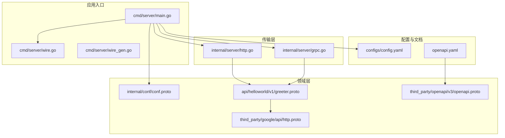
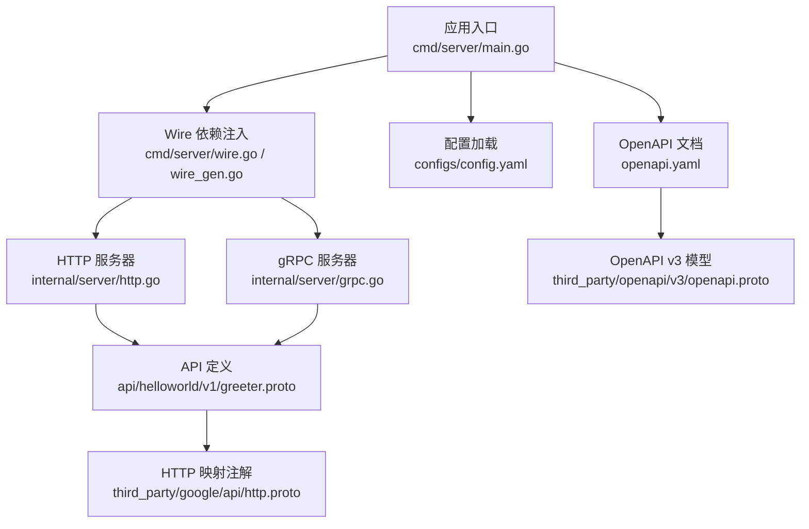
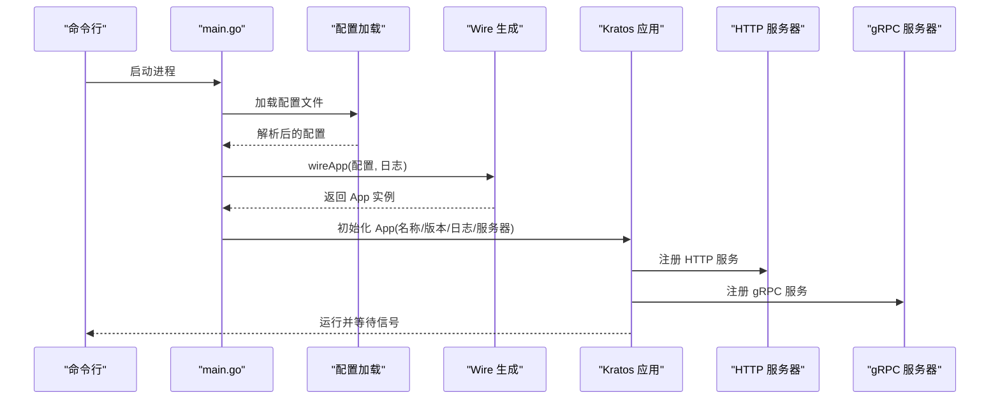
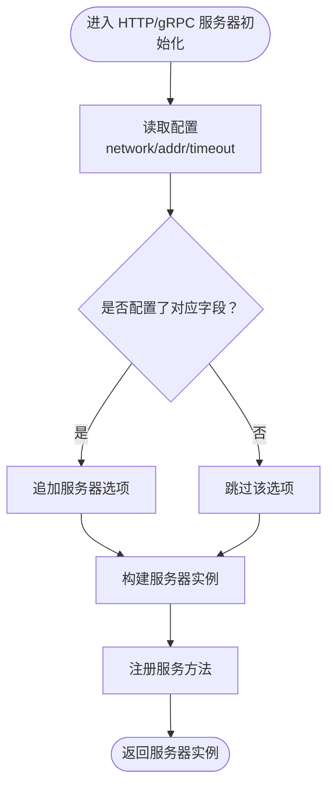
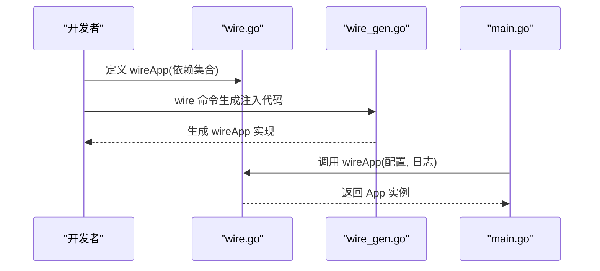
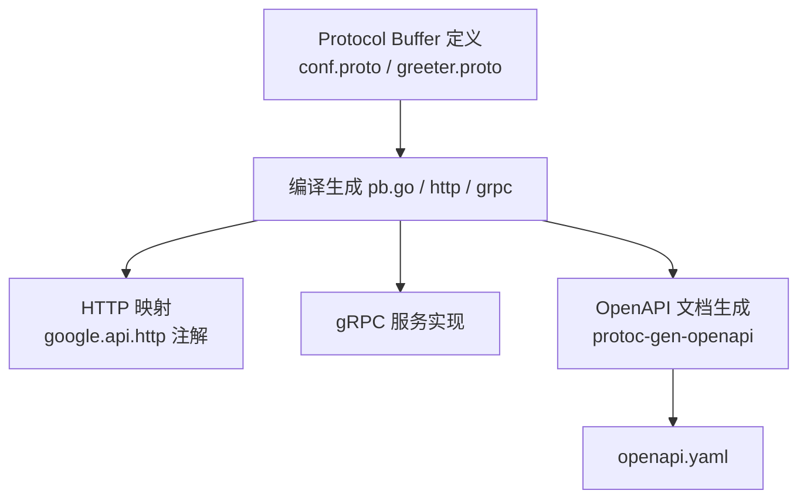
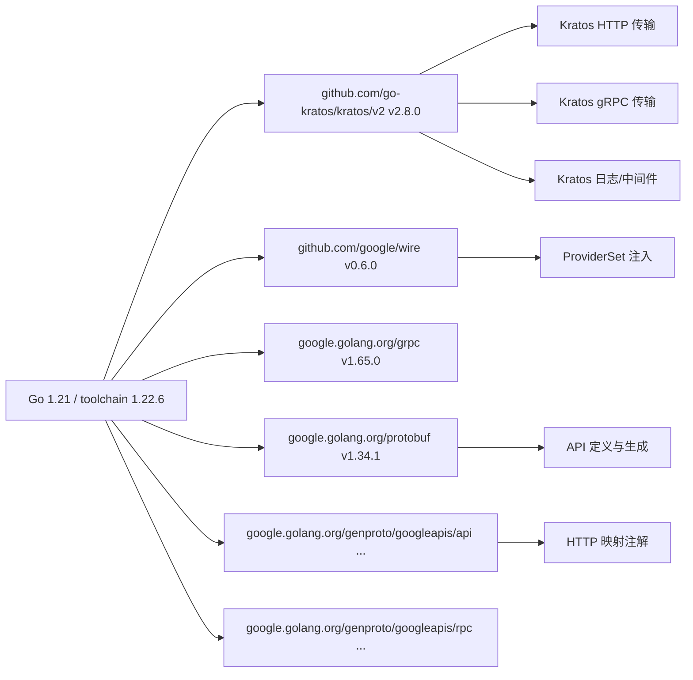

# 技术栈与依赖

<cite>
**本文引用的文件列表**
- [go.mod](file://go.mod)
- [README.md](file://README.md)
- [Makefile](file://Makefile)
- [cmd/server/main.go](file://cmd/server/main.go)
- [cmd/server/wire.go](file://cmd/server/wire.go)
- [cmd/server/wire_gen.go](file://cmd/server/wire_gen.go)
- [internal/server/http.go](file://internal/server/http.go)
- [internal/server/grpc.go](file://internal/server/grpc.go)
- [internal/conf/conf.proto](file://internal/conf/conf.proto)
- [api/helloworld/v1/greeter.proto](file://api/helloworld/v1/greeter.proto)
- [third_party/google/api/http.proto](file://third_party/google/api/http.proto)
- [third_party/openapi/v3/openapi.proto](file://third_party/openapi/v3/openapi.proto)
- [openapi.yaml](file://openapi.yaml)
- [configs/config.yaml](file://configs/config.yaml)
</cite>

## 目录
1. [引言](#引言)
2. [项目结构](#项目结构)
3. [核心组件](#核心组件)
4. [架构总览](#架构总览)
5. [详细组件分析](#详细组件分析)
6. [依赖关系分析](#依赖关系分析)
7. [性能考量](#性能考量)
8. [故障排查指南](#故障排查指南)
9. [结论](#结论)
10. [附录：go.mod 关键模块解读与扩展建议](#附录gomo-关键模块解读与扩展建议)

## 引言
本文件系统化梳理 kratos-layout 项目所采用的技术栈与第三方库，重点围绕以下关键依赖展开：
- Go-Kratos 框架：提供应用生命周期管理、日志、中间件、配置加载、gRPC/HTTP 传输层等基础设施。
- Google Wire：用于服务对象的静态依赖注入，通过代码生成实现可维护的依赖装配。
- Protocol Buffer 编译器与运行时库：用于接口与配置的定义、序列化与跨语言通信。
- gRPC-Go：提供高性能、多语言的 RPC 通信能力。
- OpenAPI v3 支持库：通过第三方 OpenAPI v3 协议模型与生成工具，输出 OpenAPI 文档。

文档将解释各依赖在项目中的具体用途、版本兼容性现状、如何扩展或升级依赖，以及如何避免版本冲突。

## 项目结构
项目采用分层与按功能域组织的结构，便于依赖注入与职责分离：
- cmd/server：应用入口与 Wire 依赖注入生成物
- internal/*：业务域（biz）、数据访问（data）、服务实现（service）、服务器适配（server）
- api/*：对外暴露的协议定义（含 gRPC 与 HTTP 映射）
- configs：运行时配置（YAML）
- third_party：外部协议模型（Google API 注解、OpenAPI v3 等）

图表来源
- [cmd/server/main.go](file://cmd/server/main.go#L1-L88)
- [cmd/server/wire.go](file://cmd/server/wire.go#L1-L24)
- [cmd/server/wire_gen.go](file://cmd/server/wire_gen.go)
- [internal/server/http.go](file://internal/server/http.go#L1-L33)
- [internal/server/grpc.go](file://internal/server/grpc.go#L1-L33)
- [internal/conf/conf.proto](file://internal/conf/conf.proto#L1-L42)
- [api/helloworld/v1/greeter.proto](file://api/helloworld/v1/greeter.proto#L1-L31)
- [third_party/google/api/http.proto](file://third_party/google/api/http.proto#L1-L376)
- [third_party/openapi/v3/openapi.proto](file://third_party/openapi/v3/openapi.proto#L1-L673)
- [openapi.yaml](file://openapi.yaml#L1-L40)
- [configs/config.yaml](file://configs/config.yaml#L1-L16)

章节来源
- [README.md](file://README.md#L1-L52)
- [go.mod](file://go.mod#L1-L36)

## 核心组件
- 应用入口与生命周期管理：负责解析命令行参数、加载配置、初始化日志、构建 Kratos 应用并启动服务。
- 传输层适配：分别创建 gRPC 与 HTTP 服务器，注册服务方法，并应用恢复中间件。
- 配置与协议：使用 Protocol Buffer 定义配置与 API 接口；通过 Google API 注解实现 HTTP REST 映射；使用 OpenAPI v3 模型生成 OpenAPI 文档。
- 依赖注入：通过 Google Wire 的 ProviderSet 与代码生成，实现服务对象的静态装配。

章节来源
- [cmd/server/main.go](file://cmd/server/main.go#L1-L88)
- [internal/server/http.go](file://internal/server/http.go#L1-L33)
- [internal/server/grpc.go](file://internal/server/grpc.go#L1-L33)
- [internal/conf/conf.proto](file://internal/conf/conf.proto#L1-L42)
- [api/helloworld/v1/greeter.proto](file://api/helloworld/v1/greeter.proto#L1-L31)
- [third_party/google/api/http.proto](file://third_party/google/api/http.proto#L1-L376)
- [third_party/openapi/v3/openapi.proto](file://third_party/openapi/v3/openapi.proto#L1-L673)
- [openapi.yaml](file://openapi.yaml#L1-L40)
- [configs/config.yaml](file://configs/config.yaml#L1-L16)

## 架构总览
下图展示了从应用入口到传输层、协议与配置的整体交互关系。

图表来源
- [cmd/server/main.go](file://cmd/server/main.go#L1-L88)
- [cmd/server/wire.go](file://cmd/server/wire.go#L1-L24)
- [cmd/server/wire_gen.go](file://cmd/server/wire_gen.go)
- [internal/server/http.go](file://internal/server/http.go#L1-L33)
- [internal/server/grpc.go](file://internal/server/grpc.go#L1-L33)
- [api/helloworld/v1/greeter.proto](file://api/helloworld/v1/greeter.proto#L1-L31)
- [third_party/google/api/http.proto](file://third_party/google/api/http.proto#L1-L376)
- [openapi.yaml](file://openapi.yaml#L1-L40)
- [third_party/openapi/v3/openapi.proto](file://third_party/openapi/v3/openapi.proto#L1-L673)
- [configs/config.yaml](file://configs/config.yaml#L1-L16)

## 详细组件分析

### 组件一：应用入口与配置加载
- 职责：解析配置路径、加载 YAML 配置、构造 Kratos 应用、启动服务。
- 关键点：
  - 使用 Kratos 配置源加载本地文件。
  - 将配置扫描到内部结构体以供后续依赖注入使用。
  - 通过 Wire 生成的应用实例包含 HTTP 与 gRPC 服务器。

图表来源
- [cmd/server/main.go](file://cmd/server/main.go#L1-L88)
- [configs/config.yaml](file://configs/config.yaml#L1-L16)
- [cmd/server/wire.go](file://cmd/server/wire.go#L1-L24)
- [cmd/server/wire_gen.go](file://cmd/server/wire_gen.go)

章节来源
- [cmd/server/main.go](file://cmd/server/main.go#L1-L88)
- [configs/config.yaml](file://configs/config.yaml#L1-L16)

### 组件二：传输层（HTTP 与 gRPC）
- HTTP 服务器：
  - 从配置读取网络、地址与超时。
  - 注册 HTTP 服务方法。
  - 应用恢复中间件提升健壮性。
- gRPC 服务器：
  - 从配置读取网络、地址与超时。
  - 注册 gRPC 服务方法。
  - 应用恢复中间件提升健壮性。

图表来源
- [internal/server/http.go](file://internal/server/http.go#L1-L33)
- [internal/server/grpc.go](file://internal/server/grpc.go#L1-L33)
- [configs/config.yaml](file://configs/config.yaml#L1-L16)

章节来源
- [internal/server/http.go](file://internal/server/http.go#L1-L33)
- [internal/server/grpc.go](file://internal/server/grpc.go#L1-L33)

### 组件三：依赖注入（Google Wire）
- 作用：通过 ProviderSet 将业务、数据、服务与传输层组合成可运行的应用。
- 工作流：
  - 在 wire.go 中定义 wireApp 函数，声明所需依赖。
  - 使用 wire.Build 组合 ProviderSet 并生成 wire_gen.go。
  - main.go 调用 wireApp 获取 App 实例。

图表来源
- [cmd/server/wire.go](file://cmd/server/wire.go#L1-L24)
- [cmd/server/wire_gen.go](file://cmd/server/wire_gen.go)
- [cmd/server/main.go](file://cmd/server/main.go#L1-L88)

章节来源
- [cmd/server/wire.go](file://cmd/server/wire.go#L1-L24)
- [cmd/server/wire_gen.go](file://cmd/server/wire_gen.go)
- [cmd/server/main.go](file://cmd/server/main.go#L1-L88)

### 组件四：协议与 OpenAPI（Protocol Buffer + OpenAPI v3）
- Protocol Buffer：
  - 配置模型：internal/conf/conf.proto 定义服务端口、网络、数据库与 Redis 等配置。
  - API 定义：api/helloworld/v1/greeter.proto 定义 Greeter 服务与消息类型，并通过 google.api.http 注解映射 HTTP REST。
- OpenAPI v3：
  - 使用 third_party/openapi/v3/openapi.proto 作为 OpenAPI v3 数据模型。
  - openapi.yaml 由生成工具基于协议注解生成，描述 REST 接口。

图表来源
- [internal/conf/conf.proto](file://internal/conf/conf.proto#L1-L42)
- [api/helloworld/v1/greeter.proto](file://api/helloworld/v1/greeter.proto#L1-L31)
- [third_party/google/api/http.proto](file://third_party/google/api/http.proto#L1-L376)
- [third_party/openapi/v3/openapi.proto](file://third_party/openapi/v3/openapi.proto#L1-L673)
- [openapi.yaml](file://openapi.yaml#L1-L40)

章节来源
- [internal/conf/conf.proto](file://internal/conf/conf.proto#L1-L42)
- [api/helloworld/v1/greeter.proto](file://api/helloworld/v1/greeter.proto#L1-L31)
- [third_party/google/api/http.proto](file://third_party/google/api/http.proto#L1-L376)
- [third_party/openapi/v3/openapi.proto](file://third_party/openapi/v3/openapi.proto#L1-L673)
- [openapi.yaml](file://openapi.yaml#L1-L40)

## 依赖关系分析
- 模块依赖：
  - go.mod 中明确列出核心依赖：kratos/v2、wire、grpc、protobuf、genproto、automaxprocs 等。
  - 间接依赖由 go.sum 与 go.mod require 区块共同约束。
- 版本兼容性要点：
  - Go 版本：项目使用 go 1.21，toolchain 为 go1.22.6，建议在升级时保持一致。
  - Kratos v2.x 与 gRPC v1.x、protobuf v1.x 兼容性良好，但需注意版本范围内的更新策略。
  - Wire v0.6.0 与 Kratos v2.x 协同工作，生成注入代码稳定。
- 外部协议：
  - google.golang.org/genproto/googleapis/api 与 google.golang.org/genproto/googleapis/rpc 提供 Google API 注解与 RPC 规范的 Go 实现。
  - third_party 下的 OpenAPI v3 模型用于生成 OpenAPI 文档。

图表来源
- [go.mod](file://go.mod#L1-L36)

章节来源
- [go.mod](file://go.mod#L1-L36)

## 性能考量
- 自动设置最大可用 CPU 核数：通过引入 go.uber.org/automaxprocs，可在容器或多核环境中自动优化 goroutine 调度。
- 中间件：在 HTTP/gRPC 服务器上启用恢复中间件，减少异常导致的服务崩溃风险。
- 配置驱动的超时控制：通过配置文件统一管理网络与超时参数，便于在不同环境进行调优。

章节来源
- [cmd/server/main.go](file://cmd/server/main.go#L1-L88)
- [internal/server/http.go](file://internal/server/http.go#L1-L33)
- [internal/server/grpc.go](file://internal/server/grpc.go#L1-L33)
- [configs/config.yaml](file://configs/config.yaml#L1-L16)

## 故障排查指南
- 配置加载失败：
  - 确认 -conf 参数指向的目录存在且包含有效的 YAML 文件。
  - 检查配置字段与内部结构体定义是否匹配。
- 依赖注入问题：
  - 确保已执行 wire 命令生成 wire_gen.go。
  - 检查 wire.go 中的 ProviderSet 是否完整覆盖所有依赖。
- gRPC/HTTP 服务无法启动：
  - 检查配置中的 network/addr/timeout 是否合理。
  - 确认服务方法已正确注册到服务器。
- OpenAPI 文档不完整：
  - 确认已使用生成工具基于协议注解生成 openapi.yaml。
  - 检查 third_party/openapi/v3/openapi.proto 是否被正确引用。

章节来源
- [cmd/server/main.go](file://cmd/server/main.go#L1-L88)
- [cmd/server/wire.go](file://cmd/server/wire.go#L1-L24)
- [cmd/server/wire_gen.go](file://cmd/server/wire_gen.go)
- [internal/server/http.go](file://internal/server/http.go#L1-L33)
- [internal/server/grpc.go](file://internal/server/grpc.go#L1-L33)
- [openapi.yaml](file://openapi.yaml#L1-L40)

## 结论
kratos-layout 项目以 Go-Kratos 为核心，结合 Google Wire 实现静态依赖注入，利用 Protocol Buffer 与 Google API 注解完成接口与 HTTP 映射定义，并通过 OpenAPI v3 模型生成文档。整体技术栈清晰、模块边界明确，具备良好的可扩展性与可维护性。遵循本文的版本兼容性与扩展建议，可安全地升级依赖并引入新功能。

## 附录：go.mod 关键模块解读与扩展建议
- 核心模块解读
  - github.com/go-kratos/kratos/v2：提供应用生命周期、日志、中间件、配置与传输层抽象。
  - github.com/google/wire：静态依赖注入工具，通过 ProviderSet 与代码生成实现可维护的装配。
  - google.golang.org/grpc：高性能 RPC 框架，配合 Kratos 的 transport/grpc 使用。
  - google.golang.org/protobuf：Protocol Buffer 运行时库，用于序列化与反序列化。
  - google.golang.org/genproto/googleapis/api 与 google.golang.org/genproto/googleapis/rpc：提供 Google API 注解与 RPC 规范的 Go 实现。
  - go.uber.org/automaxprocs：自动设置最大可用 CPU 核数，优化并发性能。
- 扩展与升级建议
  - 升级 Kratos：建议先在测试环境验证新版本的中间件与传输层兼容性，再逐步迁移。
  - 升级 gRPC/Protobuf：确保 genproto 与 protobuf 版本匹配，避免注解与生成代码不一致。
  - 引入新依赖：优先选择与现有 Kratos 版本兼容的库；如需引入 OpenAPI 生态，建议使用与当前版本匹配的生成工具链。
  - 版本锁定：通过 go.mod 与 go.sum 严格锁定版本，避免 CI/CD 环境出现漂移。
- 添加新依赖的流程
  - 使用 go get 添加依赖。
  - 如涉及 Protocol Buffer，编写或更新 .proto 文件并生成 pb.go。
  - 若需要 HTTP 映射，补充 google.api.http 注解并在生成阶段包含 OpenAPI 文档。
  - 更新 Wire ProviderSet，确保新依赖被正确注入。
  - 运行测试与集成验证，确认无版本冲突与行为异常。

章节来源
- [go.mod](file://go.mod#L1-L36)
- [README.md](file://README.md#L1-L52)
- [Makefile](file://Makefile)