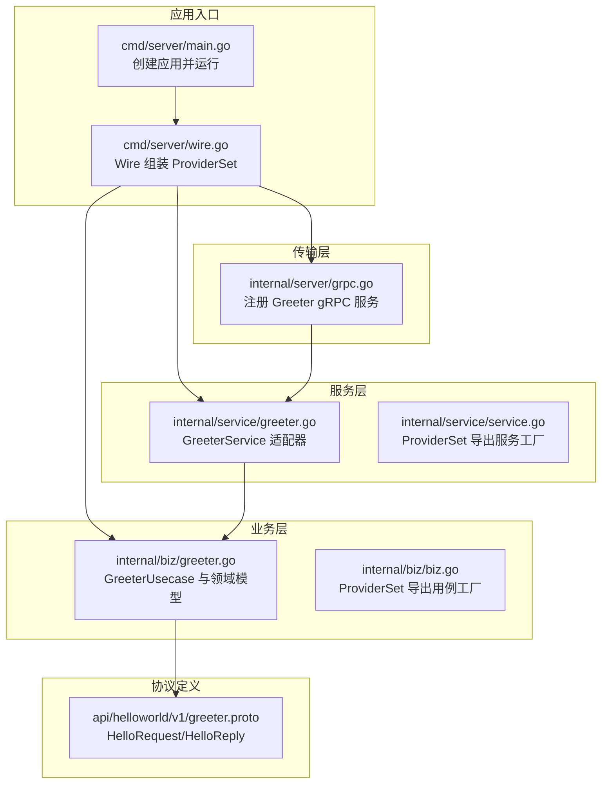
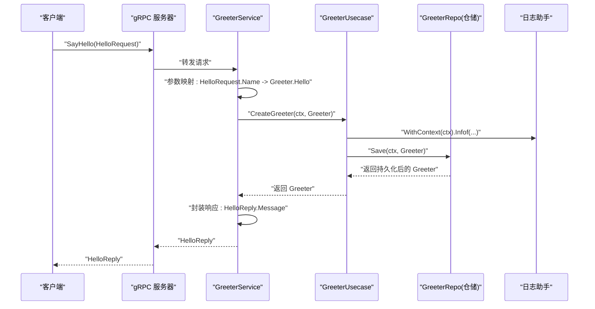
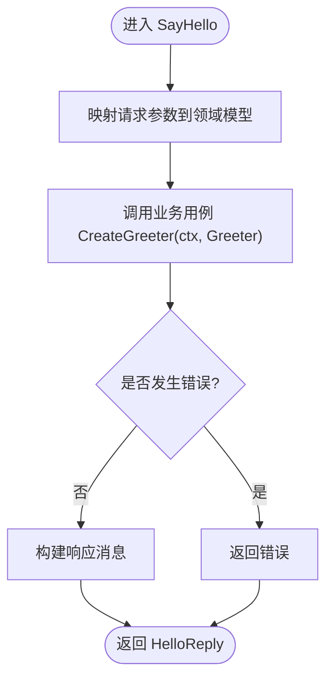
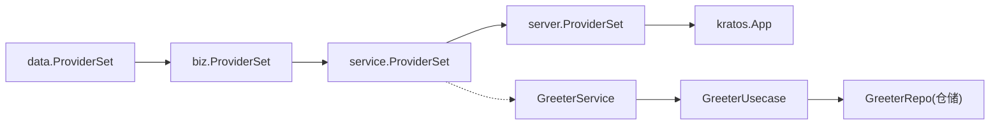

# 服务层实现

<cite>
**本文引用的文件**
- [internal/service/greeter.go](file://internal/service/greeter.go)
- [internal/service/service.go](file://internal/service/service.go)
- [internal/biz/greeter.go](file://internal/biz/greeter.go)
- [api/helloworld/v1/greeter.proto](file://api/helloworld/v1/greeter.proto)
- [internal/server/grpc.go](file://internal/server/grpc.go)
- [cmd/server/main.go](file://cmd/server/main.go)
- [cmd/server/wire.go](file://cmd/server/wire.go)
</cite>

## 目录
1. [引言](#引言)
2. [项目结构](#项目结构)
3. [核心组件](#核心组件)
4. [架构总览](#架构总览)
5. [详细组件分析](#详细组件分析)
6. [依赖关系分析](#依赖关系分析)
7. [性能考量](#性能考量)
8. [故障排查指南](#故障排查指南)
9. [结论](#结论)
10. [附录](#附录)

## 引言
本文件聚焦于 Kratos 示例工程中服务层对 gRPC 接口的实现，重点剖析 internal/service/greeter.go 中 GreeterService 的实现机制。文档从“服务层作为协议适配器”的角度出发，说明 GreeterService 如何通过依赖注入接入 biz 层用例，如何在 SayHello 方法中完成协议到领域模型的转换、调用业务逻辑并封装响应；同时梳理上下文传递、错误处理与日志集成方式，并给出扩展服务方法的编码规范与测试建议。

## 项目结构
本项目采用分层架构：api 定义协议与消息模型，internal/biz 定义业务用例与领域模型，internal/data 实现仓储接口，internal/service 作为服务层适配器，internal/server 提供 gRPC/HTTP 服务器装配，cmd/server 使用 Wire 进行依赖注入编排。

图表来源
- [cmd/server/main.go](file://cmd/server/main.go#L50-L88)
- [cmd/server/wire.go](file://cmd/server/wire.go#L20-L24)
- [internal/server/grpc.go](file://internal/server/grpc.go#L13-L33)
- [internal/service/greeter.go](file://internal/service/greeter.go#L10-L30)
- [internal/service/service.go](file://internal/service/service.go#L1-L7)
- [internal/biz/greeter.go](file://internal/biz/greeter.go#L1-L47)
- [api/helloworld/v1/greeter.proto](file://api/helloworld/v1/greeter.proto#L1-L31)

章节来源
- [cmd/server/main.go](file://cmd/server/main.go#L50-L88)
- [cmd/server/wire.go](file://cmd/server/wire.go#L20-L24)
- [internal/server/grpc.go](file://internal/server/grpc.go#L13-L33)
- [internal/service/greeter.go](file://internal/service/greeter.go#L10-L30)
- [internal/service/service.go](file://internal/service/service.go#L1-L7)
- [internal/biz/greeter.go](file://internal/biz/greeter.go#L1-L47)
- [api/helloworld/v1/greeter.proto](file://api/helloworld/v1/greeter.proto#L1-L31)

## 核心组件
- GreeterService：服务层适配器，负责将 gRPC 协议请求转换为 biz 领域对象，调用业务用例并封装响应。
- GreeterUsecase：业务用例，持有仓储接口与日志助手，执行核心业务逻辑。
- 领域模型 Greeter：承载业务数据（如 Hello 字段）。
- gRPC 服务注册：由传输层将 GreeterService 注册到 gRPC 服务器。

章节来源
- [internal/service/greeter.go](file://internal/service/greeter.go#L10-L30)
- [internal/biz/greeter.go](file://internal/biz/greeter.go#L17-L47)
- [internal/server/grpc.go](file://internal/server/grpc.go#L28-L31)

## 架构总览
服务层在整体架构中的定位是“协议适配器”：
- 接收来自 gRPC/HTTP 的请求，进行参数校验与协议到领域模型的映射；
- 调用 biz 层用例执行业务规则；
- 将业务结果转换为协议响应返回；
- 保持自身不包含核心业务规则，仅承担协议转换与参数映射职责。

图表来源
- [internal/server/grpc.go](file://internal/server/grpc.go#L28-L31)
- [internal/service/greeter.go](file://internal/service/greeter.go#L22-L29)
- [internal/biz/greeter.go](file://internal/biz/greeter.go#L42-L46)

## 详细组件分析

### GreeterService 结构与契约实现
- 嵌入 v1.UnimplementedGreeterServer：通过嵌入未实现的服务端桩，强制要求服务实现 Greeter 服务的所有 RPC 方法，避免遗漏接口契约。
- 依赖注入 uc：通过构造函数注入 biz.GreeterUsecase，确保服务层与业务层解耦。
- NewGreeterService 工厂：集中创建 GreeterService 实例，便于统一管理依赖。

章节来源
- [internal/service/greeter.go](file://internal/service/greeter.go#L10-L21)

### SayHello 方法实现逻辑
- 参数映射：将 gRPC 请求中的名称字段映射为 biz 领域模型的 Hello 字段。
- 调用业务用例：调用 uc.CreateGreeter 执行业务逻辑。
- 错误处理：若业务用例返回错误，直接向上抛出，交由传输层中间件或框架处理。
- 响应封装：成功时将领域模型 Hello 字段拼接为响应消息返回。

图表来源
- [internal/service/greeter.go](file://internal/service/greeter.go#L22-L29)
- [internal/biz/greeter.go](file://internal/biz/greeter.go#L42-L46)

章节来源
- [internal/service/greeter.go](file://internal/service/greeter.go#L22-L29)

### 上下文（Context）传递
- 服务层在调用业务用例时直接透传 gRPC 上下文，保证链路追踪、超时控制等横切能力贯穿业务层。
- 业务用例通过日志助手 WithContext(ctx) 记录日志，确保日志上下文与请求一致。

章节来源
- [internal/service/greeter.go](file://internal/service/greeter.go#L22-L24)
- [internal/biz/greeter.go](file://internal/biz/greeter.go#L42-L46)

### 错误处理机制
- 服务层直接返回业务用例的错误，不进行二次包装，保持错误语义清晰。
- 传输层可使用恢复中间件统一兜底，避免服务崩溃。

章节来源
- [internal/service/greeter.go](file://internal/service/greeter.go#L25-L27)
- [internal/server/grpc.go](file://internal/server/grpc.go#L15-L19)

### 日志记录集成
- 业务用例通过 log.NewHelper(logger) 创建日志助手，在 Infof 中输出关键业务信息。
- 服务层调用业务用例时，日志助手会自动携带上下文信息，确保可观测性。

章节来源
- [internal/biz/greeter.go](file://internal/biz/greeter.go#L31-L40)
- [internal/biz/greeter.go](file://internal/biz/greeter.go#L42-L46)

### 服务层作为适配器的角色
- 服务层不包含核心业务规则，仅负责协议转换与参数映射；
- 业务规则集中在 biz 层用例中，服务层只负责调用；
- 通过依赖注入与 ProviderSet 解耦，便于替换与测试。

章节来源
- [internal/service/greeter.go](file://internal/service/greeter.go#L10-L21)
- [internal/service/service.go](file://internal/service/service.go#L1-L7)
- [internal/biz/greeter.go](file://internal/biz/greeter.go#L31-L40)

### 服务方法扩展的编码规范与测试建议
- 编码规范
  - 新增服务方法时，遵循“协议到领域模型映射 -> 调用业务用例 -> 封装响应 -> 返回错误透传”的流程。
  - 保持服务层无业务规则，所有业务逻辑放入 biz 层。
  - 明确上下文传递路径，确保日志与追踪上下文一致。
- 测试建议
  - 单元测试：mock 业务用例与仓储接口，验证参数映射、错误分支与响应封装。
  - 集成测试：通过 Wire 组装完整依赖，验证服务注册与 gRPC 调用链路。
  - 性能测试：关注业务用例的 I/O 与日志开销，评估服务层吞吐。

章节来源
- [internal/service/greeter.go](file://internal/service/greeter.go#L22-L29)
- [internal/biz/greeter.go](file://internal/biz/greeter.go#L42-L46)
- [cmd/server/wire.go](file://cmd/server/wire.go#L20-L24)

## 依赖关系分析
- Wire ProviderSet 组合顺序：data -> biz -> service -> server -> app。
- 服务层依赖业务层，业务层依赖仓储接口，传输层依赖服务层。
- GreeterService 通过构造函数注入 GreeterUsecase，GreeterUsecase 通过构造函数注入仓储与日志助手。

图表来源
- [cmd/server/wire.go](file://cmd/server/wire.go#L20-L24)
- [internal/service/service.go](file://internal/service/service.go#L1-L7)
- [internal/biz/biz.go](file://internal/biz/biz.go#L1-L7)
- [internal/service/greeter.go](file://internal/service/greeter.go#L10-L21)
- [internal/biz/greeter.go](file://internal/biz/greeter.go#L31-L40)

章节来源
- [cmd/server/wire.go](file://cmd/server/wire.go#L20-L24)
- [internal/service/service.go](file://internal/service/service.go#L1-L7)
- [internal/biz/biz.go](file://internal/biz/biz.go#L1-L7)
- [internal/service/greeter.go](file://internal/service/greeter.go#L10-L21)
- [internal/biz/greeter.go](file://internal/biz/greeter.go#L31-L40)

## 性能考量
- 服务层轻量：仅做协议转换与调用转发，避免在服务层引入额外计算。
- 业务层 I/O：CreateGreeter 最终落到仓储 Save，关注数据库/缓存延迟与连接池配置。
- 日志成本：Infof 级别日志在高并发场景需评估输出频率，必要时降级或采样。
- 中间件：传输层启用恢复中间件，减少异常导致的进程崩溃，提升稳定性。

[本节为通用指导，无需列出具体文件来源]

## 故障排查指南
- gRPC 服务未注册
  - 检查传输层是否正确注册 Greeter 服务。
  - 参考：[internal/server/grpc.go](file://internal/server/grpc.go#L28-L31)
- 服务方法未实现
  - GreeterService 嵌入了未实现的服务端桩，确保所有 RPC 方法均已实现。
  - 参考：[internal/service/greeter.go](file://internal/service/greeter.go#L10-L16)
- 业务错误未返回
  - 服务层直接透传业务错误，确认业务用例返回的错误类型是否符合预期。
  - 参考：[internal/service/greeter.go](file://internal/service/greeter.go#L25-L27)
- 日志缺失
  - 确认业务用例已创建日志助手并在关键路径调用 WithContext(ctx)。
  - 参考：[internal/biz/greeter.go](file://internal/biz/greeter.go#L31-L40)

章节来源
- [internal/server/grpc.go](file://internal/server/grpc.go#L28-L31)
- [internal/service/greeter.go](file://internal/service/greeter.go#L10-L16)
- [internal/service/greeter.go](file://internal/service/greeter.go#L25-L27)
- [internal/biz/greeter.go](file://internal/biz/greeter.go#L31-L40)

## 结论
GreeterService 作为服务层适配器，通过嵌入未实现服务端桩确保接口契约完整，借助依赖注入将业务逻辑与协议细节解耦。SayHello 方法体现了“协议转换—调用用例—封装响应—错误透传”的清晰流程，配合上下文与日志集成，形成可维护、可观测的服务层实现。扩展新方法时应坚持“服务层无业务规则”的原则，并通过单元与集成测试保障质量。

[本节为总结性内容，无需列出具体文件来源]

## 附录
- 协议定义参考：HelloRequest/HelloReply 的字段与服务声明。
  - 参考：[api/helloworld/v1/greeter.proto](file://api/helloworld/v1/greeter.proto#L12-L31)

章节来源
- [api/helloworld/v1/greeter.proto](file://api/helloworld/v1/greeter.proto#L12-L31)