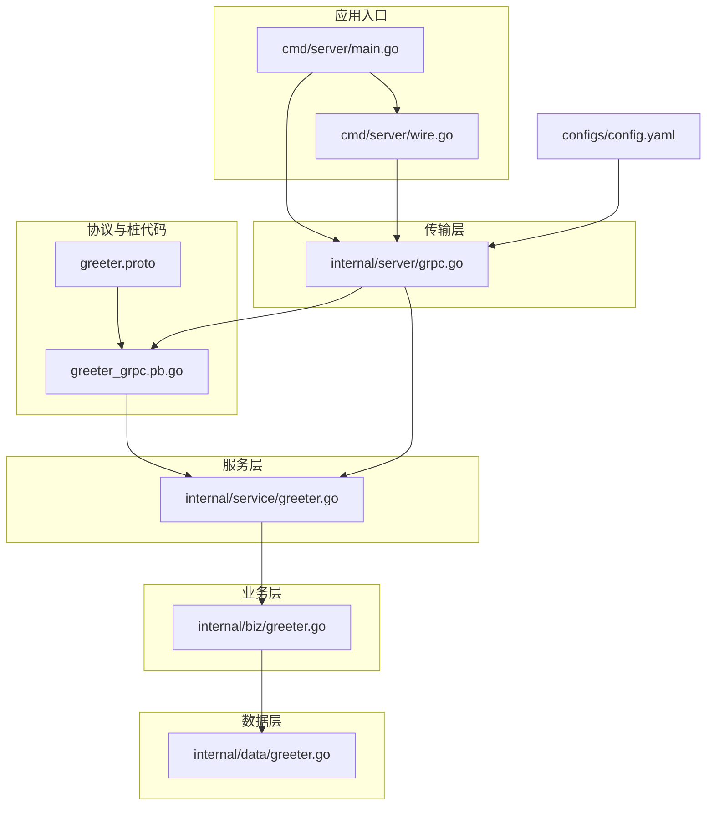
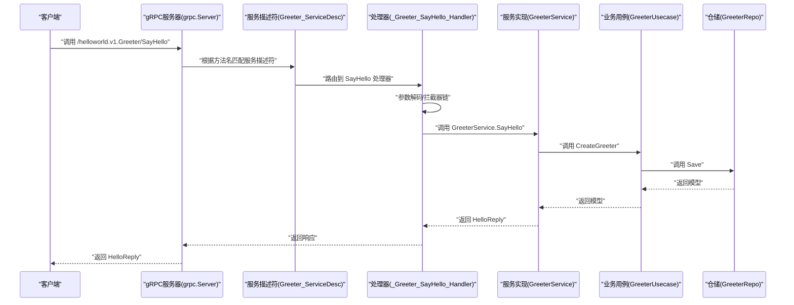
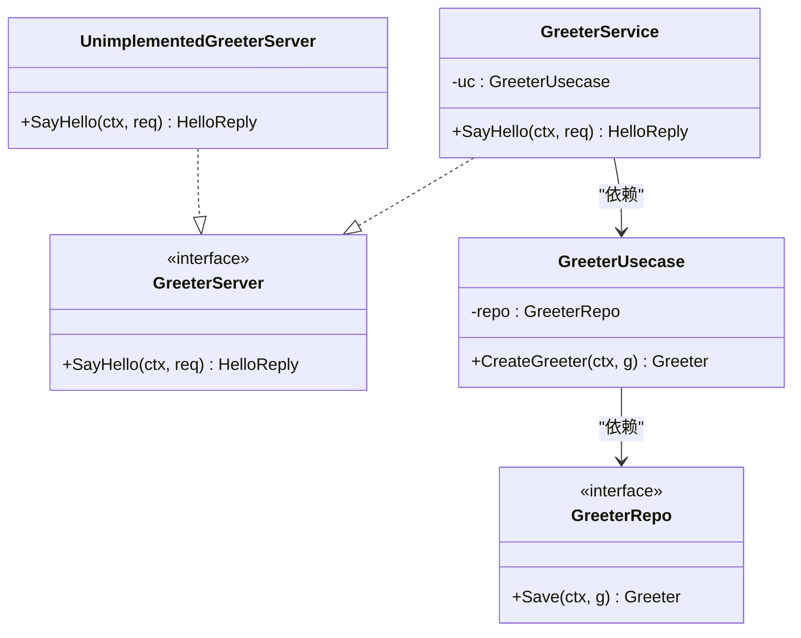
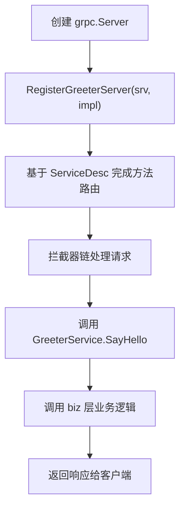
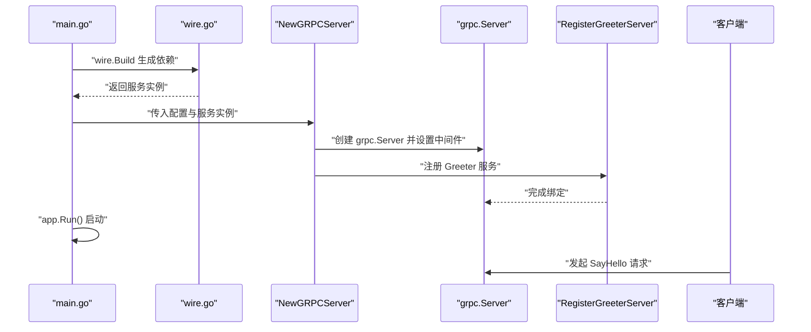
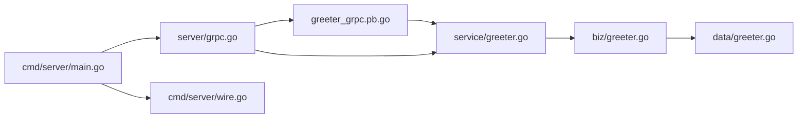

# gRPC服务绑定

<cite>
**本文引用的文件**
- [api/helloworld/v1/greeter_grpc.pb.go](file://api/helloworld/v1/greeter_grpc.pb.go)
- [api/helloworld/v1/greeter.proto](file://api/helloworld/v1/greeter.proto)
- [internal/service/greeter.go](file://internal/service/greeter.go)
- [internal/biz/greeter.go](file://internal/biz/greeter.go)
- [internal/data/greeter.go](file://internal/data/greeter.go)
- [internal/server/grpc.go](file://internal/server/grpc.go)
- [cmd/server/main.go](file://cmd/server/main.go)
- [cmd/server/wire.go](file://cmd/server/wire.go)
- [configs/config.yaml](file://configs/config.yaml)
</cite>

## 目录
1. [简介](#简介)
2. [项目结构](#项目结构)
3. [核心组件](#核心组件)
4. [架构总览](#架构总览)
5. [详细组件分析](#详细组件分析)
6. [依赖分析](#依赖分析)
7. [性能考虑](#性能考虑)
8. [故障排查指南](#故障排查指南)
9. [结论](#结论)
10. [附录](#附录)

## 简介
本文件围绕由 protoc-gen-go-grpc 生成的 gRPC 服务桩代码进行深入解析，重点覆盖：
- Greeter_ServiceDesc 服务描述符的结构组成与作用
- 方法名与处理器函数的映射关系
- UnimplementedGreeterServer 接口的用途与向前兼容性
- 在 internal/service/greeter.go 中 GreeterService 如何继承 UnimplementedGreeterServer 并实现 SayHello
- gRPC 服务注册机制：从服务描述符到 gRPC 服务器的绑定链路
- SayHello 方法如何通过服务描述符被 gRPC 服务器调用，并与业务用例层（biz）交互
- gRPC 服务启动流程：从 server.go 创建到服务注册的完整链路
- 自定义 gRPC 拦截器的集成点说明
- 新增 gRPC 方法的步骤指引

## 项目结构
该仓库采用 Kratos 框架分层组织，gRPC 服务相关的关键位置如下：
- 协议与桩代码：api/helloworld/v1/greeter.proto 与 greeter_grpc.pb.go
- 服务实现：internal/service/greeter.go
- 业务用例：internal/biz/greeter.go
- 数据访问：internal/data/greeter.go
- gRPC 服务器创建与注册：internal/server/grpc.go
- 应用入口与依赖注入：cmd/server/main.go、cmd/server/wire.go
- 配置：configs/config.yaml

图表来源
- [api/helloworld/v1/greeter_grpc.pb.go](file://api/helloworld/v1/greeter_grpc.pb.go#L93-L108)
- [internal/server/grpc.go](file://internal/server/grpc.go#L13-L33)
- [cmd/server/main.go](file://cmd/server/main.go#L50-L88)
- [cmd/server/wire.go](file://cmd/server/wire.go#L20-L24)
- [configs/config.yaml](file://configs/config.yaml#L1-L16)

章节来源
- [api/helloworld/v1/greeter_grpc.pb.go](file://api/helloworld/v1/greeter_grpc.pb.go#L93-L108)
- [internal/server/grpc.go](file://internal/server/grpc.go#L13-L33)
- [cmd/server/main.go](file://cmd/server/main.go#L50-L88)
- [cmd/server/wire.go](file://cmd/server/wire.go#L20-L24)
- [configs/config.yaml](file://configs/config.yaml#L1-L16)

## 核心组件
- Greeter_ServiceDesc：gRPC 服务描述符，声明服务名称、处理器类型、方法列表、流式方法与元数据信息。用于在 gRPC 服务器上完成服务注册。
- GreeterServer 接口与 UnimplementedGreeterServer：前者定义服务端方法契约；后者提供默认未实现行为，确保新增方法时旧客户端仍可编译通过。
- RegisterGreeterServer：将服务描述符与具体服务实现绑定到 gRPC 服务器。
- _Greeter_SayHello_Handler：SayHello 的内部处理器，负责参数解码、拦截器链与业务调用。
- GreeterService：服务实现，嵌入 UnimplementedGreeterServer 并实现 SayHello，调用 biz 层完成业务逻辑。
- gRPC 服务器创建与注册：在 internal/server/grpc.go 中创建 grpc.Server 并调用 RegisterGreeterServer 完成绑定。

章节来源
- [api/helloworld/v1/greeter_grpc.pb.go](file://api/helloworld/v1/greeter_grpc.pb.go#L46-L108)
- [internal/service/greeter.go](file://internal/service/greeter.go#L10-L30)
- [internal/server/grpc.go](file://internal/server/grpc.go#L13-L33)

## 架构总览
下图展示了从 gRPC 请求到达，到业务用例执行与返回的完整链路。

图表来源
- [api/helloworld/v1/greeter_grpc.pb.go](file://api/helloworld/v1/greeter_grpc.pb.go#L75-L91)
- [internal/service/greeter.go](file://internal/service/greeter.go#L22-L30)
- [internal/biz/greeter.go](file://internal/biz/greeter.go#L42-L47)
- [internal/data/greeter.go](file://internal/data/greeter.go#L24-L26)

## 详细组件分析

### 服务描述符 Greeter_ServiceDesc
- 作用：向 gRPC 服务器提供服务元数据，包括服务名称、处理器类型、方法列表、流式方法与元数据文件路径。
- 关键字段：
  - ServiceName：服务全限定名，用于路由与日志标识
  - HandlerType：处理器接口类型，用于类型安全绑定
  - Methods：方法列表，包含每个方法的名称与处理器函数指针
  - Streams：流式方法列表（当前为空）
  - Metadata：关联的 proto 文件路径
- 注册方式：通过 RegisterGreeterServer 将服务描述符与具体服务实现绑定到 grpc.Server

章节来源
- [api/helloworld/v1/greeter_grpc.pb.go](file://api/helloworld/v1/greeter_grpc.pb.go#L93-L108)
- [internal/server/grpc.go](file://internal/server/grpc.go#L29-L31)

### 方法名与处理器映射
- 方法名：SayHello
- 处理器函数：_Greeter_SayHello_Handler
- 映射关系：在 Greeter_ServiceDesc.Methods 中以 MethodName 为键，Handler 为值
- 调用链：gRPC 服务器根据请求的完整方法名（含包名）查找服务描述符，定位到对应处理器，再进入业务实现

章节来源
- [api/helloworld/v1/greeter_grpc.pb.go](file://api/helloworld/v1/greeter_grpc.pb.go#L99-L104)
- [api/helloworld/v1/greeter_grpc.pb.go](file://api/helloworld/v1/greeter_grpc.pb.go#L75-L91)

### UnimplementedGreeterServer 接口与向前兼容
- 用途：作为默认未实现的服务端接口，所有新方法在未实现时会自动返回“未实现”错误，保证客户端升级不会导致编译失败
- 嵌入要求：服务实现必须显式嵌入该结构体以满足接口约束
- 兼容性：新增方法后，旧客户端仍可正常编译运行，避免破坏性变更

章节来源
- [api/helloworld/v1/greeter_grpc.pb.go](file://api/helloworld/v1/greeter_grpc.pb.go#L55-L63)
- [internal/service/greeter.go](file://internal/service/greeter.go#L10-L16)

### GreeterService 实现与业务交互
- 继承方式：通过嵌入 UnimplementedGreeterServer 实现 GreeterServer 接口
- SayHello 实现：调用 biz 层 GreeterUsecase 的 CreateGreeter，将输入封装为领域模型并返回响应
- 依赖注入：通过构造函数注入 GreeterUsecase，体现清晰的依赖倒置

图表来源
- [api/helloworld/v1/greeter_grpc.pb.go](file://api/helloworld/v1/greeter_grpc.pb.go#L46-L63)
- [internal/service/greeter.go](file://internal/service/greeter.go#L10-L30)
- [internal/biz/greeter.go](file://internal/biz/greeter.go#L17-L47)
- [internal/data/greeter.go](file://internal/data/greeter.go#L16-L22)

章节来源
- [internal/service/greeter.go](file://internal/service/greeter.go#L10-L30)
- [internal/biz/greeter.go](file://internal/biz/greeter.go#L17-L47)
- [internal/data/greeter.go](file://internal/data/greeter.go#L16-L22)

### gRPC 服务注册机制
- 服务描述符绑定：RegisterGreeterServer 将 Greeter_ServiceDesc 与 GreeterService 实例绑定到 grpc.Server
- 服务器创建：NewGRPCServer 构造 grpc.Server 并设置中间件（如恢复中间件），随后完成服务注册
- 完整链路：main.go 启动应用，wire 生成依赖，最终在 NewGRPCServer 中完成注册

图表来源
- [internal/server/grpc.go](file://internal/server/grpc.go#L13-L33)
- [api/helloworld/v1/greeter_grpc.pb.go](file://api/helloworld/v1/greeter_grpc.pb.go#L71-L73)

章节来源
- [internal/server/grpc.go](file://internal/server/grpc.go#L13-L33)
- [cmd/server/main.go](file://cmd/server/main.go#L50-L88)
- [cmd/server/wire.go](file://cmd/server/wire.go#L20-L24)

### SayHello 方法调用链与业务交互
- 请求进入：gRPC 服务器根据方法名匹配到 _Greeter_SayHello_Handler
- 参数解码：处理器对请求体进行解码
- 拦截器链：若配置了拦截器，则先执行拦截器，再调用业务方法
- 业务调用：GreeterService.SayHello -> GreeterUsecase.CreateGreeter -> GreeterRepo.Save
- 返回响应：组装 HelloReply 并返回

章节来源
- [api/helloworld/v1/greeter_grpc.pb.go](file://api/helloworld/v1/greeter_grpc.pb.go#L75-L91)
- [internal/service/greeter.go](file://internal/service/greeter.go#L22-L30)
- [internal/biz/greeter.go](file://internal/biz/greeter.go#L42-L47)
- [internal/data/greeter.go](file://internal/data/greeter.go#L24-L26)

### gRPC 服务启动流程
- 应用入口：main.go 解析配置、构建依赖、启动服务
- 依赖注入：wire.go 使用 wire.Build 组装 server、data、biz、service ProviderSet
- 服务器创建：NewGRPCServer 读取配置（网络、地址、超时等），创建 grpc.Server
- 服务注册：RegisterGreeterServer 将服务描述符与实现绑定
- 应用运行：kratos.App 启动，等待停止信号

图表来源
- [cmd/server/main.go](file://cmd/server/main.go#L50-L88)
- [cmd/server/wire.go](file://cmd/server/wire.go#L20-L24)
- [internal/server/grpc.go](file://internal/server/grpc.go#L13-L33)

章节来源
- [cmd/server/main.go](file://cmd/server/main.go#L50-L88)
- [cmd/server/wire.go](file://cmd/server/wire.go#L20-L24)
- [internal/server/grpc.go](file://internal/server/grpc.go#L13-L33)
- [configs/config.yaml](file://configs/config.yaml#L1-L16)

### 自定义 gRPC 拦截器集成点
- 服务器选项：在 NewGRPCServer 中通过 grpc.Middleware 添加拦截器
- 当前示例：已集成恢复中间件，可在此基础上叠加鉴权、限流、追踪等拦截器
- 拦截器链：请求进入处理器前依次执行，支持在拦截器内修改上下文或提前返回错误

章节来源
- [internal/server/grpc.go](file://internal/server/grpc.go#L13-L33)

### 新增 gRPC 方法步骤指引
- 修改协议：在 greeter.proto 中新增 rpc 方法与消息类型
- 重新生成桩代码：使用 protoc-gen-go-grpc 生成更新后的 greeter_grpc.pb.go
- 实现服务：在 internal/service/greeter.go 中为新方法提供实现，保持嵌入 UnimplementedGreeterServer
- 注册服务：确保 RegisterGreeterServer 已在 NewGRPCServer 中注册（通常无需改动）
- 验证链路：通过客户端调用验证从 gRPC 服务器到业务层的完整链路

章节来源
- [api/helloworld/v1/greeter.proto](file://api/helloworld/v1/greeter.proto#L12-L20)
- [api/helloworld/v1/greeter_grpc.pb.go](file://api/helloworld/v1/greeter_grpc.pb.go#L93-L108)
- [internal/service/greeter.go](file://internal/service/greeter.go#L10-L30)
- [internal/server/grpc.go](file://internal/server/grpc.go#L29-L31)

## 依赖分析
- 低耦合高内聚：服务层仅依赖业务用例接口，业务层依赖仓储接口，数据层实现仓储接口
- 依赖注入：通过 Google Wire ProviderSet 组装依赖，main.go 通过 wireApp 统一管理
- gRPC 与业务解耦：gRPC 仅负责传输与路由，业务逻辑集中在 biz 层

图表来源
- [api/helloworld/v1/greeter_grpc.pb.go](file://api/helloworld/v1/greeter_grpc.pb.go#L71-L73)
- [internal/service/greeter.go](file://internal/service/greeter.go#L10-L30)
- [internal/biz/greeter.go](file://internal/biz/greeter.go#L17-L47)
- [internal/data/greeter.go](file://internal/data/greeter.go#L16-L22)
- [internal/server/grpc.go](file://internal/server/grpc.go#L13-L33)
- [cmd/server/main.go](file://cmd/server/main.go#L50-L88)
- [cmd/server/wire.go](file://cmd/server/wire.go#L20-L24)

章节来源
- [api/helloworld/v1/greeter_grpc.pb.go](file://api/helloworld/v1/greeter_grpc.pb.go#L71-L73)
- [internal/server/grpc.go](file://internal/server/grpc.go#L13-L33)
- [cmd/server/main.go](file://cmd/server/main.go#L50-L88)
- [cmd/server/wire.go](file://cmd/server/wire.go#L20-L24)

## 性能考虑
- 中间件选择：在 NewGRPCServer 中按需启用拦截器，避免不必要的开销
- 超时控制：通过配置项设置 grpc.Timeout，防止慢请求阻塞
- 日志与追踪：结合日志与追踪中间件，便于定位性能瓶颈
- 连接与网络：根据部署环境调整 network 与 address，减少握手与连接延迟

章节来源
- [internal/server/grpc.go](file://internal/server/grpc.go#L13-L33)
- [configs/config.yaml](file://configs/config.yaml#L1-L16)

## 故障排查指南
- 未实现错误：若客户端收到“未实现”错误，检查服务实现是否正确嵌入 UnimplementedGreeterServer 并实现相应方法
- 方法未注册：确认 RegisterGreeterServer 是否在 NewGRPCServer 中调用
- 拦截器异常：检查拦截器链顺序与实现，必要时临时移除以定位问题
- 配置问题：核对 config.yaml 中 grpc.addr、timeout 等配置是否正确

章节来源
- [api/helloworld/v1/greeter_grpc.pb.go](file://api/helloworld/v1/greeter_grpc.pb.go#L55-L63)
- [internal/server/grpc.go](file://internal/server/grpc.go#L29-L31)
- [configs/config.yaml](file://configs/config.yaml#L1-L16)

## 结论
本文系统梳理了由 protoc-gen-go-grpc 生成的 gRPC 服务桩代码，重点阐释了服务描述符、方法映射、拦截器集成点与服务注册机制，并结合实际实现展示了从 gRPC 请求到业务用例的完整链路。通过清晰的分层设计与依赖注入，系统实现了良好的可维护性与扩展性。新增方法时只需遵循既定流程即可快速扩展。

## 附录
- 协议文件：greeter.proto
- 服务桩代码：greeter_grpc.pb.go
- 服务实现：internal/service/greeter.go
- 业务用例：internal/biz/greeter.go
- 数据仓储：internal/data/greeter.go
- gRPC 服务器：internal/server/grpc.go
- 应用入口：cmd/server/main.go
- 依赖注入：cmd/server/wire.go
- 配置文件：configs/config.yaml