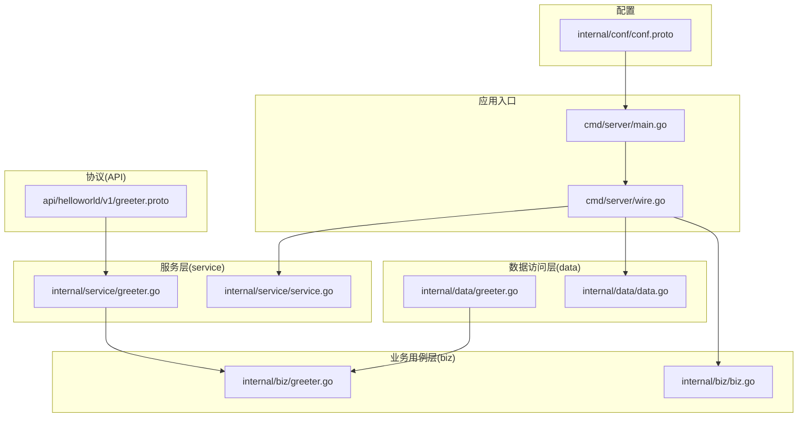
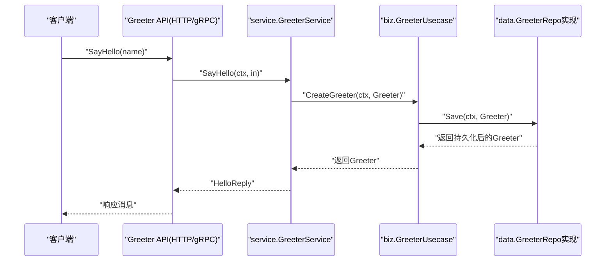
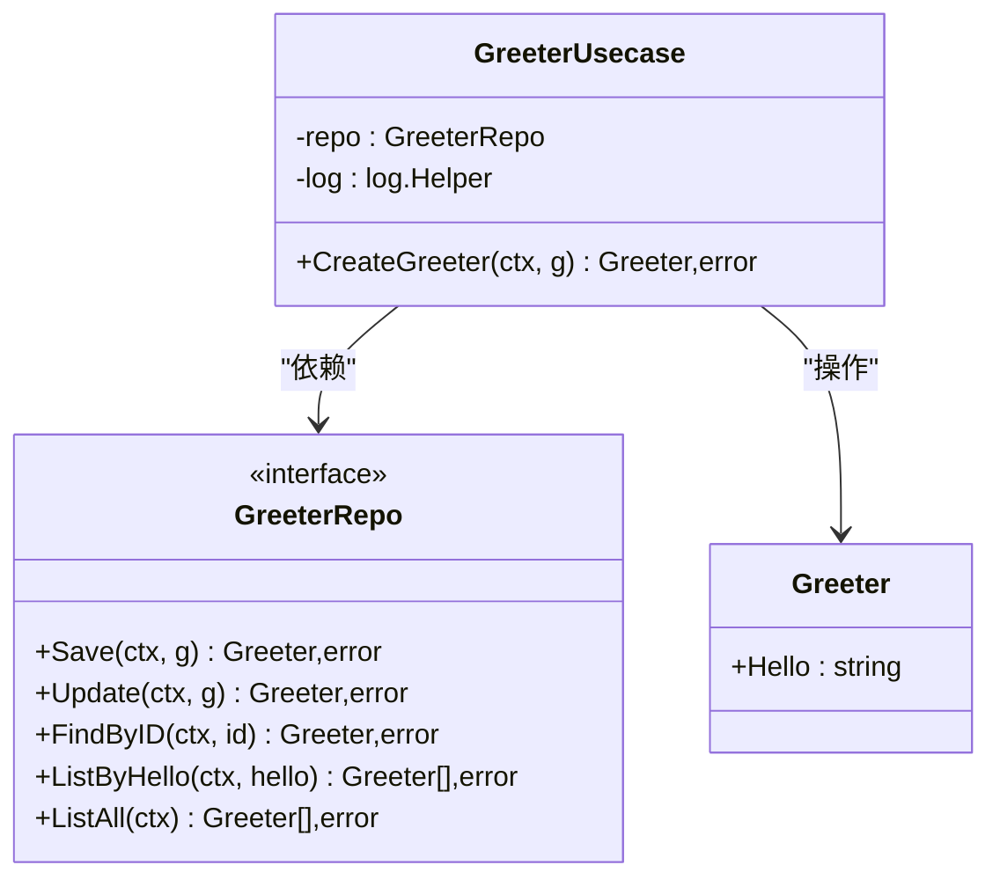
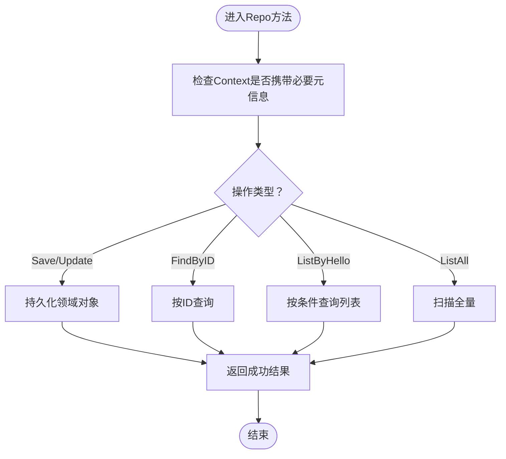
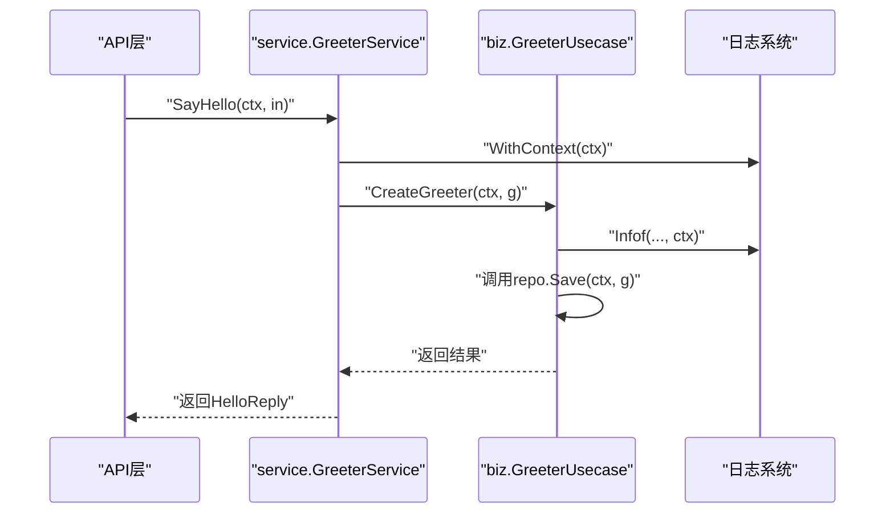
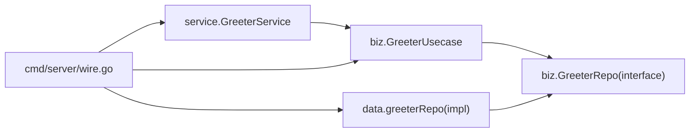

# 业务用例层（Biz）

<cite>
**本文引用的文件**
- [internal/biz/greeter.go](file://internal/biz/greeter.go)
- [internal/biz/biz.go](file://internal/biz/biz.go)
- [internal/data/greeter.go](file://internal/data/greeter.go)
- [internal/data/data.go](file://internal/data/data.go)
- [internal/service/greeter.go](file://internal/service/greeter.go)
- [internal/service/service.go](file://internal/service/service.go)
- [cmd/server/main.go](file://cmd/server/main.go)
- [cmd/server/wire.go](file://cmd/server/wire.go)
- [internal/conf/conf.proto](file://internal/conf/conf.proto)
- [api/helloworld/v1/greeter.proto](file://api/helloworld/v1/greeter.proto)
</cite>

## 目录
1. [引言](#引言)
2. [项目结构](#项目结构)
3. [核心组件](#核心组件)
4. [架构总览](#架构总览)
5. [详细组件分析](#详细组件分析)
6. [依赖关系分析](#依赖关系分析)
7. [性能考量](#性能考量)
8. [故障排查指南](#故障排查指南)
9. [结论](#结论)
10. [附录：编写新业务用例的实践指南](#附录编写新业务用例的实践指南)

## 引言
本文件聚焦于业务用例层（Biz）在Kratos布局中的实现机制，围绕GreeterUsecase展开，系统阐述“创建问候”这一业务动作的封装思路，剖析biz.Greeter领域模型与data层仓库接口GreeterRepo的契约设计，说明接口抽象对测试与实现替换的重要意义，并结合service层调用链讲解Context与日志的传递方式。最后给出编写新业务用例的实操指引，强调该层的无状态性与可测试性优势。

## 项目结构
该项目采用分层架构，按职责划分为：
- biz：业务用例层，承载领域模型与业务规则
- data：数据访问层，负责仓储接口的具体实现
- service：服务层，面向API暴露业务能力
- cmd/server：应用入口与依赖注入装配
- internal/conf：配置模型
- api：协议定义（gRPC/HTTP）

图表来源
- [cmd/server/main.go](file://cmd/server/main.go#L50-L88)
- [cmd/server/wire.go](file://cmd/server/wire.go#L20-L24)
- [internal/biz/greeter.go](file://internal/biz/greeter.go#L17-L47)
- [internal/biz/biz.go](file://internal/biz/biz.go#L1-L7)
- [internal/data/greeter.go](file://internal/data/greeter.go#L1-L43)
- [internal/data/data.go](file://internal/data/data.go#L1-L25)
- [internal/service/greeter.go](file://internal/service/greeter.go#L1-L30)
- [internal/service/service.go](file://internal/service/service.go#L1-L7)
- [internal/conf/conf.proto](file://internal/conf/conf.proto#L1-L42)
- [api/helloworld/v1/greeter.proto](file://api/helloworld/v1/greeter.proto#L1-L31)

章节来源
- [cmd/server/main.go](file://cmd/server/main.go#L50-L88)
- [cmd/server/wire.go](file://cmd/server/wire.go#L20-L24)
- [internal/biz/greeter.go](file://internal/biz/greeter.go#L17-L47)
- [internal/data/greeter.go](file://internal/data/greeter.go#L1-L43)
- [internal/service/greeter.go](file://internal/service/greeter.go#L1-L30)
- [internal/conf/conf.proto](file://internal/conf/conf.proto#L1-L42)
- [api/helloworld/v1/greeter.proto](file://api/helloworld/v1/greeter.proto#L1-L31)

## 核心组件
- 领域模型：biz.Greeter，承载“问候内容”的最小领域语义
- 仓储接口：biz.GreeterRepo，定义持久化与查询契约（保存、更新、按ID查找、按条件列表、全量列表）
- 业务用例：biz.GreeterUsecase，封装“创建问候”的业务动作，依赖GreeterRepo与日志助手
- 服务适配：service.GreeterService，将API请求转换为业务用例调用
- 依赖注入：通过Google Wire在cmd/server中装配ProviderSet，形成完整应用

章节来源
- [internal/biz/greeter.go](file://internal/biz/greeter.go#L17-L47)
- [internal/biz/biz.go](file://internal/biz/biz.go#L1-L7)
- [internal/data/greeter.go](file://internal/data/greeter.go#L1-L43)
- [internal/data/data.go](file://internal/data/data.go#L1-L25)
- [internal/service/greeter.go](file://internal/service/greeter.go#L1-L30)
- [internal/service/service.go](file://internal/service/service.go#L1-L7)
- [cmd/server/wire.go](file://cmd/server/wire.go#L20-L24)

## 架构总览
下图展示了从API到业务用例再到数据访问的整体调用链，以及依赖注入的装配关系。

图表来源
- [internal/service/greeter.go](file://internal/service/greeter.go#L22-L30)
- [internal/biz/greeter.go](file://internal/biz/greeter.go#L42-L47)
- [internal/data/greeter.go](file://internal/data/greeter.go#L24-L26)

章节来源
- [internal/service/greeter.go](file://internal/service/greeter.go#L22-L30)
- [internal/biz/greeter.go](file://internal/biz/greeter.go#L42-L47)
- [internal/data/greeter.go](file://internal/data/greeter.go#L24-L26)

## 详细组件分析

### GreeterUsecase：封装“创建问候”的业务动作
- 设计理念
  - 无状态：仅持有GreeterRepo与日志助手，不维护会话或全局状态
  - 单一职责：CreateGreeter专注于“创建”，委托Repo完成持久化
  - 可测试：通过构造函数注入Repo，便于单元测试时替换为Mock实现
- 关键行为
  - 记录上下文日志：使用log.Helper.WithContext(ctx)确保追踪ID、服务元数据等透传
  - 委派持久化：CreateGreeter直接调用repo.Save，保持业务逻辑简洁
- 错误处理
  - 通过ErrUserNotFound常量体现领域错误语义；实际返回由Repo实现决定

图表来源
- [internal/biz/greeter.go](file://internal/biz/greeter.go#L17-L47)

章节来源
- [internal/biz/greeter.go](file://internal/biz/greeter.go#L17-L47)

### GreeterRepo接口：抽象数据访问契约
- 职责边界
  - 定义与业务用例交互的数据访问方法集，屏蔽具体存储细节
  - 通过Context传递超时、追踪、租户等横切信息
- 方法族
  - Save/Update：写入领域对象
  - FindByID：按主键检索
  - ListByHello/ListAll：按条件或全量查询
- 实现形态
  - 当前示例实现位于internal/data/greeter.go，返回占位结果，便于演示装配与调用链
  - 真实项目中可替换为数据库、缓存、远程服务等实现

图表来源
- [internal/data/greeter.go](file://internal/data/greeter.go#L24-L43)

章节来源
- [internal/data/greeter.go](file://internal/data/greeter.go#L1-L43)

### service层调用链：Context与日志的传递
- Context传递
  - API层接收请求后，将ctx向下传递给service，再由service传递给biz
  - biz在记录日志时使用log.Helper.WithContext(ctx)，确保日志包含TraceID、SpanID等
- 日志传播
  - 服务端启动时统一设置日志字段（时间戳、调用者、服务元数据、追踪ID等）
  - biz层通过log.Helper增强日志上下文，保证跨层可观测性
- 典型调用序列
  - API -> service.GreeterService.SayHello -> biz.GreeterUsecase.CreateGreeter -> data.GreeterRepo.Save

图表来源
- [internal/service/greeter.go](file://internal/service/greeter.go#L22-L30)
- [internal/biz/greeter.go](file://internal/biz/greeter.go#L42-L47)
- [cmd/server/main.go](file://cmd/server/main.go#L50-L88)

章节来源
- [internal/service/greeter.go](file://internal/service/greeter.go#L22-L30)
- [internal/biz/greeter.go](file://internal/biz/greeter.go#L42-L47)
- [cmd/server/main.go](file://cmd/server/main.go#L50-L88)

### 依赖注入与ProviderSet装配
- Wire装配顺序
  - cmd/server/wire.go中通过panic(wire.Build(...))触发代码生成，组装server、data、biz、service各层ProviderSet
  - 应用入口cmd/server/main.go加载配置并调用wireApp，最终构建kratos.App
- ProviderSet职责
  - biz.ProviderSet：导出NewGreeterUsecase
  - data.ProviderSet：导出NewData与NewGreeterRepo
  - service.ProviderSet：导出NewGreeterService
- 作用
  - 将biz层的无状态用例与data层的具体实现解耦，便于替换与测试

章节来源
- [cmd/server/wire.go](file://cmd/server/wire.go#L20-L24)
- [cmd/server/main.go](file://cmd/server/main.go#L72-L88)
- [internal/biz/biz.go](file://internal/biz/biz.go#L1-L7)
- [internal/data/data.go](file://internal/data/data.go#L1-L25)
- [internal/service/service.go](file://internal/service/service.go#L1-L7)

## 依赖关系分析
- 层间依赖
  - service依赖biz（组合GreeterUsecase）
  - biz依赖data（通过GreeterRepo接口）
  - cmd/server通过Wire装配各层ProviderSet
- 接口与实现
  - biz.GreeterRepo为抽象接口，data.greeterRepo为具体实现
  - 通过接口抽象，可在测试中注入MockRepo，或在生产替换为真实存储实现

图表来源
- [internal/service/greeter.go](file://internal/service/greeter.go#L1-L30)
- [internal/biz/greeter.go](file://internal/biz/greeter.go#L22-L30)
- [internal/data/greeter.go](file://internal/data/greeter.go#L11-L22)
- [cmd/server/wire.go](file://cmd/server/wire.go#L20-L24)

章节来源
- [internal/service/greeter.go](file://internal/service/greeter.go#L1-L30)
- [internal/biz/greeter.go](file://internal/biz/greeter.go#L22-L30)
- [internal/data/greeter.go](file://internal/data/greeter.go#L11-L22)
- [cmd/server/wire.go](file://cmd/server/wire.go#L20-L24)

## 性能考量
- 无状态用例的优势
  - GreeterUsecase不持有可变状态，天然适合并发复用，降低锁竞争与上下文切换成本
- 日志与追踪
  - 通过WithContext(ctx)将追踪上下文写入日志，有助于定位热点路径与异常点
- 仓储接口的幂等性
  - Save/Update应保证幂等与一致性，避免重复写入导致的性能损耗
- 上下文超时控制
  - 通过Context传递超时，避免阻塞在Repo实现上，提升整体吞吐

## 故障排查指南
- 常见问题
  - 未正确传递Context：导致日志缺失追踪ID、无法定位请求链路
  - 仓储实现未处理错误：CreateGreeter返回nil或错误未上抛，影响上层判断
  - 依赖注入缺失：Wire未生成或ProviderSet未注册，导致运行时panic
- 排查步骤
  - 检查service层是否将ctx传入biz层
  - 在biz层确认log.Helper.WithContext(ctx)已启用
  - 确认data层Repo实现返回了正确的错误或结果
  - 校验cmd/server/main.go中wireApp调用与ProviderSet装配
- 相关定位点
  - service层调用：service.GreeterService.SayHello
  - 业务用例：biz.GreeterUsecase.CreateGreeter
  - 仓储实现：data.greeterRepo.Save
  - 依赖装配：cmd/server/wire.go与cmd/server/main.go

章节来源
- [internal/service/greeter.go](file://internal/service/greeter.go#L22-L30)
- [internal/biz/greeter.go](file://internal/biz/greeter.go#L42-L47)
- [internal/data/greeter.go](file://internal/data/greeter.go#L24-L26)
- [cmd/server/wire.go](file://cmd/server/wire.go#L20-L24)
- [cmd/server/main.go](file://cmd/server/main.go#L72-L88)

## 结论
biz层通过GreeterUsecase与GreeterRepo接口，将“创建问候”这一业务动作清晰地封装为无状态、可测试、可替换的单元。接口抽象使得data层实现可以灵活演进，同时service层通过Context与日志的透传，保障了可观测性与可追溯性。借助Google Wire的ProviderSet装配，系统实现了松耦合与高内聚，为后续扩展新业务用例提供了稳定基础。

## 附录：编写新业务用例的实践指南
- 定义领域模型
  - 在biz包新增领域结构体，仅包含业务必需字段，避免过早引入基础设施细节
  - 示例参考：biz.Greeter
- 声明仓库接口
  - 在biz包定义GreeterRepo接口，列出与业务用例交互的方法集合
  - 示例参考：biz.GreeterRepo
- 实现具体用例逻辑
  - 在biz包新增用例结构体，注入对应Repo与日志助手
  - 在用例方法中仅编排业务流程，将持久化与查询委派给Repo
  - 示例参考：biz.GreeterUsecase.CreateGreeter
- 替换与测试
  - 在data包提供Repo实现；在测试中注入MockRepo，验证业务分支
  - 示例参考：data.greeterRepo
- 服务层对接
  - 在service包新增服务结构体，注入biz用例
  - 将API输入转换为biz模型，调用用例并返回API输出
  - 示例参考：service.GreeterService.SayHello
- 依赖注入
  - 在各自层的biz.go、data.go、service.go中注册ProviderSet
  - 在cmd/server/wire.go中聚合ProviderSet并生成wireApp
  - 示例参考：cmd/server/wire.go、cmd/server/main.go

章节来源
- [internal/biz/greeter.go](file://internal/biz/greeter.go#L17-L47)
- [internal/data/greeter.go](file://internal/data/greeter.go#L1-L43)
- [internal/service/greeter.go](file://internal/service/greeter.go#L1-L30)
- [cmd/server/wire.go](file://cmd/server/wire.go#L20-L24)
- [cmd/server/main.go](file://cmd/server/main.go#L72-L88)