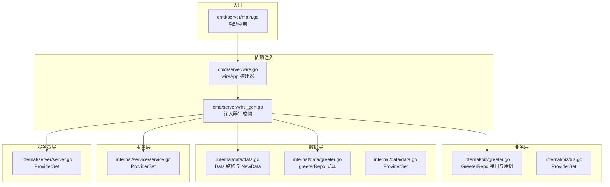
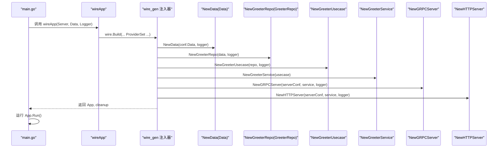
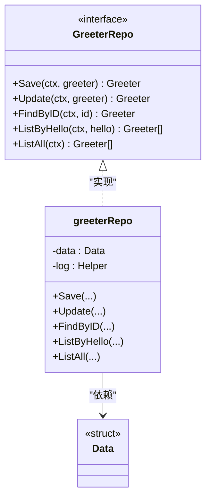
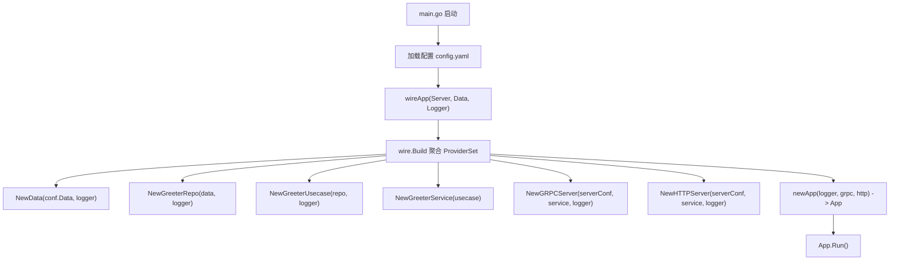
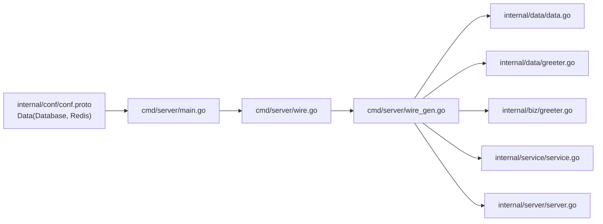

# 数据访问层（Data）

<cite>
**本文引用的文件列表**
- [internal/data/data.go](file://internal/data/data.go)
- [internal/data/greeter.go](file://internal/data/greeter.go)
- [internal/biz/greeter.go](file://internal/biz/greeter.go)
- [cmd/server/wire.go](file://cmd/server/wire.go)
- [cmd/server/wire_gen.go](file://cmd/server/wire_gen.go)
- [internal/conf/conf.proto](file://internal/conf/conf.proto)
- [configs/config.yaml](file://configs/config.yaml)
- [cmd/server/main.go](file://cmd/server/main.go)
- [internal/biz/biz.go](file://internal/biz/biz.go)
- [internal/service/service.go](file://internal/service/service.go)
- [internal/server/server.go](file://internal/server/server.go)
</cite>

## 目录
1. [简介](#简介)
2. [项目结构](#项目结构)
3. [核心组件](#核心组件)
4. [架构总览](#架构总览)
5. [组件详解](#组件详解)
6. [依赖关系分析](#依赖关系分析)
7. [性能考量](#性能考量)
8. [故障排查指南](#故障排查指南)
9. [结论](#结论)
10. [附录：接入真实数据库与缓存的扩展指南](#附录接入真实数据库与缓存的扩展指南)

## 简介
本文件系统性地文档化数据访问层（Data）在本项目中的职责与实现方式，重点围绕 GreeterRepo 接口的实现与依赖注入流程展开。当前 data 层为“实现细节”，对外仅暴露 biz 层定义的接口；greeterRepo 当前为桩实现，返回模拟数据。本文将说明：
- 如何通过 NewData 初始化并持有数据库与缓存资源（当前占位，未来可替换为真实客户端）
- 如何通过 NewGreeterRepo 将具体实现注入到 biz 层
- 如何通过 Wire 框架完成依赖注入与应用装配
- 如何扩展接入真实数据库（如 MySQL）与缓存（如 Redis），包括实体映射、DAO 方法与事务管理

## 项目结构
数据访问层位于 internal/data，包含：
- data.go：定义 Data 结构体与 NewData 构造函数，负责初始化数据库与缓存等外部资源
- greeter.go：实现 GreeterRepo 接口的具体仓库（当前为桩实现）

业务层（biz）与服务层（service）、服务器层（server）通过 Wire 注入器进行装配，最终由 cmd/server/main.go 启动应用。

图表来源
- [cmd/server/main.go](file://cmd/server/main.go#L53-L87)
- [cmd/server/wire.go](file://cmd/server/wire.go#L20-L23)
- [cmd/server/wire_gen.go](file://cmd/server/wire_gen.go#L25-L40)
- [internal/data/data.go](file://internal/data/data.go#L10-L24)
- [internal/data/greeter.go](file://internal/data/greeter.go#L16-L43)
- [internal/biz/greeter.go](file://internal/biz/greeter.go#L22-L47)
- [internal/biz/biz.go](file://internal/biz/biz.go#L1-L7)
- [internal/service/service.go](file://internal/service/service.go#L1-L7)
- [internal/server/server.go](file://internal/server/server.go#L1-L9)

章节来源
- [cmd/server/main.go](file://cmd/server/main.go#L53-L87)
- [cmd/server/wire.go](file://cmd/server/wire.go#L20-L23)
- [cmd/server/wire_gen.go](file://cmd/server/wire_gen.go#L25-L40)
- [internal/data/data.go](file://internal/data/data.go#L10-L24)
- [internal/data/greeter.go](file://internal/data/greeter.go#L16-L43)
- [internal/biz/greeter.go](file://internal/biz/greeter.go#L22-L47)
- [internal/biz/biz.go](file://internal/biz/biz.go#L1-L7)
- [internal/service/service.go](file://internal/service/service.go#L1-L7)
- [internal/server/server.go](file://internal/server/server.go#L1-L9)

## 核心组件
- Data 结构与 NewData
  - Data 用于承载数据库与缓存等外部资源（当前为占位）
  - NewData 接收配置对象与日志器，返回 Data 实例与清理函数
- GreeterRepo 接口与实现
  - Biz 定义 GreeterRepo 接口，包含 Save、Update、FindByID、ListByHello、ListAll 等方法
  - data 层提供 greeterRepo 结构体实现，并通过 NewGreeterRepo 返回 biz.GreeterRepo 接口实例
- 依赖注入
  - data.ProviderSet 包含 NewData 与 NewGreeterRepo
  - wireApp 使用 wire.Build 聚合各 ProviderSet 并生成注入器
  - main.go 通过 wireApp 获取应用实例并运行

章节来源
- [internal/data/data.go](file://internal/data/data.go#L10-L24)
- [internal/data/greeter.go](file://internal/data/greeter.go#L16-L43)
- [internal/biz/greeter.go](file://internal/biz/greeter.go#L22-L47)
- [cmd/server/wire.go](file://cmd/server/wire.go#L20-L23)
- [cmd/server/wire_gen.go](file://cmd/server/wire_gen.go#L25-L40)

## 架构总览
下图展示从入口到数据层的依赖注入与调用链路，体现 data 层作为“实现细节”对外仅暴露接口的设计原则。

图表来源
- [cmd/server/main.go](file://cmd/server/main.go#L53-L87)
- [cmd/server/wire.go](file://cmd/server/wire.go#L20-L23)
- [cmd/server/wire_gen.go](file://cmd/server/wire_gen.go#L25-L40)
- [internal/data/data.go](file://internal/data/data.go#L10-L24)
- [internal/data/greeter.go](file://internal/data/greeter.go#L16-L22)
- [internal/biz/greeter.go](file://internal/biz/greeter.go#L32-L47)
- [internal/service/service.go](file://internal/service/service.go#L1-L7)
- [internal/server/server.go](file://internal/server/server.go#L1-L9)

## 组件详解

### Data 结构与资源初始化
- 设计角色
  - Data 作为“实现细节”的容器，封装数据库与缓存等外部资源
  - NewData 接收 conf.Data 配置与日志器，返回 Data 实例与清理函数
- 当前状态
  - Data 字段为占位，未实际持有任何客户端
  - 清理函数记录关闭资源的日志
- 扩展建议
  - 在 Data 中添加数据库与缓存客户端字段
  - 在 NewData 中根据 conf.Data 初始化客户端，并在清理函数中释放资源

章节来源
- [internal/data/data.go](file://internal/data/data.go#L10-L24)
- [internal/conf/conf.proto](file://internal/conf/conf.proto#L28-L41)
- [configs/config.yaml](file://configs/config.yaml#L8-L16)

### GreeterRepo 接口与实现（桩实现）
- 接口定义
  - biz.GreeterRepo 定义 Save、Update、FindByID、ListByHello、ListAll 等方法
- 实现细节
  - data 层通过 greeterRepo 结构体实现接口
  - NewGreeterRepo 将 data 与日志器注入，返回 biz.GreeterRepo 接口
- 当前行为
  - Save、Update 返回传入参数本身
  - FindByID、ListByHello、ListAll 返回空值
- 依赖注入
  - data.ProviderSet 包含 NewGreeterRepo
  - wireApp 通过 wire.Build 自动注入 GreeterRepo 到业务用例

图表来源
- [internal/biz/greeter.go](file://internal/biz/greeter.go#L22-L47)
- [internal/data/greeter.go](file://internal/data/greeter.go#L11-L43)
- [internal/data/data.go](file://internal/data/data.go#L13-L17)

章节来源
- [internal/biz/greeter.go](file://internal/biz/greeter.go#L22-L47)
- [internal/data/greeter.go](file://internal/data/greeter.go#L16-L43)
- [internal/data/data.go](file://internal/data/data.go#L10-L24)

### 依赖注入与应用装配
- ProviderSet
  - data.ProviderSet：包含 NewData 与 NewGreeterRepo
  - biz.ProviderSet：包含 NewGreeterUsecase
  - service.ProviderSet：包含 NewGreeterService
  - server.ProviderSet：包含 NewGRPCServer 与 NewHTTPServer
- wireApp
  - wireApp 调用 wire.Build 聚合各 ProviderSet，生成注入器
  - wire_gen.go 是 wire 生成的注入器实现，按顺序创建 Data、Repo、Usecase、Service、Server，并组装成 kratos.App
- 入口启动
  - main.go 加载配置后调用 wireApp，得到 App 与 cleanup，随后运行 App.Run()

图表来源
- [cmd/server/main.go](file://cmd/server/main.go#L53-L87)
- [cmd/server/wire.go](file://cmd/server/wire.go#L20-L23)
- [cmd/server/wire_gen.go](file://cmd/server/wire_gen.go#L25-L40)
- [internal/data/data.go](file://internal/data/data.go#L10-L24)
- [internal/data/greeter.go](file://internal/data/greeter.go#L16-L22)
- [internal/biz/greeter.go](file://internal/biz/greeter.go#L32-L47)
- [internal/service/service.go](file://internal/service/service.go#L1-L7)
- [internal/server/server.go](file://internal/server/server.go#L1-L9)

章节来源
- [cmd/server/wire.go](file://cmd/server/wire.go#L20-L23)
- [cmd/server/wire_gen.go](file://cmd/server/wire_gen.go#L25-L40)
- [cmd/server/main.go](file://cmd/server/main.go#L53-L87)

## 依赖关系分析
- 组件耦合
  - data 层对 biz 层仅通过接口交互，保持低耦合
  - wire 通过 ProviderSet 解耦具体实现与上层模块
- 外部依赖
  - 配置模型来自 internal/conf/conf.proto，支持数据库与 Redis
  - 应用通过 Kratos 框架运行，日志器统一注入
- 可能的循环依赖
  - 当前未发现直接循环依赖；wire.Build 保证按依赖顺序构建

图表来源
- [internal/conf/conf.proto](file://internal/conf/conf.proto#L28-L41)
- [cmd/server/main.go](file://cmd/server/main.go#L53-L87)
- [cmd/server/wire.go](file://cmd/server/wire.go#L20-L23)
- [cmd/server/wire_gen.go](file://cmd/server/wire_gen.go#L25-L40)
- [internal/data/data.go](file://internal/data/data.go#L10-L24)
- [internal/data/greeter.go](file://internal/data/greeter.go#L16-L43)
- [internal/biz/greeter.go](file://internal/biz/greeter.go#L22-L47)
- [internal/service/service.go](file://internal/service/service.go#L1-L7)
- [internal/server/server.go](file://internal/server/server.go#L1-L9)

章节来源
- [internal/conf/conf.proto](file://internal/conf/conf.proto#L28-L41)
- [cmd/server/main.go](file://cmd/server/main.go#L53-L87)
- [cmd/server/wire.go](file://cmd/server/wire.go#L20-L23)
- [cmd/server/wire_gen.go](file://cmd/server/wire_gen.go#L25-L40)

## 性能考量
- 日志与清理
  - NewData 的清理函数用于关闭资源，建议在真实实现中确保及时释放数据库连接与缓存连接池
- 事务与并发
  - 数据库操作应使用连接池与事务控制，避免长事务与阻塞
- 缓存命中
  - 对高频查询使用缓存，注意缓存失效策略与一致性
- 依赖注入开销
  - Wire 生成的注入器在编译期确定依赖关系，运行时开销极小

## 故障排查指南
- 依赖注入失败
  - 检查各 ProviderSet 是否正确注册（data、biz、service、server）
  - 确认 wireApp 的 wire.Build 参数顺序与 ProviderSet 一致
- 配置不生效
  - 确认 config.yaml 的 data.database.driver 与 data.redis.addr 正确
  - 确认 main.go 已加载配置并传递给 wireApp
- 运行期错误
  - 查看日志输出，确认清理函数是否被调用
  - 若出现连接泄漏，检查 Data 的清理逻辑

章节来源
- [cmd/server/wire.go](file://cmd/server/wire.go#L20-L23)
- [cmd/server/wire_gen.go](file://cmd/server/wire_gen.go#L25-L40)
- [configs/config.yaml](file://configs/config.yaml#L8-L16)
- [cmd/server/main.go](file://cmd/server/main.go#L53-L87)
- [internal/data/data.go](file://internal/data/data.go#L10-L24)

## 结论
- data 层当前以“实现细节”形式存在，对外仅暴露 biz.GreeterRepo 接口，符合分层设计原则
- 通过 Wire 框架完成依赖注入与应用装配，入口 main.go 仅负责加载配置与启动应用
- 当前 greeterRepo 为桩实现，便于快速验证上层流程；后续可无缝替换为真实 DAO 与事务处理
- 建议尽快完善 Data 的真实客户端初始化与清理逻辑，以满足生产环境需求

## 附录：接入真实数据库与缓存的扩展指南

### 1. 定义实体映射
- 在 biz 层定义领域模型（如 Greeter），并在 data 层新增对应的 DAO 模型
- 映射规则遵循业务语义，避免跨层直接使用 ORM 映射

章节来源
- [internal/biz/greeter.go](file://internal/biz/greeter.go#L17-L21)

### 2. 编写 DAO 方法
- 在 data 层新增 DAO 文件，封装数据库访问
- 提供 CRUD 与查询方法，返回 biz 层领域模型
- 事务管理
  - 使用数据库事务包裹多表更新或一致性要求高的操作
  - 通过 Data 持有的数据库客户端执行事务

章节来源
- [internal/data/data.go](file://internal/data/data.go#L13-L17)
- [internal/conf/conf.proto](file://internal/conf/conf.proto#L28-L41)
- [configs/config.yaml](file://configs/config.yaml#L8-L16)

### 3. 替换 GreeterRepo 实现
- 在 data 层实现 GreeterRepo 的所有方法，调用 DAO 完成持久化
- 通过 NewGreeterRepo 返回具体实现，保持对 biz 层的接口暴露不变

章节来源
- [internal/data/greeter.go](file://internal/data/greeter.go#L16-L43)
- [internal/biz/greeter.go](file://internal/biz/greeter.go#L22-L47)

### 4. 初始化数据库与缓存客户端
- 在 NewData 中读取 conf.Data，初始化数据库与缓存客户端
- 在清理函数中释放连接，确保优雅退出

章节来源
- [internal/data/data.go](file://internal/data/data.go#L10-L24)
- [internal/conf/conf.proto](file://internal/conf/conf.proto#L28-L41)
- [configs/config.yaml](file://configs/config.yaml#L8-L16)

### 5. 事务管理最佳实践
- 开启事务：在需要一致性的场景开启事务
- 回滚策略：捕获错误并回滚，记录日志
- 提交时机：成功路径提交事务，确保幂等性
- 超时与重试：设置合理超时与重试策略，避免长时间占用连接

### 6. 缓存接入（可选）
- 在 Data 中增加缓存客户端字段
- 在 DAO 查询中加入缓存读写逻辑，注意缓存失效与双写一致性
- 使用配置项控制缓存网络与超时

章节来源
- [internal/conf/conf.proto](file://internal/conf/conf.proto#L33-L41)
- [configs/config.yaml](file://configs/config.yaml#L12-L16)