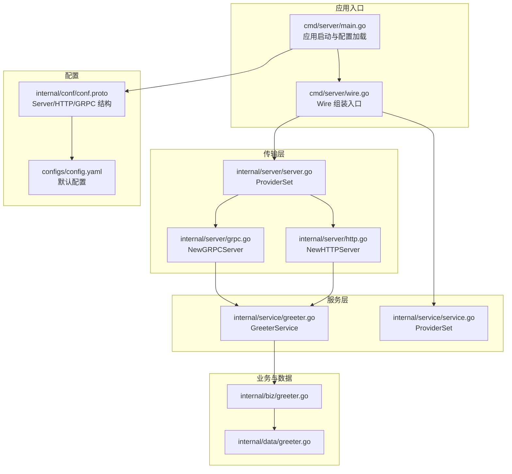
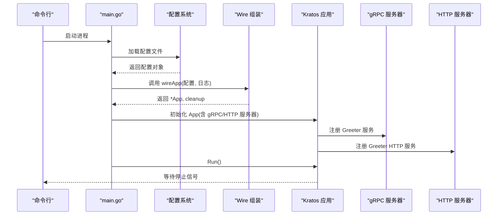
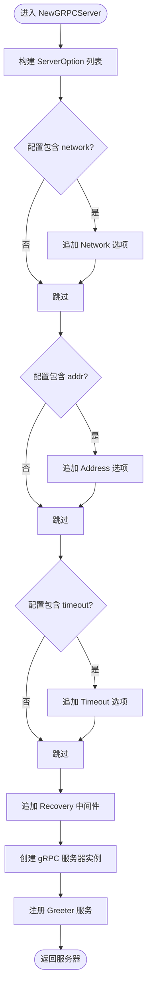
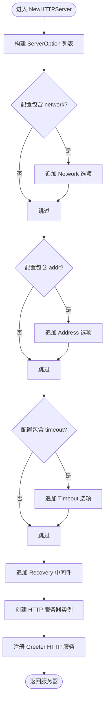
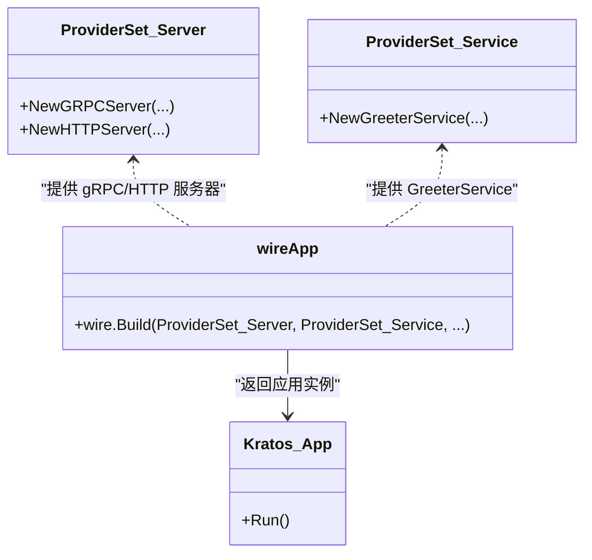
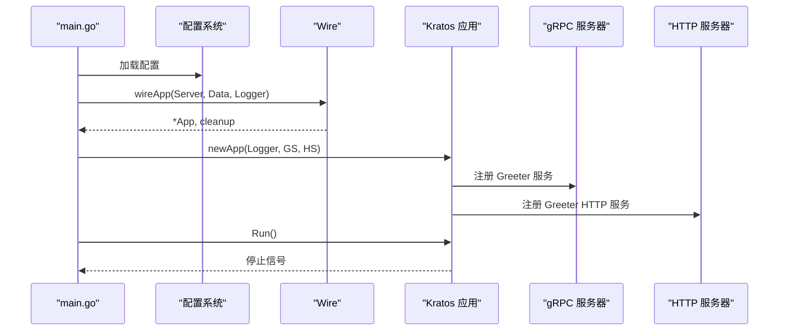
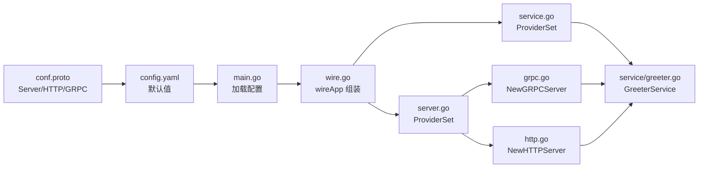

# 服务器传输层（Server）

<cite>
**本文引用的文件列表**
- [internal/server/grpc.go](file://internal/server/grpc.go)
- [internal/server/http.go](file://internal/server/http.go)
- [internal/server/server.go](file://internal/server/server.go)
- [cmd/server/main.go](file://cmd/server/main.go)
- [cmd/server/wire.go](file://cmd/server/wire.go)
- [internal/conf/conf.proto](file://internal/conf/conf.proto)
- [configs/config.yaml](file://configs/config.yaml)
- [internal/service/greeter.go](file://internal/service/greeter.go)
- [internal/service/service.go](file://internal/service/service.go)
- [internal/biz/greeter.go](file://internal/biz/greeter.go)
- [internal/data/greeter.go](file://internal/data/greeter.go)
</cite>

## 目录
1. [引言](#引言)
2. [项目结构](#项目结构)
3. [核心组件](#核心组件)
4. [架构总览](#架构总览)
5. [详细组件分析](#详细组件分析)
6. [依赖关系分析](#依赖关系分析)
7. [性能与可扩展性](#性能与可扩展性)
8. [故障排查指南](#故障排查指南)
9. [结论](#结论)
10. [附录：配置与自定义选项](#附录配置与自定义选项)

## 引言
本节聚焦于服务器传输层（Server）如何初始化并配置 gRPC 与 HTTP 两种传输协议。文档将深入解析：
- gRPC 侧：如何通过 NewGRPCServer 工厂方法创建 gRPC 服务器实例，并基于配置启用网络、地址、超时等选项；随后注册 Greeter 服务。
- HTTP 侧：如何通过 NewHTTPServer 工厂方法创建 HTTP 服务器实例，设置中间件与传输参数，并注册 Greeter 的 HTTP 服务。
- 依赖注入：在 main.go 中通过 Wire 框架装配应用，将服务层实例注入到传输层，最终由 Kratos 应用统一管理与启动。
- 配置来源：基于配置文件与 proto 定义，动态决定服务器监听地址、网络类型与超时等行为。

## 项目结构
服务器传输层位于 internal/server，包含三个关键文件：
- grpc.go：封装 gRPC 服务器的创建与注册逻辑。
- http.go：封装 HTTP 服务器的创建与注册逻辑。
- server.go：导出 ProviderSet，用于 Wire 组装。

同时，应用入口位于 cmd/server，使用 Wire 进行依赖注入，最终交由 Kratos 应用统一启动。

图表来源
- [cmd/server/main.go](file://cmd/server/main.go#L50-L88)
- [cmd/server/wire.go](file://cmd/server/wire.go#L20-L24)
- [internal/server/grpc.go](file://internal/server/grpc.go#L13-L32)
- [internal/server/http.go](file://internal/server/http.go#L13-L32)
- [internal/server/server.go](file://internal/server/server.go#L7-L9)
- [internal/service/greeter.go](file://internal/service/greeter.go#L10-L30)
- [internal/service/service.go](file://internal/service/service.go#L1-L7)
- [internal/biz/greeter.go](file://internal/biz/greeter.go#L1-L47)
- [internal/data/greeter.go](file://internal/data/greeter.go#L1-L43)
- [internal/conf/conf.proto](file://internal/conf/conf.proto#L8-L26)
- [configs/config.yaml](file://configs/config.yaml#L1-L16)

章节来源
- [internal/server/grpc.go](file://internal/server/grpc.go#L13-L32)
- [internal/server/http.go](file://internal/server/http.go#L13-L32)
- [internal/server/server.go](file://internal/server/server.go#L7-L9)
- [cmd/server/main.go](file://cmd/server/main.go#L50-L88)
- [cmd/server/wire.go](file://cmd/server/wire.go#L20-L24)
- [internal/conf/conf.proto](file://internal/conf/conf.proto#L8-L26)
- [configs/config.yaml](file://configs/config.yaml#L1-L16)

## 核心组件
- gRPC 服务器工厂：NewGRPCServer 接收配置与服务实例，按需设置网络、地址、超时等选项，并注册 Greeter 服务。
- HTTP 服务器工厂：NewHTTPServer 接收配置与服务实例，设置中间件与传输参数，注册 Greeter 的 HTTP 服务。
- ProviderSet：导出 NewGRPCServer 与 NewHTTPServer，供 Wire 组装。
- 应用装配：Wire 将传输层、服务层、业务层与数据层组合为 Kratos 应用，main 负责加载配置与启动。

章节来源
- [internal/server/grpc.go](file://internal/server/grpc.go#L13-L32)
- [internal/server/http.go](file://internal/server/http.go#L13-L32)
- [internal/server/server.go](file://internal/server/server.go#L7-L9)
- [cmd/server/wire.go](file://cmd/server/wire.go#L20-L24)

## 架构总览
下图展示了从配置加载到服务器启动的整体流程，以及 Wire 如何将各层组件装配为 Kratos 应用。

图表来源
- [cmd/server/main.go](file://cmd/server/main.go#L50-L88)
- [cmd/server/wire.go](file://cmd/server/wire.go#L20-L24)
- [internal/server/grpc.go](file://internal/server/grpc.go#L13-L32)
- [internal/server/http.go](file://internal/server/http.go#L13-L32)

## 详细组件分析

### gRPC 服务器初始化与服务注册
- 工厂方法：NewGRPCServer
  - 接收参数：配置对象（包含 gRPC 的 network、addr、timeout）、服务实例 GreeterService、日志。
  - 选项构建：根据配置动态追加网络、地址、超时等 ServerOption；默认内置恢复中间件。
  - 实例创建：使用构建好的选项创建 gRPC 服务器。
  - 服务注册：调用 v1.RegisterGreeterServer 将服务实例绑定到 gRPC 服务器。
- 关键点：
  - 传输参数来源于配置对象的 gRPC 字段。
  - 服务实例 GreeterService 实现了 v1.GreeterServer 接口。
  - 通过中间件 Recovery 提升稳定性。

图表来源
- [internal/server/grpc.go](file://internal/server/grpc.go#L13-L32)

章节来源
- [internal/server/grpc.go](file://internal/server/grpc.go#L13-L32)
- [internal/service/greeter.go](file://internal/service/greeter.go#L10-L30)
- [internal/conf/conf.proto](file://internal/conf/conf.proto#L13-L23)

### HTTP 服务器初始化与服务注册
- 工厂方法：NewHTTPServer
  - 接收参数：配置对象（包含 HTTP 的 network、addr、timeout）、服务实例 GreeterService、日志。
  - 选项构建：根据配置动态追加网络、地址、超时等 ServerOption；默认内置恢复中间件。
  - 实例创建：使用构建好的选项创建 HTTP 服务器。
  - 服务注册：调用 v1.RegisterGreeterHTTPServer 将服务实例绑定到 HTTP 服务器。
- 关键点：
  - 传输参数来源于配置对象的 HTTP 字段。
  - 服务实例 GreeterService 通过 HTTP 协议暴露接口。
  - 通过中间件 Recovery 提升稳定性。

图表来源
- [internal/server/http.go](file://internal/server/http.go#L13-L32)

章节来源
- [internal/server/http.go](file://internal/server/http.go#L13-L32)
- [internal/service/greeter.go](file://internal/service/greeter.go#L10-L30)
- [internal/conf/conf.proto](file://internal/conf/conf.proto#L13-L23)

### 传输层 ProviderSet 与 Wire 组装
- ProviderSet 导出 NewGRPCServer 与 NewHTTPServer，作为 Wire 的提供者集合。
- wireApp 在 wire.go 中通过 panic(wire.Build(...)) 触发代码生成，组装以下内容：
  - 传输层：server.ProviderSet（包含 NewGRPCServer 与 NewHTTPServer）
  - 服务层：service.ProviderSet（包含 NewGreeterService）
  - 业务层与数据层：biz.ProviderSet、data.ProviderSet
  - 最终返回 Kratos 应用与清理函数
- main.go 中调用 wireApp 并传入配置与日志，得到应用后执行 Run()。

图表来源
- [internal/server/server.go](file://internal/server/server.go#L7-L9)
- [cmd/server/wire.go](file://cmd/server/wire.go#L20-L24)
- [cmd/server/main.go](file://cmd/server/main.go#L77-L87)

章节来源
- [internal/server/server.go](file://internal/server/server.go#L7-L9)
- [cmd/server/wire.go](file://cmd/server/wire.go#L20-L24)
- [cmd/server/main.go](file://cmd/server/main.go#L77-L87)

### 应用启动流程与 Kratos 集成
- main.go 负责：
  - 解析命令行参数（配置路径）。
  - 初始化日志器。
  - 加载配置文件并扫描到结构体。
  - 调用 wireApp 组装应用与清理函数。
  - 通过 Kratos 应用统一管理多个服务器（gRPC/HTTP），并在 Run() 中等待停止信号。
- newApp 构造 Kratos 应用时，将 gRPC 与 HTTP 服务器一并注册到应用中。

图表来源
- [cmd/server/main.go](file://cmd/server/main.go#L36-L48)
- [cmd/server/main.go](file://cmd/server/main.go#L50-L88)
- [cmd/server/wire.go](file://cmd/server/wire.go#L20-L24)
- [internal/server/grpc.go](file://internal/server/grpc.go#L13-L32)
- [internal/server/http.go](file://internal/server/http.go#L13-L32)

章节来源
- [cmd/server/main.go](file://cmd/server/main.go#L36-L48)
- [cmd/server/main.go](file://cmd/server/main.go#L50-L88)
- [cmd/server/wire.go](file://cmd/server/wire.go#L20-L24)

## 依赖关系分析
- 传输层依赖：
  - 配置模型：来自 internal/conf/conf.proto 的 Server 结构，包含 HTTP 与 GRPC 子结构。
  - 服务实现：GreeterService 实现 v1.GreeterServer 与 v1.GreeterHTTPServer。
  - 日志与中间件：统一使用 Kratos 日志与中间件（Recovery）。
- Wire 组装链路：
  - Wire 通过 ProviderSet 将传输层、服务层、业务层与数据层聚合，最终构造 Kratos 应用。
- 配置来源：
  - configs/config.yaml 提供默认值（HTTP 地址、gRPC 地址、超时等）。
  - internal/conf/conf.proto 定义了配置结构，main 中将其加载到结构体。

图表来源
- [internal/conf/conf.proto](file://internal/conf/conf.proto#L8-L26)
- [configs/config.yaml](file://configs/config.yaml#L1-L16)
- [cmd/server/main.go](file://cmd/server/main.go#L61-L76)
- [cmd/server/wire.go](file://cmd/server/wire.go#L20-L24)
- [internal/server/server.go](file://internal/server/server.go#L7-L9)
- [internal/server/grpc.go](file://internal/server/grpc.go#L13-L32)
- [internal/server/http.go](file://internal/server/http.go#L13-L32)
- [internal/service/greeter.go](file://internal/service/greeter.go#L10-L30)

章节来源
- [internal/conf/conf.proto](file://internal/conf/conf.proto#L8-L26)
- [configs/config.yaml](file://configs/config.yaml#L1-L16)
- [cmd/server/main.go](file://cmd/server/main.go#L61-L76)
- [cmd/server/wire.go](file://cmd/server/wire.go#L20-L24)
- [internal/server/server.go](file://internal/server/server.go#L7-L9)
- [internal/server/grpc.go](file://internal/server/grpc.go#L13-L32)
- [internal/server/http.go](file://internal/server/http.go#L13-L32)
- [internal/service/greeter.go](file://internal/service/greeter.go#L10-L30)

## 性能与可扩展性
- 中间件：默认启用 Recovery 中间件，有助于提升服务稳定性，减少异常导致的崩溃。
- 传输参数：通过配置控制网络类型、监听地址与请求超时，便于在不同环境（开发/生产）灵活调整。
- 可扩展点：
  - 可在 NewGRPCServer/NewHTTPServer 中追加更多 ServerOption（如 TLS、认证中间件等）。
  - 可引入更多服务注册，统一由 ProviderSet 管理。
  - 可通过配置文件切换网络类型（如 unix socket）或调整超时策略以适配高延迟场景。

[本节为通用建议，不直接分析具体文件]

## 故障排查指南
- 无法启动：
  - 检查配置文件路径是否正确，确保 config.yaml 存在且字段完整。
  - 确认端口未被占用，或修改配置中的 addr。
- 服务不可访问：
  - 核对 HTTP/gRPC 的 addr 是否符合预期。
  - 若启用中间件，请确认日志输出中是否有异常堆栈。
- 依赖注入失败：
  - 确保已生成 wire_gen.go（wire build），并检查 wireApp 的 ProviderSet 是否包含所需提供者。
- 服务未注册：
  - 确认 NewGRPCServer 与 NewHTTPServer 已被 ProviderSet 导出，并在 wireApp 中被纳入组装。

章节来源
- [configs/config.yaml](file://configs/config.yaml#L1-L16)
- [cmd/server/main.go](file://cmd/server/main.go#L32-L40)
- [cmd/server/wire.go](file://cmd/server/wire.go#L20-L24)
- [internal/server/grpc.go](file://internal/server/grpc.go#L13-L32)
- [internal/server/http.go](file://internal/server/http.go#L13-L32)

## 结论
本项目采用清晰的分层设计与 Wire 依赖注入，将 gRPC 与 HTTP 两种传输协议的初始化与配置集中在 server 层，通过 ProviderSet 与 wireApp 统一装配服务层、业务层与数据层，最终由 Kratos 应用统一管理与启动。配置文件与 proto 定义共同驱动服务器行为，具备良好的可扩展性与可维护性。

[本节为总结性内容，不直接分析具体文件]

## 附录：配置与自定义选项
- 配置项来源
  - 配置结构：Server.HTTP 与 Server.GRPC 字段分别定义网络类型、监听地址与超时。
  - 默认配置：HTTP 与 gRPC 的 addr 与 timeout。
- 自定义选项建议
  - 端口与网络：通过配置文件的 network 与 addr 字段进行调整。
  - 超时：通过 timeout 字段统一控制请求处理时间。
  - 中间件：可在 NewGRPCServer/NewHTTPServer 中追加更多中间件（如鉴权、限流、指标采集等）。
  - TLS：可在 NewGRPCServer 中追加 TLS 相关 ServerOption（例如证书与私钥路径），并在配置中新增对应字段。
  - 其他传输参数：如连接池、压缩、拦截器等，均可通过相应 ServerOption 扩展。

章节来源
- [internal/conf/conf.proto](file://internal/conf/conf.proto#L13-L23)
- [configs/config.yaml](file://configs/config.yaml#L1-L16)
- [internal/server/grpc.go](file://internal/server/grpc.go#L13-L32)
- [internal/server/http.go](file://internal/server/http.go#L13-L32)