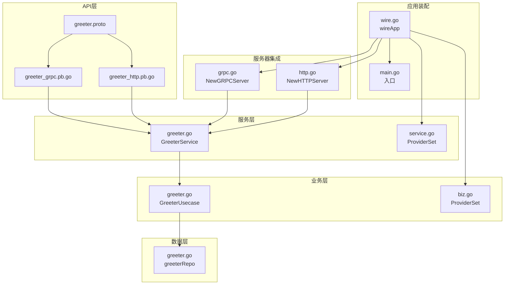
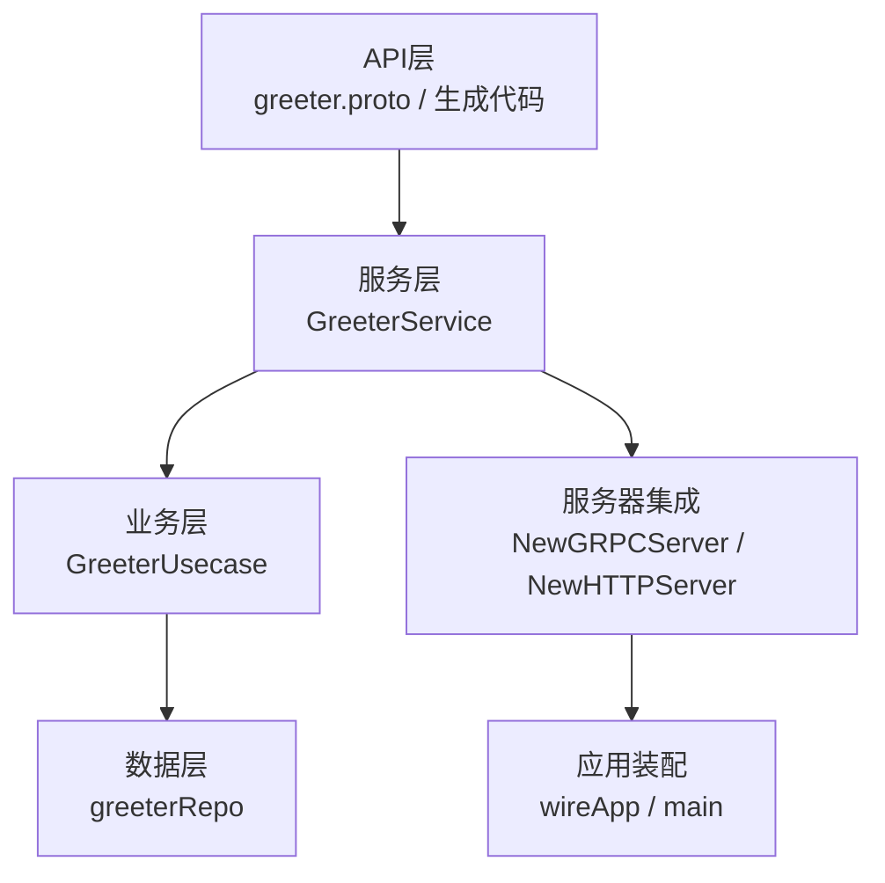
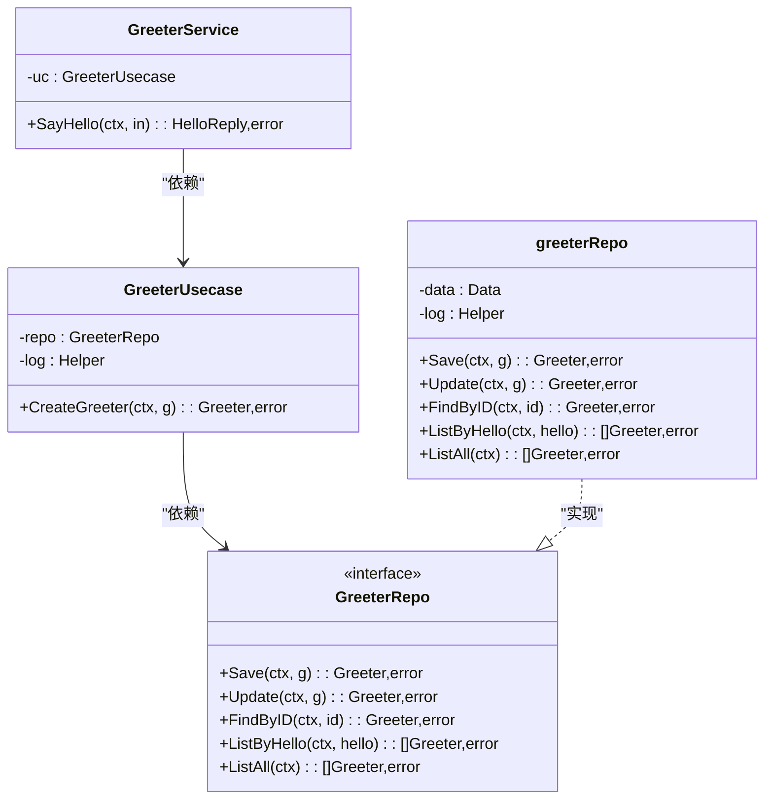
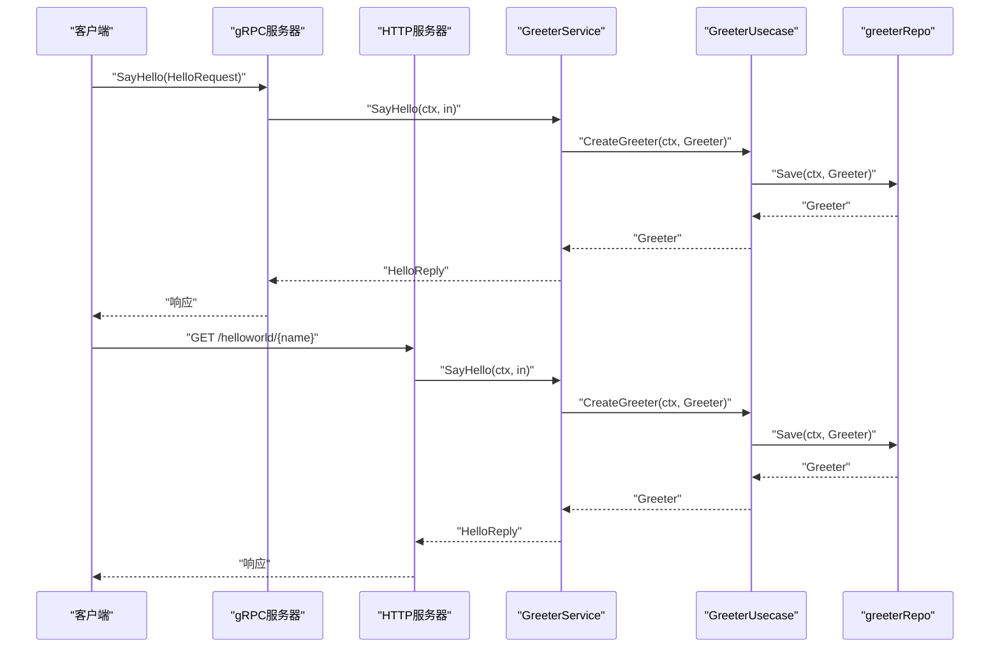
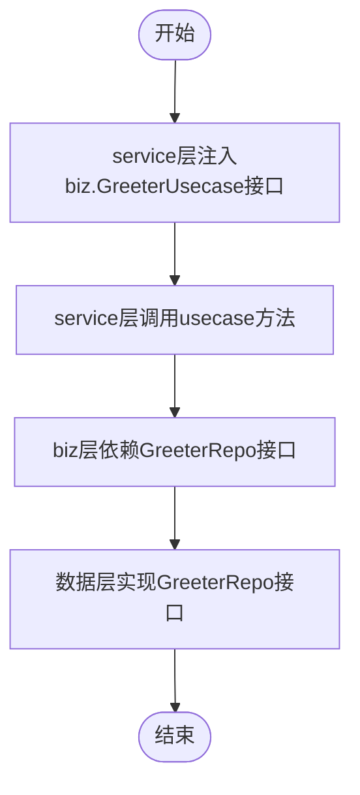
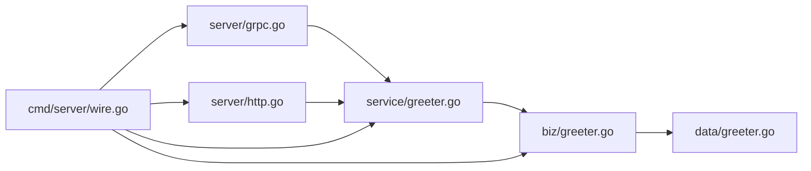

# 服务层（Service）

<cite>
**本文引用的文件**
- [greeter.go](file://internal/service/greeter.go)
- [service.go](file://internal/service/service.go)
- [greeter.go](file://internal/biz/greeter.go)
- [biz.go](file://internal/biz/biz.go)
- [greeter.go](file://internal/data/greeter.go)
- [grpc.go](file://internal/server/grpc.go)
- [http.go](file://internal/server/http.go)
- [greeter.proto](file://api/helloworld/v1/greeter.proto)
- [greeter_grpc.pb.go](file://api/helloworld/v1/greeter_grpc.pb.go)
- [greeter_http.pb.go](file://api/helloworld/v1/greeter_http.pb.go)
- [wire.go](file://cmd/server/wire.go)
- [main.go](file://cmd/server/main.go)
</cite>

## 目录
1. [引言](#引言)
2. [项目结构](#项目结构)
3. [核心组件](#核心组件)
4. [架构总览](#架构总览)
5. [详细组件分析](#详细组件分析)
6. [依赖关系分析](#依赖关系分析)
7. [性能考量](#性能考量)
8. [故障排查指南](#故障排查指南)
9. [结论](#结论)
10. [附录：新增API方法标准流程](#附录新增api方法标准流程)

## 引言
本节聚焦于Kratos微服务中“服务层（Service）”的角色定位：作为API与业务逻辑之间的适配器，负责：
- 解析来自gRPC/HTTP的请求参数
- 构造响应数据
- 调用biz层用例完成业务处理
- 保持自身不含核心业务逻辑，仅承担编排职责
- 通过依赖倒置（依赖biz.GreeterUsecase接口）实现松耦合

本文将结合proto定义、生成的gRPC/HTTP接口以及service层实现，系统阐述上述职责，并给出上下文传递、错误处理与日志记录的最佳实践路径，最后提供新增API方法的标准流程。

## 项目结构
围绕service层的关键目录与文件如下：
- API层（proto与生成代码）：api/helloworld/v1/greeter.proto、greeter_grpc.pb.go、greeter_http.pb.go
- 服务层（service）：internal/service/greeter.go、internal/service/service.go
- 业务层（biz）：internal/biz/greeter.go、internal/biz/biz.go
- 数据层（data）：internal/data/greeter.go
- 服务器集成：internal/server/grpc.go、internal/server/http.go
- 应用装配：cmd/server/wire.go、cmd/server/main.go

图表来源
- [greeter.proto](file://api/helloworld/v1/greeter.proto#L1-L31)
- [greeter_grpc.pb.go](file://api/helloworld/v1/greeter_grpc.pb.go#L1-L108)
- [greeter_http.pb.go](file://api/helloworld/v1/greeter_http.pb.go#L1-L75)
- [greeter.go](file://internal/service/greeter.go#L1-L30)
- [service.go](file://internal/service/service.go#L1-L7)
- [greeter.go](file://internal/biz/greeter.go#L1-L47)
- [biz.go](file://internal/biz/biz.go#L1-L7)
- [greeter.go](file://internal/data/greeter.go#L1-L43)
- [grpc.go](file://internal/server/grpc.go#L1-L33)
- [http.go](file://internal/server/http.go#L1-L33)
- [wire.go](file://cmd/server/wire.go#L1-L24)
- [main.go](file://cmd/server/main.go#L1-L88)

章节来源
- [greeter.proto](file://api/helloworld/v1/greeter.proto#L1-L31)
- [greeter_grpc.pb.go](file://api/helloworld/v1/greeter_grpc.pb.go#L1-L108)
- [greeter_http.pb.go](file://api/helloworld/v1/greeter_http.pb.go#L1-L75)
- [greeter.go](file://internal/service/greeter.go#L1-L30)
- [service.go](file://internal/service/service.go#L1-L7)
- [greeter.go](file://internal/biz/greeter.go#L1-L47)
- [biz.go](file://internal/biz/biz.go#L1-L7)
- [greeter.go](file://internal/data/greeter.go#L1-L43)
- [grpc.go](file://internal/server/grpc.go#L1-L33)
- [http.go](file://internal/server/http.go#L1-L33)
- [wire.go](file://cmd/server/wire.go#L1-L24)
- [main.go](file://cmd/server/main.go#L1-L88)

## 核心组件
- 服务层适配器：GreeterService
  - 依赖注入：通过构造函数接收biz.GreeterUsecase实例
  - 方法实现：SayHello将请求参数转换为biz模型后调用usecase，再将结果封装为API响应
- 业务层用例：GreeterUsecase
  - 依赖倒置：依赖GreeterRepo接口而非具体实现
  - 日志：使用log.Helper记录关键操作
- 数据层仓库：greeterRepo
  - 实现GreeterRepo接口，当前返回占位值以演示依赖注入链路
- 服务器集成：NewGRPCServer/NewHTTPServer
  - 将service注册到gRPC/HTTP服务器
- 应用装配：wireApp
  - 使用Wire按ProviderSet自动注入各层依赖

章节来源
- [greeter.go](file://internal/service/greeter.go#L1-L30)
- [greeter.go](file://internal/biz/greeter.go#L1-L47)
- [greeter.go](file://internal/data/greeter.go#L1-L43)
- [grpc.go](file://internal/server/grpc.go#L1-L33)
- [http.go](file://internal/server/http.go#L1-L33)
- [wire.go](file://cmd/server/wire.go#L1-L24)

## 架构总览
service层在整体架构中的位置与交互如下：
- API层（proto与生成代码）定义契约与传输格式
- 服务层（service）对接API层，编排请求与响应
- 业务层（biz）承载核心业务规则与用例
- 数据层（data）提供持久化与外部资源访问
- 服务器集成（server）将service注册到gRPC/HTTP
- 应用装配（wire/main）完成依赖注入与应用启动

图表来源
- [greeter.proto](file://api/helloworld/v1/greeter.proto#L1-L31)
- [greeter_grpc.pb.go](file://api/helloworld/v1/greeter_grpc.pb.go#L1-L108)
- [greeter_http.pb.go](file://api/helloworld/v1/greeter_http.pb.go#L1-L75)
- [greeter.go](file://internal/service/greeter.go#L1-L30)
- [greeter.go](file://internal/biz/greeter.go#L1-L47)
- [greeter.go](file://internal/data/greeter.go#L1-L43)
- [grpc.go](file://internal/server/grpc.go#L1-L33)
- [http.go](file://internal/server/http.go#L1-L33)
- [wire.go](file://cmd/server/wire.go#L1-L24)
- [main.go](file://cmd/server/main.go#L1-L88)

## 详细组件分析

### 组件A：GreeterService（服务层适配器）
- 角色与职责
  - 作为API与biz之间的适配器，负责请求参数解析与响应构造
  - 通过依赖注入接收biz.GreeterUsecase，避免直接依赖具体实现
  - 在SayHello中将API请求体映射为biz模型并调用usecase，再将结果封装为API响应
- 关键点
  - 构造函数注入usecase，体现依赖倒置
  - 返回错误时直接透传，交由上层中间件或框架处理
  - 不包含业务规则，仅做编排与转换

图表来源
- [greeter.go](file://internal/service/greeter.go#L1-L30)
- [greeter.go](file://internal/biz/greeter.go#L1-L47)
- [greeter.go](file://internal/data/greeter.go#L1-L43)

章节来源
- [greeter.go](file://internal/service/greeter.go#L1-L30)

### 组件B：SayHello调用链（序列图）
该序列图展示了从gRPC/HTTP请求到biz层用例的完整调用链，包括上下文传递与错误传播。

图表来源
- [greeter_grpc.pb.go](file://api/helloworld/v1/greeter_grpc.pb.go#L1-L108)
- [greeter_http.pb.go](file://api/helloworld/v1/greeter_http.pb.go#L1-L75)
- [greeter.go](file://internal/service/greeter.go#L1-L30)
- [greeter.go](file://internal/biz/greeter.go#L1-L47)
- [greeter.go](file://internal/data/greeter.go#L1-L43)

章节来源
- [greeter_grpc.pb.go](file://api/helloworld/v1/greeter_grpc.pb.go#L1-L108)
- [greeter_http.pb.go](file://api/helloworld/v1/greeter_http.pb.go#L1-L75)
- [greeter.go](file://internal/service/greeter.go#L1-L30)
- [greeter.go](file://internal/biz/greeter.go#L1-L47)
- [greeter.go](file://internal/data/greeter.go#L1-L43)

### 组件C：上下文传递、错误处理与日志记录最佳实践
- 上下文传递
  - service层在调用usecase时将context原样传递，保证超时、追踪等元信息贯穿全链路
  - 参考路径：service层调用usecase处的上下文传递
- 错误处理
  - service层直接返回usecase返回的错误，遵循“错误上抛、统一处理”的原则
  - 参考路径：service层返回usecase错误处
- 日志记录
  - biz层使用log.Helper记录关键操作，service层不重复记录业务细节，避免冗余
  - 参考路径：biz层日志记录处

章节来源
- [greeter.go](file://internal/service/greeter.go#L1-L30)
- [greeter.go](file://internal/biz/greeter.go#L1-L47)

### 组件D：依赖倒置与松耦合（流程图）
service层通过依赖注入GreeterUsecase接口，biz层通过接口GreeterRepo与数据层解耦，形成清晰的依赖方向。

图表来源
- [greeter.go](file://internal/service/greeter.go#L1-L30)
- [greeter.go](file://internal/biz/greeter.go#L1-L47)
- [greeter.go](file://internal/data/greeter.go#L1-L43)

章节来源
- [greeter.go](file://internal/service/greeter.go#L1-L30)
- [greeter.go](file://internal/biz/greeter.go#L1-L47)
- [greeter.go](file://internal/data/greeter.go#L1-L43)

## 依赖关系分析
- 服务层对业务层的依赖：GreeterService依赖GreeterUsecase接口
- 业务层对数据层的依赖：GreeterUsecase依赖GreeterRepo接口
- 服务器集成对服务层的依赖：gRPC/HTTP服务器注册service实例
- 应用装配对各层的依赖：wireApp聚合ProviderSet完成注入

图表来源
- [greeter.go](file://internal/service/greeter.go#L1-L30)
- [greeter.go](file://internal/biz/greeter.go#L1-L47)
- [greeter.go](file://internal/data/greeter.go#L1-L43)
- [grpc.go](file://internal/server/grpc.go#L1-L33)
- [http.go](file://internal/server/http.go#L1-L33)
- [wire.go](file://cmd/server/wire.go#L1-L24)

章节来源
- [greeter.go](file://internal/service/greeter.go#L1-L30)
- [greeter.go](file://internal/biz/greeter.go#L1-L47)
- [greeter.go](file://internal/data/greeter.go#L1-L43)
- [grpc.go](file://internal/server/grpc.go#L1-L33)
- [http.go](file://internal/server/http.go#L1-L33)
- [wire.go](file://cmd/server/wire.go#L1-L24)

## 性能考量
- 依赖注入与初始化
  - 使用Wire集中管理ProviderSet，减少手动依赖装配成本，提升可维护性
- 中间件与恢复
  - 服务器侧启用recovery中间件，降低异常导致进程崩溃的风险
- 请求处理路径
  - service层仅做轻量编排，避免在service层引入复杂计算或阻塞操作
- 日志与追踪
  - 在biz层记录关键事件，service层保持简洁，有助于降低日志噪声与开销

章节来源
- [service.go](file://internal/service/service.go#L1-L7)
- [biz.go](file://internal/biz/biz.go#L1-L7)
- [grpc.go](file://internal/server/grpc.go#L1-L33)
- [http.go](file://internal/server/http.go#L1-L33)
- [greeter.go](file://internal/biz/greeter.go#L1-L47)

## 故障排查指南
- 常见问题
  - 服务未启动：检查main.go中wireApp装配是否成功，以及server层注册是否正确
  - 接口未实现：确认service实现了生成的GreeterServer/GreeterHTTPServer接口
  - 依赖缺失：确认service依赖的biz.GreeterUsecase已通过ProviderSet注入
- 定位建议
  - 从main.go入口与wire.go装配链路入手，逐步核对各层ProviderSet是否齐全
  - 检查server层注册逻辑，确保service实例被正确注册到gRPC/HTTP服务器
  - 在biz层增加必要日志，定位usecase执行阶段的问题

章节来源
- [main.go](file://cmd/server/main.go#L1-L88)
- [wire.go](file://cmd/server/wire.go#L1-L24)
- [grpc.go](file://internal/server/grpc.go#L1-L33)
- [http.go](file://internal/server/http.go#L1-L33)
- [greeter.go](file://internal/service/greeter.go#L1-L30)
- [greeter.go](file://internal/biz/greeter.go#L1-L47)

## 结论
service层在Kratos微服务中承担“适配器”角色，专注于：
- 将API层的请求参数转换为biz层模型并调用用例
- 将biz层返回的结果封装为API响应
- 通过依赖倒置与依赖注入实现松耦合
- 不包含核心业务逻辑，避免service层臃肿

配合良好的上下文传递、错误处理与日志记录实践，service层能够稳定地支撑API与业务逻辑之间的桥梁作用。

## 附录：新增API方法标准流程
- 修改proto
  - 在greeter.proto中添加新的rpc方法与消息类型
- 生成代码
  - 使用protoc生成gRPC与HTTP相关代码
- 实现service方法
  - 在internal/service/greeter.go中实现新方法，完成请求参数到biz模型的转换与响应封装
- 注入依赖
  - 确保biz层用例与data层仓库已通过ProviderSet注入
- 集成服务器
  - 在server层注册service实例到gRPC/HTTP服务器
- 启动验证
  - 通过main.go与wire.go完成应用启动，验证新接口可用

章节来源
- [greeter.proto](file://api/helloworld/v1/greeter.proto#L1-L31)
- [greeter_grpc.pb.go](file://api/helloworld/v1/greeter_grpc.pb.go#L1-L108)
- [greeter_http.pb.go](file://api/helloworld/v1/greeter_http.pb.go#L1-L75)
- [greeter.go](file://internal/service/greeter.go#L1-L30)
- [service.go](file://internal/service/service.go#L1-L7)
- [grpc.go](file://internal/server/grpc.go#L1-L33)
- [http.go](file://internal/server/http.go#L1-L33)
- [wire.go](file://cmd/server/wire.go#L1-L24)
- [main.go](file://cmd/server/main.go#L1-L88)