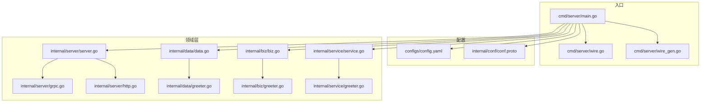
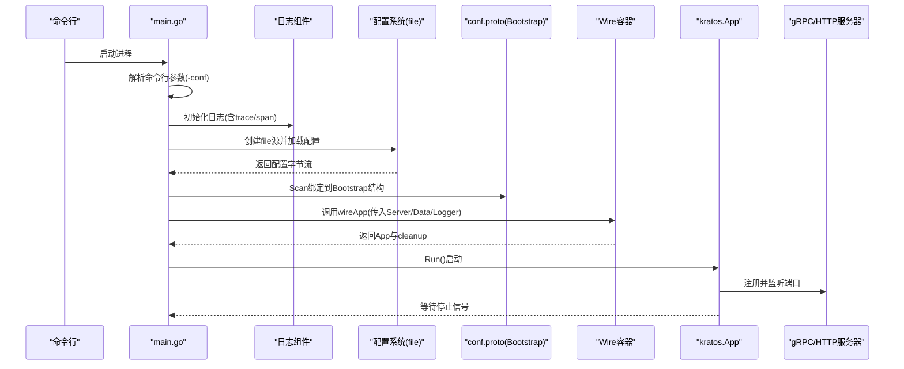
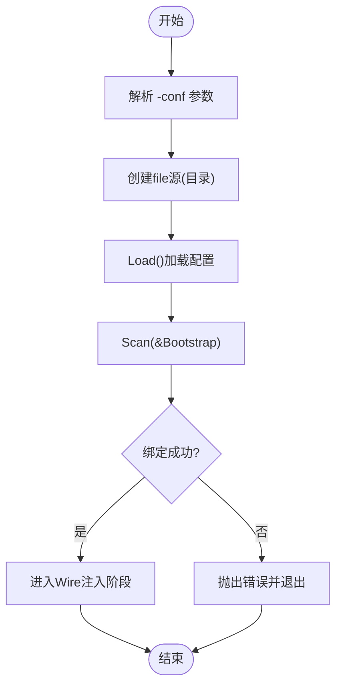
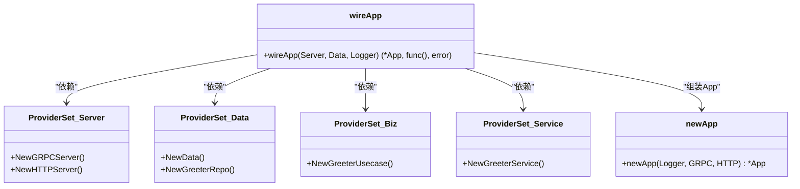
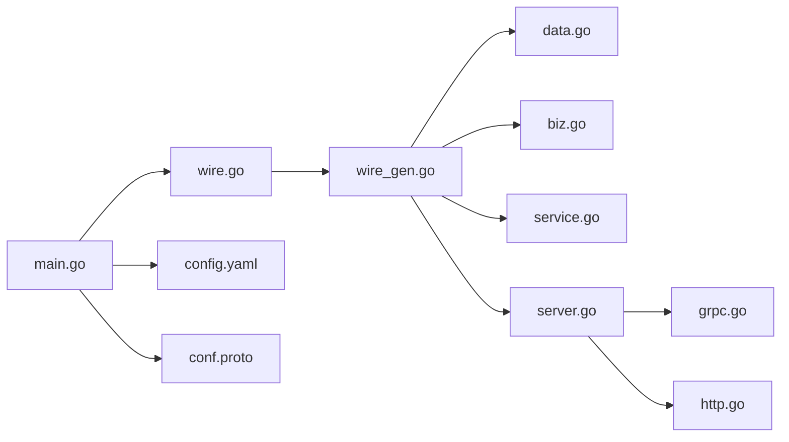

# 应用入口

<cite>
**本文引用的文件列表**
- [cmd/server/main.go](file://cmd/server/main.go)
- [cmd/server/wire.go](file://cmd/server/wire.go)
- [cmd/server/wire_gen.go](file://cmd/server/wire_gen.go)
- [configs/config.yaml](file://configs/config.yaml)
- [internal/conf/conf.proto](file://internal/conf/conf.proto)
- [internal/server/server.go](file://internal/server/server.go)
- [internal/server/grpc.go](file://internal/server/grpc.go)
- [internal/server/http.go](file://internal/server/http.go)
- [internal/data/data.go](file://internal/data/data.go)
- [internal/data/greeter.go](file://internal/data/greeter.go)
- [internal/biz/biz.go](file://internal/biz/biz.go)
- [internal/biz/greeter.go](file://internal/biz/greeter.go)
- [internal/service/service.go](file://internal/service/service.go)
- [internal/service/greeter.go](file://internal/service/greeter.go)
</cite>

## 目录
1. [简介](#简介)
2. [项目结构](#项目结构)
3. [核心组件](#核心组件)
4. [架构总览](#架构总览)
5. [详细组件分析](#详细组件分析)
6. [依赖关系分析](#依赖关系分析)
7. [性能与可维护性考量](#性能与可维护性考量)
8. [故障排查指南](#故障排查指南)
9. [结论](#结论)
10. [附录：自定义服务元信息指南](#附录自定义服务元信息指南)

## 简介
本文件围绕 Kratos 应用入口 cmd/server/main.go 的完整初始化流程进行深入解析，覆盖命令行参数解析、日志组件初始化、配置加载与绑定、依赖扫描、Wire 依赖注入容器构建，以及最终启动 Kratos 应用实例并监听信号的全过程。同时，重点说明：
- 配置源加载路径（flagconf 默认指向 ../../configs）
- Bootstrap 配置结构体的绑定过程
- wire.go 中 ProviderSet 的组织方式
- wire_gen.go 的生成机制及其在编译期依赖注入中的作用
- 如何自定义服务 ID、名称、版本等元信息

## 项目结构
该仓库采用 Kratos 官方布局，入口位于 cmd/server，核心配置位于 configs，业务按领域分层位于 internal 下的 biz、data、server、service 四个子包，并通过 Google Protocol Buffers 定义配置模型。

图表来源
- [cmd/server/main.go](file://cmd/server/main.go#L1-L88)
- [cmd/server/wire.go](file://cmd/server/wire.go#L1-L24)
- [cmd/server/wire_gen.go](file://cmd/server/wire_gen.go#L1-L41)
- [configs/config.yaml](file://configs/config.yaml#L1-L16)
- [internal/conf/conf.proto](file://internal/conf/conf.proto#L1-L42)
- [internal/server/server.go](file://internal/server/server.go#L1-L9)
- [internal/server/grpc.go](file://internal/server/grpc.go#L1-L33)
- [internal/server/http.go](file://internal/server/http.go#L1-L33)
- [internal/data/data.go](file://internal/data/data.go#L1-L25)
- [internal/data/greeter.go](file://internal/data/greeter.go#L1-L43)
- [internal/biz/biz.go](file://internal/biz/biz.go#L1-L7)
- [internal/biz/greeter.go](file://internal/biz/greeter.go#L1-L47)
- [internal/service/service.go](file://internal/service/service.go#L1-L7)
- [internal/service/greeter.go](file://internal/service/greeter.go#L1-L30)

章节来源
- [cmd/server/main.go](file://cmd/server/main.go#L1-L88)
- [configs/config.yaml](file://configs/config.yaml#L1-L16)
- [internal/conf/conf.proto](file://internal/conf/conf.proto#L1-L42)

## 核心组件
- 入口程序 main.go：负责命令行参数解析、日志初始化、配置加载与绑定、Wire 注入、应用启动与信号监听。
- 配置模型 conf.proto：定义 Bootstrap、Server、Data 结构，用于描述服务端口、超时、数据库与 Redis 等配置。
- 配置文件 config.yaml：以 YAML 形式提供具体配置值，供 file 源读取。
- Wire 构建器 wire.go：声明 wireApp 函数，使用 ProviderSet 组织依赖注入。
- 自动生成注入器 wire_gen.go：由 Wire 在编译期生成，包含完整的依赖装配逻辑。
- 服务器适配层：分别在 internal/server 下提供 gRPC 与 HTTP 服务器工厂方法。
- 数据层：提供数据连接初始化与仓储实现。
- 业务层：定义领域模型与用例接口与实现。
- 服务层：面向 API 的服务实现，承接 RPC/HTTP 调用。

章节来源
- [cmd/server/main.go](file://cmd/server/main.go#L1-L88)
- [internal/conf/conf.proto](file://internal/conf/conf.proto#L1-L42)
- [configs/config.yaml](file://configs/config.yaml#L1-L16)
- [cmd/server/wire.go](file://cmd/server/wire.go#L1-L24)
- [cmd/server/wire_gen.go](file://cmd/server/wire_gen.go#L1-L41)
- [internal/server/server.go](file://internal/server/server.go#L1-L9)
- [internal/server/grpc.go](file://internal/server/grpc.go#L1-L33)
- [internal/server/http.go](file://internal/server/http.go#L1-L33)
- [internal/data/data.go](file://internal/data/data.go#L1-L25)
- [internal/data/greeter.go](file://internal/data/greeter.go#L1-L43)
- [internal/biz/biz.go](file://internal/biz/biz.go#L1-L7)
- [internal/biz/greeter.go](file://internal/biz/greeter.go#L1-L47)
- [internal/service/service.go](file://internal/service/service.go#L1-L7)
- [internal/service/greeter.go](file://internal/service/greeter.go#L1-L30)

## 架构总览
下图展示了从 main 函数到 Kratos 应用启动的关键调用链路，包括配置加载、绑定、依赖注入与服务注册。

图表来源
- [cmd/server/main.go](file://cmd/server/main.go#L50-L88)
- [configs/config.yaml](file://configs/config.yaml#L1-L16)
- [internal/conf/conf.proto](file://internal/conf/conf.proto#L1-L42)
- [cmd/server/wire.go](file://cmd/server/wire.go#L1-L24)
- [cmd/server/wire_gen.go](file://cmd/server/wire_gen.go#L1-L41)
- [internal/server/grpc.go](file://internal/server/grpc.go#L1-L33)
- [internal/server/http.go](file://internal/server/http.go#L1-L33)

## 详细组件分析

### 命令行参数与日志初始化
- 命令行参数
  - 使用 flag.StringVar 将 -conf 绑定到 flagconf，默认值为 ../../configs，表示配置文件所在目录。
  - 另外通过 ldflags 支持注入 Name 与 Version，用于服务元信息展示。
- 日志初始化
  - 使用标准输出创建日志记录器，并设置时间戳、调用者、trace/span ID 等字段，便于分布式追踪与定位。

章节来源
- [cmd/server/main.go](file://cmd/server/main.go#L20-L40)
- [cmd/server/main.go](file://cmd/server/main.go#L50-L60)

### 配置加载与绑定（file 源与 Bootstrap）
- 配置源
  - 通过 file.NewSource(flagconf) 指定配置目录，Kratos 配置系统会读取该目录下的配置文件。
- 加载与扫描
  - 创建 config 实例后调用 Load() 完成文件读取。
  - 使用 c.Scan(&bc) 将配置扫描到 conf.Bootstrap 结构体中，其中包含 Server 与 Data 两部分。
- 配置模型
  - conf.proto 定义了 Bootstrap、Server、Data 的消息结构，对应 config.yaml 中的键名。

图表来源
- [cmd/server/main.go](file://cmd/server/main.go#L60-L76)
- [configs/config.yaml](file://configs/config.yaml#L1-L16)
- [internal/conf/conf.proto](file://internal/conf/conf.proto#L1-L42)

章节来源
- [cmd/server/main.go](file://cmd/server/main.go#L60-L76)
- [configs/config.yaml](file://configs/config.yaml#L1-L16)
- [internal/conf/conf.proto](file://internal/conf/conf.proto#L1-L42)

### Wire 依赖注入容器构建
- ProviderSet 组织
  - server.ProviderSet：包含 NewGRPCServer、NewHTTPServer。
  - data.ProviderSet：包含 NewData、NewGreeterRepo。
  - biz.ProviderSet：包含 NewGreeterUsecase。
  - service.ProviderSet：包含 NewGreeterService。
- wireApp 构造器
  - 在 wire.go 中通过 panic(wire.Build(...)) 触发 Wire 代码生成，实际注入逻辑由 wire_gen.go 提供。
  - wireApp 接收 *conf.Server、*conf.Data、log.Logger，返回 *kratos.App 与 cleanup。
- 生成机制
  - wire_gen.go 由 Wire 在编译期生成，包含完整的依赖装配顺序：先初始化数据层，再构造仓储与用例，然后创建服务，最后创建 gRPC/HTTP 服务器并注入到 App。

图表来源
- [cmd/server/wire.go](file://cmd/server/wire.go#L1-L24)
- [cmd/server/wire_gen.go](file://cmd/server/wire_gen.go#L1-L41)
- [internal/server/server.go](file://internal/server/server.go#L1-L9)
- [internal/data/data.go](file://internal/data/data.go#L1-L25)
- [internal/biz/biz.go](file://internal/biz/biz.go#L1-L7)
- [internal/service/service.go](file://internal/service/service.go#L1-L7)
- [cmd/server/main.go](file://cmd/server/main.go#L36-L48)

章节来源
- [cmd/server/wire.go](file://cmd/server/wire.go#L1-L24)
- [cmd/server/wire_gen.go](file://cmd/server/wire_gen.go#L1-L41)
- [internal/server/server.go](file://internal/server/server.go#L1-L9)
- [internal/data/data.go](file://internal/data/data.go#L1-L25)
- [internal/biz/biz.go](file://internal/biz/biz.go#L1-L7)
- [internal/service/service.go](file://internal/service/service.go#L1-L7)
- [cmd/server/main.go](file://cmd/server/main.go#L36-L48)

### Kratos 应用启动与信号监听
- 应用实例
  - newApp 通过 kratos.New 构建 App，注入服务 ID、名称、版本、元信息、日志与多个传输层服务器。
- 启动与清理
  - 调用 app.Run() 启动服务；在 main 中 defer cleanup() 释放资源。
- 信号处理
  - Kratos 内部负责监听系统信号并优雅关闭，main 中无需额外处理。

章节来源
- [cmd/server/main.go](file://cmd/server/main.go#L36-L48)
- [cmd/server/main.go](file://cmd/server/main.go#L83-L88)

### 服务器工厂与中间件
- gRPC 服务器
  - NewGRPCServer 接收 conf.Server，设置网络、地址、超时等选项，并注册 Greeter 服务。
- HTTP 服务器
  - NewHTTPServer 接收 conf.Server，设置网络、地址、超时等选项，并注册 Greeter HTTP 服务。
- 中间件
  - 两者均启用 recovery 中间件，确保异常时返回安全响应。

章节来源
- [internal/server/grpc.go](file://internal/server/grpc.go#L1-L33)
- [internal/server/http.go](file://internal/server/http.go#L1-L33)

### 数据与业务层装配
- 数据层
  - NewData 接收 *conf.Data 并返回 Data 实例，提供 cleanup。
  - NewGreeterRepo 接收 Data 与 Logger，返回 GreeterRepo 实现。
- 业务层
  - NewGreeterUsecase 接收 GreeterRepo 与 Logger，返回用例实例。
- 服务层
  - NewGreeterService 接收 GreeterUsecase，返回服务实例。

章节来源
- [internal/data/data.go](file://internal/data/data.go#L1-L25)
- [internal/data/greeter.go](file://internal/data/greeter.go#L1-L43)
- [internal/biz/biz.go](file://internal/biz/biz.go#L1-L7)
- [internal/biz/greeter.go](file://internal/biz/greeter.go#L1-L47)
- [internal/service/service.go](file://internal/service/service.go#L1-L7)
- [internal/service/greeter.go](file://internal/service/greeter.go#L1-L30)

## 依赖关系分析
- main.go 对配置、日志、Wire、服务器工厂均有直接依赖。
- Wire 通过 ProviderSet 将各层解耦，形成清晰的依赖边界。
- 生成器 wire_gen.go 将 ProviderSet 的依赖关系固化为编译期注入逻辑，避免运行时反射成本。

图表来源
- [cmd/server/main.go](file://cmd/server/main.go#L1-L88)
- [cmd/server/wire.go](file://cmd/server/wire.go#L1-L24)
- [cmd/server/wire_gen.go](file://cmd/server/wire_gen.go#L1-L41)
- [configs/config.yaml](file://configs/config.yaml#L1-L16)
- [internal/conf/conf.proto](file://internal/conf/conf.proto#L1-L42)
- [internal/server/server.go](file://internal/server/server.go#L1-L9)
- [internal/server/grpc.go](file://internal/server/grpc.go#L1-L33)
- [internal/server/http.go](file://internal/server/http.go#L1-L33)
- [internal/data/data.go](file://internal/data/data.go#L1-L25)
- [internal/biz/biz.go](file://internal/biz/biz.go#L1-L7)
- [internal/service/service.go](file://internal/service/service.go#L1-L7)

章节来源
- [cmd/server/main.go](file://cmd/server/main.go#L1-L88)
- [cmd/server/wire.go](file://cmd/server/wire.go#L1-L24)
- [cmd/server/wire_gen.go](file://cmd/server/wire_gen.go#L1-L41)

## 性能与可维护性考量
- 配置加载
  - 使用 file 源加载配置，建议将配置文件放置在稳定目录，避免频繁 IO。
- 依赖注入
  - Wire 在编译期生成注入器，减少运行时反射开销，提升启动与运行效率。
- 清理与资源回收
  - Data 层提供 cleanup，确保资源正确释放；main 中 defer 调用，避免泄漏。
- 中间件
  - 服务器统一启用 recovery 中间件，提高稳定性。

[本节为通用建议，不直接分析具体文件]

## 故障排查指南
- 配置未加载或绑定失败
  - 检查 -conf 是否指向正确的目录，且包含有效的 config.yaml。
  - 确认 config.yaml 的键名与 conf.proto 中的 Bootstrap/Server/Data 字段一致。
- Wire 注入报错
  - 确保已安装 Wire 并执行 go generate 或使用带 wireinject 构建标签的构建流程。
  - 检查 wire.go 中的 ProviderSet 是否包含所有必需的构造函数。
- 服务器无法启动
  - 检查 config.yaml 中的端口是否被占用，或网络配置是否正确。
  - 查看日志输出中的 trace/span ID，结合分布式追踪系统定位问题。

章节来源
- [cmd/server/main.go](file://cmd/server/main.go#L60-L76)
- [cmd/server/wire.go](file://cmd/server/wire.go#L1-L24)
- [configs/config.yaml](file://configs/config.yaml#L1-L16)
- [internal/conf/conf.proto](file://internal/conf/conf.proto#L1-L42)

## 结论
本入口文件以清晰的职责划分与模块化设计，实现了从配置加载、绑定、依赖注入到应用启动的完整生命周期管理。通过 Wire 的 ProviderSet 组织与编译期生成，既保证了可维护性，也提升了性能与可靠性。开发者可在不修改入口逻辑的前提下，通过调整配置与 ProviderSet 来扩展功能。

[本节为总结性内容，不直接分析具体文件]

## 附录：自定义服务元信息指南
- 自定义服务 ID、名称、版本
  - 服务 ID：在 main.go 中通过 os.Hostname() 获取主机名作为默认 ID，也可替换为固定字符串或环境变量。
  - 服务名称与版本：通过构建参数 ldflags 注入 Name 与 Version，例如在构建命令中添加 -X main.Name=your-service-name -X main.Version=x.y.z。
- 配置源路径
  - 默认 -conf 指向 ../../configs，如需变更，请在启动时显式传入 -conf /path/to/configs。
- 配置项映射
  - config.yaml 中的 server.http、server.grpc、data.database、data.redis 等键名需与 conf.proto 中的 Bootstrap/Server/Data 字段保持一致，否则 Scan 绑定会失败。

章节来源
- [cmd/server/main.go](file://cmd/server/main.go#L20-L40)
- [cmd/server/main.go](file://cmd/server/main.go#L60-L76)
- [configs/config.yaml](file://configs/config.yaml#L1-L16)
- [internal/conf/conf.proto](file://internal/conf/conf.proto#L1-L42)