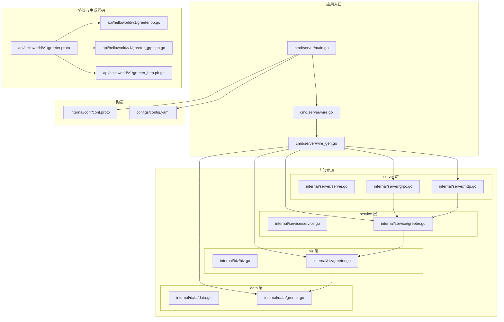
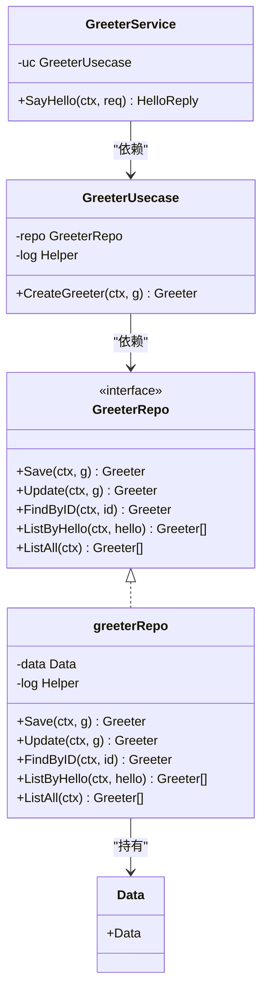
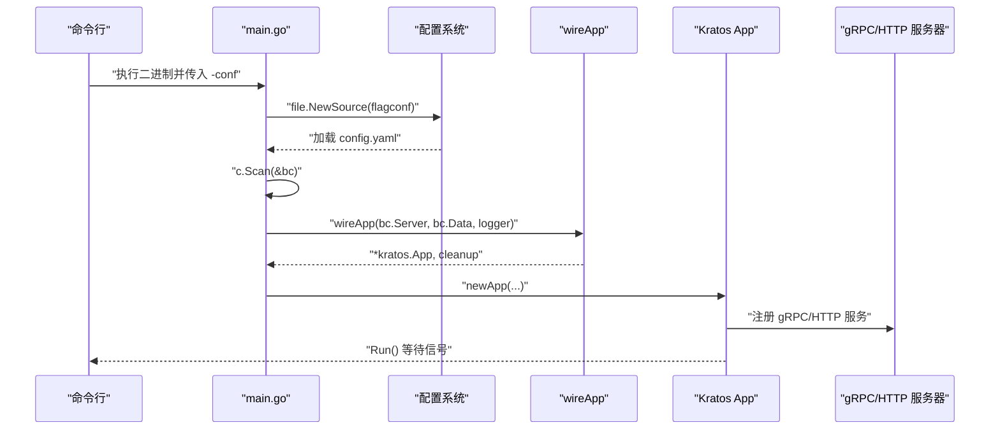
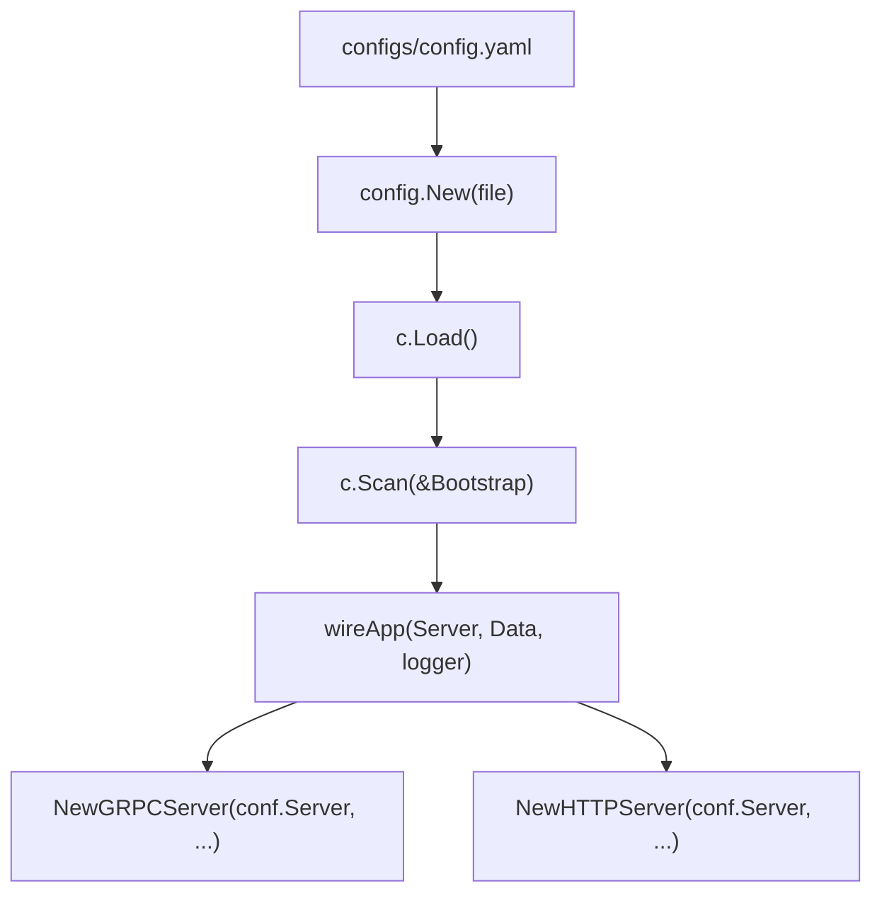
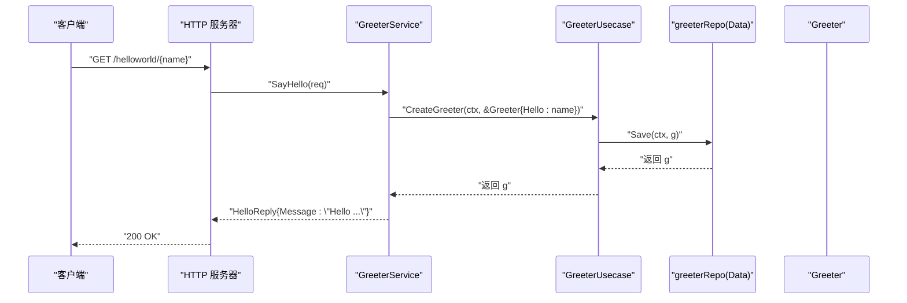

# 目录结构说明

<cite>
**本文引用的文件列表**
- [api/helloworld/v1/greeter.proto](file://api/helloworld/v1/greeter.proto)
- [api/helloworld/v1/greeter.pb.go](file://api/helloworld/v1/greeter.pb.go)
- [api/helloworld/v1/greeter_grpc.pb.go](file://api/helloworld/v1/greeter_grpc.pb.go)
- [api/helloworld/v1/greeter_http.pb.go](file://api/helloworld/v1/greeter_http.pb.go)
- [internal/biz/biz.go](file://internal/biz/biz.go)
- [internal/biz/greeter.go](file://internal/biz/greeter.go)
- [internal/data/data.go](file://internal/data/data.go)
- [internal/data/greeter.go](file://internal/data/greeter.go)
- [internal/service/service.go](file://internal/service/service.go)
- [internal/service/greeter.go](file://internal/service/greeter.go)
- [internal/server/server.go](file://internal/server/server.go)
- [internal/server/grpc.go](file://internal/server/grpc.go)
- [internal/server/http.go](file://internal/server/http.go)
- [internal/conf/conf.proto](file://internal/conf/conf.proto)
- [configs/config.yaml](file://configs/config.yaml)
- [cmd/server/main.go](file://cmd/server/main.go)
- [cmd/server/wire.go](file://cmd/server/wire.go)
- [cmd/server/wire_gen.go](file://cmd/server/wire_gen.go)
- [README.md](file://README.md)
</cite>

## 目录与职责总览

本项目遵循 Kratos 推荐的分层架构与“以协议为中心”的设计哲学：  
- api/ 目录存放服务契约与生成代码，统一对外接口形态，便于多端复用与跨语言互通。  
- internal/ 下按领域与基础设施分层组织：biz（业务用例）、data（数据访问与资源管理）、service（gRPC/HTTP 适配器）、server（传输层装配）。  
- cmd/server/ 是应用入口，负责配置加载、依赖注入装配与服务启动。  
- configs/ 与 internal/conf/ 协同定义配置模型与默认值来源，确保配置可扫描、可注入、可替换。

图表来源
- [cmd/server/main.go](file://cmd/server/main.go#L1-L88)
- [cmd/server/wire.go](file://cmd/server/wire.go#L1-L24)
- [cmd/server/wire_gen.go](file://cmd/server/wire_gen.go#L1-L200)
- [internal/conf/conf.proto](file://internal/conf/conf.proto#L1-L42)
- [configs/config.yaml](file://configs/config.yaml#L1-L16)
- [api/helloworld/v1/greeter.proto](file://api/helloworld/v1/greeter.proto#L1-L31)
- [api/helloworld/v1/greeter.pb.go](file://api/helloworld/v1/greeter.pb.go#L1-L200)
- [api/helloworld/v1/greeter_grpc.pb.go](file://api/helloworld/v1/greeter_grpc.pb.go#L1-L200)
- [api/helloworld/v1/greeter_http.pb.go](file://api/helloworld/v1/greeter_http.pb.go#L1-L200)
- [internal/biz/biz.go](file://internal/biz/biz.go#L1-L7)
- [internal/biz/greeter.go](file://internal/biz/greeter.go#L1-L47)
- [internal/data/data.go](file://internal/data/data.go#L1-L25)
- [internal/data/greeter.go](file://internal/data/greeter.go#L1-L43)
- [internal/service/service.go](file://internal/service/service.go#L1-L7)
- [internal/service/greeter.go](file://internal/service/greeter.go#L1-L30)
- [internal/server/server.go](file://internal/server/server.go#L1-L9)
- [internal/server/grpc.go](file://internal/server/grpc.go#L1-L33)
- [internal/server/http.go](file://internal/server/http.go#L1-L33)

章节来源
- [README.md](file://README.md#L1-L52)

## api/ 目录与协议生成物

- 契约定义：greeter.proto 定义了 Greeter 服务、请求/响应消息以及 HTTP 注解，统一对外接口形态，支持 gRPC 与 HTTP 两种传输形态。
- 生成代码：
  - greeter.pb.go：包含消息类型与序列化方法，供上层使用。
  - greeter_grpc.pb.go：包含 gRPC 服务接口与客户端桩代码。
  - greeter_http.pb.go：包含 HTTP 适配器注册方法，用于将服务映射到 HTTP 路由。
- 设计要点：
  - 通过 proto 文件集中定义接口，避免重复实现，提升跨语言一致性与可测试性。
  - HTTP 注解将 RPC 映射为 REST 风格路由，便于前端直连与网关集成。

章节来源
- [api/helloworld/v1/greeter.proto](file://api/helloworld/v1/greeter.proto#L1-L31)
- [api/helloworld/v1/greeter.pb.go](file://api/helloworld/v1/greeter.pb.go#L1-L200)
- [api/helloworld/v1/greeter_grpc.pb.go](file://api/helloworld/v1/greeter_grpc.pb.go#L1-L200)
- [api/helloworld/v1/greeter_http.pb.go](file://api/helloworld/v1/greeter_http.pb.go#L1-L200)

## internal/ 分层职责与交互

- biz（业务用例层）
  - 职责：封装核心业务规则与流程，暴露领域对象与用例方法；不直接依赖外部框架。
  - 关键点：定义 GreeterRepo 接口与 GreeterUsecase 实现，隔离数据访问细节。
- data（数据访问层）
  - 职责：实现 GreeterRepo 接口，封装数据库/缓存等资源；提供生命周期清理。
  - 关键点：通过 NewGreeterRepo 将 Data 实例注入仓库，保持对 biz 的纯接口依赖。
- service（服务适配层）
  - 职责：作为 gRPC/HTTP 的服务实现，编排 biz 用例；处理协议到业务对象的转换。
  - 关键点：GreeterService 持有 biz.GreeterUsecase 并在 SayHello 中调用。
- server（传输层装配）
  - 职责：根据配置创建 gRPC/HTTP 服务器，注册服务，设置中间件。
  - 关键点：NewGRPCServer/NewHTTPServer 读取 conf.Server 并注册 v1 服务实现。

图表来源
- [internal/biz/greeter.go](file://internal/biz/greeter.go#L1-L47)
- [internal/data/greeter.go](file://internal/data/greeter.go#L1-L43)
- [internal/service/greeter.go](file://internal/service/greeter.go#L1-L30)
- [internal/data/data.go](file://internal/data/data.go#L1-L25)

章节来源
- [internal/biz/biz.go](file://internal/biz/biz.go#L1-L7)
- [internal/biz/greeter.go](file://internal/biz/greeter.go#L1-L47)
- [internal/data/data.go](file://internal/data/data.go#L1-L25)
- [internal/data/greeter.go](file://internal/data/greeter.go#L1-L43)
- [internal/service/service.go](file://internal/service/service.go#L1-L7)
- [internal/service/greeter.go](file://internal/service/greeter.go#L1-L30)

## cmd/ 应用入口与初始化流程

- 入口文件：cmd/server/main.go
  - 解析命令行参数（配置路径），加载 YAML 配置，扫描到 conf.Bootstrap 结构。
  - 使用 Wire 生成的应用装配函数 wireApp(bc.Server, bc.Data, logger) 构建完整应用。
  - 创建 Kratos App 并运行，等待停止信号。
- 依赖注入：cmd/server/wire.go 通过 google/wire 的 ProviderSet 组合 server、data、biz、service 各层实例。
- 生成文件：wire_gen.go 由 wire 工具生成，包含完整的依赖图与构造逻辑。

图表来源
- [cmd/server/main.go](file://cmd/server/main.go#L1-L88)
- [cmd/server/wire.go](file://cmd/server/wire.go#L1-L24)
- [cmd/server/wire_gen.go](file://cmd/server/wire_gen.go#L1-L200)
- [internal/server/grpc.go](file://internal/server/grpc.go#L1-L33)
- [internal/server/http.go](file://internal/server/http.go#L1-L33)

章节来源
- [cmd/server/main.go](file://cmd/server/main.go#L1-L88)
- [cmd/server/wire.go](file://cmd/server/wire.go#L1-L24)
- [cmd/server/wire_gen.go](file://cmd/server/wire_gen.go#L1-L200)

## 配置模型与关系

- 配置模型：internal/conf/conf.proto 定义了 Bootstrap、Server、Data 等消息结构，对应 configs/config.yaml 的键名。
- 加载与扫描：cmd/server/main.go 通过 config.File 源加载 YAML，再 Scan 到 conf.Bootstrap，随后传递给 wireApp。
- 运行时注入：server 层的 NewGRPCServer/NewHTTPServer 从 conf.Server 读取网络、地址与超时等参数。

图表来源
- [configs/config.yaml](file://configs/config.yaml#L1-L16)
- [internal/conf/conf.proto](file://internal/conf/conf.proto#L1-L42)
- [cmd/server/main.go](file://cmd/server/main.go#L1-L88)
- [internal/server/grpc.go](file://internal/server/grpc.go#L1-L33)
- [internal/server/http.go](file://internal/server/http.go#L1-L33)

章节来源
- [internal/conf/conf.proto](file://internal/conf/conf.proto#L1-L42)
- [configs/config.yaml](file://configs/config.yaml#L1-L16)
- [cmd/server/main.go](file://cmd/server/main.go#L1-L88)

## 跨层调用链示例（greeter 服务）

以 HTTP 请求为例，greeter 服务的调用链如下：

图表来源
- [internal/service/greeter.go](file://internal/service/greeter.go#L1-L30)
- [internal/biz/greeter.go](file://internal/biz/greeter.go#L1-L47)
- [internal/data/greeter.go](file://internal/data/greeter.go#L1-L43)
- [api/helloworld/v1/greeter_http.pb.go](file://api/helloworld/v1/greeter_http.pb.go#L1-L200)

章节来源
- [internal/service/greeter.go](file://internal/service/greeter.go#L1-L30)
- [internal/biz/greeter.go](file://internal/biz/greeter.go#L1-L47)
- [internal/data/greeter.go](file://internal/data/greeter.go#L1-L43)

## 新功能/模块添加指南（基于现有分层）

- 在 api/ 添加新的 proto 文件，定义服务与消息。
- 生成 pb.go、grpc.pb.go、http.pb.go 后，在 internal/service/ 生成服务适配器。
- 在 internal/biz/ 定义领域接口与用例，保持对数据访问的抽象。
- 在 internal/data/ 实现数据访问接口，注入资源与清理逻辑。
- 在 internal/server/ 注册新服务到 gRPC/HTTP 服务器。
- 在 cmd/server/wire.go 的 ProviderSet 中组合新组件，确保 main.go 可通过 wireApp 自动装配。
- 在 configs/config.yaml 中新增对应配置项，或扩展 internal/conf/conf.proto 以支持新配置。

章节来源
- [README.md](file://README.md#L1-L52)
- [cmd/server/wire.go](file://cmd/server/wire.go#L1-L24)
- [internal/server/server.go](file://internal/server/server.go#L1-L9)
- [internal/biz/biz.go](file://internal/biz/biz.go#L1-L7)
- [internal/data/data.go](file://internal/data/data.go#L1-L25)
- [internal/service/service.go](file://internal/service/service.go#L1-L7)

## 分层架构的优势

- 可维护性：各层职责清晰，修改集中在特定层，降低耦合度。
- 可测试性：biz 层通过接口隔离，可在单元测试中以假实现替换 data 层。
- 可扩展性：新增服务只需在 service 层新增适配器，biz/data 层按需扩展，server 层自动注册。
- 可观测性：server 层统一注入中间件与日志，便于统一治理。

[本节为概念性总结，无需列出章节来源]

## 性能与可靠性建议

- 传输层：合理设置网络与超时参数，避免阻塞；在 server 层启用必要的中间件（如恢复、限流）。
- 数据层：对数据库/缓存连接进行池化与健康检查，确保资源及时释放。
- 配置热更新：结合 Kratos 的配置源能力，按需支持动态变更（需在应用侧配合实现）。

[本节为通用建议，无需列出章节来源]

## 故障排查指引

- 启动失败：检查 -conf 参数指向的配置路径与格式；确认 config.yaml 与 conf.proto 字段一致。
- 服务未注册：确认 wireApp 成功构建 App，且 server 层已注册对应服务。
- 调用异常：在 service 层打印上下文日志，定位 biz 用例与 data 仓库的边界问题。

章节来源
- [cmd/server/main.go](file://cmd/server/main.go#L1-L88)
- [internal/server/grpc.go](file://internal/server/grpc.go#L1-L33)
- [internal/server/http.go](file://internal/server/http.go#L1-L33)

## 结论

该布局以协议为中心，通过清晰的分层与依赖注入，实现了高内聚、低耦合的服务架构。新增模块只需遵循现有约定即可快速落地，同时保留良好的可测试性与可维护性。

[本节为总结性内容，无需列出章节来源]