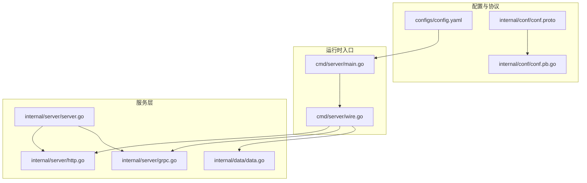
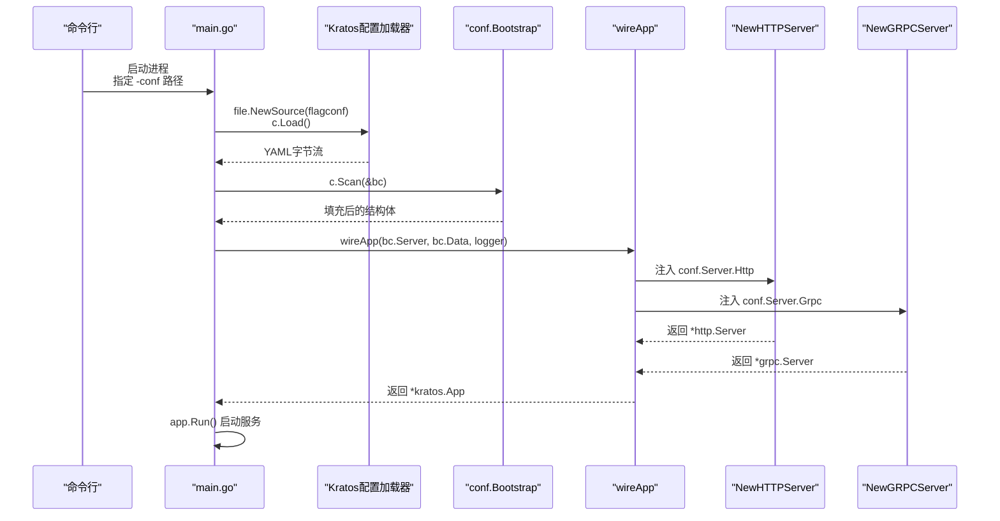
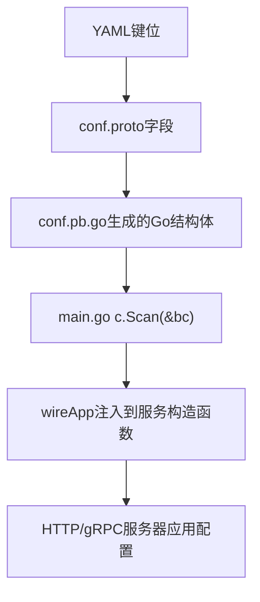
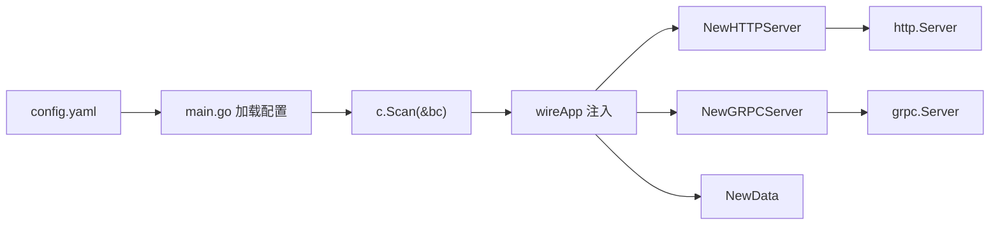

# 运行时配置

<cite>
**本文引用的文件**
- [config.yaml](file://configs/config.yaml)
- [conf.proto](file://internal/conf/conf.proto)
- [conf.pb.go](file://internal/conf/conf.pb.go)
- [main.go](file://cmd/server/main.go)
- [wire.go](file://cmd/server/wire.go)
- [http.go](file://internal/server/http.go)
- [grpc.go](file://internal/server/grpc.go)
- [server.go](file://internal/server/server.go)
- [data.go](file://internal/data/data.go)
- [README.md](file://README.md)
</cite>

## 目录
1. [简介](#简介)
2. [项目结构](#项目结构)
3. [核心组件](#核心组件)
4. [架构总览](#架构总览)
5. [详细组件分析](#详细组件分析)
6. [依赖关系分析](#依赖关系分析)
7. [性能考量](#性能考量)
8. [故障排查指南](#故障排查指南)
9. [结论](#结论)
10. [附录](#附录)

## 简介
本文件围绕运行时配置展开，重点说明 config.yaml 如何实例化并填充 internal/conf/conf.proto 中定义的结构体，以及这些配置在启动流程中的传递与应用。我们将逐项解析关键配置项（如 server.http.addr、server.grpc.addr、timeout、data.database.source、data.redis.addr 等），解释它们对服务行为的影响，并给出针对不同部署环境（开发、测试、生产）的参数调优建议，同时强调敏感信息的安全处理策略。

## 项目结构
该工程采用 Kratos 框架模板，配置文件位于 configs/config.yaml，协议定义位于 internal/conf/conf.proto，运行时通过 Kratos 配置加载器将其反序列化为 Go 结构体，再由 Wire 注入到服务层。

图表来源
- [config.yaml](file://configs/config.yaml#L1-L16)
- [conf.proto](file://internal/conf/conf.proto#L1-L42)
- [conf.pb.go](file://internal/conf/conf.pb.go#L1-L200)
- [main.go](file://cmd/server/main.go#L50-L88)
- [wire.go](file://cmd/server/wire.go#L20-L24)
- [http.go](file://internal/server/http.go#L13-L33)
- [grpc.go](file://internal/server/grpc.go#L13-L33)
- [server.go](file://internal/server/server.go#L1-L9)
- [data.go](file://internal/data/data.go#L1-L25)

章节来源
- [README.md](file://README.md#L1-L52)
- [config.yaml](file://configs/config.yaml#L1-L16)
- [conf.proto](file://internal/conf/conf.proto#L1-L42)
- [conf.pb.go](file://internal/conf/conf.pb.go#L1-L200)
- [main.go](file://cmd/server/main.go#L50-L88)
- [wire.go](file://cmd/server/wire.go#L20-L24)
- [http.go](file://internal/server/http.go#L13-L33)
- [grpc.go](file://internal/server/grpc.go#L13-L33)
- [server.go](file://internal/server/server.go#L1-L9)
- [data.go](file://internal/data/data.go#L1-L25)

## 核心组件
- 配置模型：conf.proto 定义了 Bootstrap、Server、Data 及其子消息，对应 config.yaml 的顶层键位。
- 运行时加载：main.go 使用 Kratos 配置源加载 YAML，然后 Scan 到 conf.Bootstrap 结构体。
- 服务注入：Wire 将 conf.Bootstrap 中的 Server 和 Data 注入到 HTTP/gRPC 服务器构造函数中。
- 服务应用：HTTP/gRPC 服务器从 conf.Server 读取网络、地址与超时，设置传输层行为。

章节来源
- [conf.proto](file://internal/conf/conf.proto#L8-L42)
- [conf.pb.go](file://internal/conf/conf.pb.go#L24-L187)
- [main.go](file://cmd/server/main.go#L61-L76)
- [http.go](file://internal/server/http.go#L13-L33)
- [grpc.go](file://internal/server/grpc.go#L13-L33)
- [wire.go](file://cmd/server/wire.go#L20-L24)

## 架构总览
下图展示了从配置文件到服务实例化的完整链路。

图表来源
- [main.go](file://cmd/server/main.go#L50-L88)
- [wire.go](file://cmd/server/wire.go#L20-L24)
- [http.go](file://internal/server/http.go#L13-L33)
- [grpc.go](file://internal/server/grpc.go#L13-L33)

## 详细组件分析

### 配置文件到结构体的映射
- config.yaml 的 server.http.addr 对应 conf.Server.HTTP.addr；server.grpc.addr 对应 conf.Server.GRPC.addr。
- config.yaml 的 server.http.timeout、server.grpc.timeout 对应 conf.Server.HTTP.timeout、conf.Server.GRPC.timeout。
- config.yaml 的 data.database.driver、data.database.source 对应 conf.Data.Database.driver、conf.Data.Database.source。
- config.yaml 的 data.redis.addr、data.redis.read_timeout、data.redis.write_timeout 对应 conf.Data.Redis.addr、read_timeout、write_timeout。

图表来源
- [config.yaml](file://configs/config.yaml#L1-L16)
- [conf.proto](file://internal/conf/conf.proto#L8-L42)
- [conf.pb.go](file://internal/conf/conf.pb.go#L24-L187)
- [main.go](file://cmd/server/main.go#L61-L76)
- [http.go](file://internal/server/http.go#L13-L33)
- [grpc.go](file://internal/server/grpc.go#L13-L33)

章节来源
- [config.yaml](file://configs/config.yaml#L1-L16)
- [conf.proto](file://internal/conf/conf.proto#L8-L42)
- [conf.pb.go](file://internal/conf/conf.pb.go#L24-L187)
- [main.go](file://cmd/server/main.go#L61-L76)

### 关键配置项逐项解析
- server.http.addr
  - 含义：HTTP 服务监听的地址，格式为“主机:端口”。
  - 实际应用：http.go 读取 conf.Server.Http.Addr 并设置 http.Server 的监听地址。
  - 示例：当配置为 0.0.0.0:8000 时，HTTP 服务将监听所有网卡的 8000 端口。
  章节来源
  - [http.go](file://internal/server/http.go#L23-L25)

- server.grpc.addr
  - 含义：gRPC 服务监听的地址，格式为“主机:端口”。
  - 实际应用：grpc.go 读取 conf.Server.Grpc.Addr 并设置 grpc.Server 的监听地址。
  - 示例：当配置为 0.0.0.0:9000 时，gRPC 服务将监听所有网卡的 9000 端口。
  章节来源
  - [grpc.go](file://internal/server/grpc.go#L23-L25)

- timeout（server.http.timeout、server.grpc.timeout）
  - 含义：请求处理超时时间，用于控制服务端处理单次请求的最长等待时间。
  - 实际应用：http.go 与 grpc.go 分别读取 Timeout 并转换为持续时间后传入对应服务器选项。
  - 影响：过短可能导致正常业务被中断；过长会放大资源占用与延迟感知。建议按接口复杂度与下游依赖进行权衡。
  章节来源
  - [http.go](file://internal/server/http.go#L26-L28)
  - [grpc.go](file://internal/server/grpc.go#L26-L28)

- data.database.source（MySQL 连接字符串）
  - 含义：数据库连接信息，驱动类型与连接串由 conf.Data.Database.driver 与 conf.Data.Database.source 共同决定。
  - 组成要素（以示例为准）：
    - 协议与驱动：driver=mysql
    - 用户名：root
    - 密码：root
    - 主机与端口：127.0.0.1:3306
    - 数据库名：test
    - 参数：parseTime=True&loc=Local
  - 实际应用：data.go 接收 conf.Data，具体数据库客户端初始化可在此处完成（当前示例未展示完整实现）。
  - 安全建议：生产环境不应在配置文件中直接存放明文密码，应结合环境变量或密钥管理服务注入。
  章节来源
  - [config.yaml](file://configs/config.yaml#L10-L12)
  - [conf.proto](file://internal/conf/conf.proto#L28-L41)
  - [data.go](file://internal/data/data.go#L19-L24)

- data.redis.addr
  - 含义：Redis 缓存服务地址，格式为“主机:端口”。
  - 实际应用：conf.Data.Redis.addr 用于初始化 Redis 客户端连接。
  - 其他相关：read_timeout、write_timeout 控制读写超时，避免阻塞影响服务稳定性。
  章节来源
  - [config.yaml](file://configs/config.yaml#L12-L14)
  - [conf.proto](file://internal/conf/conf.proto#L33-L38)
  - [http.go](file://internal/server/http.go#L26-L28)
  - [grpc.go](file://internal/server/grpc.go#L26-L28)

### 部署环境参数调优指南
- 开发环境
  - 监听地址：可使用 0.0.0.0:8000/9000 便于本地联调。
  - 超时：适当放宽，提升调试体验。
  - 数据库/缓存：使用本地或容器内服务地址，便于快速迭代。
- 测试环境
  - 监听地址：固定内网 IP 或容器网络，避免暴露公网。
  - 超时：与生产相近，确保行为一致。
  - 数据库/缓存：独立实例，隔离数据。
- 生产环境
  - 监听地址：仅绑定内网或受控网络，必要时通过反向代理暴露。
  - 超时：严格控制，避免级联故障。
  - 数据库/缓存：高可用集群，开启鉴权与加密。
  - 敏感信息：严禁在配置文件中存储密码等敏感数据，应通过环境变量或密钥管理服务注入。

章节来源
- [config.yaml](file://configs/config.yaml#L1-L16)
- [http.go](file://internal/server/http.go#L23-L28)
- [grpc.go](file://internal/server/grpc.go#L23-L28)
- [README.md](file://README.md#L44-L52)

## 依赖关系分析
- 配置加载依赖
  - main.go 通过 Kratos 配置源加载 YAML，Scan 到 conf.Bootstrap。
- 服务注入依赖
  - wireApp 将 conf.Server 与 conf.Data 注入到 HTTP/gRPC 服务器构造函数。
- 服务器应用依赖
  - http.go 与 grpc.go 从 conf.Server 读取网络、地址与超时，设置传输层行为。
- 数据层依赖
  - data.go 接收 conf.Data，用于初始化数据库与缓存客户端（当前示例未展示完整实现）。

图表来源
- [main.go](file://cmd/server/main.go#L61-L76)
- [wire.go](file://cmd/server/wire.go#L20-L24)
- [http.go](file://internal/server/http.go#L13-L33)
- [grpc.go](file://internal/server/grpc.go#L13-L33)
- [data.go](file://internal/data/data.go#L19-L24)

章节来源
- [main.go](file://cmd/server/main.go#L61-L76)
- [wire.go](file://cmd/server/wire.go#L20-L24)
- [http.go](file://internal/server/http.go#L13-L33)
- [grpc.go](file://internal/server/grpc.go#L13-L33)
- [data.go](file://internal/data/data.go#L19-L24)

## 性能考量
- 超时设置
  - 过短：导致请求失败率上升，影响用户体验与上游依赖。
  - 过长：占用连接与线程资源，放大延迟与抖动风险。
  - 建议：基于接口耗时分布与下游 SLA 设定，定期校准。
- 网络与地址
  - 监听地址为 0.0.0.0 时，服务对所有网卡开放，需配合防火墙与反向代理限制访问。
- 数据库与缓存
  - 连接池大小、重试策略与超时需与业务并发匹配，避免热点节点过载。
- 日志与追踪
  - 保持默认日志与追踪上下文，有助于定位性能瓶颈。

章节来源
- [http.go](file://internal/server/http.go#L23-L28)
- [grpc.go](file://internal/server/grpc.go#L23-L28)
- [config.yaml](file://configs/config.yaml#L1-L16)

## 故障排查指南
- 配置加载失败
  - 现象：启动时报错无法加载配置。
  - 排查：确认 -conf 指向的目录存在且包含 config.yaml；检查 YAML 语法与缩进。
- 地址冲突或权限不足
  - 现象：监听失败或被拒绝。
  - 排查：确认端口未被占用；在非特权端口场景下检查权限；必要时改为随机端口或使用反向代理。
- 超时异常
  - 现象：请求频繁超时或响应缓慢。
  - 排查：核对 server.http.timeout 与 server.grpc.timeout；评估下游依赖性能并同步调整。
- 数据库连接问题
  - 现象：连接失败或认证错误。
  - 排查：核对 data.database.source 的用户名、密码、主机、端口与数据库名；生产环境使用密钥管理服务注入敏感信息。
- 缓存连接问题
  - 现象：缓存读写超时或不可用。
  - 排查：核对 data.redis.addr、read_timeout、write_timeout；检查网络连通性与 ACL 设置。

章节来源
- [main.go](file://cmd/server/main.go#L61-L76)
- [http.go](file://internal/server/http.go#L23-L28)
- [grpc.go](file://internal/server/grpc.go#L23-L28)
- [config.yaml](file://configs/config.yaml#L1-L16)

## 结论
config.yaml 通过 Kratos 配置加载机制与 conf.proto 的强类型定义，实现了运行时配置的结构化实例化。HTTP/gRPC 服务器与数据层均从 conf.Bootstrap 中读取相应配置，从而实现灵活的部署与运维。建议在开发、测试、生产三类环境中分别设定合理的监听地址、超时与连接参数，并将敏感信息置于安全通道之外，确保系统稳定与安全。

## 附录
- 快速启动与端口映射参考
  - 参考 README 中的 Docker 运行示例，将宿主机端口映射到容器内的 8000/9000 端口，便于本地验证 HTTP/gRPC 服务。
- 配置文件路径
  - 默认通过 -conf 指定配置目录，程序会加载该目录下的 config.yaml 文件。

章节来源
- [README.md](file://README.md#L44-L52)
- [main.go](file://cmd/server/main.go#L32-L34)