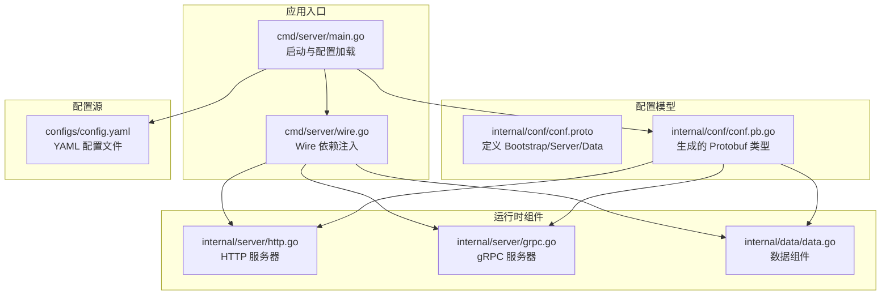
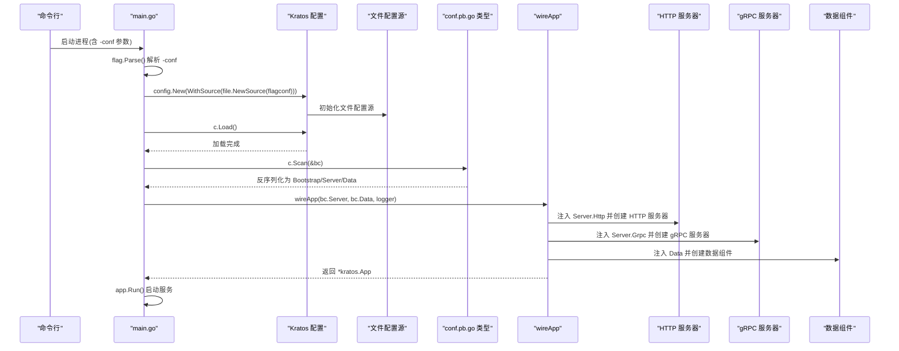
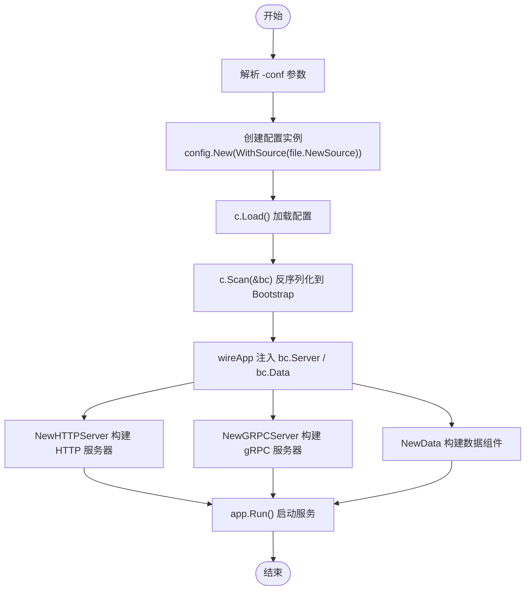
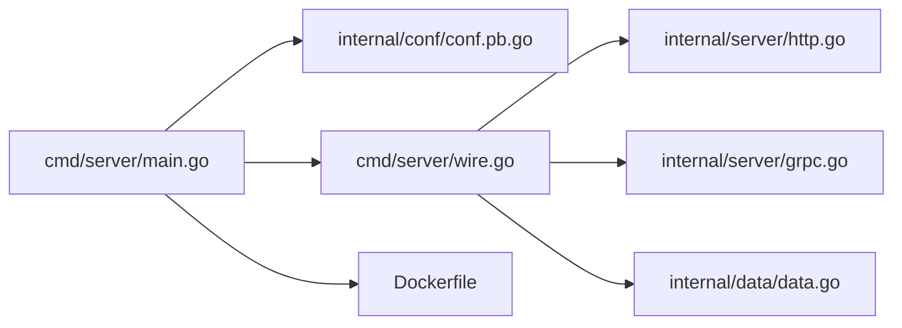

# 配置加载机制

<cite>
**本文引用的文件**
- [cmd/server/main.go](file://cmd/server/main.go)
- [internal/conf/conf.proto](file://internal/conf/conf.proto)
- [internal/conf/conf.pb.go](file://internal/conf/conf.pb.go)
- [configs/config.yaml](file://configs/config.yaml)
- [cmd/server/wire.go](file://cmd/server/wire.go)
- [internal/server/http.go](file://internal/server/http.go)
- [internal/server/grpc.go](file://internal/server/grpc.go)
- [internal/data/data.go](file://internal/data/data.go)
- [Dockerfile](file://Dockerfile)
</cite>

## 目录
1. [引言](#引言)
2. [项目结构](#项目结构)
3. [核心组件](#核心组件)
4. [架构总览](#架构总览)
5. [详细组件分析](#详细组件分析)
6. [依赖关系分析](#依赖关系分析)
7. [性能考量](#性能考量)
8. [故障排查指南](#故障排查指南)
9. [结论](#结论)

## 引言
本文件围绕 Kratos 应用启动时的配置加载流程展开，系统性梳理从命令行参数解析、配置源创建、配置加载与扫描、到依赖注入与服务初始化的全过程。重点解释：
- flag.Parse() 如何解析 -conf 参数以确定配置源路径；
- config.New 结合 file.NewSource 创建配置源，并通过 c.Load() 触发加载；
- c.Scan(&bc) 将 YAML 数据反序列化到由 conf.pb.go 生成的 Bootstrap 类型变量 bc 中；
- 利用 Bootstrap 及其子类型（Server、Data）的 Proto 反射能力实现类型安全的配置读取；
- 最终通过 wireApp(bc.Server, bc.Data, logger) 完成依赖注入，初始化 HTTP/gRPC 服务器与数据组件。

## 项目结构
本项目采用 Kratos 推荐的分层与功能域划分：命令入口在 cmd/server，配置模型定义于 internal/conf，运行时配置位于 configs，服务与数据组件分别在 internal/server 与 internal/data，依赖注入使用 Wire 在 cmd/server/wire.go 中声明。

图表来源
- [cmd/server/main.go](file://cmd/server/main.go#L50-L87)
- [cmd/server/wire.go](file://cmd/server/wire.go#L20-L24)
- [internal/conf/conf.proto](file://internal/conf/conf.proto#L1-L42)
- [internal/conf/conf.pb.go](file://internal/conf/conf.pb.go#L24-L187)
- [configs/config.yaml](file://configs/config.yaml#L1-L16)
- [internal/server/http.go](file://internal/server/http.go#L13-L33)
- [internal/server/grpc.go](file://internal/server/grpc.go#L13-L33)
- [internal/data/data.go](file://internal/data/data.go#L10-L25)

章节来源
- [cmd/server/main.go](file://cmd/server/main.go#L50-L87)
- [cmd/server/wire.go](file://cmd/server/wire.go#L20-L24)
- [internal/conf/conf.proto](file://internal/conf/conf.proto#L1-L42)
- [internal/conf/conf.pb.go](file://internal/conf/conf.pb.go#L24-L187)
- [configs/config.yaml](file://configs/config.yaml#L1-L16)
- [internal/server/http.go](file://internal/server/http.go#L13-L33)
- [internal/server/grpc.go](file://internal/server/grpc.go#L13-L33)
- [internal/data/data.go](file://internal/data/data.go#L10-L25)

## 核心组件
- 命令行参数与入口
  - 使用 flag.String 暴露 -conf 参数，默认值指向 configs 目录；在 main 中调用 flag.Parse() 解析。
- 配置源与加载
  - 通过 config.New(config.WithSource(file.NewSource(flagconf))) 创建基于文件系统的配置源；
  - 调用 c.Load() 触发配置加载；
  - 使用 c.Scan(&bc) 将已加载的配置反序列化到 Bootstrap 类型变量 bc。
- 配置模型与类型安全
  - conf.proto 定义了 Bootstrap/Server/Data 等消息类型；
  - conf.pb.go 为这些消息提供 Proto 反射、Reset、ProtoReflect 等方法，确保类型安全与动态解析。
- 依赖注入与服务初始化
  - wireApp(bc.Server, bc.Data, logger) 通过 Wire 将配置注入到 HTTP/gRPC 服务器与数据组件构造器中，最终构建并运行 Kratos 应用。

章节来源
- [cmd/server/main.go](file://cmd/server/main.go#L32-L34)
- [cmd/server/main.go](file://cmd/server/main.go#L61-L75)
- [internal/conf/conf.proto](file://internal/conf/conf.proto#L8-L42)
- [internal/conf/conf.pb.go](file://internal/conf/conf.pb.go#L24-L187)
- [cmd/server/wire.go](file://cmd/server/wire.go#L20-L24)

## 架构总览
下图展示从启动到服务运行的关键步骤与组件交互。

图表来源
- [cmd/server/main.go](file://cmd/server/main.go#L50-L87)
- [cmd/server/wire.go](file://cmd/server/wire.go#L20-L24)
- [internal/server/http.go](file://internal/server/http.go#L13-L33)
- [internal/server/grpc.go](file://internal/server/grpc.go#L13-L33)
- [internal/data/data.go](file://internal/data/data.go#L10-L25)

## 详细组件分析

### 命令行参数解析与配置源创建
- -conf 参数
  - 在 init 中通过 flag.StringVar 绑定 -conf，用于指定配置源路径（默认指向 configs 目录）。
  - 在 main 中调用 flag.Parse() 完成解析。
- 配置源创建
  - 使用 config.New(config.WithSource(file.NewSource(flagconf))) 创建基于文件系统的配置源。
  - file.NewSource 接收 -conf 指定的目录或文件路径，Kratos 配置模块会据此读取配置内容。
- 生命周期管理
  - main 中 defer c.Close() 确保配置资源释放。

章节来源
- [cmd/server/main.go](file://cmd/server/main.go#L32-L34)
- [cmd/server/main.go](file://cmd/server/main.go#L61-L66)

### 配置加载与扫描（c.Load 与 c.Scan）
- c.Load()
  - 调用 c.Load() 触发配置加载，Kratos 配置模块会从已注册的配置源（此处为 file.NewSource）读取配置数据。
- c.Scan(&bc)
  - 将已加载的配置数据反序列化到由 conf.pb.go 生成的 Bootstrap 类型变量 bc 中。
  - 由于 Bootstrap/Server/Data 是 Protobuf 消息类型，Scan 过程遵循 Protobuf 的字段映射规则，将 YAML 中的键值对映射到对应字段。
  - 该过程实现了类型安全的配置读取，避免了手工解析带来的错误。

章节来源
- [cmd/server/main.go](file://cmd/server/main.go#L68-L75)
- [internal/conf/conf.pb.go](file://internal/conf/conf.pb.go#L24-L187)

### Bootstrap 类型与 Proto 反射能力
- Bootstrap 结构体
  - Bootstrap 包含 Server 与 Data 两个字段，分别对应服务端配置与数据层配置。
- Proto 方法
  - Reset：重置消息状态，便于重复使用。
  - ProtoReflect：返回消息的 Protobuf 反射对象，Kratos 配置模块可借助此能力进行动态解析与字段访问。
- 字段访问
  - GetServer()/GetData() 提供安全的字段获取接口，配合 ProtoReflect 实现类型安全的动态读取。

章节来源
- [internal/conf/conf.proto](file://internal/conf/conf.proto#L8-L11)
- [internal/conf/conf.pb.go](file://internal/conf/conf.pb.go#L24-L77)
- [internal/conf/conf.pb.go](file://internal/conf/conf.pb.go#L88-L113)
- [internal/conf/conf.pb.go](file://internal/conf/conf.pb.go#L134-L168)

### 配置到服务的贯通（依赖注入）
- wireApp 入口
  - wireApp(*conf.Server, *conf.Data, log.Logger) 通过 Wire 将配置注入到各组件构造器。
- HTTP 服务器
  - NewHTTPServer 接收 *conf.Server，根据其中的 Http 字段设置网络、地址与超时等选项。
- gRPC 服务器
  - NewGRPCServer 接收 *conf.Server，根据其中的 Grpc 字段设置网络、地址与超时等选项。
- 数据组件
  - NewData 接收 *conf.Data，用于初始化数据库与缓存等资源。
- 应用运行
  - wireApp 返回 *kratos.App，main 调用 app.Run() 启动服务。

图表来源
- [cmd/server/main.go](file://cmd/server/main.go#L50-L87)
- [cmd/server/wire.go](file://cmd/server/wire.go#L20-L24)
- [internal/server/http.go](file://internal/server/http.go#L13-L33)
- [internal/server/grpc.go](file://internal/server/grpc.go#L13-L33)
- [internal/data/data.go](file://internal/data/data.go#L10-L25)

章节来源
- [cmd/server/main.go](file://cmd/server/main.go#L72-L87)
- [cmd/server/wire.go](file://cmd/server/wire.go#L20-L24)
- [internal/server/http.go](file://internal/server/http.go#L13-L33)
- [internal/server/grpc.go](file://internal/server/grpc.go#L13-L33)
- [internal/data/data.go](file://internal/data/data.go#L10-L25)

## 依赖关系分析
- main.go 依赖 Kratos 配置模块与 conf.pb.go 生成的类型；
- wireApp 依赖 internal/server 与 internal/data 的 ProviderSet；
- HTTP/gRPC 服务器依赖 conf.Server；
- 数据组件依赖 conf.Data；
- Dockerfile 默认将 -conf 指向 /data/conf，便于容器化部署。

图表来源
- [cmd/server/main.go](file://cmd/server/main.go#L50-L87)
- [cmd/server/wire.go](file://cmd/server/wire.go#L20-L24)
- [internal/server/http.go](file://internal/server/http.go#L13-L33)
- [internal/server/grpc.go](file://internal/server/grpc.go#L13-L33)
- [internal/data/data.go](file://internal/data/data.go#L10-L25)
- [Dockerfile](file://Dockerfile#L20-L24)

章节来源
- [cmd/server/main.go](file://cmd/server/main.go#L50-L87)
- [cmd/server/wire.go](file://cmd/server/wire.go#L20-L24)
- [Dockerfile](file://Dockerfile#L20-L24)

## 性能考量
- 配置加载成本低：YAML 文件较小且仅在启动阶段加载一次，对运行时性能影响可忽略。
- 反序列化效率：Protobuf 类型的字段映射与反射访问在 Go 中开销可控，适合启动阶段使用。
- 依赖注入：Wire 在编译期生成代码，运行时无额外开销。

## 故障排查指南
- -conf 参数未生效
  - 确认是否在启动时传入 -conf，或检查默认值是否正确（默认指向 configs 目录）。
  - Docker 环境下可通过 CMD 覆盖 -conf 指向 /data/conf。
- 配置加载失败
  - 检查 YAML 文件格式与字段名称是否与 conf.proto 定义一致；
  - 确认 file.NewSource 能正确读取目标路径（本地或容器挂载路径）。
- 反序列化错误
  - 若 c.Scan(&bc) 报错，检查 YAML 键名与 Protobuf 字段映射是否匹配；
  - 确保 conf.pb.go 已随 conf.proto 更新重新生成。
- 服务器未按预期启动
  - 检查 conf.Server.Http/Grpc 字段是否正确设置网络、地址与超时；
  - 确认 wireApp 成功注入 bc.Server 与 bc.Data。

章节来源
- [cmd/server/main.go](file://cmd/server/main.go#L32-L34)
- [cmd/server/main.go](file://cmd/server/main.go#L61-L75)
- [configs/config.yaml](file://configs/config.yaml#L1-L16)
- [Dockerfile](file://Dockerfile#L20-L24)

## 结论
本项目通过 Kratos 配置模块与 Protobuf 类型系统，实现了从命令行参数到配置文件、再到服务初始化的完整链路。-conf 参数决定配置源位置，config.New 与 file.NewSource 创建配置源，c.Load 与 c.Scan 完成加载与反序列化，Bootstrap/Server/Data 的 Proto 反射能力保证了类型安全与动态解析，最终通过 wireApp 将配置注入到 HTTP/gRPC 服务器与数据组件，完成从配置到服务的贯通。