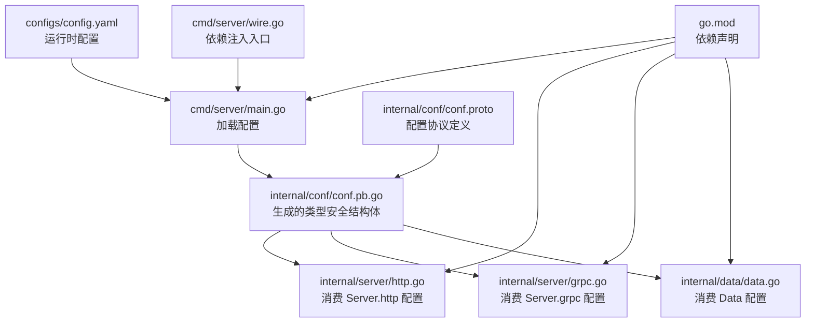
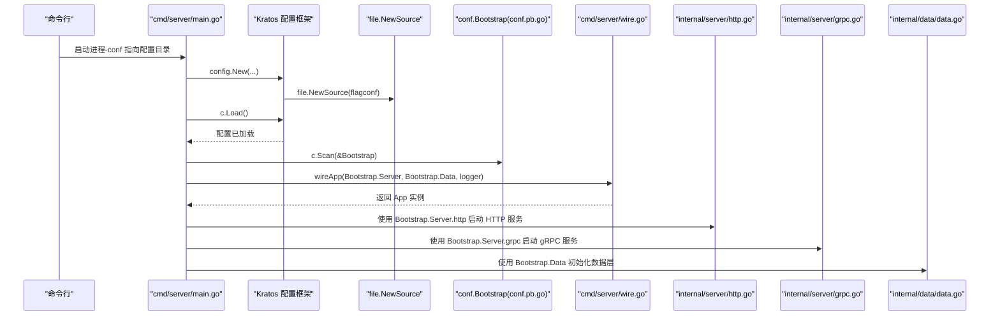
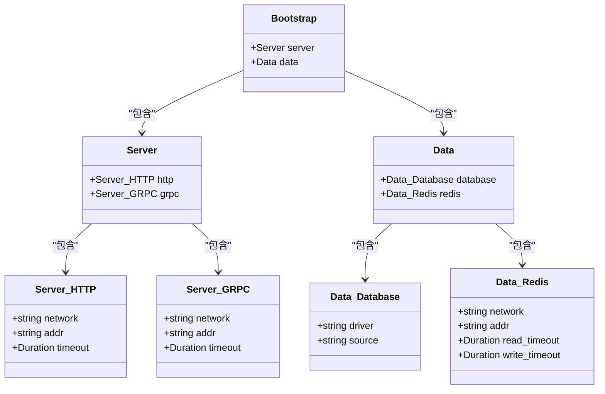
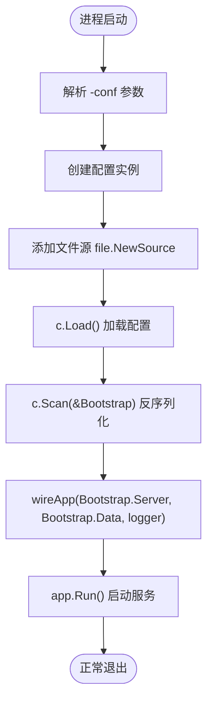
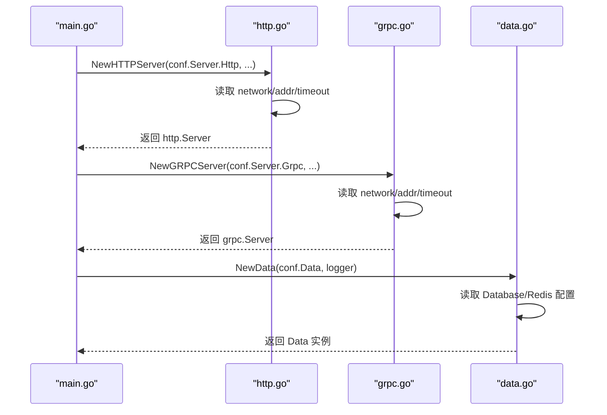
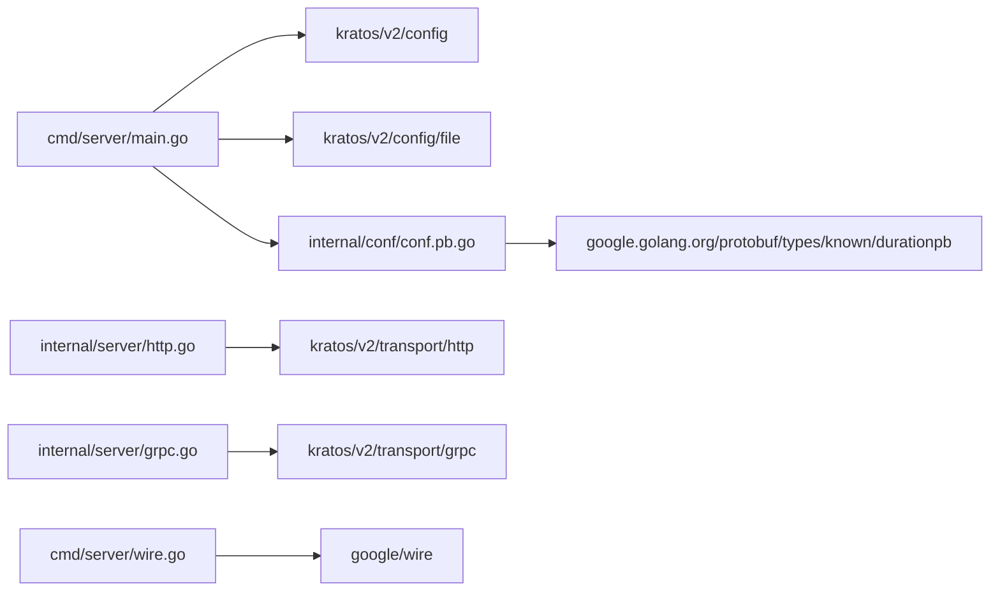
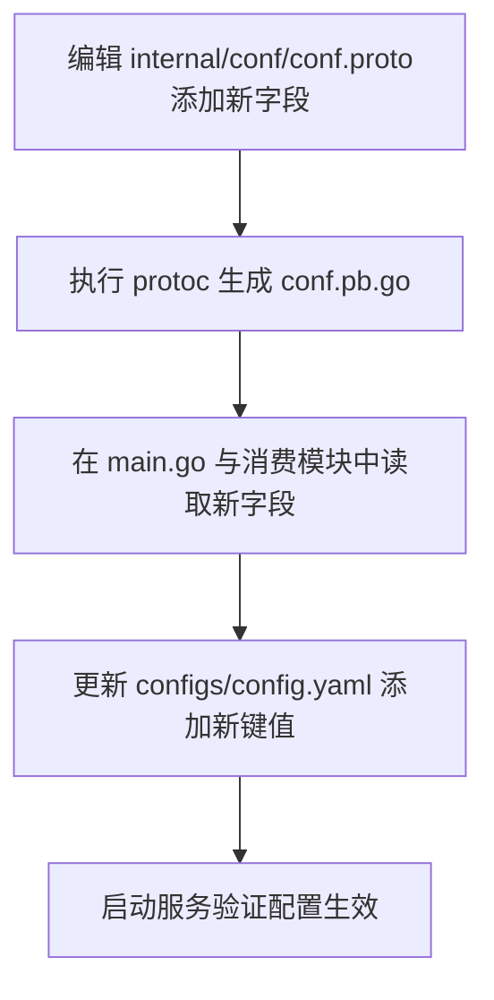

# 配置管理

<cite>
**本文引用的文件**
- [config.yaml](file://configs/config.yaml)
- [conf.proto](file://internal/conf/conf.proto)
- [conf.pb.go](file://internal/conf/conf.pb.go)
- [main.go](file://cmd/server/main.go)
- [http.go](file://internal/server/http.go)
- [grpc.go](file://internal/server/grpc.go)
- [data.go](file://internal/data/data.go)
- [wire.go](file://cmd/server/wire.go)
- [go.mod](file://go.mod)
</cite>

## 目录
1. [简介](#简介)
2. [项目结构](#项目结构)
3. [核心组件](#核心组件)
4. [架构总览](#架构总览)
5. [详细组件分析](#详细组件分析)
6. [依赖关系分析](#依赖关系分析)
7. [性能考量](#性能考量)
8. [故障排查指南](#故障排查指南)
9. [结论](#结论)
10. [附录：新增自定义配置项操作指南](#附录新增自定义配置项操作指南)

## 简介
本文件系统性解析该项目的配置管理体系，重点说明：
- config.yaml 作为运行时配置文件的结构设计与实际用途（server 的 HTTP/gRPC 端口、超时；data 的数据库与 Redis 连接等）
- conf.proto 如何定义配置的 Protocol Buffer 结构，并通过 protoc 生成 conf.pb.go 以实现类型安全读取
- main.go 中如何通过 config.New 与 file.NewSource 加载 YAML 文件并反序列化为 Bootstrap 对象
- 如何扩展自定义配置项（更新 proto 定义、重新生成代码、在代码中注入使用）以及配置与代码分离的设计优势

## 项目结构
配置相关的关键位置如下：
- 运行时配置文件：configs/config.yaml
- 配置协议定义：internal/conf/conf.proto
- 生成的类型安全配置结构体：internal/conf/conf.pb.go
- 应用入口加载配置：cmd/server/main.go
- 服务器配置消费点：internal/server/http.go、internal/server/grpc.go
- 数据层配置消费点：internal/data/data.go
- 依赖声明：go.mod

图表来源
- [config.yaml](file://configs/config.yaml#L1-L16)
- [conf.proto](file://internal/conf/conf.proto#L1-L42)
- [conf.pb.go](file://internal/conf/conf.pb.go#L1-L120)
- [main.go](file://cmd/server/main.go#L50-L88)
- [http.go](file://internal/server/http.go#L1-L33)
- [grpc.go](file://internal/server/grpc.go#L1-L33)
- [data.go](file://internal/data/data.go#L1-L25)
- [wire.go](file://cmd/server/wire.go#L1-L24)
- [go.mod](file://go.mod#L1-L36)

章节来源
- [config.yaml](file://configs/config.yaml#L1-L16)
- [conf.proto](file://internal/conf/conf.proto#L1-L42)
- [conf.pb.go](file://internal/conf/conf.pb.go#L1-L120)
- [main.go](file://cmd/server/main.go#L50-L88)
- [http.go](file://internal/server/http.go#L1-L33)
- [grpc.go](file://internal/server/grpc.go#L1-L33)
- [data.go](file://internal/data/data.go#L1-L25)
- [wire.go](file://cmd/server/wire.go#L1-L24)
- [go.mod](file://go.mod#L1-L36)

## 核心组件
- 配置协议（conf.proto）：定义了 Bootstrap、Server、Data 及其子消息（HTTP、GRPC、Database、Redis），并使用 google.protobuf.Duration 表示超时时间
- 类型安全结构体（conf.pb.go）：由 protoc-gen-go 生成，提供字段访问器与 JSON 映射，便于在 Go 代码中强类型读取
- 运行时配置（config.yaml）：YAML 格式，包含 server.http、server.grpc、data.database、data.redis 等键值
- 配置加载（main.go）：通过 Kratos 配置框架加载文件源，调用 Load 并 Scan 到 Bootstrap 结构体
- 配置消费（server/http.go、server/grpc.go、data/data.go）：从 conf.Server/conf.Data 中读取网络地址、超时等参数，驱动服务启动与数据连接

章节来源
- [conf.proto](file://internal/conf/conf.proto#L1-L42)
- [conf.pb.go](file://internal/conf/conf.pb.go#L1-L120)
- [config.yaml](file://configs/config.yaml#L1-L16)
- [main.go](file://cmd/server/main.go#L50-L88)
- [http.go](file://internal/server/http.go#L1-L33)
- [grpc.go](file://internal/server/grpc.go#L1-L33)
- [data.go](file://internal/data/data.go#L1-L25)

## 架构总览
下图展示了从配置文件到应用启动的整体流程，以及配置结构在各模块中的传递路径。

图表来源
- [main.go](file://cmd/server/main.go#L50-L88)
- [conf.pb.go](file://internal/conf/conf.pb.go#L1-L120)
- [wire.go](file://cmd/server/wire.go#L1-L24)
- [http.go](file://internal/server/http.go#L1-L33)
- [grpc.go](file://internal/server/grpc.go#L1-L33)
- [data.go](file://internal/data/data.go#L1-L25)

## 详细组件分析

### 配置协议与类型安全结构体（conf.proto → conf.pb.go）
- 协议定义要点
  - Bootstrap 包含 Server 与 Data 两个顶级消息
  - Server 内部嵌套 HTTP 与 GRPC 子消息，均包含 network、addr、timeout 字段
  - Data 内部嵌套 Database 与 Redis 子消息，分别包含 driver/source 与 network/addr/read_timeout/write_timeout
  - 超时统一使用 google.protobuf.Duration，便于在 Go 侧转换为标准库时间类型
- 生成代码特性
  - 生成的结构体提供 GetXxx 访问器，支持空指针安全
  - 支持 JSON 映射，便于与 YAML 解析兼容
  - 通过 protoimpl 提供反射与序列化能力

图表来源
- [conf.proto](file://internal/conf/conf.proto#L1-L42)
- [conf.pb.go](file://internal/conf/conf.pb.go#L1-L120)

章节来源
- [conf.proto](file://internal/conf/conf.proto#L1-L42)
- [conf.pb.go](file://internal/conf/conf.pb.go#L1-L120)

### 运行时配置文件（config.yaml）结构与用途
- server.http
  - addr：HTTP 服务监听地址
  - timeout：请求超时时间（Duration）
- server.grpc
  - addr：gRPC 服务监听地址
  - timeout：请求超时时间（Duration）
- data.database
  - driver：数据库驱动名称（如 mysql）
  - source：连接字符串（DSN）
- data.redis
  - addr：Redis 地址
  - read_timeout、write_timeout：读写超时（Duration）

章节来源
- [config.yaml](file://configs/config.yaml#L1-L16)

### 配置加载流程（main.go）
- 命令行参数 -conf 指定配置目录或文件
- 使用 config.New 创建配置源，file.NewSource 作为文件源
- 调用 c.Load() 加载配置
- 通过 c.Scan(&Bootstrap) 将 YAML 反序列化为类型安全的 Bootstrap 结构体
- 将 Bootstrap.Server 与 Bootstrap.Data 注入依赖注入容器，构建应用实例

图表来源
- [main.go](file://cmd/server/main.go#L50-L88)

章节来源
- [main.go](file://cmd/server/main.go#L50-L88)

### 配置消费点（HTTP/gRPC 与数据层）
- HTTP 服务
  - 从 conf.Server.Http 读取 network、addr、timeout
  - 通过 http.Network、http.Address、http.Timeout 设置服务选项
- gRPC 服务
  - 从 conf.Server.Grpc 读取 network、addr、timeout
  - 通过 grpc.Network、grpc.Address、grpc.Timeout 设置服务选项
- 数据层
  - 从 conf.Data 读取 Database/Redis 配置，用于初始化数据库与缓存客户端
  - 通过 NewData 接收 conf.Data 并返回资源清理函数

图表来源
- [http.go](file://internal/server/http.go#L1-L33)
- [grpc.go](file://internal/server/grpc.go#L1-L33)
- [data.go](file://internal/data/data.go#L1-L25)

章节来源
- [http.go](file://internal/server/http.go#L1-L33)
- [grpc.go](file://internal/server/grpc.go#L1-L33)
- [data.go](file://internal/data/data.go#L1-L25)

## 依赖关系分析
- Kratos 配置框架与文件源
  - main.go 依赖 github.com/go-kratos/kratos/v2/config 与 config/file
- Protocol Buffer 运行时
  - conf.pb.go 依赖 google.golang.org/protobuf/types/known/durationpb
- 传输层
  - http.go 与 grpc.go 依赖 github.com/go-kratos/kratos/v2/transport/http 与 grpc
- 依赖注入
  - wire.go 通过 google/wire 组合 ProviderSet，完成服务与数据层的装配

图表来源
- [main.go](file://cmd/server/main.go#L1-L20)
- [conf.pb.go](file://internal/conf/conf.pb.go#L1-L40)
- [http.go](file://internal/server/http.go#L1-L20)
- [grpc.go](file://internal/server/grpc.go#L1-L20)
- [wire.go](file://cmd/server/wire.go#L1-L24)
- [go.mod](file://go.mod#L1-L36)

章节来源
- [go.mod](file://go.mod#L1-L36)
- [main.go](file://cmd/server/main.go#L1-L20)
- [conf.pb.go](file://internal/conf/conf.pb.go#L1-L40)
- [http.go](file://internal/server/http.go#L1-L20)
- [grpc.go](file://internal/server/grpc.go#L1-L20)
- [wire.go](file://cmd/server/wire.go#L1-L24)

## 性能考量
- 配置加载采用一次性扫描到结构体的方式，避免重复解析
- Duration 在 Go 侧可直接转换为标准时间类型，减少额外转换开销
- 通过依赖注入集中管理配置消费点，降低耦合度，提升可测试性

## 故障排查指南
- 配置未生效
  - 确认 -conf 指向正确的配置目录或文件
  - 确认 YAML 键名与 conf.proto 定义一致（大小写敏感）
- 类型不匹配
  - 超时字段应为 Duration，确保 YAML 中使用秒/纳秒等合法格式
- 服务无法启动
  - 检查 server.http.addr 与 server.grpc.addr 是否冲突
  - 检查 data.database.source 与 data.redis.addr 是否可达
- 依赖注入问题
  - 确保 wireApp 接收的 conf.Server 与 conf.Data 非空
  - 检查 ProviderSet 是否正确注册

章节来源
- [main.go](file://cmd/server/main.go#L50-L88)
- [http.go](file://internal/server/http.go#L1-L33)
- [grpc.go](file://internal/server/grpc.go#L1-L33)
- [data.go](file://internal/data/data.go#L1-L25)

## 结论
该配置管理体系通过 Protocol Buffer 定义清晰的配置模型，结合 Kratos 配置框架与文件源，实现了类型安全、可演进且易于维护的运行时配置方案。配置与代码分离的设计使得服务启动参数、数据库与缓存连接等均可在不修改代码的情况下灵活调整，提升了部署灵活性与可运维性。

## 附录：新增自定义配置项操作指南
以下流程基于现有代码结构，指导如何安全地添加新的配置项：
1. 更新协议定义（conf.proto）
   - 在对应消息内添加新字段（如在 Data 下新增某子消息或字段）
   - 若涉及超时，建议使用 google.protobuf.Duration 保持一致性
   - 保存后执行 protoc-gen-go 生成 conf.pb.go
2. 重新生成代码
   - 使用 protoc 命令生成 Go 代码，确保 go_package 与导入路径一致
   - 生成后的 conf.pb.go 将包含新字段的访问器
3. 在代码中注入使用
   - 在 main.go 中继续使用 c.Scan(&Bootstrap) 获取最新结构体
   - 在需要消费配置的模块（如 data.go、http.go、grpc.go）中，从 conf.Data 或 conf.Server 读取新增字段
   - 通过依赖注入（wire.go）将新配置传入相应构造函数
4. 更新运行时配置（config.yaml）
   - 在对应层级添加新键值，遵循 YAML 语法与类型要求
   - 启动服务验证配置是否生效

图表来源
- [conf.proto](file://internal/conf/conf.proto#L1-L42)
- [conf.pb.go](file://internal/conf/conf.pb.go#L1-L120)
- [main.go](file://cmd/server/main.go#L50-L88)
- [data.go](file://internal/data/data.go#L1-L25)
- [http.go](file://internal/server/http.go#L1-L33)
- [grpc.go](file://internal/server/grpc.go#L1-L33)
- [config.yaml](file://configs/config.yaml#L1-L16)

章节来源
- [conf.proto](file://internal/conf/conf.proto#L1-L42)
- [conf.pb.go](file://internal/conf/conf.pb.go#L1-L120)
- [main.go](file://cmd/server/main.go#L50-L88)
- [data.go](file://internal/data/data.go#L1-L25)
- [http.go](file://internal/server/http.go#L1-L33)
- [grpc.go](file://internal/server/grpc.go#L1-L33)
- [config.yaml](file://configs/config.yaml#L1-L16)