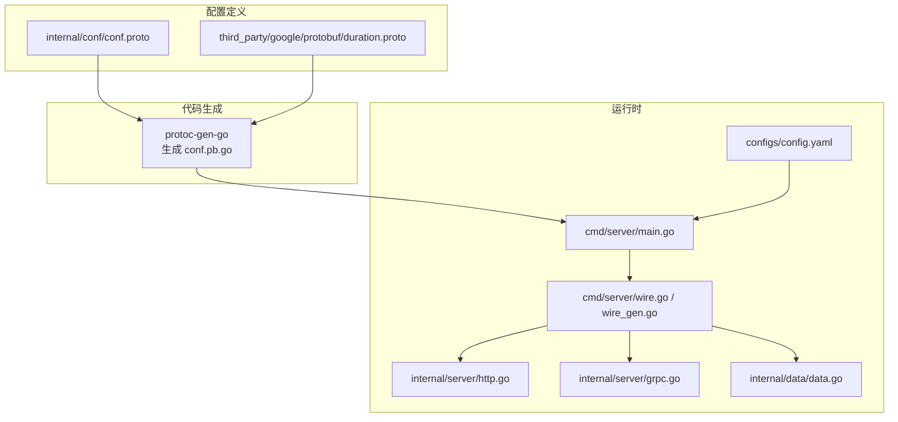
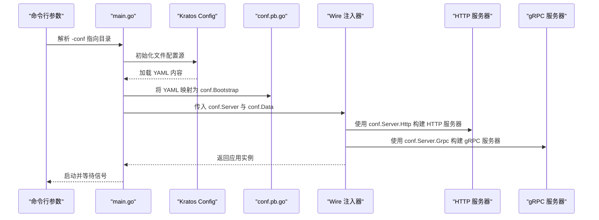
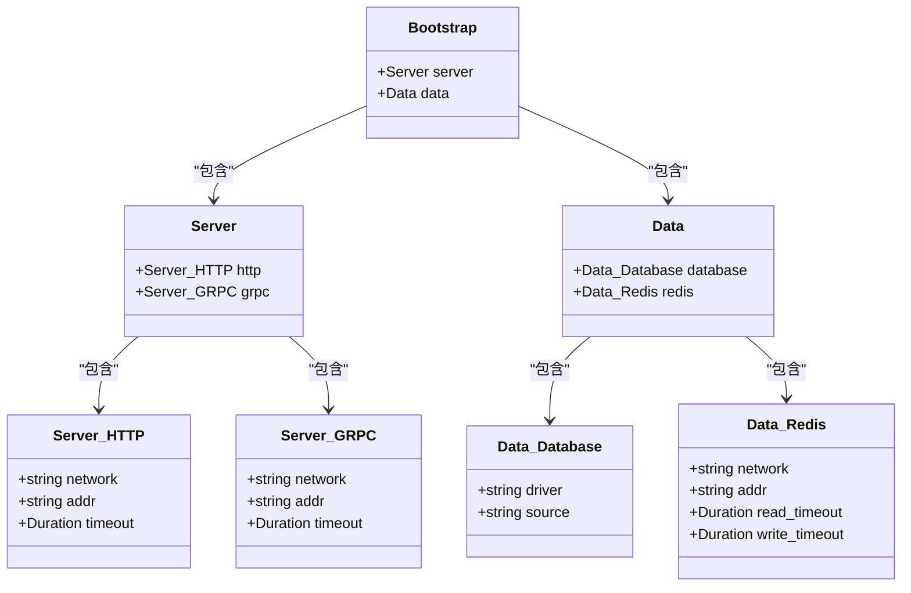
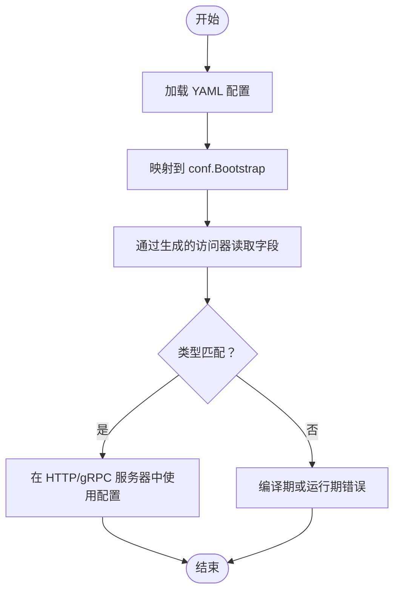
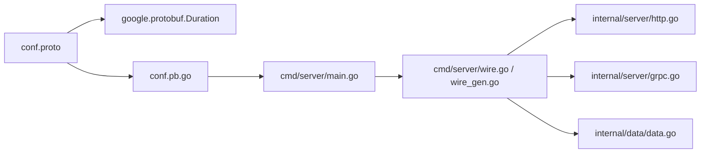

# 配置定义与结构

<cite>
**本文引用的文件**
- [conf.proto](file://internal/conf/conf.proto)
- [conf.pb.go](file://internal/conf/conf.pb.go)
- [duration.proto](file://third_party/google/protobuf/duration.proto)
- [main.go](file://cmd/server/main.go)
- [wire.go](file://cmd/server/wire.go)
- [wire_gen.go](file://cmd/server/wire_gen.go)
- [http.go](file://internal/server/http.go)
- [grpc.go](file://internal/server/grpc.go)
- [data.go](file://internal/data/data.go)
- [config.yaml](file://configs/config.yaml)
- [validate.proto](file://third_party/validate/validate.proto)
</cite>

## 目录
1. [引言](#引言)
2. [项目结构](#项目结构)
3. [核心组件](#核心组件)
4. [架构总览](#架构总览)
5. [详细组件分析](#详细组件分析)
6. [依赖关系分析](#依赖关系分析)
7. [性能考量](#性能考量)
8. [故障排查指南](#故障排查指南)
9. [结论](#结论)
10. [附录：扩展与最佳实践](#附录扩展与最佳实践)

## 引言
本文件围绕 Kratos 项目的配置定义与结构展开，重点基于 conf.proto 文件，系统讲解如何通过 Protocol Buffer 定义项目配置结构，覆盖以下主题：
- Bootstrap、Server、Data 等核心消息类型的定义方式与嵌套结构（HTTP/GRPC、Database/Redis）
- 字段类型（如 string、google.protobuf.Duration）的使用与语义
- go_package 选项的作用及其对代码生成的影响
- conf.pb.go 如何由 protoc-gen-go 自动生成，以及生成的 Go 结构体如何保证类型安全的配置访问
- 在 proto 中添加自定义配置项（如日志级别、第三方服务密钥）的完整示例与字段编号（tag）的重要性
- 使用 Protocol Buffer 而非纯 YAML/JSON 的优势：强类型校验、跨语言兼容性、版本兼容性

## 项目结构
本项目采用 Kratos 模块化布局，配置定义位于 internal/conf，运行时通过 Kratos 配置源读取 YAML 并映射到生成的 Go 结构体，再注入到服务启动流程中。

图表来源
- [conf.proto](file://internal/conf/conf.proto#L1-L42)
- [duration.proto](file://third_party/google/protobuf/duration.proto#L1-L117)
- [conf.pb.go](file://internal/conf/conf.pb.go#L1-L653)
- [main.go](file://cmd/server/main.go#L1-L88)
- [wire.go](file://cmd/server/wire.go#L1-L24)
- [wire_gen.go](file://cmd/server/wire_gen.go#L1-L41)
- [http.go](file://internal/server/http.go#L1-L33)
- [grpc.go](file://internal/server/grpc.go#L1-L33)
- [data.go](file://internal/data/data.go#L1-L25)
- [config.yaml](file://configs/config.yaml#L1-L16)

章节来源
- [conf.proto](file://internal/conf/conf.proto#L1-L42)
- [main.go](file://cmd/server/main.go#L61-L76)
- [wire.go](file://cmd/server/wire.go#L20-L23)
- [wire_gen.go](file://cmd/server/wire_gen.go#L25-L40)

## 核心组件
- Bootstrap：顶层配置入口，包含 Server 与 Data 两个子配置对象，分别用于 HTTP/gRPC 服务器与数据层（数据库/Redis）配置。
- Server：包含 HTTP 与 GRPC 子消息，每个子消息均包含网络协议、监听地址与超时时间（Duration）。
- Data：包含 Database 与 Redis 子消息，分别描述驱动、连接源、网络、地址与读写超时等字段。

字段类型与嵌套结构
- 基本类型：string（如 network、addr、driver、source）
- 复杂类型：google.protobuf.Duration（timeout/read_timeout/write_timeout），用于表达秒级或纳秒级的时间跨度
- 嵌套消息：Server.HTTP、Server.GRPC、Data.Database、Data.Redis

go_package 选项
- 在 conf.proto 中通过 option go_package 指定生成 Go 包路径与别名，影响生成文件的 package 声明与导入路径，确保与其他模块正确集成。

章节来源
- [conf.proto](file://internal/conf/conf.proto#L1-L42)
- [duration.proto](file://third_party/google/protobuf/duration.proto#L103-L116)
- [conf.pb.go](file://internal/conf/conf.pb.go#L1-L653)

## 架构总览
配置从 YAML 到运行时的典型流程如下：

图表来源
- [main.go](file://cmd/server/main.go#L61-L87)
- [wire.go](file://cmd/server/wire.go#L20-L23)
- [wire_gen.go](file://cmd/server/wire_gen.go#L25-L40)
- [http.go](file://internal/server/http.go#L13-L32)
- [grpc.go](file://internal/server/grpc.go#L13-L32)

章节来源
- [main.go](file://cmd/server/main.go#L61-L87)
- [wire.go](file://cmd/server/wire.go#L20-L23)
- [wire_gen.go](file://cmd/server/wire_gen.go#L25-L40)
- [http.go](file://internal/server/http.go#L13-L32)
- [grpc.go](file://internal/server/grpc.go#L13-L32)

## 详细组件分析

### Bootstrap/Server/Data 类型关系图

图表来源
- [conf.proto](file://internal/conf/conf.proto#L8-L41)
- [conf.pb.go](file://internal/conf/conf.pb.go#L24-L440)

章节来源
- [conf.proto](file://internal/conf/conf.proto#L8-L41)
- [conf.pb.go](file://internal/conf/conf.pb.go#L24-L440)

### 配置加载与类型安全访问流程
- YAML 配置文件（configs/config.yaml）定义了 server.http、server.grpc、data.database、data.redis 等键值。
- 运行时通过 Kratos 配置源加载 YAML，并调用 conf.Bootstrap 接收映射结果。
- 生成的 conf.pb.go 提供强类型访问器（如 GetServer、GetData、GetHttp、GetGrpc、GetDatabase、GetRedis），并在访问 Duration 字段时提供 AsDuration() 等方法，确保类型安全与可读性。

图表来源
- [main.go](file://cmd/server/main.go#L61-L76)
- [http.go](file://internal/server/http.go#L20-L28)
- [grpc.go](file://internal/server/grpc.go#L20-L28)
- [conf.pb.go](file://internal/conf/conf.pb.go#L65-L132)

章节来源
- [main.go](file://cmd/server/main.go#L61-L76)
- [http.go](file://internal/server/http.go#L20-L28)
- [grpc.go](file://internal/server/grpc.go#L20-L28)
- [conf.pb.go](file://internal/conf/conf.pb.go#L65-L132)

### 代码生成与 go_package 的作用
- go_package 选项决定生成 Go 文件的包名与导入路径，确保生成的 conf.pb.go 可被 internal/conf 引用，避免包名冲突。
- protoc-gen-go 根据 .proto 文件内容生成结构体、访问器、序列化/反序列化方法与依赖关系表，保证与 YAML 键名一致的 JSON 标签映射。

章节来源
- [conf.proto](file://internal/conf/conf.proto#L1-L10)
- [conf.pb.go](file://internal/conf/conf.pb.go#L1-L22)

### Duration 类型的使用与转换
- Server.HTTP/GRPC 与 Data.Redis 均使用 google.protobuf.Duration 表达超时配置。
- 在运行时，可通过 AsDuration() 方法将 Duration 转换为标准库时间类型，便于设置 HTTP/gRPC 服务器的超时选项。

章节来源
- [duration.proto](file://third_party/google/protobuf/duration.proto#L103-L116)
- [http.go](file://internal/server/http.go#L26-L28)
- [grpc.go](file://internal/server/grpc.go#L26-L28)
- [conf.pb.go](file://internal/conf/conf.pb.go#L196-L206)

### 数据层配置注入与生命周期
- data.ProviderSet 通过 NewData 接收 conf.Data，实现对数据库/Redis 的初始化与清理。
- 该模式体现“配置即接口”的思想：业务层仅依赖 conf.Data 抽象，不关心具体实现细节。

章节来源
- [data.go](file://internal/data/data.go#L13-L25)
- [wire.go](file://cmd/server/wire.go#L20-L23)
- [wire_gen.go](file://cmd/server/wire_gen.go#L25-L40)

## 依赖关系分析
- 配置定义依赖 google.protobuf.Duration（well-known 类型）
- 运行时依赖 Kratos 配置源与 Wire 注入框架
- 生成的 conf.pb.go 作为中间层，向上游提供类型安全的配置访问

图表来源
- [conf.proto](file://internal/conf/conf.proto#L1-L10)
- [duration.proto](file://third_party/google/protobuf/duration.proto#L103-L116)
- [conf.pb.go](file://internal/conf/conf.pb.go#L1-L653)
- [main.go](file://cmd/server/main.go#L61-L87)
- [wire.go](file://cmd/server/wire.go#L20-L23)
- [wire_gen.go](file://cmd/server/wire_gen.go#L25-L40)
- [http.go](file://internal/server/http.go#L13-L32)
- [grpc.go](file://internal/server/grpc.go#L13-L32)
- [data.go](file://internal/data/data.go#L13-L25)

章节来源
- [conf.proto](file://internal/conf/conf.proto#L1-L10)
- [conf.pb.go](file://internal/conf/conf.pb.go#L514-L541)
- [main.go](file://cmd/server/main.go#L61-L87)

## 性能考量
- Protocol Buffer 的二进制序列化/反序列化在大型配置场景下具有更小的解析开销与更高的内存效率。
- Duration 类型以整数秒/纳秒存储，避免字符串解析带来的额外成本。
- 通过字段编号（tag）固定字段顺序，减少映射查找成本；同时保持向后兼容，便于演进。

[本节为通用指导，无需特定文件来源]

## 故障排查指南
- YAML 键名与 proto 字段不匹配：检查 conf.proto 中字段名称与 YAML 层级是否一致；生成的 JSON 标签与 proto 字段名需一一对应。
- Duration 解析异常：确认 YAML 中的超时格式符合 Duration 语义（如秒/纳秒），并在运行时通过 AsDuration() 正确转换。
- 配置未生效：确认 main.go 中已调用 c.Load() 与 c.Scan(&bc) 并成功将配置映射到 conf.Bootstrap。
- Wire 注入失败：检查 wire.go/wire_gen.go 中 ProviderSet 的构建链路，确保 conf.Server 与 conf.Data 已正确传递给 HTTP/gRPC 服务器构造函数。

章节来源
- [main.go](file://cmd/server/main.go#L61-L76)
- [http.go](file://internal/server/http.go#L20-L28)
- [grpc.go](file://internal/server/grpc.go#L20-L28)
- [wire.go](file://cmd/server/wire.go#L20-L23)
- [wire_gen.go](file://cmd/server/wire_gen.go#L25-L40)

## 结论
通过 Protocol Buffer 定义配置结构，能够获得强类型约束、跨语言一致性与良好的版本兼容性。结合 Kratos 配置源与 Wire 注入，实现了从 YAML 到运行时的类型安全映射与依赖注入，既保证了开发体验，也提升了系统的可维护性与可扩展性。

[本节为总结性内容，无需特定文件来源]

## 附录：扩展与最佳实践

### 在 proto 中添加自定义配置项的完整示例
- 日志级别：在 Server 或 Data 下新增 string 字段（如 log_level），并在运行时读取并设置日志级别。
- 第三方服务密钥：在 Data 下新增子消息（如 ThirdParty），包含 string 字段（如 api_key、secret），并通过环境变量或外部密钥管理服务注入。
- 字段编号（tag）建议：新增字段优先使用较大的编号，预留后续扩展空间；避免修改已有编号，以保持向后兼容。

章节来源
- [conf.proto](file://internal/conf/conf.proto#L8-L41)
- [conf.pb.go](file://internal/conf/conf.pb.go#L24-L440)

### 使用 Protocol Buffer 的优势
- 强类型校验：proto 定义字段类型与约束，生成代码提供编译期与运行期校验能力。
- 跨语言兼容：同一 .proto 可生成多种语言的代码，统一配置模型。
- 版本兼容性：通过字段编号与可选字段策略，支持向后兼容与演进。

章节来源
- [conf.proto](file://internal/conf/conf.proto#L1-L10)
- [conf.pb.go](file://internal/conf/conf.pb.go#L1-L22)

### 集成字段校验（可选）
- 可引入 protoc-gen-validate（third_party/validate/validate.proto）为字段添加规则（如长度、范围、正则等），在生成代码基础上进一步增强配置校验能力。

章节来源
- [validate.proto](file://third_party/validate/validate.proto#L1-L120)