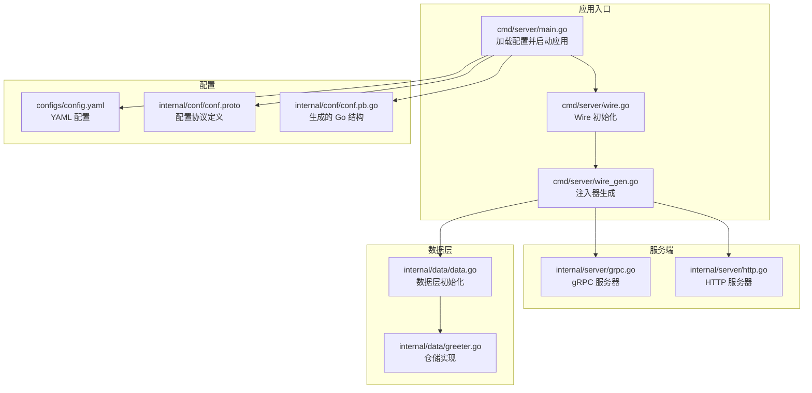
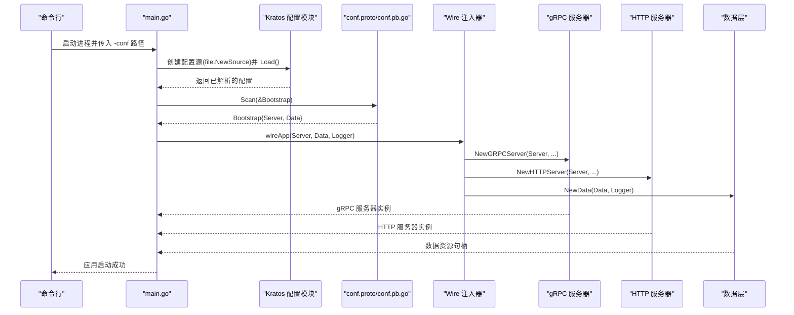
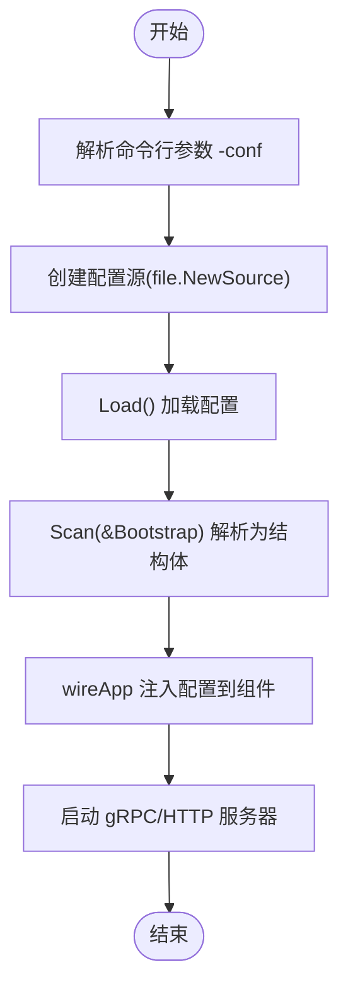
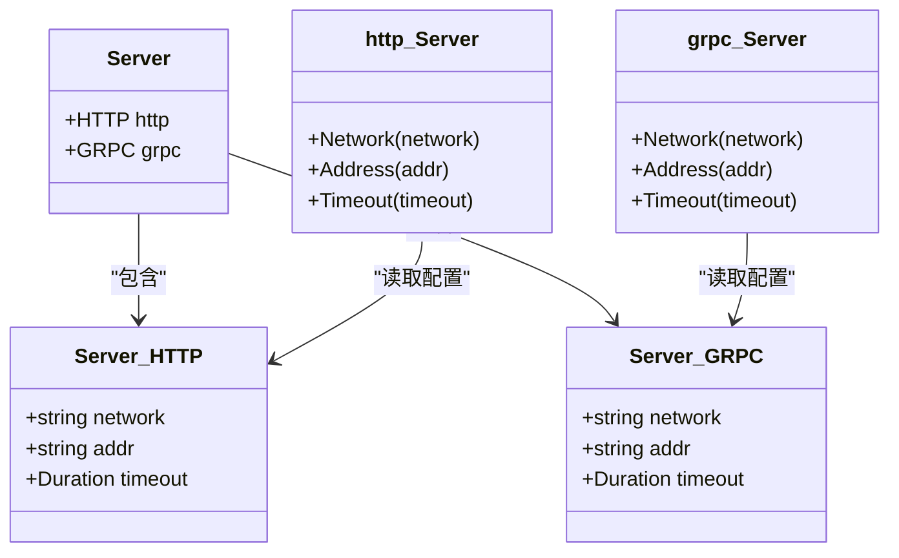
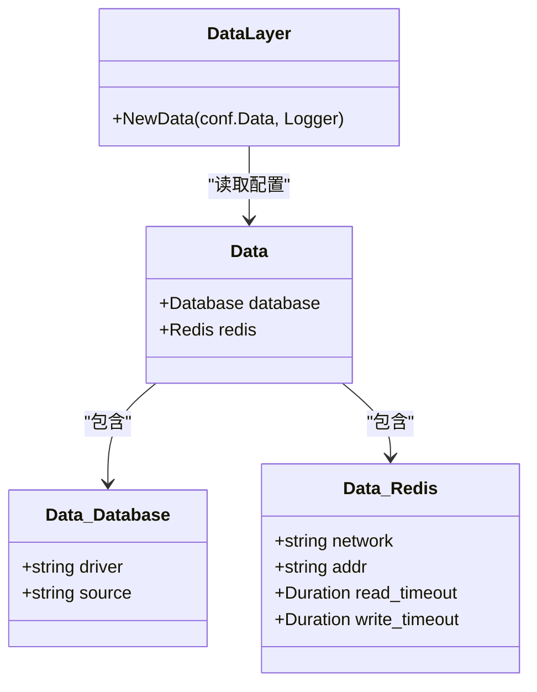
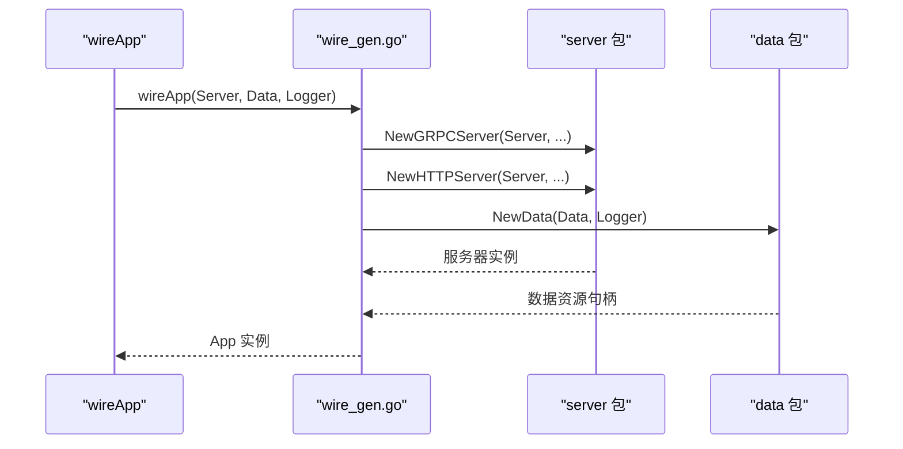
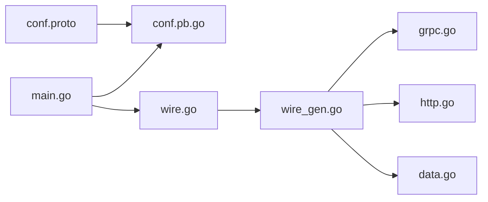
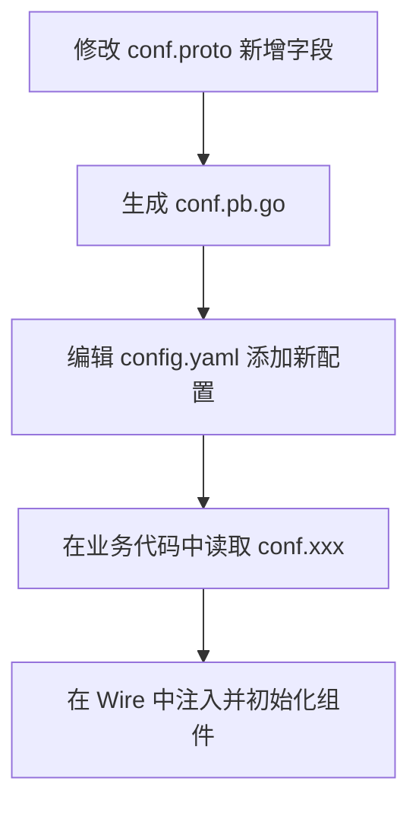

# 配置管理最佳实践

<cite>
**本文引用的文件**
- [main.go](file://cmd/server/main.go)
- [wire.go](file://cmd/server/wire.go)
- [wire_gen.go](file://cmd/server/wire_gen.go)
- [config.yaml](file://configs/config.yaml)
- [conf.proto](file://internal/conf/conf.proto)
- [conf.pb.go](file://internal/conf/conf.pb.go)
- [grpc.go](file://internal/server/grpc.go)
- [http.go](file://internal/server/http.go)
- [data.go](file://internal/data/data.go)
- [greeter.go](file://internal/data/greeter.go)
- [README.md](file://README.md)
</cite>

## 目录
1. [引言](#引言)
2. [项目结构](#项目结构)
3. [核心组件](#核心组件)
4. [架构总览](#架构总览)
5. [详细组件分析](#详细组件分析)
6. [依赖关系分析](#依赖关系分析)
7. [性能与稳定性最佳实践](#性能与稳定性最佳实践)
8. [故障排查指南](#故障排查指南)
9. [结论](#结论)
10. [附录：扩展配置到新组件的完整流程](#附录扩展配置到新组件的完整流程)

## 引言
本指南围绕 Kratos 项目的配置管理进行系统性梳理，重点覆盖以下主题：
- 多环境配置隔离：通过不同配置文件或环境变量覆盖实现
- 敏感信息安全处理：推荐使用环境变量注入或密钥管理服务，避免硬编码
- 扩展配置结构：新增组件（如消息队列、缓存集群）的完整流程
- 配置热更新：Kratos 配置模块的监听机制与运行时重载思路
- 命名规范、超时时间与连接池参数等性能与稳定性最佳实践

## 项目结构
该项目采用 Kratos 标准布局，配置相关的关键位置如下：
- 配置文件：configs/config.yaml
- 配置模型定义：internal/conf/conf.proto 及其生成的 Go 结构 conf.pb.go
- 应用入口与配置加载：cmd/server/main.go
- 服务端初始化：internal/server/grpc.go、internal/server/http.go
- 数据层与配置注入：internal/data/data.go、internal/data/greeter.go
- 依赖注入：cmd/server/wire.go、cmd/server/wire_gen.go
- 使用说明与示例：README.md

图表来源
- [main.go](file://cmd/server/main.go#L50-L87)
- [wire.go](file://cmd/server/wire.go#L20-L24)
- [wire_gen.go](file://cmd/server/wire_gen.go#L25-L40)
- [config.yaml](file://configs/config.yaml#L1-L16)
- [conf.proto](file://internal/conf/conf.proto#L1-L42)
- [conf.pb.go](file://internal/conf/conf.pb.go#L24-L652)
- [grpc.go](file://internal/server/grpc.go#L13-L33)
- [http.go](file://internal/server/http.go#L13-L33)
- [data.go](file://internal/data/data.go#L13-L25)
- [greeter.go](file://internal/data/greeter.go#L16-L22)

章节来源
- [main.go](file://cmd/server/main.go#L50-L87)
- [wire.go](file://cmd/server/wire.go#L20-L24)
- [wire_gen.go](file://cmd/server/wire_gen.go#L25-L40)
- [config.yaml](file://configs/config.yaml#L1-L16)
- [conf.proto](file://internal/conf/conf.proto#L1-L42)
- [conf.pb.go](file://internal/conf/conf.pb.go#L24-L652)
- [grpc.go](file://internal/server/grpc.go#L13-L33)
- [http.go](file://internal/server/http.go#L13-L33)
- [data.go](file://internal/data/data.go#L13-L25)
- [greeter.go](file://internal/data/greeter.go#L16-L22)
- [README.md](file://README.md#L1-L52)

## 核心组件
- 配置模型与加载
  - 使用 conf.proto 定义配置结构，conf.pb.go 提供强类型访问
  - main.go 中通过 Kratos 配置模块加载 YAML 并 Scan 到 Bootstrap 结构
- 服务端配置注入
  - gRPC/HTTP 服务器从 conf.Server 读取网络地址、超时等参数
- 数据层配置注入
  - data 层从 conf.Data 读取数据库、Redis 等参数
- 依赖注入
  - Wire 将配置注入到各组件，形成清晰的控制反转

章节来源
- [conf.proto](file://internal/conf/conf.proto#L8-L42)
- [conf.pb.go](file://internal/conf/conf.pb.go#L24-L652)
- [main.go](file://cmd/server/main.go#L61-L76)
- [grpc.go](file://internal/server/grpc.go#L13-L33)
- [http.go](file://internal/server/http.go#L13-L33)
- [data.go](file://internal/data/data.go#L19-L24)
- [wire.go](file://cmd/server/wire.go#L20-L24)
- [wire_gen.go](file://cmd/server/wire_gen.go#L25-L40)

## 架构总览
下图展示了配置从加载到注入再到使用的整体流程。

图表来源
- [main.go](file://cmd/server/main.go#L50-L87)
- [wire.go](file://cmd/server/wire.go#L20-L24)
- [wire_gen.go](file://cmd/server/wire_gen.go#L25-L40)
- [grpc.go](file://internal/server/grpc.go#L13-L33)
- [http.go](file://internal/server/http.go#L13-L33)
- [data.go](file://internal/data/data.go#L19-L24)
- [conf.proto](file://internal/conf/conf.proto#L8-L42)
- [conf.pb.go](file://internal/conf/conf.pb.go#L24-L652)

## 详细组件分析

### 配置加载与扫描流程
- 入口程序通过 Kratos 配置模块创建文件源并加载配置
- 加载完成后将配置扫描到 Bootstrap 结构，随后注入到各组件

图表来源
- [main.go](file://cmd/server/main.go#L50-L87)

章节来源
- [main.go](file://cmd/server/main.go#L50-L87)

### 服务端配置注入（gRPC/HTTP）
- gRPC/HTTP 服务器从 conf.Server 读取网络、地址、超时等参数
- 当配置中的字段为空时，对应选项不会被设置，保持默认行为

图表来源
- [conf.proto](file://internal/conf/conf.proto#L13-L31)
- [conf.pb.go](file://internal/conf/conf.pb.go#L93-L197)
- [grpc.go](file://internal/server/grpc.go#L13-L33)
- [http.go](file://internal/server/http.go#L13-L33)

章节来源
- [grpc.go](file://internal/server/grpc.go#L13-L33)
- [http.go](file://internal/server/http.go#L13-L33)
- [conf.proto](file://internal/conf/conf.proto#L13-L31)
- [conf.pb.go](file://internal/conf/conf.pb.go#L93-L197)

### 数据层配置注入（数据库/Redis）
- data 层从 conf.Data 读取数据库驱动与连接串、Redis 地址与读写超时
- 当前仓库未实际使用数据库/Redis，但结构已完备，便于后续接入

图表来源
- [conf.proto](file://internal/conf/conf.proto#L28-L41)
- [conf.pb.go](file://internal/conf/conf.pb.go#L134-L187)
- [data.go](file://internal/data/data.go#L19-L24)

章节来源
- [data.go](file://internal/data/data.go#L19-L24)
- [conf.proto](file://internal/conf/conf.proto#L28-L41)
- [conf.pb.go](file://internal/conf/conf.pb.go#L134-L187)

### 依赖注入与组件装配
- Wire 将配置注入到各组件，形成清晰的装配链路
- wire_gen.go 展示了注入器如何调用 NewGRPCServer/NewHTTPServer/NewData

图表来源
- [wire.go](file://cmd/server/wire.go#L20-L24)
- [wire_gen.go](file://cmd/server/wire_gen.go#L25-L40)
- [grpc.go](file://internal/server/grpc.go#L13-L33)
- [http.go](file://internal/server/http.go#L13-L33)
- [data.go](file://internal/data/data.go#L19-L24)

章节来源
- [wire.go](file://cmd/server/wire.go#L20-L24)
- [wire_gen.go](file://cmd/server/wire_gen.go#L25-L40)

## 依赖关系分析
- 配置模型与加载：conf.proto 定义结构，conf.pb.go 提供访问；main.go 通过 Kratos 配置模块加载并 Scan
- 组件装配：Wire 将配置注入到 server 与 data 层
- 服务端：gRPC/HTTP 服务器从 conf.Server 读取参数

图表来源
- [conf.proto](file://internal/conf/conf.proto#L1-L42)
- [conf.pb.go](file://internal/conf/conf.pb.go#L24-L652)
- [main.go](file://cmd/server/main.go#L50-L87)
- [wire.go](file://cmd/server/wire.go#L20-L24)
- [wire_gen.go](file://cmd/server/wire_gen.go#L25-L40)
- [grpc.go](file://internal/server/grpc.go#L13-L33)
- [http.go](file://internal/server/http.go#L13-L33)
- [data.go](file://internal/data/data.go#L19-L24)

章节来源
- [conf.proto](file://internal/conf/conf.proto#L1-L42)
- [conf.pb.go](file://internal/conf/conf.pb.go#L24-L652)
- [main.go](file://cmd/server/main.go#L50-L87)
- [wire.go](file://cmd/server/wire.go#L20-L24)
- [wire_gen.go](file://cmd/server/wire_gen.go#L25-L40)
- [grpc.go](file://internal/server/grpc.go#L13-L33)
- [http.go](file://internal/server/http.go#L13-L33)
- [data.go](file://internal/data/data.go#L19-L24)

## 性能与稳定性最佳实践
- 命名规范
  - 配置键建议采用小写加点分隔的层级命名，如 server.http.addr、data.database.driver
  - 字段语义明确，避免缩写，确保跨团队可读性
- 超时时间设置
  - 服务端超时：根据业务特性设置合理的 HTTP/gRPC 超时，避免过长导致资源占用
  - 数据层超时：数据库与 Redis 的读写超时应与业务 SLA 对齐，防止慢查询拖垮服务
- 连接池参数
  - 数据库连接池：合理设置最大连接数、空闲连接数、连接生命周期，避免连接泄漏
  - Redis 连接池：根据 QPS 与延迟目标调整连接数与超时，避免阻塞
- 日志与可观测性
  - 在配置中保留日志级别、采样率等开关，便于线上快速诊断
- 容错与降级
  - 为关键依赖（数据库、缓存）配置重试策略与熔断阈值，提升系统韧性

[本节为通用指导，不直接分析具体文件]

## 故障排查指南
- 配置加载失败
  - 检查 -conf 参数指向的目录是否正确，YAML 语法是否合法
  - 确认 conf.proto 与 conf.pb.go 是否同步生成
- 配置扫描错误
  - 确保 YAML 键与 conf.proto 字段一致，大小写匹配
  - 若字段为空，对应组件将使用默认行为，检查是否符合预期
- 服务器启动异常
  - 检查 server.http.addr/server.grpc.addr 是否冲突或不可绑定
  - 确认超时配置是否合理，避免过短导致请求失败
- 数据层初始化问题
  - 确认 data.database.source 与 data.redis.addr 正确无误
  - 如需连接池参数，请在后续扩展中补充

章节来源
- [main.go](file://cmd/server/main.go#L50-L87)
- [config.yaml](file://configs/config.yaml#L1-L16)
- [conf.proto](file://internal/conf/conf.proto#L8-L42)
- [conf.pb.go](file://internal/conf/conf.pb.go#L24-L652)
- [grpc.go](file://internal/server/grpc.go#L13-L33)
- [http.go](file://internal/server/http.go#L13-L33)
- [data.go](file://internal/data/data.go#L19-L24)

## 结论
本项目以 Kratos 配置模块为核心，结合 Wire 依赖注入，实现了清晰、可维护的配置管理架构。通过强类型配置模型与严格的装配流程，既保证了开发效率，也为后续扩展打下了良好基础。建议在生产环境中配合多环境配置隔离、敏感信息安全处理与热更新能力，持续提升系统的安全性与可运维性。

[本节为总结性内容，不直接分析具体文件]

## 附录：扩展配置到新组件的完整流程
以下流程适用于新增组件（如消息队列、缓存集群）的配置扩展，涵盖从协议定义到业务代码读取的全链路。

步骤一：在协议中定义新配置
- 在 conf.proto 中新增 message 或字段，描述新组件的配置项（如地址、连接数、超时等）
- 生成 Go 结构：执行 protoc 生成 conf.pb.go

步骤二：在 YAML 中添加对应配置
- 在 config.yaml 中新增对应层级与键，确保与 conf.proto 字段一一对应

步骤三：在业务代码中读取配置
- 在相应包中接收 conf.xxx 结构体指针，按需读取字段
- 若涉及连接池、超时等参数，在初始化阶段统一设置

步骤四：在 Wire 中注入配置
- 在 wire.go/wire_gen.go 中确认注入链路，确保新组件能拿到配置并完成初始化

图表来源
- [conf.proto](file://internal/conf/conf.proto#L1-L42)
- [conf.pb.go](file://internal/conf/conf.pb.go#L24-L652)
- [config.yaml](file://configs/config.yaml#L1-L16)
- [wire.go](file://cmd/server/wire.go#L20-L24)
- [wire_gen.go](file://cmd/server/wire_gen.go#L25-L40)

章节来源
- [conf.proto](file://internal/conf/conf.proto#L1-L42)
- [conf.pb.go](file://internal/conf/conf.pb.go#L24-L652)
- [config.yaml](file://configs/config.yaml#L1-L16)
- [wire.go](file://cmd/server/wire.go#L20-L24)
- [wire_gen.go](file://cmd/server/wire_gen.go#L25-L40)

## 多环境配置隔离与敏感信息安全处理
- 多环境隔离
  - 通过不同配置文件实现隔离：例如 dev/prod/staging 环境分别对应不同的 config.yaml
  - 也可通过环境变量覆盖关键字段，实现“基线配置 + 环境变量覆盖”的模式
- 敏感信息处理
  - 推荐使用环境变量注入或密钥管理服务（如 Vault）读取数据库密码、API 密钥等
  - 避免将任何敏感信息硬编码进版本控制

[本节为通用指导，不直接分析具体文件]

## 配置热更新与运行时重载
- Kratos 配置模块支持监听机制（如 WithWatcher），可在运行时检测配置变更并触发重载
- 实践建议
  - 将热更新与优雅停机结合，确保重载期间平滑切换
  - 对于数据库、缓存等外部依赖，重载后需验证连接可用性
  - 对于 gRPC/HTTP 服务器，重载后应重新注册路由与中间件

[本节为通用指导，不直接分析具体文件]